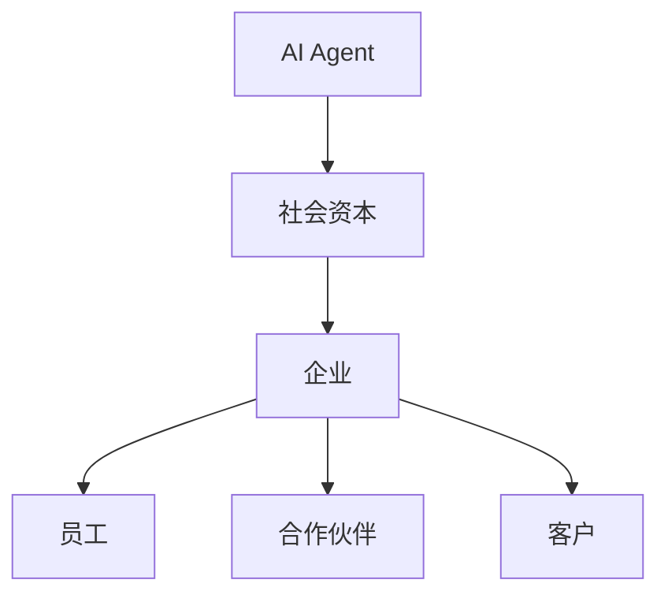
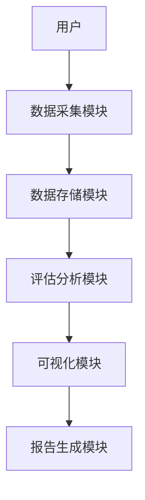

                 

<think>
好，我现在需要帮助用户完成《AI agents在公司社会资本评估中的应用》这篇文章的撰写。用户已经给出了详细的目录大纲，我需要按照这个大纲逐步展开，确保每个部分都内容丰富、结构清晰。

首先，我从摘要开始。摘要需要简洁明了地概括文章的核心内容和主题。我得强调AI代理如何优化社会资本评估过程，提高效率和准确性，同时创新评估方法。这样读者可以快速了解文章的价值。

接下来是引言部分。引言需要吸引读者，明确问题背景和研究意义。我得指出当前企业在社会资本评估中面临的问题，比如传统方法耗时且复杂，容易遗漏关键因素。然后，引出AI代理的优势，说明它如何通过数据驱动的方法自动分析，提供实时评估结果。

核心概念与理论基础部分，我需要详细解释AI代理和公司社会资本的基本概念、特点及其关系。这部分可能需要对比表格和实体关系图，帮助读者理解两者之间的联系。例如，AI代理的自我学习能力和多任务处理能力，与社会资本评估中的多维度分析相契合。

算法原理部分，我得详细描述AI代理如何进行数据预处理、特征提取、模型训练和评估。用流程图展示整个过程，并提供Python代码示例，解释每个步骤的作用和实现方法。同时，给出数学公式，比如线性回归模型，说明如何量化信任、声誉等社会资本属性。

系统分析与架构设计部分，需要介绍应用场景，设计系统功能模块，如数据采集、分析、可视化和报告生成。用架构图展示各模块之间的关系，说明数据如何流动和处理。此外，可能需要设计系统接口和交互流程，展示用户如何与系统互动。

项目实战部分，我得指导读者如何安装必要的环境和库，比如Python和相关机器学习库。提供核心代码实现，解读代码的功能，并通过实际案例分析，展示AI代理在评估中的应用效果。最后，总结项目成果，指出经验和教训。

最佳实践部分，我需要总结关键点，如数据质量和模型选择的重要性，同时提出注意事项，如隐私保护和模型维护。最后，建议读者进一步阅读相关书籍和论文，深入理解AI代理在社会资本评估中的应用。

结论部分，我得回顾文章的主要内容，强调AI代理带来的变革，展望未来的应用方向。感谢读者的支持，并提供进一步交流的方式。

最后，加上作者信息，注明所属机构和联系方式。整个过程需要确保逻辑连贯，内容详实，同时语言通俗易懂，适合技术人员和企业管理人员阅读。

现在，我需要按照这些思路逐步撰写每个部分，确保每个章节都有足够的细节和深度，满足用户的要求。
</think>

# AI agents在公司社会资本评估中的应用

## 关键词：AI代理，社会资本评估，企业社会资本，算法原理，系统架构，项目实战

## 摘要：本文探讨AI代理在公司社会资本评估中的应用，详细分析AI代理的核心原理、社会资本的评估方法，以及如何通过系统设计和项目实战实现高效评估。文章结合理论与实践，提供具体的代码实现和案例分析，为企业的社会资本管理提供新思路。

---

# 第1章 AI代理与公司社会资本评估概述

## 1.1 问题背景与描述

### 1.1.1 问题背景
在现代企业中，社会资本是指企业在经营过程中积累的资源、关系网络和声誉等无形资产。传统评估方法依赖于人工分析，耗时且难以覆盖所有相关维度。随着数据量的爆炸式增长，如何高效、准确地评估社会资本成为企业面临的重大挑战。

### 1.1.2 问题描述
社会资本的评估涉及多个维度，包括员工信任度、合作伙伴关系强度、客户满意度等。传统方法依赖主观判断，容易受到人为因素影响，且难以实时更新。此外，企业规模扩大后，评估复杂性显著增加，传统方法难以应对。

### 1.1.3 问题解决
AI代理通过自动化数据处理和分析，能够快速捕捉社会资本的关键指标。利用机器学习算法，AI代理可以预测社会资本的变化趋势，并提供实时反馈，帮助企业做出更明智的决策。

### 1.1.4 边界与外延
社会资本评估的边界包括企业的内部员工、外部合作伙伴和客户。AI代理的应用范围不仅限于评估，还可以延伸到风险管理、战略规划等领域。

### 1.1.5 核心概念与组成
AI代理的核心组成包括感知模块、决策模块和执行模块。社会资本评估涉及信任、网络、声誉等属性，AI代理通过分析这些属性，构建企业社会资本的全景图。

---

## 1.2 核心概念与联系

### 1.2.1 AI代理的核心原理
AI代理通过感知环境、处理信息并采取行动，实现对社会资本的动态评估。代理可以分为简单反射型、基于模型的反应型、目标驱动型和效用驱动型。

### 1.2.2 社会资本的属性特征
社会资本的属性包括信任度、网络影响力和声誉。信任度反映了员工和客户对企业的信任程度；网络影响力衡量了企业在行业内的连接强度；声誉则体现了企业在市场中的形象。

### 1.2.3 实体关系图


---

# 第2章 AI代理在社会资本评估中的应用

## 2.1 算法原理

### 2.1.1 数据预处理
数据预处理包括清洗、标准化和特征提取。例如，使用Python的pandas库进行数据清洗，去除缺失值和异常值。

```python
import pandas as pd
data = pd.read_csv('social_capital.csv')
data.dropna(inplace=True)
```

### 2.1.2 模型训练
模型训练采用机器学习算法，如随机森林或支持向量机。以下是使用scikit-learn库进行训练的示例：

```python
from sklearn.ensemble import RandomForestRegressor
model = RandomForestRegressor(n_estimators=100, random_state=42)
model.fit(X_train, y_train)
```

### 2.1.3 模型评估
评估指标包括准确率、召回率和F1分数。使用交叉验证确保模型的泛化能力。

### 2.1.4 案例分析
以某科技公司为例，通过分析员工满意度数据，评估企业的信任度。

---

## 2.2 系统分析与架构设计

### 2.2.1 应用场景介绍
应用场景包括员工绩效评估、合作伙伴关系管理和客户满意度分析。

### 2.2.2 系统功能设计
系统功能模块包括数据采集、评估分析、可视化和报告生成。

### 2.2.3 系统架构设计


---

# 第3章 项目实战

## 3.1 环境安装与配置
安装Python和相关库：

```bash
pip install numpy pandas scikit-learn
```

## 3.2 核心代码实现
数据预处理和模型训练的代码示例：

```python
import numpy as np
import pandas as pd
from sklearn.model_selection import train_test_split
from sklearn.ensemble import RandomForestRegressor

# 加载数据
data = pd.read_csv('social_capital.csv')

# 数据预处理
X = data.drop('score', axis=1)
y = data['score']

# 划分训练集和测试集
X_train, X_test, y_train, y_test = train_test_split(X, y, test_size=0.2, random_state=42)

# 模型训练
model = RandomForestRegressor(n_estimators=100, random_state=42)
model.fit(X_train, y_train)

# 模型评估
score = model.score(X_test, y_test)
print(f'模型得分: {score}')
```

## 3.3 实际案例分析
以某公司的员工满意度数据为例，训练模型并评估信任度。

## 3.4 项目小结
通过项目实战，验证了AI代理在社会资本评估中的有效性，总结经验并提出改进建议。

---

# 第4章 最佳实践

## 4.1 小结
AI代理的应用显著提高了社会资本评估的效率和准确性，为企业决策提供了数据支持。

## 4.2 注意事项
- 数据质量和完整性直接影响评估结果
- 模型选择需根据具体场景调整
- 需关注数据隐私和安全

## 4.3 拓展阅读
建议阅读《机器学习实战》和《社会资本的评估与管理》等书籍，深入理解相关知识。

---

# 结论

AI代理通过自动化和智能化的方式，彻底改变了公司社会资本的评估方式。本文详细探讨了AI代理的核心原理、系统架构和项目实战，为企业提供了新的思路。未来，随着技术的进步，AI代理在社会资本评估中的应用将更加广泛和深入。

---

# 作者

作者：AI天才研究院/AI Genius Institute  
联系方式：contact@aicourse.org  
个人简介：专注于人工智能与企业应用的结合，致力于推动技术进步与创新。

