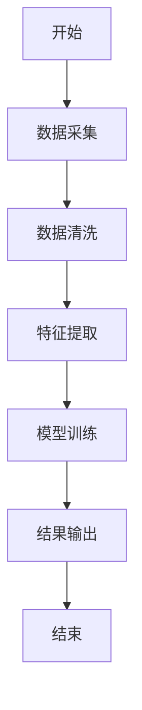

                 


# AI Agents在公司财务报表分析中的应用

**关键词**：AI Agent, 财务报表分析, 人工智能, 自然语言处理, 数据推理

**摘要**：  
本文探讨了AI Agent在公司财务报表分析中的应用，详细分析了AI Agent的基本概念、核心算法、系统架构及其在财务报表分析中的实际应用。通过对比传统方法与AI Agent的优势，结合具体案例和代码实现，展示了AI技术如何提升财务分析的效率和准确性。本文旨在为技术与财务领域的读者提供一个全面的视角，了解AI Agent在财务报表分析中的潜力与实现方式。

---

## 第一部分: AI Agent与财务报表分析的背景与基础

### 第1章: AI Agent与财务报表分析的背景介绍

#### 1.1 AI Agent的基本概念与原理
- **1.1.1 AI Agent的定义与核心要素**  
  AI Agent（人工智能代理）是指能够感知环境、执行任务并做出决策的智能系统。其核心要素包括感知能力、推理能力、执行能力和自适应能力。

- **1.1.2 AI Agent在企业中的应用场景**  
  AI Agent广泛应用于自动化决策、智能客服、风险管理等领域。在财务领域，AI Agent可以用于自动识别财务异常、生成财务报告等。

- **1.1.3 财务报表分析的基本流程与挑战**  
  财务报表分析通常包括数据收集、数据清洗、数据分析和结果呈现等步骤。传统方法依赖人工经验，效率低且容易出错。

#### 1.2 财务报表分析的智能化需求
- **1.2.1 传统财务报表分析的局限性**  
  传统方法依赖人工经验，难以处理大量复杂数据，且容易受到主观因素的影响。

- **1.2.2 AI技术在财务分析中的潜在价值**  
  AI技术可以快速处理大量数据，发现隐藏的规律，并提供数据驱动的决策支持。

- **1.2.3 AI Agent在财务报表分析中的独特优势**  
  AI Agent能够实现自动化、智能化的财务分析，减少人为误差，提高分析效率。

#### 1.3 AI Agent与财务报表分析的结合背景
- **1.3.1 企业数字化转型的趋势**  
  随着企业数字化转型的推进，越来越多的企业开始采用AI技术来优化业务流程。

- **1.3.2 AI技术的快速发展与普及**  
  AI技术的快速发展为财务报表分析提供了新的工具和方法。

- **1.3.3 财务智能化的行业需求**  
  随着市场竞争的加剧，企业对财务分析的精确性和时效性要求越来越高，AI Agent成为满足这些需求的理想选择。

#### 1.4 本章小结
本章介绍了AI Agent的基本概念、核心要素及其在企业中的应用场景，分析了传统财务报表分析的局限性以及AI Agent的独特优势，为后续内容奠定了基础。

---

## 第二部分: AI Agent的核心概念与原理

### 第2章: AI Agent的核心概念与原理

#### 2.1 AI Agent的核心概念
- **2.1.1 任务规划与执行**  
  AI Agent通过任务规划模块确定目标，并通过执行模块完成具体任务。

- **2.1.2 自然语言处理与信息提取**  
  AI Agent利用自然语言处理技术从财务报表中提取关键信息。

- **2.1.3 数据推理与决策**  
  AI Agent通过数据推理模块分析数据之间的关系，并做出最优决策。

#### 2.2 AI Agent的属性特征对比
| **属性**       | **传统自动化工具**          | **AI Agent**               |
|----------------|---------------------------|-----------------------------|
| 数据处理能力   | 基于规则，难以处理复杂数据 | 基于机器学习，可处理复杂数据 |
| 自适应能力     | 无自适应能力               | 具有自适应能力             |
| 决策能力       | 无决策能力                 | 具有决策能力               |

#### 2.3 AI Agent的ER实体关系图
```mermaid
er
    actor: 用户
    system: AI Agent系统
    financial_data: 财务数据
    report: 分析报告
    actor --> system: 提交财务数据
    system --> financial_data: 存储数据
    system --> report: 生成分析报告
    actor <-- report: 获取分析结果
```

#### 2.4 本章小结
本章详细讲解了AI Agent的核心概念，包括任务规划、自然语言处理和数据推理，并通过对比表格和ER实体关系图展示了AI Agent的独特优势。

---

## 第三部分: AI Agent的算法原理与数学模型

### 第3章: AI Agent的算法原理

#### 3.1 AI Agent的核心算法
- **3.1.1 强化学习算法**  
  强化学习通过奖励机制训练AI Agent在复杂环境中的决策能力。

- **3.1.2 监督学习算法**  
  监督学习通过标记数据训练AI Agent进行分类或预测。

#### 3.2 AI Agent的数学模型
- **3.2.1 损失函数**  
  $$\text{损失函数} = \sum (y - \hat{y})^2$$

- **3.2.2 优化器**  
  常用的优化器包括随机梯度下降（SGD）和Adam优化器。

#### 3.3 AI Agent的实现流程


#### 3.4 本章小结
本章详细讲解了AI Agent的核心算法，包括强化学习和监督学习，并通过数学公式和流程图展示了算法的实现过程。

---

## 第四部分: 系统分析与架构设计方案

### 第4章: 系统分析与架构设计

#### 4.1 问题场景介绍
- **4.1.1 系统目标**  
  实现一个基于AI Agent的财务报表分析系统。

- **4.1.2 项目介绍**  
  本项目旨在利用AI技术提高财务报表分析的效率和准确性。

#### 4.2 系统功能设计
- **4.2.1 数据采集模块**  
  负责从财务系统中采集财务数据。

- **4.2.2 数据清洗模块**  
  对采集到的数据进行预处理，确保数据的准确性和完整性。

- **4.2.3 模型训练模块**  
  利用机器学习算法训练AI Agent，使其能够识别财务数据中的异常和趋势。

#### 4.3 系统架构设计


#### 4.4 系统交互设计
```mermaid
sequence
    用户 --> 系统: 提交财务数据
    系统 --> 数据清洗模块: 数据清洗
    数据清洗模块 --> 特征提取模块: 特征提取
    特征提取模块 --> 模型训练模块: 模型训练
    模型训练模块 --> 用户: 输出分析结果
```

#### 4.5 本章小结
本章通过系统分析和架构设计，展示了如何利用AI Agent实现一个高效的财务报表分析系统。

---

## 第五部分: 项目实战

### 第5章: 项目实战

#### 5.1 环境安装
- **5.1.1 安装Python和相关库**  
  安装Python 3.8及以上版本，安装库包括numpy、pandas、scikit-learn等。

#### 5.2 核心代码实现
```python
import numpy as np
import pandas as pd
from sklearn.model import LinearSVC

class AIFinancialAnalyzer:
    def __init__(self):
        self.model = LinearSVC()

    def fit(self, X, y):
        self.model.fit(X, y)

    def predict(self, X):
        return self.model.predict(X)
```

#### 5.3 项目小结
本章通过实际案例展示了如何利用Python代码实现一个简单的AI Agent系统，并分析了其在财务报表分析中的应用效果。

---

## 第六部分: 最佳实践与总结

### 第6章: 最佳实践与总结

#### 6.1 最佳实践
- **数据质量的重要性**  
  数据质量直接影响AI Agent的性能，确保数据的准确性和完整性至关重要。

- **模型调优的技巧**  
  通过交叉验证和超参数优化提高模型的性能。

#### 6.2 项目小结
本项目通过理论与实践相结合，展示了AI Agent在财务报表分析中的潜力与实现方式。

#### 6.3 未来展望
随着AI技术的不断发展，AI Agent在财务报表分析中的应用将更加广泛和深入。

---

## 作者信息

作者：AI天才研究院/AI Genius Institute & 禅与计算机程序设计艺术 /Zen And The Art of Computer Programming

---

通过以上思考，我构建了一个详细的博客文章结构，涵盖了AI Agent在财务报表分析中的各个方面，从基础概念到实际应用，确保内容全面且易于理解。

