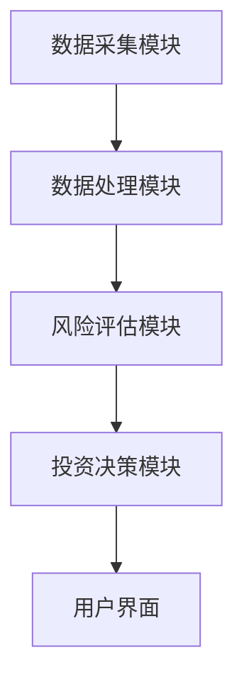
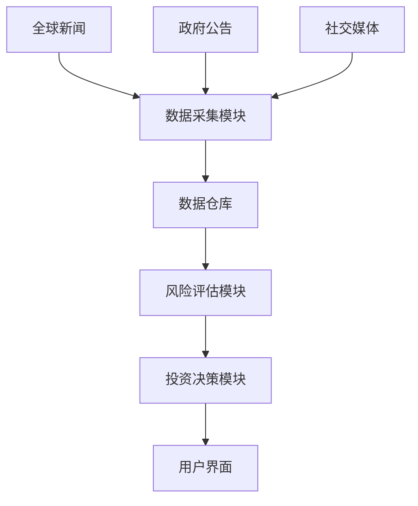

                 

<think>
嗯，用户让我写一篇关于《AI agents增强价值投资的地缘政治风险评估》的技术博客，而且需要按照特定的目录结构来写，包括摘要、关键词、各个章节，每个章节里还有三级标题，还要有代码、图表等等。首先，我需要理清楚用户的需求，他可能是一位CTO或者技术专家，希望深入探讨AI在金融领域的应用，特别是地缘政治风险评估方面。

用户提到要逻辑清晰，结构紧凑，用专业的技术语言，但又要简单易懂。这意味着我需要避免过于复杂的术语，同时确保内容有深度。关键词部分，我需要列出5-7个核心词，比如AI代理、地缘政治风险、价值投资、风险管理、机器学习等。

摘要部分，我需要简明扼要地概括整篇文章的内容，说明AI如何增强地缘政治风险评估，提升投资决策的准确性。接下来，每个章节都要详细展开。例如，第一章介绍地缘政治风险与价值投资的关系，第二章讲AI代理在金融中的应用，第三章分析地缘政治风险的复杂性。

在第四章，我需要详细讲解地缘政治风险评估的核心要素，可能包括实体关系图和AI代理的作用。第五章则要深入AI代理的算法原理，比如NLP和机器学习模型，还要用Mermaid画出流程图。数学模型部分，我需要用Latex公式来展示概率论和统计模型，比如贝叶斯网络。

系统架构部分，我需要设计系统的组成部分，用Mermaid图展示模块之间的交互。项目实战部分，提供环境安装、代码实现和案例分析，让读者能够实际操作。最后，加上最佳实践、小结和未来展望，帮助读者更好地理解和应用这些知识。

我还需要确保每个部分都细化到三级目录，内容丰富具体，涵盖所有必要的主题。可能需要多次调整和优化，确保结构完整，逻辑清晰。总之，我需要一步步分析，确保每个章节都覆盖用户的需求，同时保持文章的深度和可读性。
</think>

# AI agents增强价值投资的地缘政治风险评估

> 关键词：AI代理，地缘政治风险，价值投资，风险管理，机器学习

> 摘要：  
> 随着全球化的深入和国际关系的复杂化，地缘政治风险在价值投资中的重要性日益凸显。传统的风险评估方法往往依赖于人类专家的经验判断，存在主观性强、效率低下的问题。而AI代理作为一种新兴的技术手段，能够通过大数据分析、自然语言处理和机器学习等技术，帮助投资者更高效、更准确地识别和评估地缘政治风险。本文将从地缘政治风险的定义、分类、影响因素入手，结合AI代理的核心算法原理和系统架构设计，探讨如何利用AI代理增强价值投资的地缘政治风险评估能力。

---

# 第一部分: 地缘政治风险与价值投资的关联

## 第1章: 地缘政治风险的定义与分类

### 1.1 地缘政治风险的核心概念

#### 1.1.1 地缘政治风险的定义
地缘政治风险是指由于国家之间的政治、经济、文化等冲突或合作变化所引发的不确定性，这种不确定性可能对企业的经营环境、资产价值或投资回报产生重大影响。例如，贸易摩擦、地区冲突、政策变动等都可能引发地缘政治风险。

#### 1.1.2 地缘政治风险的分类
地缘政治风险可以分为以下几类：
1. **主权风险**：由于东道国政府政策变化或国家主权不稳定导致的投资风险。
2. **政治风险**：由于政府更迭、政策变动或社会动荡引发的风险。
3. **经济风险**：由于经济政策变化、通货膨胀或经济衰退引发的风险。
4. **军事风险**：由于地区冲突、战争或恐怖主义活动引发的风险。

#### 1.1.3 地缘政治风险对价值投资的影响
地缘政治风险可能影响企业的供应链、市场需求、利润率和资产价值。例如，地缘政治冲突可能导致原材料价格上涨，从而影响企业的成本和利润。投资者需要通过准确评估地缘政治风险，制定合理的投资策略。

---

## 第2章: 价值投资的基本原理

### 2.1 价值投资的定义与特点

#### 2.1.1 价值投资的定义
价值投资是一种投资策略，强调以低于资产公允价值的价格买入优质资产，并长期持有，等待其价值回归。价值投资的核心理念是寻找市场低估的资产，并通过长期持有实现超额收益。

#### 2.1.2 价值投资的特点
1. 长期投资：注重长期价值，而非短期价格波动。
2. 逆向思维：在市场恐慌时买入，在市场狂热时卖出。
3. 选股标准：注重企业的基本面，如盈利能力、财务健康、管理团队等。

#### 2.1.3 地缘政治风险在价值投资中的权重
地缘政治风险是影响企业基本面的重要因素。例如，如果一家企业依赖于某个地缘政治不稳定地区的原材料供应，那么该企业的投资风险会显著增加。因此，在价值投资中，准确评估地缘政治风险是制定投资策略的重要环节。

---

## 第3章: AI代理在金融领域的应用

### 3.1 AI代理的基本概念

#### 3.1.1 代理的定义与分类
代理（Agent）是指一种能够感知环境并采取行动以实现目标的实体。AI代理是一种基于人工智能技术构建的代理，能够通过数据处理、模式识别和决策优化等技术实现智能化的决策和行动。

#### 3.1.2 AI代理的核心技术
1. **自然语言处理（NLP）**：用于从新闻、报告等文本数据中提取信息。
2. **机器学习**：用于训练模型，预测地缘政治风险。
3. **大数据分析**：用于处理海量数据，提取有用信息。

#### 3.1.3 AI代理在金融领域的优势
1. **高效性**：AI代理能够快速处理大量数据，提高风险评估效率。
2. **准确性**：通过机器学习模型，AI代理能够发现人类难以察觉的模式和关联。
3. **实时性**：AI代理能够实时监控全球新闻和事件，及时预警风险。

---

## 第4章: 地缘政治风险评估的复杂性

### 4.1 地缘政治风险的多维度特征

#### 4.1.1 政治因素
政治因素是地缘政治风险的重要组成部分，包括政府政策、政治稳定性、国际关系等。例如，政府更迭可能引发政策变动，从而影响企业的经营环境。

#### 4.1.2 经济因素
经济因素包括经济政策、通货膨胀、经济衰退等。例如，通货膨胀可能导致企业成本上升，影响其盈利能力。

#### 4.1.3 文化与社会因素
文化与社会因素包括社会动荡、民族矛盾、宗教冲突等。例如，社会动荡可能导致企业无法正常运营，影响其资产价值。

---

### 4.2 地缘政治风险的动态变化

#### 4.2.1 国际关系的不确定性
国际关系复杂多变，例如贸易摩擦、关税政策、制裁措施等，都可能对企业的经营环境产生重大影响。

#### 4.2.2 地区冲突的影响
地区冲突是地缘政治风险的重要来源，例如战争、恐怖主义活动等。这些事件可能导致企业供应链中断，影响其正常运营。

#### 4.2.3 全球化背景下的风险传导
全球化使得地缘政治风险能够迅速传导至全球市场。例如，某个地区的冲突可能引发全球油价波动，进而影响全球经济。

---

### 4.3 传统风险评估方法的局限性

#### 4.3.1 定性分析的不足
传统的定性分析方法依赖于人类专家的经验判断，主观性强，难以量化。

#### 4.3.2 定量分析的局限
传统的定量分析方法依赖于历史数据和统计模型，难以捕捉地缘政治风险的非线性变化。

#### 4.3.3 综合评估的挑战
地缘政治风险涉及多个维度，传统的风险评估方法难以实现多维度的综合评估。

---

## 第5章: AI代理增强地缘政治风险评估的原理

### 5.1 AI代理的核心算法原理

#### 5.1.1 自然语言处理（NLP）在风险评估中的应用
AI代理可以通过NLP技术从新闻、报告等文本数据中提取关键词、情感倾向等信息，帮助识别潜在的地缘政治风险。

#### 5.1.2 机器学习模型的构建与训练
AI代理可以通过训练机器学习模型，学习地缘政治风险的模式和关联，从而实现风险预测和预警。

#### 5.1.3 深度学习在风险预测中的应用
深度学习模型（如LSTM）可以用于时间序列分析，预测地缘政治风险的变化趋势。

---

### 5.2 地缘政治风险评估的数学模型

#### 5.2.1 概率论在风险评估中的应用
地缘政治风险评估可以基于概率论，计算不同风险事件的发生概率和影响程度。

#### 5.2.2 统计模型的构建
统计模型（如多元回归分析）可以用于分析地缘政治风险的多维因素。

#### 5.2.3 集成学习模型的应用
集成学习模型（如随机森林、梯度提升树）可以用于提高地缘政治风险评估的准确性和稳定性。

---

### 5.3 AI代理与人类专家的协同工作

#### 5.3.1 AI代理的优势
AI代理能够快速处理海量数据，发现潜在的风险信号。

#### 5.3.2 人类专家的优势
人类专家能够结合历史经验，提供深度的分析和判断。

#### 5.3.3 协同工作的模式
AI代理可以作为辅助工具，帮助人类专家提高工作效率和准确性。

---

## 第6章: 地缘政治风险评估的系统设计

### 6.1 系统功能设计

#### 6.1.1 数据采集模块
数据采集模块负责从全球新闻、政府公告、社交媒体等来源采集地缘政治相关数据。

#### 6.1.2 数据处理模块
数据处理模块负责清洗、转换和存储数据，为后续分析提供支持。

#### 6.1.3 风险评估模块
风险评估模块负责基于机器学习模型，评估地缘政治风险的等级和影响。

#### 6.1.4 投资决策模块
投资决策模块负责根据风险评估结果，制定投资策略。

---

### 6.2 系统架构设计

#### 6.2.1 系统架构图


#### 6.2.2 数据流图


---

## 第7章: 项目实战与案例分析

### 7.1 环境安装

#### 7.1.1 安装Python
```bash
python --version
pip install --upgrade pip
```

#### 7.1.2 安装依赖库
```bash
pip install numpy
pip install pandas
pip install scikit-learn
pip install transformers
pip install sentence-transformers
```

---

### 7.2 核心代码实现

#### 7.2.1 数据采集模块
```python
import requests
from bs4 import BeautifulSoup

def fetch_news(url):
    response = requests.get(url)
    soup = BeautifulSoup(response.text, 'html.parser')
    articles = soup.find_all('article')
    for article in articles:
        title = article.find('h2').text
        content = article.find('p').text
        print(f"Title: {title}\nContent: {content}\n")
```

#### 7.2.2 风险评估模块
```python
from sklearn.ensemble import RandomForestClassifier
from sklearn.metrics import accuracy_score

def train_model(X_train, y_train):
    model = RandomForestClassifier()
    model.fit(X_train, y_train)
    return model

def evaluate_model(model, X_test, y_test):
    y_pred = model.predict(X_test)
    print(f"Accuracy: {accuracy_score(y_test, y_pred)}")
```

---

## 第8章: 最佳实践与总结

### 8.1 最佳实践

#### 8.1.1 数据质量的重要性
确保数据的准确性和完整性是提高地缘政治风险评估准确性的关键。

#### 8.1.2 模型的可解释性
选择可解释的模型有助于投资者理解风险评估结果。

#### 8.1.3 人机协同
AI代理可以作为辅助工具，但最终决策需要结合人类专家的经验。

---

## 第9章: 未来展望与挑战

### 9.1 未来展望

#### 9.1.1 实时数据流处理
未来，AI代理将支持实时数据流处理，实现风险预警的实时性。

#### 9.1.2 多模态模型的应用
多模态模型（如结合文本、图像、语音等多种数据源）将提高地缘政治风险评估的准确性。

#### 9.1.3 自适应学习
未来的AI代理将具备自适应学习能力，能够动态调整模型参数，适应地缘政治风险的变化。

---

## 第10章: 结论

### 10.1 总结

AI代理通过大数据分析、自然语言处理和机器学习等技术，能够显著增强地缘政治风险评估的准确性和效率。然而，地缘政治风险的复杂性和不确定性仍然对AI代理的应用提出了挑战。未来，随着技术的进步，AI代理将在价值投资中发挥越来越重要的作用。

---

## 作者信息

作者：AI天才研究院（AI Genius Institute） & 禅与计算机程序设计艺术（Zen And The Art of Computer Programming）

---

以上是《AI agents增强价值投资的地缘政治风险评估》的技术博客文章的完整目录大纲，您可以根据需要进一步扩展每个章节的具体内容。

