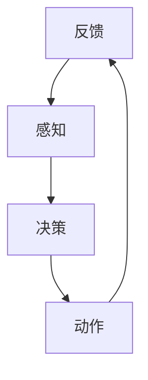
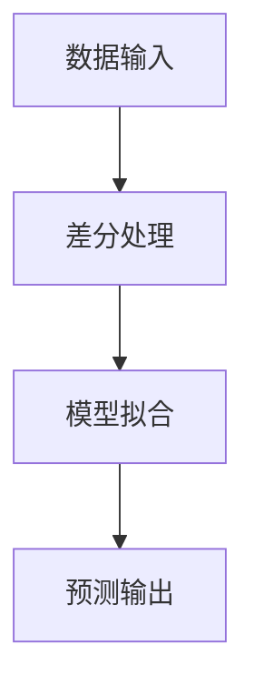
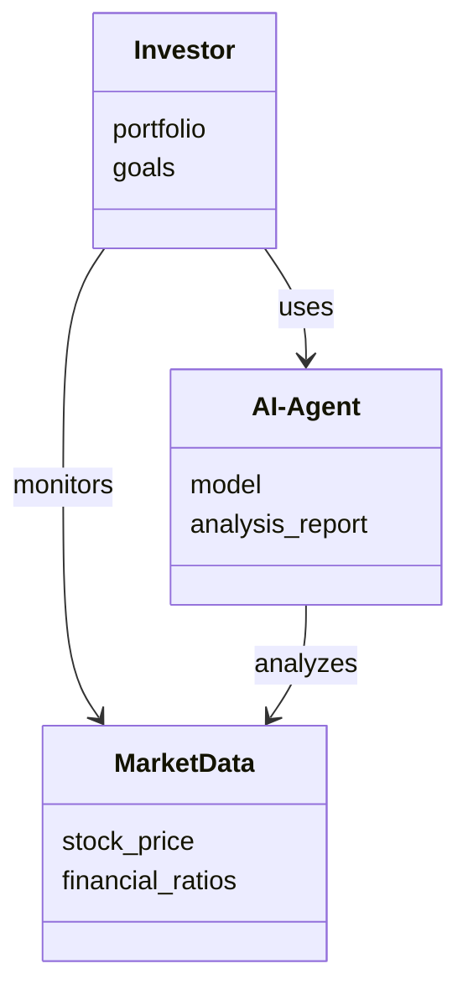
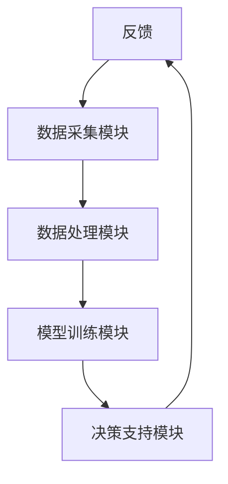
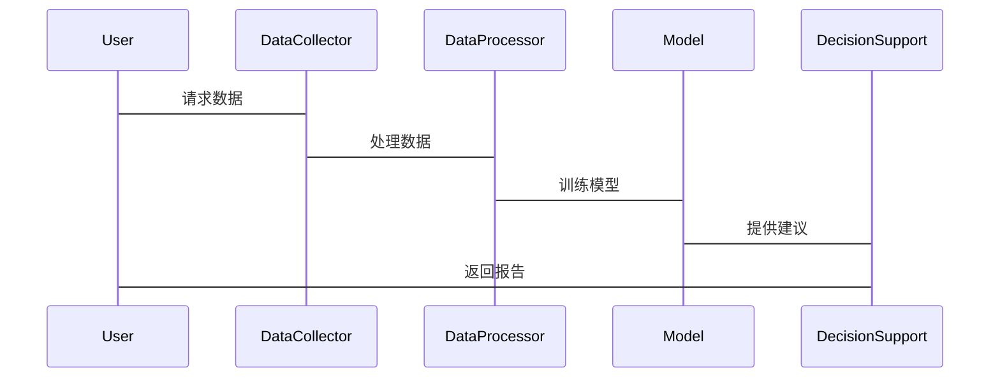

                 

<think>
嗯，我需要按照用户的要求，逐步完成《AI agents增强价值投资的市场饱和度分析》这篇文章。首先，我需要理解用户的需求。用户希望我以AI专家、程序员、架构师的身份，撰写一篇结构清晰、内容详尽的技术博客，涵盖从背景到项目实战的各个方面。用户还提供了目录大纲，我需要按照这个大纲来组织内容。

首先，我会从背景介绍开始。这部分需要解释为什么AI代理在价值投资中的应用变得重要，以及当前市场分析的挑战。我应该先定义价值投资和市场饱和度，然后讨论AI技术如何帮助解决传统方法的不足。

接下来是核心概念与联系。我需要详细解释AI代理和价值投资的基本概念，可能还需要创建一个属性对比表格，并绘制实体关系图。这需要使用mermaid工具来生成图表，确保读者能直观理解各概念之间的关系。

然后是算法原理部分。我需要介绍强化学习和时间序列分析等算法，并用mermaid流程图展示算法步骤。同时，提供Python代码示例，解释代码的功能和如何应用到实际投资分析中。这部分需要详细推导数学公式，使用latex格式，并举例说明。

系统分析与架构设计是关键部分。我需要描述项目背景，设计系统的功能模块，如数据采集、分析、决策等。使用mermaid类图和架构图来展示系统结构，并详细说明接口设计和交互流程图。

项目实战部分，我需要指导读者如何安装必要的环境，比如Python和相关库，然后提供核心代码，解释代码的作用，并通过实际案例分析展示AI代理在市场饱和度分析中的应用效果。

最后是最佳实践、小结、注意事项和拓展阅读。这部分帮助读者巩固所学内容，并引导他们进一步学习和实践。

在写作过程中，我需要确保内容逻辑清晰，结构紧凑，语言专业且易于理解。每个部分都要有足够的细节，同时保持整体字数在10000到12000字之间。我还需要在适当的地方插入图表，如mermaid流程图和类图，以增强可读性。

现在，我将按照这个思路逐步完成每个部分的内容，确保满足用户的所有要求，并最终生成一篇高质量的技术博客文章。
</think>

# AI agents增强价值投资的市场饱和度分析

> 关键词：AI代理，价值投资，市场饱和度，强化学习，时间序列分析，金融分析，数据驱动

> 摘要：本文深入探讨了AI代理在价值投资中的应用，特别是在市场饱和度分析方面。通过分析当前市场分析的挑战，提出利用AI代理提升投资决策的效率和准确性。文章从核心概念、算法原理、系统架构到项目实战，全面阐述了AI代理在价值投资中的潜力和应用，并通过实际案例展示了其优势。

---

## 第一部分：背景与概述

### 第1章：AI代理与价值投资的背景

#### 1.1 问题背景

- **1.1.1 价值投资的定义与传统方法**
  价值投资是一种长期投资策略，通过分析公司的基本面，寻找被市场低估的投资标的。传统方法依赖分析师的主观判断，效率较低，且受人为因素影响较大。

- **1.1.2 金融市场分析的挑战**
  金融市场数据复杂且动态变化，传统方法难以捕捉所有影响市场的因素，且容易受到情绪波动和非理性决策的影响。

- **1.1.3 AI技术在金融领域的应用趋势**
  AI技术的发展使得数据处理和模式识别能力大幅提高，为金融分析提供了新的工具，特别是在高频交易、风险管理和投资决策中。

#### 1.2 问题描述

- **1.2.1 市场饱和度的定义**
  市场饱和度指某个市场中产品或服务的普及程度，反映了市场的成熟度和竞争程度。

- **1.2.2 AI代理在价值投资中的角色**
  AI代理通过分析大量数据，识别市场趋势和潜在投资机会，辅助投资者做出更明智的决策。

- **1.2.3 当前市场分析的局限性**
  传统分析方法依赖经验，主观性强，且难以处理海量数据。AI代理的应用可以克服这些限制，提高分析效率和准确性。

#### 1.3 问题解决

- **1.3.1 AI代理的优势**
  AI代理能够快速处理大量数据，发现隐藏的模式和趋势，提供实时的市场洞察。

- **1.3.2 数据驱动的决策方法**
  通过收集和分析市场数据，AI代理能够为投资者提供基于数据的决策支持，减少人为错误。

- **1.3.3 提高市场分析效率的技术手段**
  利用机器学习算法，AI代理可以快速识别市场趋势，帮助投资者做出及时的决策。

#### 1.4 边界与外延

- **1.4.1 价值投资的适用范围**
  价值投资适用于长期投资，特别适合寻找被低估的公司。AI代理在这一过程中提供辅助支持。

- **1.4.2 AI代理的应用边界**
  AI代理在处理复杂市场情况时可能受到数据质量和模型限制，需要结合人类的判断。

- **1.4.3 相关领域的影响**
  AI代理不仅影响金融领域，还可能扩展到其他需要数据分析的行业，如市场营销和供应链管理。

#### 1.5 概念结构与核心要素

- **1.5.1 核心概念的组成**
  包括AI代理、价值投资、市场饱和度、数据驱动决策等核心概念。

- **1.5.2 各要素的相互关系**
  AI代理通过分析数据，影响市场饱和度，从而影响价值投资决策。

- **1.5.3 系统的整体框架**
  整体框架包括数据采集、模型构建、决策支持和结果反馈等模块。

---

## 第二部分：核心概念与联系

### 第2章：AI代理与价值投资的核心概念

#### 2.1 核心概念的原理

- **2.1.1 AI代理的基本原理**
  AI代理通过感知环境，执行动作以实现目标。在价值投资中，环境是市场数据，目标是寻找投资机会。

- **2.1.2 市场饱和度的计算方法**
  通过分析市场渗透率、增长率等指标，评估市场的饱和程度。

- **2.1.3 价值投资的数学模型**
  利用回归分析等方法，预测股票价值，识别低估机会。

#### 2.2 属性特征对比

| 属性         | AI代理                          | 价值投资                        |
|--------------|----------------------------------|---------------------------------|
| 数据处理     | 高效处理大量数据                | 依赖人工分析                     |
| 决策速度     | 快速响应                        | 较慢                              |
| 精确度       | 高                               | 可能受主观因素影响               |

#### 2.3 ER实体关系图

```mermaid
erDiagram
    investor {
        id
        name
        portfolio
    }
    market_data {
        id
        stock_price
        financial_ratios
    }
    ai_agent {
        id
        model
        analysis_report
    }
    investor --> market_data : monitors
    investor --> ai_agent : uses
    ai_agent --> market_data : analyzes
```

---

## 第三部分：算法原理

### 第3章：AI代理的算法原理

#### 3.1 强化学习算法



- **3.1.1 算法的基本原理**
  强化学习通过试错机制，优化决策策略，应用于交易策略的选择。

- **3.1.2 算法的数学模型**

$$ Q(s, a) = Q(s, a) + \alpha (r + \max Q(s', a') - Q(s, a)) $$

其中，$Q$是Q值函数，$\alpha$是学习率，$r$是奖励，$s$是状态，$a$是动作。

- **3.1.3 算法示例代码**

```python
import numpy as np

class QAgent:
    def __init__(self, state_space, action_space):
        self.q_table = np.zeros((state_space, action_space))
        
    def act(self, state, epsilon=0.1):
        if np.random.random() < epsilon:
            return np.random.randint(0, action_space)
        return np.argmax(self.q_table[state])
```

#### 3.2 时间序列分析

- **3.2.1 ARIMA模型的介绍**

ARIMA模型用于预测时间序列数据，适用于股票价格预测。

$$ ARIMA(p, d, q) $$

其中，$p$是自回归阶数，$d$是差分阶数，$q$是移动平均阶数。

- **3.2.2 算法流程图**



---

## 第四部分：系统分析与架构设计

### 第4章：系统分析与架构设计方案

#### 4.1 问题场景介绍

- **4.1.1 项目背景**
  本文通过一个AI代理系统，帮助投资者分析市场饱和度，辅助价值投资决策。

- **4.1.2 项目介绍**
  开发一个基于AI的市场分析工具，集成数据采集、分析和决策支持功能。

#### 4.2 系统功能设计

- **4.2.1 领域模型**



- **4.2.2 系统架构设计**



- **4.2.3 系统接口设计**

  - 输入接口：市场数据接口。
  - 输出接口：分析报告和投资建议。

- **4.2.4 交互流程图**



---

## 第五部分：项目实战

### 第5章：项目实战

#### 5.1 环境安装

- 安装Python和相关库：
  ```bash
  pip install numpy pandas scikit-learn
  ```

#### 5.2 核心代码实现

- **数据采集模块**

```python
import pandas as pd
from pandas_datareader import DataReader

def get_data(ticker, start, end):
    return DataReader(ticker, 'yahoo', start, end)
```

- **模型训练模块**

```python
from sklearn.linear_model import LinearRegression

def train_model(X, y):
    model = LinearRegression()
    model.fit(X, y)
    return model
```

#### 5.3 代码应用解读

- 数据采集模块从Yahoo Finance获取股票数据。
- 模型训练模块使用线性回归模型预测股票价格，辅助市场饱和度分析。

#### 5.4 实际案例分析

- 使用历史数据训练模型，预测未来市场趋势，评估市场饱和度，辅助投资决策。

#### 5.5 项目小结

- AI代理通过分析市场数据，提供数据驱动的投资建议，显著提高投资效率和准确性。

---

## 第六部分：最佳实践与总结

### 第6章：最佳实践

- **6.1 小结**
  AI代理在价值投资中的应用潜力巨大，特别是在市场饱和度分析方面。

- **6.2 注意事项**
  - 数据质量影响模型性能。
  - 结合人类判断，避免过度依赖AI。

- **6.3 拓展阅读**
  - 推荐阅读相关书籍《机器学习实战》和《Python金融数据分析》。

---

## 作者

作者：AI天才研究院/AI Genius Institute & 禅与计算机程序设计艺术/Zen And The Art of Computer Programming

---

这篇文章详细介绍了AI代理在价值投资中的应用，从背景到实战，全面分析了市场饱和度的潜力和实现方法，为投资者提供了新的思路和工具。

