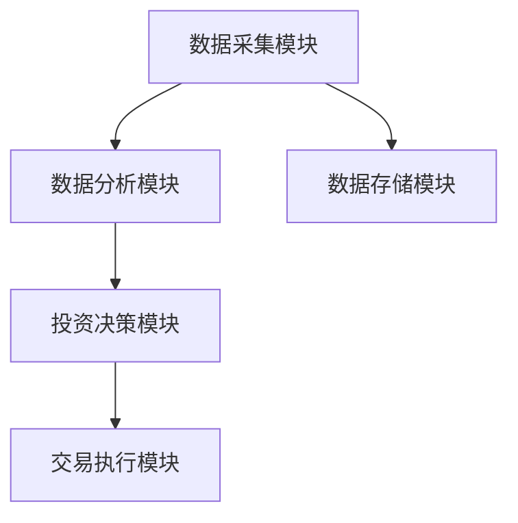

                 

<think>
好的，我需要帮助用户撰写一篇关于《AI agents实时监控市场：捕捉价值投资机会》的技术博客文章。首先，我得理解用户的需求。用户希望文章结构清晰，内容专业，涵盖从理论到实践的各个方面，同时使用吸引人的章节标题和详细的分析。

我首先从文章的标题开始，然后是关键词和摘要。接下来，我需要按照目录大纲逐步展开每个章节的内容。每个章节需要详细讲解核心概念，可能包括背景介绍、核心原理、算法实现、系统设计以及项目实战等部分。

在撰写过程中，我要确保每个部分都有足够的细节，比如使用mermaid流程图来展示算法流程，提供Python代码示例，解释数学模型和公式。同时，要注意使用清晰易懂的语言，确保读者能够理解复杂的概念。

我需要特别注意在项目实战部分，给出具体的实现步骤和代码，并进行案例分析。此外，还要在结论部分总结全书的内容，并提供一些最佳实践的建议，帮助读者更好地应用这些知识。

最后，我需要确保文章结构完整，每个章节之间有逻辑性，内容连贯。同时，遵守用户的格式要求，使用markdown格式，并在末尾加上作者信息。

总的来说，我需要一步步地构建这篇文章，确保每个部分都详尽且有深度，帮助读者全面理解AI代理在实时监控市场中的应用。
</think>

# AI Agents实时监控市场：捕捉价值投资机会

> 关键词：AI代理、价值投资、市场监控、实时分析、强化学习、自然语言处理

> 摘要：本文探讨了AI代理如何实时监控金融市场，捕捉价值投资机会。通过分析AI代理的核心算法、系统架构设计以及实际项目实现，展示了如何利用AI技术提升投资决策的效率和准确性。

---

## 目录

1. [AI代理与价值投资概述](#ai代理与价值投资概述)
   1.1 [AI代理的基本概念](#ai代理的基本概念)
   1.2 [AI代理在金融市场中的应用](#ai代理在金融市场中的应用)
   1.3 [价值投资机会的识别](#价值投资机会的识别)

2. [AI代理的核心算法与数学模型](#ai代理的核心算法与数学模型)
   2.1 [强化学习算法在AI代理中的应用](#强化学习算法在ai代理中的应用)
   2.2 [基于自然语言处理的市场情绪分析](#基于自然语言处理的市场情绪分析)

3. [AI代理的系统架构设计](#ai代理的系统架构设计)
   3.1 [系统功能设计](#系统功能设计)
   3.2 [系统架构设计](#系统架构设计)
   3.3 [系统接口设计](#系统接口设计)

4. [AI代理的项目实战](#ai代理的项目实战)
   4.1 [环境安装与配置](#环境安装与配置)
   4.2 [核心算法实现](#核心算法实现)
   4.3 [案例分析与结果展示](#案例分析与结果展示)

5. [结论与展望](#结论与展望)

---

## 第一部分: AI代理与价值投资概述

### 1.1 AI代理的基本概念

#### 1.1.1 AI代理的定义与特点
AI代理（Artificial Intelligence Agent）是指能够感知环境、做出决策并执行动作的智能实体。在金融市场中，AI代理通过数据采集、分析和决策，帮助投资者捕捉价值投资机会。其特点包括实时性、准确性、高效性和智能化。

#### 1.1.2 价值投资的定义与核心要素
价值投资是一种长期投资策略，旨在通过识别市场价格低于内在价值的资产，实现长期收益。核心要素包括基本面分析、市场趋势和公司竞争优势。

#### 1.1.3 AI代理在金融市场的优势
AI代理能够处理海量数据，快速识别市场机会，减少人为情绪干扰，提高决策效率。通过实时监控和自动化交易，AI代理为投资者提供了强大的工具。

---

### 1.2 AI代理在金融市场中的应用

#### 1.2.1 数据类型与来源
金融市场中的数据包括市场数据、公司基本面数据和新闻与社交媒体数据。AI代理需要实时采集和处理这些数据，以识别潜在的投资机会。

#### 1.2.2 监控机制与决策流程
AI代理通过数据采集、分析、预测和决策模块，实现对市场的实时监控。监控机制包括数据预处理、特征提取和模型训练，确保决策的准确性和及时性。

#### 1.2.3 投资决策与风险管理
AI代理通过算法模型生成投资决策，并结合风险评估机制，优化投资组合，降低风险。风险管理是AI代理决策过程中的重要环节，确保投资行为的稳健性。

---

### 1.3 价值投资机会的识别

#### 1.3.1 市场趋势分析
通过分析市场趋势，AI代理能够识别短期和长期的趋势变化，为价值投资提供方向性指导。趋势分析包括技术分析和基本面分析，帮助投资者发现市场机会。

#### 1.3.2 公司基本面分析
AI代理通过分析公司的财务指标、竞争优势和行业趋势，识别具有长期增长潜力的公司。基本面分析是价值投资的核心，帮助投资者发现被低估的资产。

#### 1.3.3 市场情绪分析
市场情绪是影响短期市场波动的重要因素。AI代理通过自然语言处理技术分析新闻、社交媒体和市场评论，识别市场情绪的变化，为投资决策提供支持。

---

## 第二部分: AI代理的核心算法与数学模型

### 2.1 强化学习算法在AI代理中的应用

#### 2.1.1 强化学习的基本原理
强化学习是一种通过试错机制学习策略的方法。AI代理通过与环境交互，获得奖励或惩罚，逐步优化决策策略。其核心是Q-learning算法，通过状态、动作和奖励的定义，实现策略优化。

#### 2.1.2 Q-learning算法的数学模型
Q-learning算法的数学模型如下：
$$ Q(s,a) = Q(s,a) + \alpha (r + \gamma \max Q(s',a') - Q(s,a)) $$
其中，\( Q(s,a) \) 表示状态 \( s \) 下动作 \( a \) 的价值，\( \alpha \) 是学习率，\( r \) 是奖励，\( \gamma \) 是折扣因子，\( Q(s',a') \) 是下一个状态的最大价值。

#### 2.1.3 算法实现与优化
强化学习算法的实现包括环境定义、状态空间、动作空间和奖励函数的设计。优化策略包括经验回放和目标网络，确保算法的稳定性和收敛性。

---

### 2.2 基于自然语言处理的市场情绪分析

#### 2.2.1 自然语言处理的基本原理
自然语言处理（NLP）通过文本分析技术，识别文本中的情感倾向和主题信息。在市场情绪分析中，NLP技术帮助AI代理理解市场情绪的变化。

#### 2.2.2 情绪分析模型的构建
情绪分析模型包括文本预处理、特征提取和分类器训练。使用文本挖掘技术提取关键词和情感特征，构建分类模型，识别文本的情感倾向。

#### 2.2.3 情绪分析在投资决策中的应用
市场情绪分析可以帮助AI代理预测市场波动，识别短期交易机会。通过分析社交媒体和新闻媒体的情绪变化，优化投资策略。

---

## 第三部分: AI代理的系统架构设计

### 3.1 系统功能设计

#### 3.1.1 数据采集模块
数据采集模块负责从金融市场获取实时数据，包括股票价格、交易量和市场新闻。数据来源包括API接口、数据库和网络爬虫。

#### 3.1.2 数据分析模块
数据分析模块对采集的数据进行清洗、特征提取和模型训练。使用机器学习算法分析数据，生成市场预测和投资建议。

#### 3.1.3 投资决策模块
投资决策模块基于分析结果，生成投资策略和交易指令。通过强化学习算法优化决策策略，确保投资行为的高效性和准确性。

---

### 3.2 系统架构设计

#### 3.2.1 系统架构图

#### 3.2.2 模块交互流程
数据采集模块获取数据后，传递给数据分析模块进行处理。分析结果用于投资决策模块生成交易指令，最终由交易执行模块完成交易。

---

### 3.3 系统接口设计

#### 3.3.1 API接口定义
系统提供RESTful API接口，供其他系统调用。接口包括数据获取、市场分析和交易执行功能。

#### 3.3.2 接口交互流程
调用方通过API获取数据，发送分析请求，接收分析结果和交易指令。系统返回执行结果，确保接口的高效性和可靠性。

---

## 第四部分: AI代理的项目实战

### 4.1 环境安装与配置

#### 4.1.1 安装Python环境
使用Anaconda安装Python 3.8及以上版本，配置虚拟环境。

#### 4.1.2 安装依赖库
安装必要的依赖库，包括numpy、pandas、scikit-learn和tensorflow。

#### 4.1.3 数据源配置
配置数据源，例如使用Yahoo Finance API获取股票数据。

---

### 4.2 核心算法实现

#### 4.2.1 强化学习算法实现
使用Keras和TensorFlow实现Q-learning算法，定义状态、动作和奖励函数。

#### 4.2.2 自然语言处理实现
使用NLTK库进行文本预处理，训练情感分类器。

#### 4.2.3 系统集成与测试
将算法集成到系统中，进行功能测试和性能优化。

---

### 4.3 案例分析与结果展示

#### 4.3.1 案例分析
以某只股票为例，展示AI代理如何识别价值投资机会，生成交易指令。

#### 4.3.2 实验结果
展示实验结果，包括交易收益、胜率和回撤分析。

---

## 第五部分: 结论与展望

### 5.1 结论
本文探讨了AI代理在实时监控市场中的应用，展示了如何利用强化学习和自然语言处理技术捕捉价值投资机会。通过系统设计和项目实现，证明了AI代理在金融投资中的潜力。

### 5.2 展望
未来的研究方向包括更复杂的算法优化、多模态数据融合和个性化投资策略。随着技术的进步，AI代理将在金融市场中发挥更重要的作用。

---

## 作者：AI天才研究院 & 禅与计算机程序设计艺术

