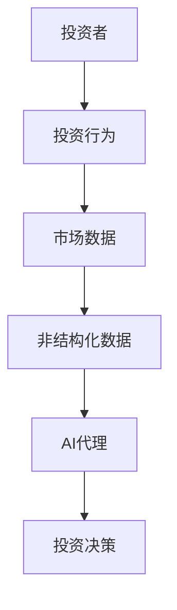

                 


# AI agents挖掘非结构化数据：发现隐藏的投资价值

> 关键词：AI代理，非结构化数据，投资价值，自然语言处理，机器学习，数据挖掘

> 摘要：本文详细探讨了AI代理如何通过挖掘非结构化数据来发现隐藏的投资价值。文章从AI代理和非结构化数据的基本概念出发，分析了AI代理的核心原理、算法实现、数学模型，并通过实际案例展示了AI代理在投资领域的应用场景。最后，文章总结了AI代理的优势与挑战，并展望了未来的发展方向。

---

## 第一部分: AI代理与非结构化数据概述

### 第1章: AI代理与非结构化数据的背景

#### 1.1 什么是AI代理？

AI代理（Artificial Intelligence Agents）是指能够感知环境、采取行动以实现目标的智能实体。与传统算法不同，AI代理具有以下核心特点：

- **自主性**：能够自主决策，无需人工干预。
- **反应性**：能够实时感知环境变化并做出反应。
- **目标导向性**：所有行为都以实现特定目标为导向。

#### 1.2 非结构化数据的定义与特点

非结构化数据是指没有固定结构、难以用传统数据库存储和查询的数据类型，主要包括：

- **文本数据**：新闻、报告、社交媒体内容等。
- **图像数据**：照片、图表等。
- **音频数据**：语音记录等。

非结构化数据的特点：

- **多样性**：数据类型多样，难以统一处理。
- **模糊性**：数据之间缺乏明确的关联性。
- **海量性**：数据量巨大，难以人工处理。

#### 1.3 AI代理在投资领域的应用背景

在投资领域，非结构化数据的价值往往被忽视。例如，社交媒体上的投资者情绪分析、新闻中的市场趋势预测等。AI代理能够通过自然语言处理（NLP）和机器学习技术，从非结构化数据中提取有价值的信息。

#### 1.4 本章小结

本章介绍了AI代理的基本概念和非结构化数据的特点，为后续内容奠定了基础。

---

## 第二部分: AI代理的核心概念与原理

### 第2章: AI代理的核心概念与联系

#### 2.1 AI代理的核心概念

AI代理的核心概念包括：

- **感知环境**：通过传感器或数据输入感知外部环境。
- **决策制定**：基于感知信息，通过算法做出决策。
- **执行动作**：根据决策结果执行具体动作。

#### 2.2 非结构化数据与AI代理的关系

非结构化数据是AI代理的重要输入源，AI代理通过处理非结构化数据来实现目标。例如，股票价格预测可以通过分析新闻、社交媒体等非结构化数据来实现。

#### 2.3 核心概念对比表

| 比较项 | 非结构化数据 | 结构化数据 |
|--------|--------------|------------|
| 数据类型 | 文本、图像等 | 数值、表格等 |
| 处理难度 | 高 | 低 |
| 价值密度 | 高 | 中 |

#### 2.4 ER实体关系图



---

## 第三部分: AI代理的算法原理

### 第3章: AI代理的算法原理

#### 3.1 算法原理概述

AI代理的算法主要包括以下步骤：

1. **数据输入**：接收非结构化数据。
2. **数据处理**：对数据进行清洗、转换。
3. **特征提取**：提取数据中的特征。
4. **模型训练**：基于特征训练模型。
5. **决策制定**：根据模型输出结果做出决策。

#### 3.2 算法流程图


#### 3.3 算法实现代码

```python
import numpy as np
import pandas as pd

# 示例代码：基于文本数据的情感分析
def preprocess(text):
    # 数据清洗代码
    pass

def model_train(X, y):
    # 模型训练代码
    pass

def main():
    # 读取数据
    data = pd.read_csv('data.csv')
    # 数据预处理
    X = data['text'].apply(preprocess)
    y = data['label']
    # 训练模型
    model_train(X, y)
    
if __name__ == '__main__':
    main()
```

#### 3.4 算法数学模型

AI代理的核心算法通常涉及概率论和优化理论。例如，常见的损失函数公式如下：

$$ L = -\frac{1}{n}\sum_{i=1}^{n} y_i \log(p_i) + (1 - y_i)\log(1 - p_i) $$

其中，$p_i$是模型预测的概率，$y_i$是真实标签。

---

## 第四部分: 数学模型与公式

### 第4章: 数学模型与公式

#### 4.1 概率分布模型

在AI代理中，概率分布模型用于描述数据的分布情况。例如，伯努利分布的公式为：

$$ P(X = k) = p^k (1-p)^{1-k} $$

其中，$p$是成功概率，$k$是二进制变量。

#### 4.2 损失函数

损失函数用于衡量模型预测值与真实值之间的差异。例如，均方误差（MSE）的公式为：

$$ L = \frac{1}{n}\sum_{i=1}^{n} (y_i - \hat{y}_i)^2 $$

其中，$y_i$是真实值，$\hat{y}_i$是预测值。

---

## 第五部分: 系统分析与架构设计方案

### 第5章: 系统分析与架构设计

#### 5.1 问题场景介绍

假设我们开发一个股票价格预测系统，系统需要分析新闻、社交媒体等非结构化数据。

#### 5.2 系统功能设计

系统功能包括：

- 数据采集：从互联网获取新闻、社交媒体数据。
- 数据处理：清洗、转换数据。
- 特征提取：提取文本特征。
- 模型训练：训练预测模型。
- 投资决策：根据模型结果做出投资决策。

#### 5.3 系统架构设计


---

## 第六部分: 项目实战

### 第6章: 项目实战

#### 6.1 环境安装

需要安装以下库：

```bash
pip install numpy pandas scikit-learn
```

#### 6.2 系统核心实现源代码

```python
import numpy as np
import pandas as pd
from sklearn.feature_extraction.text import TfidfVectorizer
from sklearn.linear_model import LogisticRegression

# 数据预处理
def preprocess(text):
    return text.lower()

# 模型训练
def model_train(X, y):
    vectorizer = TfidfVectorizer()
    X_vec = vectorizer.fit_transform(X)
    model = LogisticRegression()
    model.fit(X_vec, y)
    return model, vectorizer

# 主函数
def main():
    # 读取数据
    data = pd.read_csv('data.csv')
    X = data['text'].apply(preprocess)
    y = data['label']
    # 训练模型
    model, vectorizer = model_train(X, y)
    # 预测结果
    test_text = ["这是一个好的投资机会"]
    test_vec = vectorizer.transform(test_text)
    print(model.predict(test_vec))

if __name__ == '__main__':
    main()
```

#### 6.3 实际案例分析

假设我们有一个包含股票新闻的数据集，目标是预测股票价格涨跌。

1. 数据预处理：将新闻文本转换为小写。
2. 特征提取：使用TF-IDF提取文本特征。
3. 模型训练：训练逻辑回归模型。
4. 投资决策：根据模型预测结果进行投资。

---

## 第七部分: 总结与展望

### 第7章: 总结与展望

#### 7.1 本章小结

本文详细介绍了AI代理如何通过非结构化数据挖掘隐藏的投资价值，从概念到实现，为读者提供了全面的指导。

#### 7.2 最佳实践 tips

- 数据预处理是关键，确保数据质量。
- 选择合适的算法，提升模型性能。
- 定期更新模型，适应市场变化。

#### 7.3 未来展望

随着AI技术的发展，AI代理在投资领域的应用将更加广泛，可能出现更多创新性的算法和应用场景。

---

## 作者：AI天才研究院/AI Genius Institute & 禅与计算机程序设计艺术 /Zen And The Art of Computer Programming

