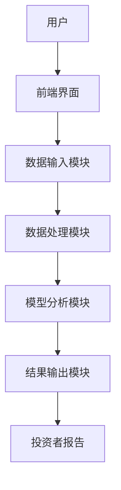
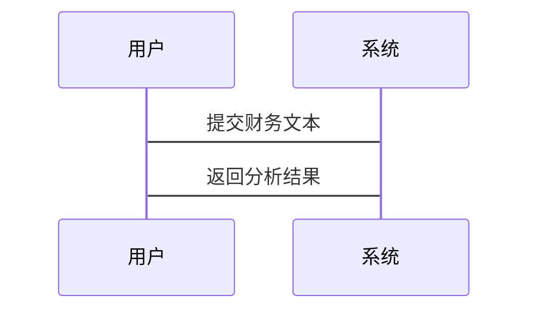

                 


# AI agents辅助价值投资者解读复杂的财务脚注

## 关键词：AI代理，价值投资，财务脚注，自然语言处理，机器学习，BERT模型，财务分析

## 摘要：  
本文探讨了AI代理在辅助价值投资者解读复杂财务脚注中的应用。通过结合自然语言处理（NLP）和机器学习技术，AI代理能够高效地从财务报告中提取关键信息，帮助投资者做出更明智的投资决策。文章详细分析了AI代理的核心概念、算法原理、系统架构，并通过实际案例展示了AI代理在财务脚注解读中的优势和应用场景。

---

# 第一部分: AI代理与价值投资背景

## 第1章: AI代理与价值投资概述

### 1.1 AI代理的核心概念
#### 1.1.1 AI代理的基本定义
AI代理是一种智能系统，能够通过感知环境、理解输入数据并执行任务来辅助人类完成特定目标。在财务分析中，AI代理可以作为投资者的工具，帮助他们解读复杂的财务信息。

#### 1.1.2 价值投资的基本原理
价值投资是一种投资策略，旨在通过分析公司的基本面，如财务报表、市场地位和管理团队，来寻找被市场低估的股票。财务脚注作为财务报表的重要组成部分，提供了大量细节信息，对价值投资者的决策至关重要。

#### 1.1.3 财务脚注的复杂性
财务脚注通常包含大量法律术语和复杂的会计规则，这使得非专业人士难以理解。AI代理通过自然语言处理技术，可以将这些信息转化为易于理解的结构化数据。

### 1.2 AI代理在价值投资中的作用
#### 1.2.1 数据处理与分析
AI代理能够快速处理大量财务文本，提取关键信息，如收入、利润和负债等，帮助投资者快速了解公司的财务状况。

#### 1.2.2 风险识别
通过分析财务脚注，AI代理可以识别潜在的财务风险，如诉讼、担保和应收账款问题，从而帮助投资者做出更明智的投资决策。

#### 1.2.3 趋势预测
AI代理可以通过历史数据分析，识别行业趋势和公司业绩变化，为投资者提供前瞻性的见解。

## 第2章: 财务脚注的复杂性与挑战

### 2.1 财务脚注的特点
#### 2.1.1 文本的非结构化
财务脚注通常是非结构化的文本，包含大量的专业术语和复杂的会计规则，这使得手动分析非常困难。

#### 2.1.2 信息的多样性
财务脚注可能包含多种信息类型，如法律声明、会计政策和管理层讨论，这需要AI代理具备多方面的处理能力。

#### 2.1.3 数据的动态性
财务数据是动态变化的，AI代理需要实时更新模型以适应新的信息。

### 2.2 AI代理在财务脚注分析中的优势
#### 2.2.1 高效性
AI代理能够快速处理大量文本数据，显著提高分析效率。

#### 2.2.2 准确性
通过机器学习算法，AI代理可以减少人为错误，提高分析结果的准确性。

#### 2.2.3 深度理解
AI代理能够深入理解财务文本的含义，提取关键信息，帮助投资者做出更明智的决策。

---

# 第二部分: AI代理的核心概念与联系

## 第3章: 核心概念原理

### 3.1 自然语言处理（NLP）原理
#### 3.1.1 词嵌入
词嵌入是一种将单词转换为低维向量的技术，常用的模型有Word2Vec和BERT。这些模型能够捕捉单词之间的语义关系，帮助AI代理理解财务文本的含义。

#### 3.1.2 语法分析
语法分析通过解析句子的语法结构，识别主语、谓语和宾语等成分，帮助AI代理理解财务文本的语法关系。

#### 3.1.3 文本摘要
文本摘要技术能够从财务文本中提取关键信息，生成简洁的摘要，帮助投资者快速理解财务报告的核心内容。

### 3.2 机器学习原理
#### 3.2.1 数据预处理
数据预处理是机器学习的重要步骤，包括数据清洗、特征提取和数据标准化。这些步骤能够提高模型的准确性和鲁棒性。

#### 3.2.2 特征提取
特征提取是从财务文本中提取有意义的特征，如财务比率和行业指标。这些特征能够帮助模型更好地理解数据的含义。

#### 3.2.3 模型训练
模型训练是通过大量数据训练机器学习模型，使其能够识别财务文本中的模式和规律。常用的模型包括随机森林和神经网络。

### 3.3 AI代理的工作流程
#### 3.3.1 数据输入
AI代理接收财务文本数据，如财务报表和脚注。

#### 3.3.2 数据处理
数据处理包括文本清洗、分词和词嵌入等步骤，将非结构化的文本转化为结构化的数据。

#### 3.3.3 结果输出
AI代理通过分析处理后的数据，生成可读的报告或警报，帮助投资者做出决策。

---

# 第三部分: 算法原理与实现

## 第4章: AI代理的算法原理

### 4.1 BERT模型的结构与特点
#### 4.1.1 模型结构
BERT（Bidirectional Encoder Representations from Transformers）是一种基于Transformer的预训练语言模型，能够同时捕捉文本的上下文信息。

#### 4.1.2 预训练过程
预训练过程包括掩码词预测和句子分割任务，帮助模型理解文本的语法和语义关系。

#### 4.1.3 微调任务
在财务分析任务中，BERT模型需要进行微调，以适应特定的财务文本分析需求。

### 4.2 BERT模型的训练流程
#### 4.2.1 数据准备
准备财务文本数据，包括清洗、分词和标注等步骤。

#### 4.2.2 模型训练
使用预训练的BERT模型，在特定的财务任务上进行微调，优化模型的性能。

#### 4.2.3 模型评估
通过测试集评估模型的性能，调整超参数以提高模型的准确性和鲁棒性。

### 4.3 BERT模型的数学公式
BERT模型的自注意力机制可以通过以下公式表示：

$$
\text{Attention}(Q, K, V) = \text{softmax}\left(\frac{QK^T}{\sqrt{d_k}}\right)V
$$

其中，$Q$、$K$和$V$分别是查询、键和值向量，$d_k$是键的维度。

---

# 第四部分: 系统架构与实现

## 第5章: 系统架构设计

### 5.1 系统功能设计
系统功能包括文本输入、数据处理、模型分析和结果输出。通过模块化设计，确保系统的可扩展性和可维护性。

### 5.2 系统架构图
以下是系统的架构图：



### 5.3 接口设计
系统提供RESTful API接口，支持JSON格式的数据输入和输出。接口设计遵循REST原则，确保系统的灵活性和可扩展性。

### 5.4 系统交互流程
以下是系统的交互流程图：



---

# 第五部分: 项目实战

## 第6章: 项目实战

### 6.1 环境安装
安装Python和相关库，如TensorFlow、Keras和BERT-for-tf2。

### 6.2 核心实现
以下是核心实现代码：

```python
import tensorflow as tf
from tensorflow.keras import layers

def build_model(max_seq_length):
    input_ids = layers.Input(shape=(max_seq_length,), dtype='int32')
    input_mask = layers.Input(shape=(max_seq_length,), dtype='int32')
    input_type_ids = layers.Input(shape=(max_seq_length,), dtype='int32')
    
    embedder = BertModel(
        vocab_size=30000,
        embedding_size=128,
        hidden_size=128,
        num_hidden_layers=2,
        num_attention_heads=2,
        intermediate_size=512,
        dropout_rate=0.1
    )
    
    pooled_output = embedder.bert(input_ids, input_mask, input_type_ids)[0]
    dense = layers.Dense(2, activation='softmax')(pooled_output)
    
    model = tf.keras.Model(inputs=[input_ids, input_mask, input_type_ids], outputs=dense)
    return model
```

### 6.3 代码解读与分析
代码实现了一个基于BERT的文本分类模型，用于分类财务文本。模型包括输入层、嵌入层和全连接层，通过Softmax激活函数输出概率分布。

### 6.4 实际案例分析
通过分析某公司的财务脚注，AI代理能够识别潜在的财务风险，并生成相应的警报。

### 6.5 项目小结
本项目展示了AI代理在财务分析中的应用潜力，为投资者提供了高效、准确的工具。

---

# 第六部分: 总结与展望

## 第7章: 总结与展望

### 7.1 项目总结
本文详细探讨了AI代理在辅助价值投资者解读财务脚注中的应用，展示了其在数据处理、模型训练和系统设计方面的优势。

### 7.2 未来展望
未来的研究方向包括开发更高效的模型、优化系统的交互体验，并扩展AI代理在更多财务分析任务中的应用。

---

# 作者：AI天才研究院/AI Genius Institute & 禅与计算机程序设计艺术 /Zen And The Art of Computer Programming

