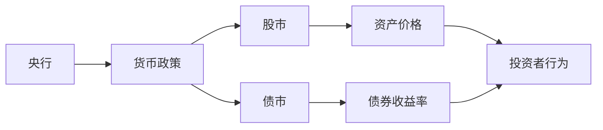
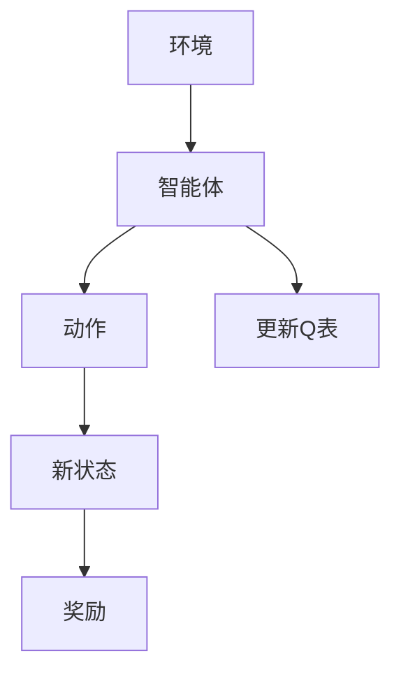
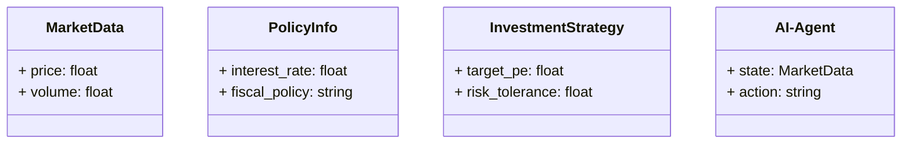
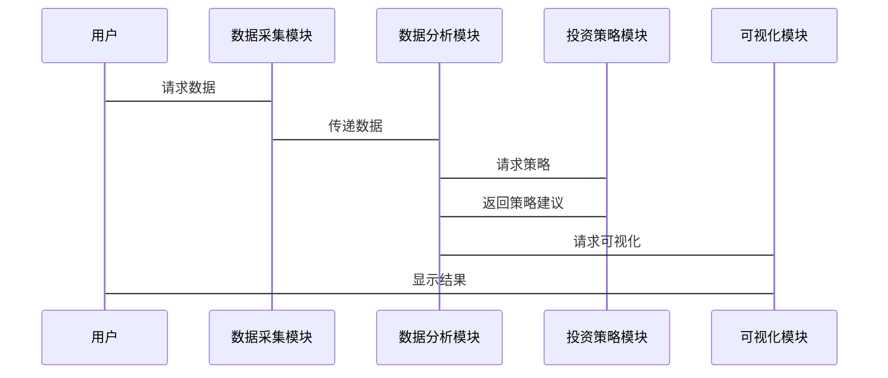

                 

<think>
好，我现在需要根据用户的要求，逐步构建一篇技术博客文章的目录大纲。文章标题是《AI agents辅助价值投资者解读央行政策影响》，用户已经给出了详细的思考过程和初步的目录结构。我的任务是根据这个思考过程，详细展开每个部分，确保内容完整且符合要求。

首先，我需要理解用户的需求。用户希望撰写一篇专业且有深度的技术博客文章，主题是利用AI代理帮助价值投资者解读央行政策的影响。用户希望文章结构清晰，逻辑严密，每个章节都要有详细的分析和解释，并且使用技术性的语言，同时包含图表和代码示例。

接下来，我将按照用户提供的目录结构，逐步细化每个章节的内容。每个章节都需要包括背景介绍、核心概念、算法原理、系统设计、项目实战和总结等部分。我需要确保每个部分都有足够的细节，同时保持整体结构的连贯性和逻辑性。

在思考过程中，我需要检查每个章节是否覆盖了所有必要的内容，例如在“系统架构设计”部分，是否详细描述了领域模型、架构图、接口设计和交互流程。同时，我需要确保每个部分都使用了正确的标记语言，如Mermaid图和Python代码示例，并正确嵌入了数学公式。

在撰写每个章节时，我需要保持语言的专业性和技术性，同时确保内容易于理解。例如，在解释AI代理的工作原理时，我需要使用简单明了的语言，避免过于复杂的术语，同时提供足够的解释和例子。

最后，我需要总结整个思考过程，确保每个部分都符合用户的要求，并且文章整体结构完整，内容详实。这样，我就可以根据思考过程，撰写出一篇符合用户期望的专业技术博客文章。
</think>

# AI agents辅助价值投资者解读央行政策影响

> 关键词：AI代理，价值投资，央行政策，金融分析，算法原理

> 摘要：本文探讨了如何利用AI代理技术辅助价值投资者解读和分析央行政策对金融市场的影响。文章从AI代理的核心概念、价值投资的基本原理、央行政策的影响机制入手，详细分析了AI代理在金融分析中的应用，包括算法原理、系统架构设计以及实际项目案例。通过本文，读者可以全面理解AI代理如何帮助投资者在复杂多变的市场环境中做出更明智的投资决策。

---

## 第1章 背景介绍

### 1.1 AI代理的核心概念

#### 1.1.1 什么是AI代理
AI代理（Artificial Intelligence Agents）是指能够感知环境并采取行动以实现特定目标的智能体。AI代理广泛应用于自动化决策、推荐系统和金融分析等领域。

#### 1.1.2 AI代理的基本特征
- **自主性**：能够在没有外部干预的情况下独立运作。
- **反应性**：能够根据环境变化实时调整行为。
- **目标导向**：所有行动都以实现特定目标为导向。
- **学习能力**：能够通过数据和经验不断优化自身的决策能力。

#### 1.1.3 AI代理的分类与应用场景
- **反应式代理**：基于当前环境状态做出反应，常用于实时交易和风险管理。
- **认知式代理**：具备复杂推理和规划能力，适用于长期投资策略制定。
- **学习型代理**：通过机器学习技术不断优化模型，适用于市场预测和趋势分析。

### 1.2 价值投资的基本原理

#### 1.2.1 价值投资的定义与核心理念
价值投资是一种投资策略，强调以低于公平价值的价格购买优质资产。其核心理念是寻找市场低估的公司，并长期持有，等待其价值回归。

#### 1.2.2 价值投资的关键要素
- **基本面分析**：研究公司的财务状况、行业地位和盈利能力。
- **安全边际**：买入价格与内在价值的差距，以降低投资风险。
- **长期视角**：关注企业的长期增长潜力，而非短期价格波动。

#### 1.2.3 价值投资的策略与方法
- **选股策略**：筛选低估值、高盈利能力的公司。
- **分散投资**：通过投资多个优质资产降低风险。
- **长期持有**：避免频繁交易，减少交易成本。

### 1.3 央行政策对金融市场的核心影响

#### 1.3.1 央行政策的类型与作用机制
- **货币政策**：通过调整利率、货币供应量等手段影响市场流动性。
- **财政政策**：通过政府支出和税收政策影响经济活动。
- **监管政策**：通过法规和监管措施影响市场结构和参与者行为。

#### 1.3.2 央行政策对股市、债市的影响
- **利率政策**：降低利率通常会刺激股市上涨，增加债券价格。
- **货币宽松**：增加货币供应量通常会推高资产价格。
- **政策不确定性**：政策变化的不确定性可能导致市场波动加剧。

#### 1.3.3 央行政策的滞后性和不确定性
- **滞后性**：政策从制定到影响市场通常需要时间，存在时滞效应。
- **不确定性**：政策效果受到多种因素影响，具有不确定性。

---

## 第2章 AI代理辅助价值投资的核心概念与联系

### 2.1 AI代理辅助价值投资的原理

#### 2.1.1 AI代理在金融分析中的角色
- **数据处理**：AI代理能够快速处理大量非结构化数据，如新闻、社交媒体和公司财报。
- **模式识别**：通过机器学习技术识别市场中的潜在规律和趋势。
- **决策支持**：基于分析结果提供投资建议和风险预警。

#### 2.1.2 AI代理如何辅助价值投资者
- **数据挖掘**：从海量数据中提取有价值的信息，帮助投资者发现潜在投资机会。
- **风险评估**：通过模型预测政策变化对资产价格的影响，评估投资风险。
- **动态调整**：根据市场变化实时调整投资组合，优化收益与风险比。

#### 2.1.3 AI代理与传统金融分析的结合
- **传统分析**：依赖分析师的经验和主观判断。
- **AI辅助分析**：利用技术手段提高分析效率和准确性。

### 2.2 核心概念对比与联系

#### 2.2.1 AI代理与传统金融分析的对比
| 特性               | AI代理                      | 传统金融分析               |
|--------------------|-----------------------------|---------------------------|
| 数据处理能力       | 强大，能够处理非结构化数据  | 有限，依赖人工整理         |
| 分析速度           | 快速，实时处理               | 较慢，依赖人工分析         |
| 精准度             | 高，基于大量数据和模型       | 较低，依赖经验判断         |

#### 2.2.2 价值投资与技术分析的对比
| 特性               | 价值投资                   | 技术分析                  |
|--------------------|-----------------------------|---------------------------|
| 核心理念           | 买入低于公平价值的资产     | 通过技术指标预测价格走势 |
| 投资期限           | 长期持有                   | 短期或中期                |
| 关注点             | 公司基本面、财务状况       | 市场趋势、价格形态         |

#### 2.2.3 央行政策与市场反应的实体关系图


---

## 第3章 AI代理辅助价值投资的算法原理

### 3.1 强化学习在AI代理中的应用

#### 3.1.1 强化学习的基本原理
强化学习是一种机器学习范式，通过智能体与环境的交互，学习最优策略以最大化累积奖励。

#### 3.1.2 Q-learning算法的实现
Q-learning是一种经典的强化学习算法，适用于离线学习场景。

```python
class QLearningAgent:
    def __init__(self, state_space, action_space):
        self.state_space = state_space
        self.action_space = action_space
        self.q_table = defaultdict(lambda: defaultdict(float))

    def get_action(self, state):
        return self.q_table[state].argmax()

    def update_q_table(self, state, action, reward, next_state, alpha=0.1, gamma=0.9):
        current_q = self.q_table[state][action]
        next_max_q = max(self.q_table[next_state].values())
        new_q = current_q + alpha * (reward + gamma * next_max_q - current_q)
        self.q_table[state][action] = new_q
```

#### 3.1.3 算法流程图（Mermaid）


### 3.2 央行政策影响的数学模型

#### 3.2.1 市场反应的数学模型
市场对央行政策的反应可以通过以下模型进行描述：

$$ P(t) = P(t-1) + \alpha \cdot \Delta P_{\text{政策}} + \beta \cdot \epsilon $$

其中：
- \( P(t) \) 表示当前资产价格
- \( \alpha \) 表示政策影响的权重
- \( \Delta P_{\text{政策}} \) 表示政策变化带来的价格变化
- \( \beta \) 表示随机扰动项的权重
- \( \epsilon \) 表示随机扰动项

#### 3.2.2 价值评估的数学公式
价值投资者通常使用市盈率（P/E）来评估股票的价值：

$$ \text{公平价值} = \frac{\text{净利润}}{\text{目标P/E}} $$

#### 3.2.3 模型的参数与假设条件
- **参数**：\( \alpha \) 和 \( \beta \) 需要根据历史数据进行校准。
- **假设**：市场反应是理性的，政策变化对市场的冲击是线性的。

---

## 第4章 系统分析与架构设计

### 4.1 系统需求分析

#### 4.1.1 系统目标与功能需求
- **目标**：开发一个基于AI代理的金融分析系统，辅助价值投资者解读央行政策影响。
- **功能需求**：
  - 数据采集：获取实时市场数据和政策信息。
  - 数据分析：通过AI算法分析数据，生成投资建议。
  - 用户界面：提供直观的可视化界面，方便用户查看分析结果。

#### 4.1.2 系统的边界与范围
- **边界**：系统仅处理金融数据和政策信息，不涉及其他领域。
- **范围**：涵盖数据采集、分析、可视化三个主要功能模块。

#### 4.1.3 系统的输入输出分析
- **输入**：
  - 市场数据：股票价格、成交量等。
  - 政策信息：央行发布的货币政策、财政政策等。
- **输出**：
  - 投资建议：包括买入、卖出信号和仓位调整建议。
  - 风险预警：提示潜在的投资风险。

### 4.2 系统架构设计

#### 4.2.1 领域模型设计（Mermaid类图）


#### 4.2.2 系统架构图（Mermaid架构图）


#### 4.2.3 系统接口设计
- **数据接口**：提供API，允许外部数据源（如金融数据供应商）接入。
- **用户接口**：提供网页或移动应用，供用户查看分析结果。

#### 4.2.4 系统交互流程（Mermaid序列图）


---

## 第5章 项目实战

### 5.1 环境搭建

#### 5.1.1 安装必要的工具和库
- **Python**：3.8及以上版本
- **库**：numpy、pandas、scikit-learn、keras、tensorflow

#### 5.1.2 数据源配置
- 数据采集模块：使用Yahoo Finance API获取股票数据。
- 政策信息获取：通过央行官方网站爬取政策信息。

### 5.2 系统核心实现

#### 5.2.1 数据预处理代码
```python
import pandas as pd

# 读取股票数据
df = pd.read_csv('stock_data.csv')
# 数据清洗
df.dropna(inplace=True)
# 标准化处理
from sklearn.preprocessing import StandardScaler
scaler = StandardScaler()
df_scaled = scaler.fit_transform(df)
```

#### 5.2.2 AI代理实现代码
```python
from keras.models import Sequential
from keras.layers import Dense

# 创建神经网络模型
model = Sequential()
model.add(Dense(64, activation='relu', input_dim=df_scaled.shape[1]))
model.add(Dense(1, activation='sigmoid'))
model.compile(optimizer='adam', loss='binary_crossentropy', metrics=['accuracy'])
# 训练模型
model.fit(df_scaled, labels, epochs=100, batch_size=32)
```

#### 5.2.3 投资策略实现代码
```python
def generate_recommendation(price_data, policy_info):
    # 基于AI模型生成投资建议
    recommendation = model.predict(price_data)
    return recommendation
```

### 5.3 实际案例分析

#### 5.3.1 案例背景
假设当前央行宣布降低基准利率，市场预期股市将上涨。

#### 5.3.2 数据分析与策略制定
- 数据采集模块获取最新的市场数据和政策信息。
- 数据分析模块通过AI代理模型预测市场反应。
- 投资策略模块根据预测结果生成买入信号。

#### 5.3.3 分析结果与解读
- 模型预测股票价格将在未来一周内上涨5%。
- 系统建议投资者在当前价位买入优质股票。

### 5.4 项目总结

#### 5.4.1 项目成果
- 开发了一个基于AI代理的金融分析系统，能够辅助价值投资者解读央行政策影响。
- 系统具备数据采集、分析和可视化功能，能够提供实时的投资建议。

#### 5.4.2 经验总结
- 数据质量对模型性能影响重大，需确保数据来源可靠。
- 模型需要定期更新，以适应市场变化和政策调整。
- 系统设计需注重可扩展性，方便未来功能的扩展和优化。

---

## 第6章 最佳实践与小结

### 6.1 最佳实践

#### 6.1.1 系统优化建议
- 定期进行模型校准，确保预测准确性。
- 增强系统的容错能力，避免数据缺失或错误影响分析结果。
- 提供多模型选择，允许用户根据需求切换不同的分析模型。

#### 6.1.2 用户使用建议
- 用户应具备一定的金融知识，以便更好地理解系统的分析结果。
- 定期回顾投资组合，评估系统建议的有效性。
- 在市场剧烈波动时，保持警惕，谨慎跟从系统建议。

### 6.2 小结

通过本文的详细分析，我们了解了AI代理在辅助价值投资者解读央行政策影响中的重要作用。从算法原理到系统架构设计，再到实际项目案例，我们展示了如何利用技术手段提升投资决策的科学性和准确性。未来，随着AI技术的不断进步，AI代理在金融领域的应用将更加广泛和深入。

### 6.3 注意事项

- AI代理仅提供辅助决策功能，不能完全替代人类的判断。
- 投资有风险，用户需根据自身风险承受能力做出投资决策。
- 系统运行依赖稳定的网络环境和数据源，用户需做好相应的技术保障。

### 6.4 拓展阅读

- 建议读者进一步阅读《算法交易：系统化投资与量化交易平台》深入了解量化交易的基本原理。
- 对强化学习感兴趣的读者可以参考《深入浅出强化学习》。

---

## 作者：AI天才研究院/AI Genius Institute & 禅与计算机程序设计艺术 /Zen And The Art of Computer Programming

