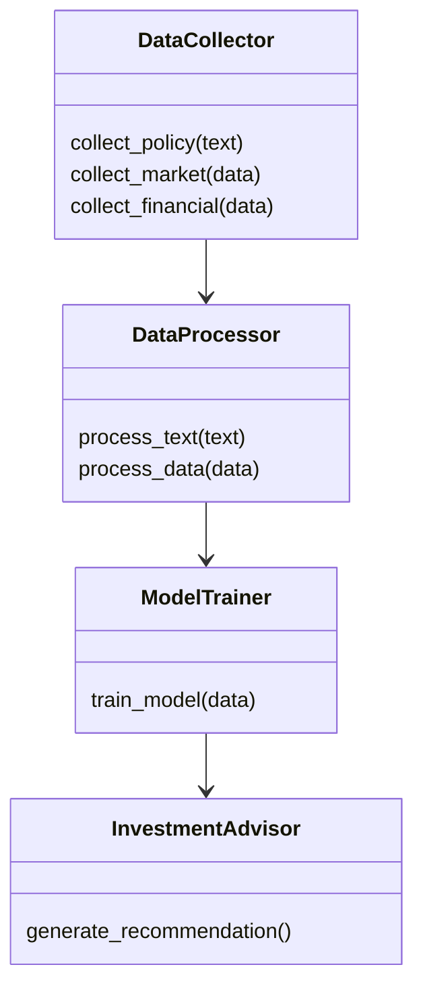
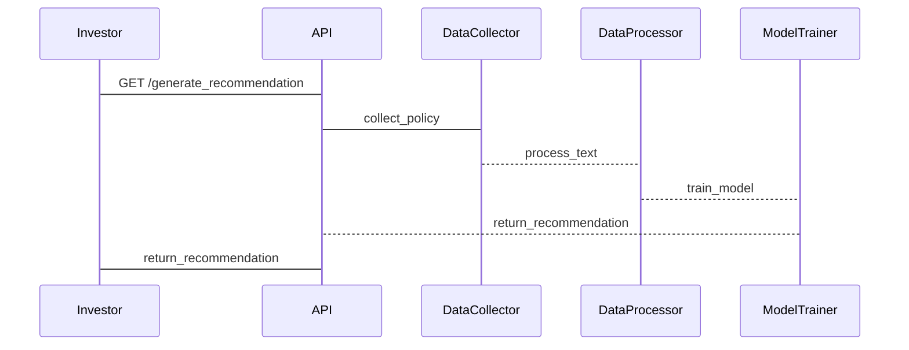

                 


# AI Agents辅助价值投资者解读政府政策影响

## 关键词：
AI代理，价值投资，政策分析，自然语言处理，强化学习，投资决策，系统架构

## 摘要：
本文探讨了如何利用AI代理辅助价值投资者解读政府政策的影响。通过分析政策文本和市场数据，AI代理能够帮助投资者识别潜在的投资机会和风险。文章从AI代理的核心算法、系统架构到实际应用案例进行了详细讲解，展示了如何利用强化学习和自然语言处理技术提升投资决策的效率和准确性。

---

# 第1章: 问题背景与核心概念

## 1.1 问题背景

### 1.1.1 价值投资与政策分析的重要性
价值投资是一种长期投资策略，强调通过分析企业的基本面来判断其内在价值。然而，政府政策的变化（如税收政策、行业监管等）对企业价值和市场走势有重要影响。传统的政策分析依赖于人工研究，耗时且容易受到主观因素的影响。

### 1.1.2 政府政策对企业投资的影响
政府政策可以直接或间接影响企业的盈利能力、市场准入和竞争环境。例如，环保政策的收紧可能会增加企业的生产成本，而税收优惠政策则可能提升企业的净利润率。投资者需要及时解读政策变化，才能做出明智的投资决策。

### 1.1.3 AI技术在金融领域的应用潜力
AI技术，特别是自然语言处理和强化学习，能够帮助投资者快速分析大量政策文本和市场数据，提取关键信息，并预测政策变化对市场的影响。AI代理可以辅助投资者在复杂的政策环境中快速识别机会和风险。

---

## 1.2 核心概念

### 1.2.1 AI代理的定义与特点
AI代理是一种智能系统，能够感知环境、执行任务并做出决策。其特点是自主性、反应性、目标导向和学习能力。在投资领域，AI代理可以用于数据采集、模式识别和决策支持。

### 1.2.2 价值投资的基本原理
价值投资强调以低于内在价值的价格买入优质资产。核心在于对企业基本面（如收入、利润、现金流）和行业环境的深入分析。政策分析是价值投资的重要组成部分，因为政策变化会影响企业的经营环境和财务表现。

### 1.2.3 政府政策的分类与分析框架
政府政策可以分为宏观经济政策（如货币政策、财政政策）和行业政策（如环保政策、行业监管）。政策分析需要考虑政策的直接影响（如直接影响企业成本）和间接影响（如影响市场情绪）。

---

## 1.3 问题描述与解决思路

### 1.3.1 投资者面临的政策解读难题
政策文本复杂且信息量大，人工解读效率低且容易遗漏关键信息。此外，政策对市场的短期和长期影响难以量化，投资者需要借助工具来辅助分析。

### 1.3.2 AI代理如何辅助政策解读
AI代理可以通过自然语言处理技术分析政策文本，提取关键词和主题。结合强化学习算法，AI代理可以预测政策变化对市场的影响，并为投资者提供投资建议。

### 1.3.3 从数据到决策的AI代理应用流程
1. 数据采集：收集政策文本、市场数据和企业基本面数据。
2. 数据处理：清洗和结构化数据，提取关键特征。
3. 模型训练：使用强化学习算法训练政策影响预测模型。
4. 投资决策：基于模型输出生成投资建议。

---

# 第2章: AI代理与价值投资的结合

## 2.1 AI代理的核心功能

### 2.1.1 数据采集与处理
AI代理可以从新闻网站、政府公告和企业财报中采集政策和市场数据。数据处理包括文本清洗、分词和向量化。

### 2.1.2 政策分析与预测
通过自然语言处理技术，AI代理可以分析政策文本的语义和情感。结合时间序列分析，AI代理可以预测政策变化对市场的影响。

### 2.1.3 投资决策支持
AI代理可以基于政策分析结果和市场数据，生成投资策略。例如，当某行业政策放松时，AI代理可以建议投资者关注该行业的龙头企业。

---

## 2.2 价值投资与政策分析的协同

### 2.2.1 政策对行业的影响评估
AI代理可以分析政策对行业的影响，例如环保政策对制造业的影响。投资者可以根据AI代理的分析结果，调整投资组合。

### 2.2.2 企业基本面分析的AI辅助
AI代理可以帮助投资者分析企业的财务数据，识别财务风险和投资机会。例如，AI代理可以预测企业的净利润增长率。

### 2.2.3 市场情绪与政策解读的结合
市场情绪可以通过社交媒体和新闻数据进行分析。AI代理可以将市场情绪与政策解读相结合，预测政策变化对市场的影响。

---

## 2.3 投资决策中的AI代理价值

### 2.3.1 提高投资效率
AI代理可以快速分析大量数据，帮助投资者节省时间和精力。例如，AI代理可以在几分钟内分析数百份政策文件。

### 2.3.2 降低投资风险
通过预测政策变化和市场走势，AI代理可以帮助投资者规避潜在风险。例如，AI代理可以提前预警某行业政策收紧的风险。

### 2.3.3 数据驱动的决策优势
AI代理可以基于大量数据进行分析，避免人为判断的主观性。例如，AI代理可以基于历史数据预测某政策对企业利润的影响。

---

# 第3章: 政府政策影响的解读框架

## 3.1 政策影响的分析维度

### 3.1.1 宏观经济政策分析
宏观经济政策（如货币政策和财政政策）直接影响市场整体走势。例如，央行降息可能会降低企业的融资成本，从而提升企业利润。

### 3.1.2 产业政策分析
产业政策（如行业监管和税收优惠）直接影响特定行业的企业。例如，环保政策的收紧可能会增加制造业企业的生产成本。

### 3.1.3 财税政策分析
财税政策（如税率调整和补贴政策）直接影响企业的净利润。例如，税收优惠政策可以提升企业的净利润率。

---

## 3.2 政策解读的关键要素

### 3.2.1 政策目标与实施效果
政策目标是指政府希望通过政策实现的目标，例如经济增长或环境保护。政策实施效果是指政策实际对市场和企业的影响。

### 3.2.2 政策的行业影响
不同行业的政策敏感性不同。例如，环保政策对制造业的影响可能大于对服务业的影响。

### 3.2.3 政策的市场反应
政策的市场反应包括市场情绪和股价波动。例如，某行业政策放松可能会导致该行业股票价格上涨。

---

## 3.3 AI代理在政策解读中的应用

### 3.3.1 数据挖掘与模式识别
AI代理可以通过数据挖掘技术，识别政策变化的模式和趋势。例如，AI代理可以发现某行业政策每隔两年调整一次的规律。

### 3.3.2 自然语言处理在政策文本分析中的应用
自然语言处理技术可以帮助AI代理理解政策文本的语义。例如，AI代理可以识别政策文本中的关键词，如“鼓励”、“限制”等。

### 3.3.3 预测模型的构建与优化
AI代理可以基于历史数据和当前政策，构建政策影响预测模型。例如，AI代理可以预测某政策对企业利润的影响。

---

# 第4章: 强化学习在AI代理中的应用

## 4.1 强化学习的基本原理

### 4.1.1 状态空间与动作空间
在强化学习中，状态空间是环境的所有可能状态，动作空间是代理可以执行的所有动作。例如，在投资决策中，状态可以是当前市场数据，动作可以是买入、卖出或持有。

### 4.1.2 奖励函数与策略优化
奖励函数用于衡量代理的动作是否带来预期结果。策略优化是通过不断调整策略参数，以最大化累计奖励。

### 4.1.3 Q-learning算法
Q-learning是一种经典的强化学习算法，通过更新Q值表来学习最优策略。Q值表示从当前状态执行某动作后的预期奖励。

### 4.1.4 Deep Q-Networks (DQN)
DQN是Q-learning的深度学习版本，使用神经网络近似Q值函数。DQN在投资决策中可以用于动态调整投资组合。

---

## 4.2 强化学习在投资决策中的应用

### 4.2.1 状态表示与动作选择
在投资决策中，状态可以是市场数据（如股价、成交量），动作可以是买入、卖出或持有。

### 4.2.2 奖励机制的设计
奖励机制需要与投资目标一致。例如，获得正收益可以得到正奖励，亏损可以得到负奖励。

### 4.2.3 策略网络的构建与训练
策略网络用于根据当前状态选择最优动作。例如，策略网络可以根据当前市场数据，建议买入某股票。

---

## 4.3 算法实现与优化

### 4.3.1 算法实现步骤
1. 初始化Q值表或策略网络。
2. 收集市场数据作为状态。
3. 执行动作（如买入或卖出）。
4. 计算奖励并更新Q值或策略网络。

### 4.3.2 神经网络结构与训练
使用深度神经网络近似Q值函数。神经网络结构包括输入层、隐藏层和输出层。训练过程使用梯度下降优化。

### 4.3.3 算法优化技巧
- 使用经验回放缓解样本偏差。
- 调整学习率和折扣因子。
- 定期更新目标网络。

---

# 第5章: 系统架构设计与实现

## 5.1 系统功能设计

### 5.1.1 功能模块
- 数据采集模块：收集政策文本、市场数据和企业基本面数据。
- 数据处理模块：清洗和结构化数据。
- 模型训练模块：训练强化学习模型。
- 投资决策模块：基于模型输出生成投资建议。

### 5.1.2 领域模型（mermaid类图）


---

## 5.2 系统架构设计

### 5.2.1 系统架构图（mermaid架构图）


---

## 5.3 系统接口设计

### 5.3.1 API接口
- `/collect_policy`：接收政策文本。
- `/process_data`：处理市场数据。
- `/train_model`：训练强化学习模型。
- `/generate_recommendation`：生成投资建议。

### 5.3.2 接口交互流程（mermaid序列图）


---

# 第6章: 项目实战与案例分析

## 6.1 项目实战

### 6.1.1 环境安装
安装必要的库：
```bash
pip install numpy pandas keras tensorflow transformers
```

### 6.1.2 核心代码实现

#### 数据采集模块
```python
import requests
from bs4 import BeautifulSoup

def collect_policy(url):
    response = requests.get(url)
    soup = BeautifulSoup(response.text, 'html.parser')
    policy_text = soup.find('div', {'class': 'policy-content'}).text
    return policy_text
```

#### 数据处理模块
```python
import numpy as np
from sklearn.feature_extraction.text import TfidfVectorizer

def process_text(text):
    vectorizer = TfidfVectorizer()
    vectors = vectorizer.fit_transform([text])
    return vectors.toarray()[0]
```

#### 模型训练模块
```python
import tensorflow as tf
from tensorflow.keras.models import Sequential
from tensorflow.keras.layers import Dense

def train_model(train_data, train_labels):
    model = Sequential()
    model.add(Dense(64, activation='relu', input_dim=train_data.shape[1]))
    model.add(Dense(1, activation='sigmoid'))
    model.compile(optimizer='adam', loss='binary_crossentropy', metrics=['accuracy'])
    model.fit(train_data, train_labels, epochs=10, batch_size=32)
    return model
```

#### 投资决策模块
```python
def generate_recommendation(policy_vector, model):
    prediction = model.predict(np.array([policy_vector]))
    if prediction[0][0] > 0.5:
        return "Buy"
    else:
        return "Sell"
```

### 6.1.3 代码应用解读
上述代码实现了从政策文本采集、数据处理到模型训练和投资决策的完整流程。投资者可以调用`generate_recommendation`函数，根据AI代理的预测结果做出投资决策。

---

## 6.2 案例分析

### 6.2.1 案例背景
假设政府出台了一项新的环保政策，投资者希望了解该政策对某制造业企业的影响。

### 6.2.2 数据采集与处理
AI代理采集政策文本并进行分词和向量化处理。

### 6.2.3 模型训练与预测
模型预测该政策对企业利润的影响，并生成投资建议。

### 6.2.4 投资决策
根据模型预测结果，投资者决定是否买入、卖出或持有该企业的股票。

---

## 6.3 项目小结

### 6.3.1 项目总结
通过AI代理辅助政策解读，投资者可以更高效地做出投资决策。AI代理能够处理大量数据，提供准确的预测结果，帮助投资者规避风险。

### 6.3.2 项目意义
本项目展示了AI技术在金融领域的应用潜力。通过结合自然语言处理和强化学习，AI代理能够为投资者提供有价值的决策支持。

---

# 第7章: 最佳实践与小结

## 7.1 最佳实践

### 7.1.1 数据质量管理
确保数据的准确性和完整性，避免噪声数据对模型的影响。

### 7.1.2 模型优化
定期更新模型参数，根据市场变化调整模型结构。

### 7.1.3 风险控制
设置止损点和止盈点，避免重大损失。

### 7.1.4 人工辅助
AI代理无法完全替代人类判断，投资者需要结合市场实际情况进行决策。

---

## 7.2 小结

### 7.2.1 全文总结
本文详细介绍了AI代理在价值投资中的应用，从政策解读到投资决策，展示了AI技术在金融领域的巨大潜力。

### 7.2.2 注意事项
- 数据隐私问题需要重视。
- 模型需要不断优化和更新。
- 投资者需要结合市场实际情况进行决策。

### 7.2.3 拓展阅读
建议读者进一步学习强化学习和自然语言处理技术，了解更多的投资策略和模型。

---

# 作者：AI天才研究院/AI Genius Institute & 禅与计算机程序设计艺术 /Zen And The Art of Computer Programming

