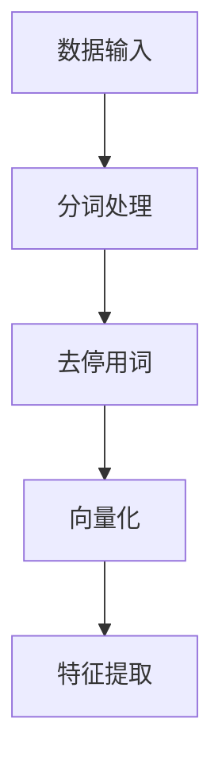
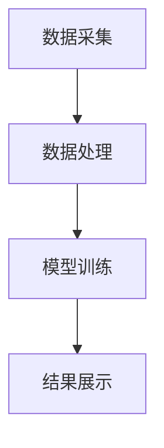
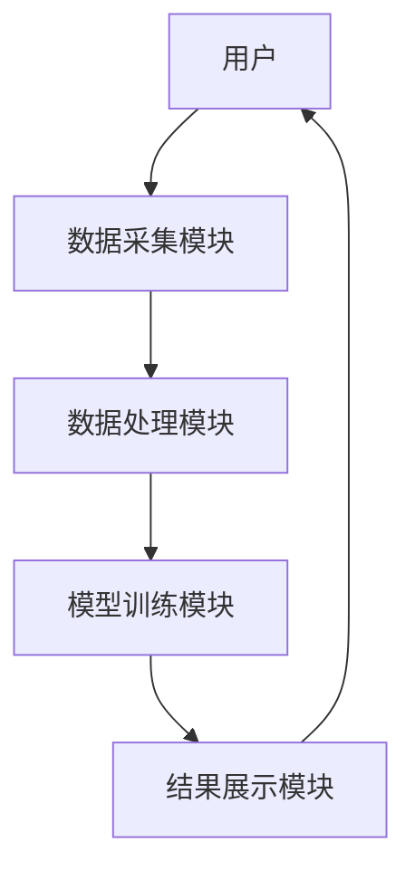

                 


# AI agents辅助价值投资者解读非结构化数据

**关键词：** AI代理, 价值投资, 非结构化数据, 自然语言处理, 机器学习, 数据分析, 股票投资

**摘要：**  
本文探讨AI代理如何辅助价值投资者解读非结构化数据。通过分析非结构化数据的特点，结合AI代理的核心原理，提出一种基于自然语言处理和机器学习的解决方案。文章从背景介绍、核心概念、算法原理、系统架构到项目实战，详细阐述了AI代理在价值投资中的应用，并给出了实际案例和最佳实践建议。

---

# 第1章 AI代理与价值投资概述

## 1.1 AI代理的基本概念

### 1.1.1 什么是AI代理
AI代理（Artificial Intelligence Agent）是指能够感知环境、做出决策并执行动作的智能实体。与传统算法相比，AI代理具有更强的自主性和适应性，能够在复杂环境中实现目标。

### 1.1.2 AI代理的核心特征
- **自主性：** 能够独立完成任务。
- **反应性：** 能够实时感知环境并做出反应。
- **目标导向：** 通过实现目标来优化行为。
- **学习能力：** 能够通过经验改进性能。

### 1.1.3 AI代理与传统算法的区别
| 特性 | 传统算法 | AI代理 |
|------|----------|--------|
| 行为方式 | 预设规则，被动执行 | 自主决策，主动探索 |
| 学习能力 | 无学习能力 | 具备学习能力 |
| 适应性 | 固定场景 | 多场景适应 |

---

## 1.2 价值投资的基本原理

### 1.2.1 价值投资的定义
价值投资是一种投资策略，通过分析企业的基本面（如财务状况、行业地位、盈利能力等），寻找被市场低估的投资标的。

### 1.2.2 价值投资的关键要素
- **基本面分析：** 企业的财务报表、行业地位、竞争优势。
- **市场情绪：** 市场参与者的心理和行为。
- **长期价值：** 企业的内在价值和成长潜力。

### 1.2.3 价值投资与AI的结合
AI代理可以通过分析海量非结构化数据（如新闻、社交媒体、行业报告），辅助投资者发现潜在的投资机会。

---

## 1.3 非结构化数据的特点

### 1.3.1 非结构化数据的定义
非结构化数据是指没有固定结构，难以用传统数据库存储和处理的数据形式，如文本、图像、音频等。

### 1.3.2 非结构化数据的分类
- **文本数据：** 新闻、评论、报告。
- **图像数据：** 图片、图表。
- **音频数据：** 音频、电话记录。

### 1.3.3 非结构化数据的处理挑战
- **数据量大：** 需要高效的存储和处理能力。
- **数据异构：** 数据格式多样，难以统一处理。
- **语义复杂：** 需要理解数据的深层含义。

---

## 1.4 AI代理在非结构化数据中的应用

### 1.4.1 非结构化数据的价值挖掘
AI代理可以通过自然语言处理技术，从新闻、社交媒体等非结构化数据中提取有价值的信息。

### 1.4.2 AI代理在数据解读中的作用
- **信息提取：** 从文本中提取关键信息。
- **情感分析：** 分析市场情绪。
- **主题建模：** 挖掘数据中的主题分布。

### 1.4.3 价值投资中的AI代理优势
- **高效性：** 能够快速处理海量数据。
- **准确性：** 通过算法优化投资决策。
- **持续性：** 可以实时监控市场动态。

---

## 1.5 本章小结

本章介绍了AI代理的基本概念和价值投资的核心原理，重点分析了非结构化数据的特点及其在价值投资中的应用。AI代理通过感知、决策和执行三个模块，能够有效辅助投资者解读非结构化数据。

---

# 第2章 AI代理的核心原理

## 2.1 AI代理的感知模块

### 2.1.1 数据输入与预处理
AI代理需要从非结构化数据中提取特征，常见的预处理方法包括分词、去停用词和向量化。



### 2.1.2 感知模型的构建
感知模型通常采用自然语言处理技术，如词袋模型或词嵌入（Word2Vec）。

### 2.1.3 感知结果的输出
感知结果包括关键词提取和情感倾向分析。

---

## 2.2 AI代理的决策模块

### 2.2.1 决策规则的制定
决策规则基于感知结果和历史数据，制定投资策略。

### 2.2.2 决策模型的训练
决策模型通常采用监督学习，如随机森林或支持向量机（SVM）。

### 2.2.3 决策结果的优化
通过回测和策略调整，优化决策结果。

---

## 2.3 AI代理的执行模块

### 2.3.1 执行策略的设计
执行策略包括买入、卖出和持有三种操作。

### 2.3.2 执行过程的监控
监控市场动态，实时调整执行策略。

### 2.3.3 执行结果的反馈
将执行结果反馈到感知和决策模块，形成闭环。

---

## 2.4 AI代理的核心概念对比

| 模块 | 感知 | 决策 | 执行 |
|------|------|------|------|
| 功能 | 数据输入与预处理 | 制定投资策略 | 执行交易 |
| 方法 | NLP技术 | 机器学习 | 策略执行 |
| 输出 | 特征提取 | 投资决策 | 交易结果 |

---

## 2.5 本章小结

本章详细阐述了AI代理的核心原理，包括感知、决策和执行三个模块。通过对比分析，明确了各模块的功能和实现方法。

---

# 第3章 AI代理的算法原理

## 3.1 情感分析算法

### 3.1.1 情感分析的定义
情感分析是通过自然语言处理技术，判断文本中的情感倾向。

### 3.1.2 基于词袋模型的情感分析
```python
from sklearn.feature_extraction.text import TfidfVectorizer
from sklearn.linear_model import LogisticRegression

# 数据预处理
vectorizer = TfidfVectorizer()
X = vectorizer.fit_transform(texts)
y = [0, 1]  # 0表示负面，1表示正面

# 模型训练
model = LogisticRegression()
model.fit(X, y)

# 预测
new_text = ["这个公司表现不佳"]
new_X = vectorizer.transform([new_text])
print(model.predict(new_X))  # 输出：[0]
```

### 3.1.3 情感分析的数学模型
情感分析可以使用逻辑回归模型，其数学公式如下：
$$ P(y=1|x) = \frac{1}{1 + e^{-\beta x}} $$

---

## 3.2 主题建模算法

### 3.2.1 主题建模的定义
主题建模是通过分析文本数据，挖掘出隐藏的主题分布。

### 3.2.2 基于LDA的主题建模
```python
from gensim.models import LdaModel
from gensim.corpora import Dictionary

# 创建词典
dictionary = Dictionary(texts)
corpus = [dictionary.doc2bow(text) for text in texts]

# 训练模型
model = LdaModel(corpus, num_topics=5, id2word=dictionary)

# 输出主题
print(model.print_topics())
```

### 3.2.3 主题建模的数学模型
LDA（Latent Dirichlet Allocation）的数学公式如下：
$$ \theta_{d} \sim \text{Dirichlet}(\alpha) $$
$$ \phi_{z} \sim \text{Dirichlet}(\beta) $$
$$ \text{words}_{d} \sim \text{Multinomial}(\phi_{z}) $$

---

## 3.3 本章小结

本章详细讲解了AI代理中常用的算法原理，包括情感分析和主题建模。通过Python代码和数学公式，展示了这些算法的具体实现和应用。

---

# 第4章 系统分析与架构设计

## 4.1 项目背景与需求分析

### 4.1.1 项目背景
本文旨在构建一个基于AI代理的非结构化数据解读系统，辅助价值投资者进行投资决策。

### 4.1.2 项目目标
通过自然语言处理和机器学习技术，实现对新闻、社交媒体等非结构化数据的自动分析。

---

## 4.2 系统功能设计

### 4.2.1 系统功能模块
- **数据采集模块：** 从新闻网站、社交媒体等来源采集数据。
- **数据处理模块：** 对数据进行清洗、分词和向量化。
- **模型训练模块：** 训练情感分析和主题建模模型。
- **结果展示模块：** 可视化分析结果。



---

## 4.3 系统架构设计

### 4.3.1 系统架构图


---

## 4.4 系统接口设计

### 4.4.1 接口定义
- **数据采集接口：** 从API获取新闻数据。
- **数据处理接口：** 对数据进行预处理。
- **模型训练接口：** 训练情感分析和主题建模模型。
- **结果展示接口：** 显示分析结果。

---

## 4.5 系统交互流程

### 4.5.1 交互流程图


---

## 4.6 本章小结

本章从系统架构的角度，详细设计了AI代理辅助价值投资者解读非结构化数据的系统。通过模块划分和流程设计，明确了系统的实现方式。

---

# 第5章 项目实战：构建AI代理辅助系统

## 5.1 环境安装与配置

### 5.1.1 安装Python环境
```bash
python --version
pip install -y numpy scikit-learn gensim
```

### 5.1.2 安装NLP库
```bash
pip install -y nltk spacy
python -m spacy download en_core_web_sm
```

---

## 5.2 系统核心实现

### 5.2.1 数据采集模块
```python
import requests
from bs4 import BeautifulSoup

def fetch_data(url):
    response = requests.get(url)
    soup = BeautifulSoup(response.text, 'html.parser')
    texts = [p.text for p in soup.find_all('p')]
    return texts
```

### 5.2.2 数据处理模块
```python
from sklearn.feature_extraction.text import TfidfVectorizer

def preprocess(texts):
    vectorizer = TfidfVectorizer()
    X = vectorizer.fit_transform(texts)
    return X
```

### 5.2.3 模型训练模块
```python
from sklearn.model_selection import train_test_split
from sklearn.linear_model import LogisticRegression

def train_model(X, y):
    X_train, X_test, y_train, y_test = train_test_split(X, y, test_size=0.2)
    model = LogisticRegression()
    model.fit(X_train, y_train)
    return model
```

### 5.2.4 结果展示模块
```python
import matplotlib.pyplot as plt

def visualize_results(results):
    plt.bar(range(len(results)), results)
    plt.show()
```

---

## 5.3 项目小结

本章通过实际案例，详细展示了AI代理辅助系统的构建过程。从环境安装到系统实现，每一步都进行了详细说明，为读者提供了可参考的代码和实现思路。

---

# 第6章 最佳实践与小结

## 6.1 最佳实践

### 6.1.1 数据质量的重要性
确保数据的准确性和完整性，避免噪声干扰。

### 6.1.2 模型调优的必要性
通过交叉验证和超参数优化，提升模型性能。

### 6.1.3 持续学习的重要性
根据市场变化，动态调整模型和策略。

---

## 6.2 本章小结

本文详细探讨了AI代理辅助价值投资者解读非结构化数据的方法，从背景介绍到项目实战，全面覆盖了相关技术和实现细节。通过本文的学习，读者可以掌握如何利用AI代理技术，提升投资决策的效率和准确性。

---

# 作者：AI天才研究院 & 禅与计算机程序设计艺术

---

**感谢您的阅读！**

