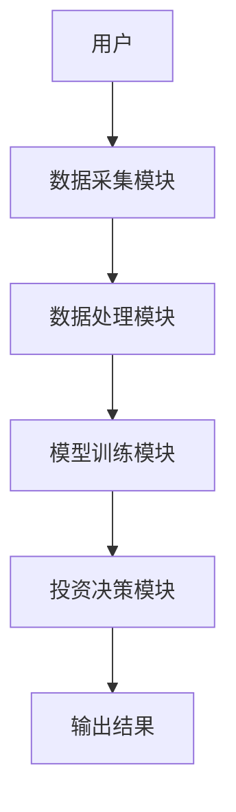
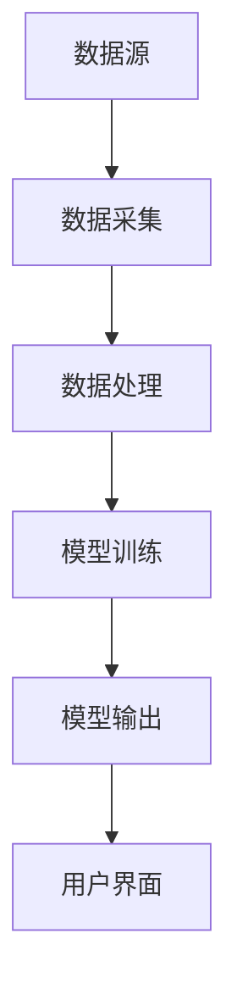

                 

<think>
好，用户希望我根据他提供的书名《AI agents辅助价值投资者评估公司的数字化转型速度》来设计一个完整的目录大纲。我需要理解这本书的核心内容，确保目录涵盖背景、原理、评估模型、系统架构、项目实战和小结等部分。

首先，从背景介绍开始。我需要一章来概述数字化转型的背景，包括定义、价值、框架等。然后是AI代理的原理，这部分需要深入讲解AI代理的定义、技术基础、模型构建、算法实现，以及与传统方法的区别。

接下来是评估模型部分。我需要详细说明如何构建评估指标体系，包括指标体系设计、数据采集、特征工程、模型训练和评估体系。这部分可能需要一些数学模型和公式，比如机器学习中的回归模型或分类模型，用mermaid流程图来展示数据处理流程。

然后是系统架构设计部分。我需要介绍整体架构，包括功能模块、数据流、系统接口和交互流程。这部分可能需要使用mermaid来绘制系统架构图和序列图，展示系统各部分之间的协作。

项目实战部分需要具体实施，包括环境安装、数据准备、特征工程、模型实现和结果分析。这部分需要提供Python代码示例，展示如何实现模型训练和评估。

最后，最佳实践和小结部分需要总结整个过程，给出实际应用中的注意事项和未来的发展方向。可能还需要一些数学公式，比如使用线性回归模型来预测数字化转型的速度，或者用混淆矩阵来评估模型的性能。

在编写过程中，我需要确保每个部分都有足够的细节，同时保持结构清晰。比如，在背景介绍中，要解释什么是数字化转型，为什么它重要，以及AI代理在其中的作用。在算法部分，要详细讲解机器学习的原理，如何训练模型，以及如何评估模型的性能。

我还需要注意用户的要求，比如使用markdown格式，三级目录结构，以及包含数学公式和mermaid图表。这可能意味着在某些章节中，我需要插入代码块或图表，以更直观地展示内容。

总的来说，我需要按照用户提供的示例结构，结合书名的核心内容，设计一个全面且逻辑清晰的目录大纲。确保每个部分都详细覆盖，同时保持简洁和结构化，满足用户的需求。
</think>

# AI Agents辅助价值投资者评估公司的数字化转型速度

## 关键词：
AI Agent, 数字化转型, 价值投资, 企业评估, 机器学习, 自然语言处理

## 摘要：
随着数字化转型的深入推进，企业竞争格局正在发生深刻变化。AI Agents作为新兴的技术工具，为价值投资者提供了全新的视角和方法，帮助其更高效地评估企业的数字化转型速度。本文通过系统性地分析AI Agent的核心原理、数字化转型评估指标体系、AI Agent辅助评估的实现流程，以及实际案例的深入剖析，为价值投资者提供了一套完整的解决方案，以应对复杂多变的市场环境。

---

# 第一部分：AI Agent与数字化转型的背景

## 第1章：AI Agent与数字化转型的背景

### 1.1 数字化转型的定义与价值
#### 1.1.1 数字化转型的定义
数字化转型是指企业利用数字技术（如人工智能、大数据、云计算等）改造业务流程、商业模式和决策方式，以实现业务创新和效率提升的过程。

#### 1.1.2 数字化转型对企业的影响
- 提高运营效率
- 创新业务模式
- 改善客户体验
- 提升竞争力

#### 1.1.3 数字化转型的核心要素
- 技术驱动：人工智能、大数据、物联网等
- 业务重构：流程优化、组织变革
- 价值创造：提升效率、创造新价值

### 1.2 价值投资与数字化转型的结合
#### 1.2.1 价值投资的核心理念
- 长期投资：关注企业的长期价值
- 基本面分析：研究企业的财务状况、行业地位、管理团队等
- 安全边际：寻找价格低于内在价值的投资标的

#### 1.2.2 数字化转型对价值投资的影响
- 提供新的投资机会：数字化转型能力强的企业更具成长性
- 改变传统评估指标：技术投入、数字化人才等成为重要考量
- 提高评估效率：AI Agent技术辅助分析海量数据

#### 1.2.3 AI Agent在价值投资中的优势
- 高效数据处理：快速分析大量非结构化数据（如新闻、财报）
- 智能决策支持：基于机器学习模型提供投资建议
- 实时监控：动态跟踪企业数字化转型进展

---

# 第二部分：AI Agent的核心原理与实现

## 第2章：AI Agent的核心原理

### 2.1 AI Agent的基本概念
#### 2.1.1 AI Agent的定义
AI Agent是一种能够感知环境、自主决策并采取行动的智能体。它通过数据输入、模型分析和决策执行，帮助用户完成特定任务。

#### 2.1.2 AI Agent的分类
- 单智能体：独立运作，如股票交易机器人
- 多智能体：协作完成复杂任务，如分布式投资组合管理
- 基于规则的AI Agent：基于预设规则进行决策
- 基于模型的AI Agent：通过机器学习模型自主学习和优化

#### 2.1.3 AI Agent的核心要素
- 感知能力：数据采集与处理
- 决策能力：基于数据的分析与决策
- 执行能力：根据决策采取行动

### 2.2 AI Agent的算法基础
#### 2.2.1 机器学习基础
- 监督学习：用于分类和回归任务
- 无监督学习：用于聚类和降维
- 强化学习：用于策略优化和动态决策

#### 2.2.2 自然语言处理基础
- 文本分析：从新闻、报告中提取关键词和情感倾向
- 信息抽取：从非结构化数据中提取结构化信息
- 语义理解：理解文本的深层含义

#### 2.2.3 数据处理与特征工程
- 数据清洗：处理缺失值、异常值
- 特征提取：将文本数据转化为数值特征
- 数据增强：通过技术手段提升数据质量

### 2.3 AI Agent的实现流程
#### 2.3.1 数据输入与处理
- 数据源：企业财报、行业报告、新闻媒体等
- 数据预处理：清洗、转换、标准化
- 数据存储：使用数据库或数据湖存储结构化和非结构化数据

#### 2.3.2 模型训练与优化
- 模型选择：根据任务选择合适的算法（如随机森林、神经网络）
- 模型训练：使用训练数据进行参数优化
- 模型评估：通过验证集评估模型性能

#### 2.3.3 模型部署与应用
- API接口：将模型封装为可调用的服务
- 实时监控：监控模型运行状态和性能
- 模型更新：根据新数据定期更新模型

---

# 第三部分：数字化转型评估模型的构建

## 第3章：数字化转型评估指标体系

### 3.1 评估指标的设计原则
#### 3.1.1 指标的全面性
- 包括技术、管理、文化等多个维度
- 覆盖数字化转型的各个阶段

#### 3.1.2 指标的可量化性
- 指标应可量化，便于数据采集和分析
- 避免主观性过强的指标

#### 3.1.3 指标的动态性
- 能够反映企业数字化转型的进展和变化
- 随时间更新指标权重

### 3.2 数字化转型的关键指标
#### 3.2.1 技术投入指标
- R&D投入比例
- IT人员占比
- 数字化设备采购金额

#### 3.2.2 数字化人才指标
- 技术团队能力
- 数字化培训覆盖率
- 人才流失率

#### 3.2.3 数字化成果指标
- 数字化产品收入占比
- 数字化流程效率提升
- 客户满意度

### 3.3 指标权重的确定方法
#### 3.3.1 层次分析法（AHP）
- 构建评估指标的层次结构
- 确定各指标的权重

#### 3.3.2 主成分分析（PCA）
- 通过主成分分析降维，确定重要指标

### 3.4 数字化转型评估模型的构建
#### 3.4.1 模型设计原则
- 简洁性：避免过于复杂的模型
- 可解释性：便于投资者理解
- 实用性：能够实际指导投资决策

#### 3.4.2 模型实现流程
- 数据采集：收集企业的数字化转型相关数据
- 特征提取：将数据转化为模型可处理的特征
- 模型训练：使用机器学习算法训练评估模型
- 模型验证：通过验证集评估模型性能
- 模型部署：将模型应用于实际投资决策

---

# 第四部分：AI Agent辅助评估的系统架构设计

## 第4章：AI Agent辅助评估的系统架构

### 4.1 系统功能设计
#### 4.1.1 数据采集模块
- 企业财报数据采集
- 行业报告数据采集
- 新闻媒体数据采集

#### 4.1.2 数据处理模块
- 数据清洗与预处理
- 特征提取与转换
- 数据存储与管理

#### 4.1.3 模型训练模块
- 选择合适的机器学习算法
- 训练数字化转型评估模型
- 验证模型性能

#### 4.1.4 投资决策模块
- 提供企业数字化转型评估结果
- 生成投资建议
- 实时监控企业动态

### 4.2 系统架构设计
#### 4.2.1 系统架构图


#### 4.2.2 数据流图


#### 4.2.3 系统接口设计
- 数据接口：API接口用于数据输入和输出
- 用户接口：Web界面或移动端界面供投资者使用
- 模型接口：与其他系统（如投资管理系统）对接

### 4.3 系统交互设计
#### 4.3.1 用户登录与数据输入
- 用户登录系统
- 输入企业信息和相关数据

#### 4.3.2 数据处理与模型训练
- 系统自动处理数据
- 后台训练模型

#### 4.3.3 结果展示与投资建议
- 展示企业数字化转型评估结果
- 提供具体的投资建议

---

# 第五部分：AI Agent辅助评估的项目实战

## 第5章：项目实战

### 5.1 环境安装与配置
- 安装Python和相关库（如scikit-learn、spaCy、pandas）
- 安装机器学习框架（如TensorFlow、PyTorch）
- 安装自然语言处理工具（如Gensim）

### 5.2 数据准备与特征工程
#### 5.2.1 数据采集
```python
import pandas as pd

# 从CSV文件读取数据
df = pd.read_csv('digital_transformation.csv')
```

#### 5.2.2 特征提取
```python
from sklearn.feature_extraction.text import TfidfVectorizer

# 对企业新闻进行特征提取
vectorizer = TfidfVectorizer()
X = vectorizer.fit_transform(df['news'])
```

### 5.3 模型实现与训练
#### 5.3.1 模型选择与训练
```python
from sklearn.ensemble import RandomForestClassifier
from sklearn.model_selection import train_test_split

# 划分训练集和测试集
X_train, X_test, y_train, y_test = train_test_split(X, df['label'], test_size=0.2)

# 训练随机森林模型
model = RandomForestClassifier()
model.fit(X_train, y_train)
```

#### 5.3.2 模型评估
```python
from sklearn.metrics import accuracy_score

# 预测测试集
y_pred = model.predict(X_test)
print("准确率:", accuracy_score(y_test, y_pred))
```

### 5.4 投资决策与结果分析
#### 5.4.1 投资建议生成
```python
# 根据模型预测结果生成投资建议
def generate_investment_advice(score):
    if score > 0.8:
        return "强烈推荐"
    elif score > 0.6:
        return "谨慎推荐"
    else:
        return "不推荐"
```

#### 5.4.2 结果可视化
```python
import matplotlib.pyplot as plt

# 绘制评估结果分布图
plt.hist(df['score'], bins=10, edgecolor='black')
plt.xlabel('评估分数')
plt.ylabel('企业数量')
plt.show()
```

---

# 第六部分：总结与展望

## 第6章：总结与展望

### 6.1 最佳实践
- 数据质量是关键：确保数据的准确性和完整性
- 模型选择要谨慎：根据实际需求选择合适的算法
- 持续优化：定期更新模型和评估指标

### 6.2 本章小结
通过本文的系统分析和实战案例，我们展示了如何利用AI Agent辅助价值投资者评估企业的数字化转型速度。AI Agent不仅提高了评估效率，还提供了更精准的投资建议。

### 6.3 未来展望
- 更多应用场景：AI Agent在更多领域的应用
- 技术进步：算法优化和模型可解释性提升
- 数据共享：建立行业数据共享机制

---

# 作者：AI天才研究院 & 禅与计算机程序设计艺术

