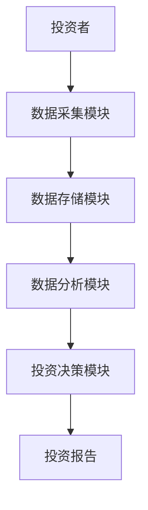
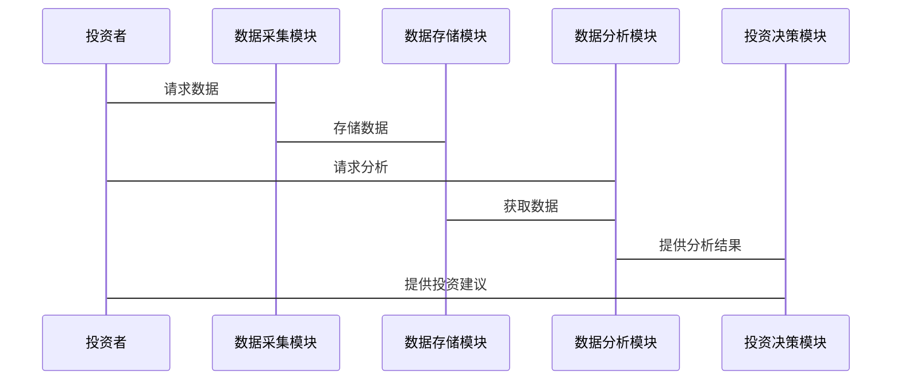

                 


# AI agents辅助价值投资者评估公司的数据变现能力

**关键词**: AI代理, 数据变现能力, 价值投资, 机器学习, 数据分析, 投资决策

**摘要**:  
本文探讨了AI代理如何辅助价值投资者评估公司的数据变现能力。通过分析数据资产的价值、数据驱动的投资决策流程以及AI代理的核心算法，本文为价值投资者提供了基于AI的工具和方法，以更精准地评估企业的数据潜力和投资价值。文章结合理论与实践，详细讲解了AI代理在投资分析中的应用场景，并通过案例分析展示了其在实际投资决策中的优势。

---

# 第一部分: AI代理与价值投资的背景与概念

## 第1章: AI代理与价值投资概述

### 1.1 数据变现能力的核心概念

#### 1.1.1 数据在现代企业中的价值
数据是现代企业的重要资产，它可以转化为经济收益。企业的数据资产包括用户数据、交易数据、市场数据等，这些数据可以通过分析和挖掘，为企业创造新的收入来源。

#### 1.1.2 数据变现的定义与模式
数据变现是指通过数据的分析和应用，将其转化为实际的经济收益。常见的数据变现模式包括数据销售、数据驱动的产品和服务、数据广告等。

#### 1.1.3 价值投资者的核心理念
价值投资者关注企业的内在价值，通过分析企业的财务状况、市场地位、竞争优势等因素，寻找被市场低估的投资机会。数据变现能力是企业内在价值的重要组成部分。

---

### 1.2 AI代理在投资分析中的作用

#### 1.2.1 AI代理的基本概念
AI代理是一种能够感知环境、自主决策并执行任务的智能系统。在投资分析中，AI代理可以通过分析大量数据，提供投资建议和决策支持。

#### 1.2.2 AI代理在金融领域的应用
AI代理在金融领域的应用包括股票预测、风险评估、投资组合优化等。通过机器学习算法，AI代理可以快速处理和分析大量数据，帮助投资者做出更明智的决策。

#### 1.2.3 数据驱动投资分析的优势
数据驱动的投资分析具有高效性、精准性和实时性。通过AI代理，投资者可以快速获取数据洞察，发现市场趋势和投资机会。

---

## 第2章: 数据变现能力的评估框架

### 2.1 数据资产的分类与价值评估

#### 2.1.1 数据资产的分类标准
数据资产可以分为结构化数据、非结构化数据、实时数据和历史数据等。不同类型的数据显示出不同的价值和应用场景。

#### 2.1.2 数据资产的价值评估指标
数据资产的价值评估指标包括数据的完整性、准确性、及时性、可用性和隐私性。这些指标可以帮助投资者判断数据的质量和潜力。

#### 2.1.3 数据资产的生命周期管理
数据资产的生命周期包括数据生成、存储、分析、应用和销毁。有效的生命周期管理可以最大化数据的价值，降低数据风险。

---

### 2.2 数据变现能力的核心维度

#### 2.2.1 数据的可用性
数据的可用性是指数据能够被有效利用的程度。高可用性的数据能够为企业创造更多的价值。

#### 2.2.2 数据的可扩展性
数据的可扩展性是指数据能够适应企业未来发展需求的能力。可扩展性强的数据能够支持企业长期的数据变现战略。

#### 2.2.3 数据的隐私与合规性
数据的隐私和合规性是数据变现的重要前提。企业需要遵守数据保护法规，确保数据的合法性和安全性。

---

## 第3章: AI代理辅助投资决策的原理

### 3.1 AI代理的核心算法

#### 3.1.1 机器学习算法概述
机器学习算法是AI代理的核心工具之一。常见的机器学习算法包括线性回归、决策树、随机森林和神经网络等。

#### 3.1.2 自然语言处理在投资分析中的应用
自然语言处理（NLP）技术可以用于分析新闻、财报和其他文本数据，提取情感和关键词，帮助投资者判断市场情绪和公司前景。

#### 3.1.3 时间序列分析与预测模型
时间序列分析是一种用于预测未来数据的统计方法。通过分析历史数据，AI代理可以预测股票价格和其他市场指标的未来走势。

---

### 3.2 数据驱动的投资决策流程

#### 3.2.1 数据收集与清洗
数据收集是投资分析的第一步。投资者需要从多种来源收集数据，并进行清洗和预处理，确保数据的准确性和完整性。

#### 3.2.2 数据分析与特征提取
通过对数据进行分析和特征提取，投资者可以发现数据中的规律和趋势。特征提取是将数据转化为可分析的特征，以便更好地训练模型。

#### 3.2.3 投资策略的生成与优化
基于分析结果，AI代理可以生成投资策略，并通过优化算法不断改进策略，以最大化投资收益。

---

## 第4章: AI代理与价值投资者的协同工作

### 4.1 价值投资者的角色定位

#### 4.1.1 价值投资者的决策逻辑
价值投资者关注企业的基本面，通过分析财务报表和市场环境，寻找被低估的投资机会。AI代理可以帮助投资者更高效地分析数据，发现潜在的投资机会。

#### 4.1.2 数据驱动决策的优势
数据驱动决策可以帮助投资者更全面地了解企业的情况，发现数据中的潜在价值，提高投资决策的精准性。

#### 4.1.3 人工经验与AI代理的结合
人工经验是投资决策的重要组成部分，而AI代理可以提供数据支持和分析工具。两者的结合可以充分发挥数据驱动和人类判断的优势。

---

### 4.2 AI代理在投资组合管理中的应用

#### 4.2.1 投资组合优化的数学模型
投资组合优化可以通过数学模型实现。常见的模型包括均值-方差模型和因子模型。AI代理可以通过优化算法，帮助投资者找到最优的投资组合。

#### 4.2.2 风险评估与管理
AI代理可以通过分析历史数据和市场趋势，评估投资组合的风险，并提出风险管理策略。例如，通过情景分析和压力测试，评估投资组合在不同市场条件下的表现。

#### 4.2.3 实时市场监控与反馈
AI代理可以实时监控市场动态，及时发现市场变化，并向投资者提供反馈。这种实时监控可以帮助投资者快速调整投资策略，抓住市场机会。

---

# 第二部分: 数据变现能力的数学模型与算法实现

## 第5章: 数据驱动的投资分析模型

### 5.1 数据分析的数学基础

#### 5.1.1 线性回归模型
线性回归是一种常用的统计方法，用于预测连续型变量。通过线性回归模型，投资者可以预测股票价格和其他市场指标。

#### 5.1.2 聚类分析与分类算法
聚类分析可以将相似的数据点分组，帮助投资者发现市场中的潜在机会。分类算法可以用于分类股票的涨跌趋势，帮助投资者做出投资决策。

#### 5.1.3 时间序列预测模型
时间序列预测模型可以用于预测股票价格和其他市场指标的未来走势。常见的模型包括ARIMA和LSTM。

---

### 5.2 数据变现能力的评估模型

#### 5.2.1 数据质量评估模型
数据质量评估模型用于评估数据的完整性和准确性。通过模型的评估结果，投资者可以判断数据的质量，进而做出更明智的投资决策。

#### 5.2.2 数据收益潜力预测模型
数据收益潜力预测模型用于预测数据的变现潜力。通过分析企业的数据资产和市场环境，模型可以预测数据的未来收益。

#### 5.2.3 数据风险评估模型
数据风险评估模型用于评估数据相关的风险，如数据泄露和隐私问题。通过模型的评估结果，投资者可以制定风险管理策略，降低数据相关风险。

---

## 第6章: AI代理的算法实现

### 6.1 机器学习算法的实现步骤

#### 6.1.1 数据预处理
数据预处理是机器学习算法的重要步骤。包括数据清洗、特征提取和数据标准化等。

#### 6.1.2 模型训练
模型训练是通过数据训练机器学习模型。常用的算法包括支持向量机（SVM）、随机森林和神经网络等。

#### 6.1.3 模型评估与优化
模型评估是通过测试数据评估模型的性能。常用的评估指标包括准确率、召回率和F1分数等。模型优化是通过调整参数和改进算法，提高模型的性能。

---

### 6.2 自然语言处理在投资分析中的应用

#### 6.2.1 文本数据的特征提取
自然语言处理技术可以用于提取文本数据的特征，如关键词和情感倾向。这些特征可以帮助投资者分析新闻和财报，判断市场情绪。

#### 6.2.2 基于NLP的情感分析
情感分析可以帮助投资者判断市场情绪。例如，通过分析新闻标题和社交媒体上的评论，投资者可以判断市场的乐观或悲观情绪。

#### 6.2.3 文本生成与预测
文本生成技术可以用于生成投资报告和市场预测。通过分析大量的文本数据，AI代理可以自动生成投资建议和市场分析报告。

---

## 第7章: 系统分析与架构设计

### 7.1 项目背景与目标

#### 7.1.1 项目背景
本项目旨在开发一个基于AI代理的投资分析系统，帮助价值投资者评估企业的数据变现能力。

#### 7.1.2 项目目标
通过开发AI代理，投资者可以更高效地分析数据，发现投资机会，优化投资组合，降低投资风险。

---

### 7.2 系统功能设计

#### 7.2.1 数据采集模块
数据采集模块负责从多种数据源（如股票市场数据、新闻数据等）获取数据，并进行清洗和预处理。

#### 7.2.2 数据分析模块
数据分析模块通过机器学习算法和自然语言处理技术，分析数据，提取特征，并生成投资建议。

#### 7.2.3 投资决策模块
投资决策模块基于分析结果，生成投资策略，并优化投资组合，降低投资风险。

---

### 7.3 系统架构设计

#### 7.3.1 系统架构图
以下是系统的架构图：



#### 7.3.2 系统接口设计
系统接口包括数据采集接口、数据分析接口和投资决策接口。这些接口通过API的方式与其他系统进行交互。

#### 7.3.3 系统交互流程图
以下是系统的交互流程图：



---

## 第8章: 项目实战

### 8.1 环境安装与配置

#### 8.1.1 安装Python
投资者需要安装Python编程语言，版本建议为3.8或更高。

#### 8.1.2 安装机器学习库
安装机器学习库，如Scikit-learn、TensorFlow和Keras等。

#### 8.1.3 安装自然语言处理库
安装自然语言处理库，如NLTK和spaCy。

---

### 8.2 系统核心实现

#### 8.2.1 数据采集模块实现
以下是数据采集模块的Python代码示例：

```python
import requests
from bs4 import BeautifulSoup

def get_stock_data(ticker):
    url = f"https://finance.yahoo.com/quote/{ticker}"
    response = requests.get(url)
    soup = BeautifulSoup(response.text, 'html.parser')
    price = soup.find('span', {'class': 'Trsdu(0.1s)'}).text
    return price
```

#### 8.2.2 数据分析模块实现
以下是数据分析模块的Python代码示例：

```python
from sklearn.linear_model import LinearRegression

def predict_stock_price(X, y):
    model = LinearRegression()
    model.fit(X, y)
    return model.predict(X)
```

---

### 8.3 案例分析与实际应用

#### 8.3.1 案例分析
以某科技公司为例，分析其数据变现能力。通过数据采集模块获取该公司的财务数据和市场数据，通过数据分析模块分析数据，生成投资建议。

#### 8.3.2 实际应用
投资者可以通过系统获取实时市场数据，分析数据，生成投资策略，并优化投资组合，降低投资风险。

---

## 第9章: 最佳实践与小结

### 9.1 最佳实践

#### 9.1.1 数据质量的重要性
数据质量是投资分析的关键因素。投资者需要确保数据的准确性和完整性，避免因数据问题导致决策失误。

#### 9.1.2 模型优化的必要性
模型优化是提高投资分析精度的重要手段。投资者需要不断优化算法和模型，以适应市场变化。

#### 9.1.3 人工经验与AI的结合
人工经验是投资决策的重要组成部分。投资者需要结合市场经验，合理使用AI代理的分析结果，做出更明智的投资决策。

---

### 9.2 小结

本文详细探讨了AI代理在价值投资中的应用，分析了数据变现能力的核心概念和评估框架。通过数学模型和算法实现，本文展示了如何利用AI代理辅助投资决策，优化投资组合，降低投资风险。

---

## 第10章: 注意事项与拓展阅读

### 10.1 注意事项

#### 10.1.1 数据隐私与合规性
投资者需要注意数据隐私和合规性问题，确保数据的合法性和安全性。

#### 10.1.2 模型的局限性
AI代理的模型具有一定的局限性，投资者需要结合市场实际情况，合理使用模型的分析结果。

#### 10.1.3 市场风险与不确定性
市场风险和不确定性是投资决策的重要因素。投资者需要充分考虑市场风险，制定风险管理策略。

---

### 10.2 拓展阅读

#### 10.2.1 机器学习与金融投资
推荐阅读《机器学习与金融投资》（《Machine Learning for Asset Managers》），作者：Marc Potters。

#### 10.2.2 自然语言处理与市场分析
推荐阅读《自然语言处理与市场分析》（《NLP for Market Analysis》），作者：John D. Kress。

#### 10.2.3 数据驱动的投资策略
推荐阅读《数据驱动的投资策略》（《Data-Driven Investment Strategies》），作者：Anand R. D. Srivastava。

---

# 作者：AI天才研究院/AI Genius Institute & 禅与计算机程序设计艺术 /Zen And The Art of Computer Programming

