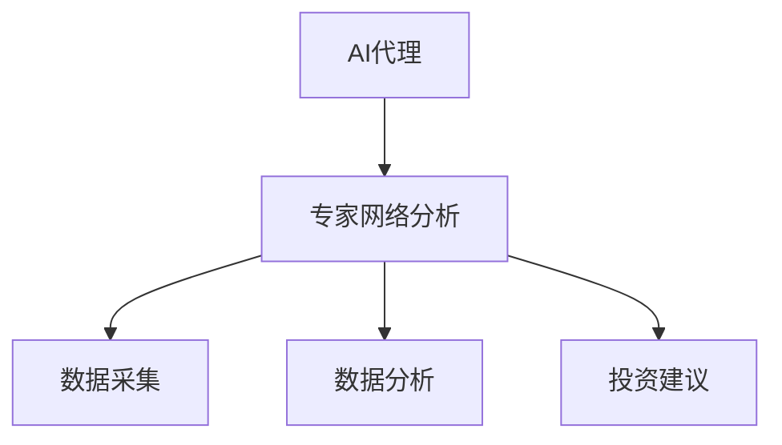

                 


# AI agents辅助价值投资者进行专家网络分析

> 关键词：AI代理，价值投资，专家网络分析，金融分析，自然语言处理，图论算法

> 摘要：本文探讨了AI代理如何辅助价值投资者进行专家网络分析。通过分析AI代理的核心概念、算法原理、系统架构及项目实战，详细阐述了其在金融领域的应用及其对投资决策的支持。本文旨在为价值投资者提供一个创新的技术视角，帮助其利用AI技术提升投资效率和准确性。

---

## 第一部分：背景介绍

### 第1章：AI代理与价值投资概述

#### 1.1 AI代理的基本概念
- **1.1.1 AI代理的定义与特点**
  AI代理是一种能够感知环境并采取行动以实现目标的智能体。其特点包括自主性、反应性、目标导向和学习能力。这些特点使其在金融分析中具备广泛的应用潜力。

- **1.1.2 AI代理在金融领域的应用**
  AI代理在金融领域的应用包括股票预测、风险评估、交易自动化和市场情绪分析等。通过处理大量数据，AI代理能够为投资者提供实时的市场洞察。

- **1.1.3 价值投资的基本原理**
  价值投资是一种投资策略，旨在通过分析公司的基本面来识别被市场低估的投资标的。其核心在于寻找具有长期竞争优势和稳定现金流的企业。

#### 1.2 专家网络分析的背景
- **1.2.1 专家网络分析的定义**
  专家网络分析是指通过分析专家（如行业分析师、公司高管）的言论、报告和社交媒体内容，提取有价值的信息，以辅助投资决策。

- **1.2.2 专家网络分析在金融中的作用**
  专家网络分析能够帮助投资者识别市场趋势、公司动向和潜在风险。通过分析专家的观点，投资者可以更全面地评估投资标的的价值。

- **1.2.3 专家网络分析的挑战与机遇**
  专家网络分析面临的挑战包括数据来源多样性、信息噪音大和分析复杂性。然而，AI技术的进步为解决这些问题提供了新的可能性。

#### 1.3 AI代理在金融分析中的应用现状
- **1.3.1 AI代理在金融分析中的应用案例**
  AI代理在金融分析中的应用案例包括股票预测、风险评估和市场情绪分析。通过自然语言处理技术，AI代理能够从新闻、报告和社交媒体中提取情感和关键词，辅助投资者做出决策。

- **1.3.2 当前应用中的问题与挑战**
  当前应用中的问题包括数据质量、模型解释性和计算资源消耗。AI代理在处理复杂金融数据时仍面临诸多挑战，如数据稀疏性和模型泛化能力不足。

- **1.3.3 未来发展趋势**
  未来，AI代理在金融分析中的应用将更加广泛，尤其是在专家网络分析领域。随着技术的进步，AI代理将具备更强的自适应能力和更高的分析精度。

---

## 第二部分：核心概念与联系

### 第2章：AI代理与专家网络分析的核心概念

#### 2.1 AI代理的核心概念
- **2.1.1 AI代理的核心原理**
  AI代理通过感知环境、处理信息并采取行动来实现目标。在专家网络分析中，AI代理能够实时监控市场动态，分析专家观点，并提供投资建议。

- **2.1.2 AI代理与专家网络分析的关系**
  AI代理是专家网络分析的核心工具，通过自然语言处理和图论算法，AI代理能够从大量非结构化数据中提取关键信息，帮助投资者识别投资机会和风险。

#### 2.2 专家网络分析的核心要素
- **2.2.1 专家网络分析的输入数据**
  专家网络分析的主要数据来源包括行业报告、新闻文章、社交媒体、公司财报和分析师观点等。这些数据通常是非结构化的文本数据，需要通过自然语言处理技术进行解析。

- **2.2.2 专家网络分析的输出结果**
  分析结果包括行业趋势、公司动向、市场情绪和投资建议等。这些结果为投资者提供了重要的决策依据。

#### 2.3 AI代理与专家网络分析的关系图


#### 2.4 AI代理与专家网络分析的关系对比
| 特性       | AI代理                     | 专家网络分析                |
|------------|-----------------------------|-----------------------------|
| 数据来源     | 多样化数据源               | 专家观点和行业报告           |
| 分析方法     | 自然语言处理、图论算法     | 数据挖掘、文本分析           |
| 应用场景     | 股票预测、风险评估         | 投资决策、市场趋势分析       |

#### 2.5 专家网络分析的ER实体关系图
```mermaid
erd
actor 投资者
expert Expert
interaction 交互
report 报告
data 数据
```

---

## 第三部分：算法原理

### 第3章：AI代理与专家网络分析的算法原理

#### 3.1 自然语言处理算法
- **3.1.1 自然语言处理的基本原理**
  自然语言处理（NLP）是AI代理的核心技术之一，主要用于从文本数据中提取有用信息。其基本流程包括分词、词性标注、句法分析和语义理解。

- **3.1.2 基于NLP的专家观点提取**
  使用NLP技术从专家报告和社交媒体中提取关键词和情感倾向。例如，使用TF-IDF算法提取关键词，使用情感分析模型评估观点的积极或消极倾向。

  ```python
  from sklearn.feature_extraction.text import TfidfVectorizer

  vectorizer = TfidfVectorizer()
  tfidf = vectorizer.fit_transform(texts)
  ```

  ```mermaid
  graph TD
  Input[输入文本] --> Tokenizer[分词]
  Tokenizer --> Vectorizer[向量化]
  Vectorizer --> Classifier[分类器]
  Classifier --> Output[输出结果]
  ```

- **3.1.3 NLP在专家网络分析中的应用案例**
  某AI代理通过分析行业分析师的报告，提取出某公司的关键词如“增长”、“利润”等，进而评估该公司的投资价值。

#### 3.2 图论算法
- **3.2.1 图论算法的基本原理**
  图论算法用于分析专家之间的关系网络，如社交网络分析和社区发现。常用算法包括PageRank和Louvain算法。

- **3.2.2 基于图论的专家网络分析**
  使用PageRank算法评估专家在网络中的影响力，识别关键意见领袖。例如，分析社交媒体上的专家观点，发现哪些专家的观点影响力更大。

  ```python
  import networkx as nx

  G = nx.Graph()
  G.add_nodes_from(experts)
  G.add_edges_from(edges)
  pr = nx.pagerank(G)
  ```

  ```mermaid
  graph TD
  Expert1 --> Expert2
  Expert2 --> Expert3
  Expert1 --> Expert3
  ```

- **3.2.3 图论算法在专家网络分析中的应用案例**
  某AI代理通过分析行业专家的社交网络，发现某领域的关键意见领袖，进而评估其观点对市场的潜在影响。

#### 3.3 强化学习算法
- **3.3.1 强化学习的基本原理**
  强化学习是一种机器学习技术，通过模拟试错过程来优化决策策略。在专家网络分析中，强化学习可用于动态调整分析模型，以适应市场变化。

- **3.3.2 基于强化学习的专家网络分析**
  使用强化学习算法优化投资组合，根据市场反馈调整投资策略。例如，通过Q-learning算法，AI代理能够学习在不同市场条件下做出最优的投资决策。

  ```python
  import numpy as np
  from collections import defaultdict

  class QLearning:
      def __init__(self, actions):
          self.q = defaultdict(lambda: np.zeros(len(actions)))
  ```

  ```mermaid
  graph TD
  State[市场状态] --> Action[投资行动]
  Action --> Reward[收益反馈]
  Reward --> QLearning[强化学习模型]
  ```

- **3.3.3 强化学习在专家网络分析中的应用案例**
  某AI代理通过强化学习算法，根据专家观点和市场反馈动态调整投资组合，实现收益最大化。

---

## 第四部分：数学模型和公式

### 第4章：AI代理与专家网络分析的数学模型

#### 4.1 概率论模型
- **4.1.1 贝叶斯定理的应用**
  贝叶斯定理用于计算条件概率，在专家观点分析中用于评估某观点的可信度。

  $$ P(A|B) = \frac{P(B|A)P(A)}{P(B)} $$

- **4.1.2 专家观点的可信度计算**
  使用贝叶斯定理，根据专家的历史观点准确性和当前观点的相关性，计算当前观点的可信度。

  $$ \text{可信度} = P(\text{观点正确} | \text{专家历史表现}) $$

#### 4.2 图论模型
- **4.2.1 PageRank算法的数学公式**
  PageRank算法用于评估节点的重要性，公式如下：

  $$ PR(i) = \alpha PR(i) + (1-\alpha) \sum_{j} \frac{PR(j)}{outDegree(j)} $$

  其中，$\alpha$ 是阻尼因子，通常为0.85。

- **4.2.2 社交网络中的影响力传播**
  使用PageRank算法评估专家在网络中的影响力，识别关键意见领袖。

  $$ \text{影响力}(i) = \sum_{j} \frac{\text{影响力}(j)}{outDegree(j)} $$

#### 4.3 强化学习模型
- **4.3.1 Q-learning算法的数学公式**
  Q-learning算法通过更新Q值表来学习最优策略：

  $$ Q(s, a) = Q(s, a) + \alpha [r + \gamma \max Q(s', a') - Q(s, a)] $$

  其中，$\alpha$ 是学习率，$\gamma$ 是折扣因子。

- **4.3.2 动态投资组合优化**
  使用强化学习算法动态调整投资组合，根据市场反馈优化投资策略。

  $$ \text{收益}(t+1) = r + \mu \cdot \text{收益}(t) $$

---

## 第五部分：系统分析与架构设计

### 第5章：AI代理与专家网络分析的系统架构

#### 5.1 系统应用场景
- **5.1.1 专家网络分析的典型场景**
  典型场景包括行业趋势分析、公司动向监测和市场情绪分析。AI代理通过实时监控市场动态，为投资者提供及时的分析结果。

- **5.1.2 系统功能模块**
  系统功能模块包括数据采集、数据分析、数据存储和结果可视化。每个模块负责不同的功能，协同工作以实现专家网络分析。

#### 5.2 系统功能设计
- **5.2.1 数据采集模块**
  数据采集模块负责从多种数据源获取专家观点和市场数据，包括新闻网站、社交媒体和行业报告。

  ```mermaid
  classDiagram
  class 数据采集模块 {
    + 数据源：新闻网站、社交媒体、行业报告
    + 采集接口：API调用、爬虫技术
  }
  ```

- **5.2.2 数据分析模块**
  数据分析模块使用NLP和图论算法对数据进行处理，提取关键词和情感倾向，构建专家网络关系图。

  ```mermaid
  classDiagram
  class 数据分析模块 {
    + NLP处理：分词、情感分析
    + 图论算法：PageRank、Louvain
  }
  ```

- **5.2.3 数据存储模块**
  数据存储模块负责存储处理后的数据，包括专家观点、情感倾向和网络关系图。使用数据库技术进行高效存储和检索。

  ```mermaid
  classDiagram
  class 数据存储模块 {
    + 数据库：关系型数据库、非关系型数据库
    + 存储接口：SQL、NoSQL
  }
  ```

- **5.2.4 结果可视化模块**
  结果可视化模块将分析结果以图形化方式展示，帮助投资者直观理解市场动态和专家观点。

  ```mermaid
  classDiagram
  class 结果可视化模块 {
    + 可视化工具：Matplotlib、Tableau
    + 输出格式：图表、报告
  }
  ```

#### 5.3 系统架构设计
- **5.3.1 系统架构概述**
  系统采用分层架构，包括数据层、业务逻辑层和应用层。数据层负责数据存储和管理，业务逻辑层负责数据处理和分析，应用层负责用户交互和结果展示。

  ```mermaid
  classDiagram
  class 数据层 {
    + 数据库
    + 数据模型
  }
  class 业务逻辑层 {
    + 数据分析模块
    + 模型训练模块
  }
  class 应用层 {
    + 用户界面
    + API接口
  }
  ```

- **5.3.2 系统接口设计**
  系统接口设计包括数据接口、分析接口和结果接口。数据接口负责数据输入，分析接口负责数据处理，结果接口负责结果输出。

  ```mermaid
  sequenceDiagram
  User -> 数据采集模块: 请求数据采集
  数据采集模块 -> 数据存储模块: 存储数据
  User -> 数据分析模块: 请求分析结果
  数据分析模块 -> 数据存储模块: 获取数据
  数据分析模块 -> 结果可视化模块: 请求可视化
  结果可视化模块 -> User: 显示结果
  ```

- **5.3.3 系统交互流程**
  系统交互流程包括数据采集、数据分析、结果生成和结果展示四个步骤。每个步骤由相应的模块负责，确保系统的高效运行。

  ```mermaid
  sequenceDiagram
  User -> 数据采集模块: 采集数据
  数据采集模块 -> 数据分析模块: 提供数据
  数据分析模块 -> 数据存储模块: 存储数据
  User -> 数据分析模块: 分析数据
  数据分析模块 -> 数据存储模块: 获取数据
  数据分析模块 -> 结果可视化模块: 生成结果
  结果可视化模块 -> User: 显示结果
  ```

---

## 第六部分：项目实战

### 第6章：AI代理与专家网络分析的项目实战

#### 6.1 环境安装
- **6.1.1 系统环境**
  需要安装Python 3.8及以上版本，以及相关库如Numpy、Pandas、Scikit-learn、NetworkX、Plotly和NLTK。

  ```bash
  pip install numpy pandas scikit-learn networkx plotly nltk
  ```

- **6.1.2 工具安装**
  安装Jupyter Notebook用于代码编写和调试，安装Git用于版本控制。

  ```bash
  pip install jupyter notebook
  ```

#### 6.2 系统核心实现
- **6.2.1 数据采集模块**
  使用爬虫技术从新闻网站和社交媒体获取专家观点。

  ```python
  import requests
  from bs4 import BeautifulSoup

  def fetch_data(url):
      response = requests.get(url)
      soup = BeautifulSoup(response.text, 'html.parser')
      content = soup.get_text()
      return content
  ```

- **6.2.2 数据分析模块**
  使用NLP技术处理文本数据，提取关键词和情感倾向。

  ```python
  from sklearn.feature_extraction.text import TfidfVectorizer
  from nltk.sentiment import SentimentIntensityAnalyzer

  vectorizer = TfidfVectorizer()
  tfidf = vectorizer.fit_transform(texts)
  analyzer = SentimentIntensityAnalyzer()
  sentiments = analyzer.polarity_scores(text)
  ```

- **6.2.3 数据存储模块**
  将处理后的数据存储到数据库中，供后续分析使用。

  ```python
  import sqlite3

  conn = sqlite3.connect('expert_network.db')
  cursor = conn.cursor()
  cursor.execute('''CREATE TABLE expert_data (id INTEGER PRIMARY KEY AUTOINCREMENT, content TEXT)''')
  cursor.execute('INSERT INTO expert_data (content) VALUES (?)', (content,))
  ```

- **6.2.4 结果可视化模块**
  使用Plotly生成交互式图表，展示专家观点和网络关系图。

  ```python
  import plotly.express as px

  fig = px.networkx_graph(G)
  fig.show()
  ```

#### 6.3 代码应用解读与分析
- **6.3.1 代码结构分析**
  代码分为四个主要部分：数据采集、数据分析、数据存储和结果可视化。每个部分独立实现，通过接口进行数据传递。

- **6.3.2 代码实现细节**
  使用Python编写代码，采用模块化设计，确保代码的可维护性和扩展性。

- **6.3.3 代码优化建议**
  优化数据处理效率，采用并行计算和缓存技术，提高系统的运行速度。

#### 6.4 实际案例分析
- **6.4.1 案例背景介绍**
  以某行业为例，分析专家观点和市场趋势，评估投资标的的价值。

- **6.4.2 数据采集与分析**
  从新闻网站和社交媒体获取专家观点，使用NLP技术提取关键词和情感倾向，构建专家网络关系图。

- **6.4.3 分析结果解读**
  根据分析结果，识别行业趋势和公司动向，为投资者提供投资建议。

#### 6.5 项目小结
- **6.5.1 项目总结**
  通过项目实战，验证了AI代理在专家网络分析中的应用效果，展示了其在金融分析中的巨大潜力。

- **6.5.2 经验与教训**
  在项目实施过程中，需要注意数据质量和模型的泛化能力，同时要优化系统的运行效率。

---

## 第七部分：总结与展望

### 第7章：总结与展望

#### 7.1 总结
- **7.1.1 核心内容回顾**
  本文详细探讨了AI代理在专家网络分析中的应用，从背景、核心概念、算法原理到系统架构和项目实战，全面阐述了其在金融分析中的重要作用。

- **7.1.2 技术总结**
  AI代理通过自然语言处理、图论算法和强化学习等技术，能够有效辅助价值投资者进行专家网络分析，提升投资决策的准确性和效率。

#### 7.2 最佳实践 tips
- **7.2.1 数据处理**
  确保数据的多样性和高质量，采用数据清洗和预处理技术，提高分析结果的准确性。

- **7.2.2 模型优化**
  选择合适的算法和参数，通过交叉验证和网格搜索优化模型性能。

- **7.2.3 系统设计**
  采用模块化设计，确保系统的可扩展性和可维护性，优化接口设计，提高系统的交互效率。

#### 7.3 注意事项
- **7.3.1 数据隐私**
  在数据采集和处理过程中，注意保护数据隐私，遵守相关法律法规。

- **7.3.2 模型解释性**
  提高模型的解释性，便于投资者理解和信任分析结果。

- **7.3.3 系统稳定性**
  确保系统的稳定性和可靠性，避免因技术故障影响投资决策。

#### 7.4 拓展阅读
- **7.4.1 相关书籍**
  - 《机器学习实战》
  - 《图论与网络流》
  - 《自然语言处理入门》

- **7.4.2 技术博客与资源**
  - 维基百科：AI代理、专家网络分析
  - Medium：机器学习、数据科学
  - GitHub：相关开源项目

#### 7.5 未来展望
- **7.5.1 技术进步**
  随着AI技术的不断进步，AI代理在专家网络分析中的应用将更加广泛和深入。未来，AI代理将具备更强的自适应能力和更高的分析精度，为投资者提供更全面的市场洞察。

- **7.5.2 应用场景扩展**
  除了金融领域，AI代理在其他领域的应用也将逐渐展开，如医疗、教育和物流等。其强大的数据处理能力和智能决策能力将推动各行业的发展。

- **7.5.3 市场需求**
  随着投资者对高效、精准的投资决策需求的增加，AI代理在专家网络分析中的市场需求将稳步增长，成为金融分析的重要工具之一。

---

## 作者信息

作者：AI天才研究院/AI Genius Institute & 禅与计算机程序设计艺术/Zen And The Art of Computer Programming

---

这篇文章详细探讨了AI代理如何辅助价值投资者进行专家网络分析，从理论到实践，从算法到系统架构，为读者提供了全面的技术视角。通过实际案例分析和最佳实践建议，帮助投资者更好地理解和应用AI技术，提升投资决策的效率和准确性。

