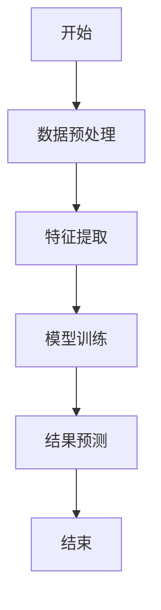
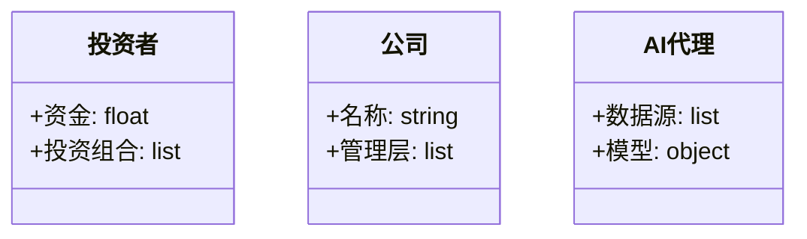
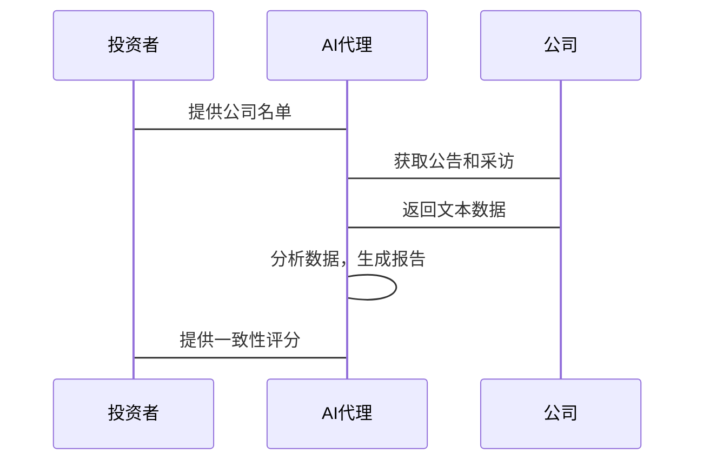

                 


# AI agents辅助价值投资者进行管理层言行一致性评估

**关键词**：AI代理、价值投资、管理层言行一致性、NLP、机器学习、金融数据分析

**摘要**：本文探讨如何利用AI代理辅助价值投资者评估管理层言行一致性，通过NLP和机器学习技术，分析公司公告和管理层采访，预测公司未来表现，帮助投资者做出更明智决策。

---

## 第一部分: AI 代理与价值投资概述

### 第1章: 背景介绍

#### 1.1 问题背景

##### 1.1.1 价值投资的核心理念
价值投资强调通过深入分析公司基本面，寻找市场低估的股票。管理层的言行一致性是公司治理和投资决策的关键因素。

##### 1.1.2 管理层言行一致性的重要性
管理层言行一致表明其言行与公司战略和价值观一致，通常预示公司长期表现良好。

##### 1.1.3 当前评估方法的局限性
传统评估方法依赖人工分析，耗时且主观，难以处理大量数据。

#### 1.2 问题描述

##### 1.2.1 管理层言行一致性评估的定义
评估管理层言行是否与其公开声明一致，判断其承诺的兑现情况。

##### 1.2.2 评估中的关键问题
- 数据来源的多样性和复杂性
- 如何量化管理层言行的一致性
- 高效、客观的评估方法

#### 1.3 问题解决思路

##### 1.3.1 引入AI代理的必要性
AI代理能高效处理大量数据，提供客观分析，帮助投资者做出更明智决策。

##### 1.3.2 AI代理在评估中的作用
通过NLP和机器学习，分析公司公告和管理层采访，预测公司未来表现。

#### 1.4 概念结构与核心要素

##### 1.4.1 核心概念的定义
- **AI代理**：模拟人类行为，执行特定任务的智能体。
- **价值投资**：基于公司基本面进行投资。

##### 1.4.2 概念的边界与外延
- **边界**：仅限于管理层言行一致性评估。
- **外延**：可扩展到其他投资策略。

##### 1.4.3 核心要素的组成
- 数据来源：公司公告、采访、财务报告。
- 分析方法：NLP、机器学习。
- 评估标准：一致性评分。

---

### 第2章: 核心概念与联系

#### 2.1 AI代理的核心原理

##### 2.1.1 AI代理的基本概念
AI代理通过感知环境，采取行动，实现目标。

##### 2.1.2 AI代理的分类与特点
- **按智能水平**：简单反应式、基于模型的、目标驱动型。
- **特点**：自主性、反应性、目标导向。

##### 2.1.3 AI代理在金融领域的应用
- 数据分析、风险评估、交易决策。

#### 2.2 价值投资与管理层言行一致性的关系

##### 2.2.1 价值投资的核心要素
- 公司基本面、管理层能力、行业地位。

##### 2.2.2 管理层言行一致性对投资决策的影响
- 一致的管理层更可能实现承诺，带来稳定回报。

##### 2.2.3 两者之间的关联性分析
管理层言行一致性是价值投资的重要考量因素。

#### 2.3 核心概念的属性特征对比

##### 2.3.1 AI代理的属性特征
| 属性 | 特征 |
|------|------|
| 智能水平 | 高 |
| 反应性 | 强 |

##### 2.3.2 管理层言行一致性的属性特征
| 属性 | 特征 |
|------|------|
| 数据来源 | 文本型 |
| 评估标准 | 定量+定性 |

#### 2.4 ER实体关系图
```mermaid
er
actor: 投资者
agent: AI代理
company: 公司
action: 行为
data: 数据
actor --> agent: 与AI代理交互
agent --> company: 分析公司行为
company --> action: 公司行为记录
data --> action: 行为数据
```

---

### 第3章: 算法原理讲解

#### 3.1 算法原理概述

##### 3.1.1 NLP技术在文本分析中的应用
- **文本预处理**：分词、去除停用词。
- **特征提取**：TF-IDF、Word2Vec。

##### 3.1.2 监督学习在分类任务中的应用
- **训练模型**：使用历史数据训练分类器。
- **预测**：判断文本是否符合管理层承诺。

##### 3.1.3 时间序列分析在行为预测中的应用
- **行为建模**：分析过去行为模式，预测未来行为。

#### 3.2 算法实现流程


#### 3.3 Python源代码实现

##### 3.3.1 数据预处理
```python
import pandas as pd
from sklearn.feature_extraction.text import TfidfVectorizer

# 加载数据
data = pd.read_csv('managerial_actions.csv')

# 文本预处理
vectorizer = TfidfVectorizer()
X = vectorizer.fit_transform(data['text'])
```

##### 3.3.2 模型训练与预测
```python
from sklearn.model_selection import train_test_split
from sklearn.linear_model import LogisticRegression

# 分割数据
X_train, X_test, y_train, y_test = train_test_split(X, data['label'], test_size=0.2)

# 训练模型
model = LogisticRegression()
model.fit(X_train, y_train)

# 预测
y_pred = model.predict(X_test)
```

##### 3.3.3 案例分析
- **输入文本**：管理层宣布将投入10亿元研发新产品。
- **模型预测**：预测其言行一致性，输出结果。

---

## 第4章: 系统分析与架构设计

### 4.1 系统功能设计

#### 4.1.1 领域模型设计


#### 4.1.2 系统架构设计


### 4.2 系统接口设计

#### 4.2.1 接口设计
- **输入接口**：公司公告、采访文本。
- **输出接口**：一致性评分、预测结果。

#### 4.2.2 交互流程设计


---

## 第5章: 项目实战

### 5.1 环境安装

#### 5.1.1 安装Python环境
- 使用Anaconda安装Python 3.8以上版本。

#### 5.1.2 安装依赖库
```bash
pip install numpy pandas scikit-learn matplotlib
```

### 5.2 核心实现

#### 5.2.1 数据加载与预处理
```python
import pandas as pd
from sklearn.feature_extraction.text import TfidfVectorizer

data = pd.read_csv('managerial_actions.csv')
vectorizer = TfidfVectorizer()
X = vectorizer.fit_transform(data['text'])
```

#### 5.2.2 模型训练与预测
```python
from sklearn.model_selection import train_test_split
from sklearn.linear_model import LogisticRegression

X_train, X_test, y_train, y_test = train_test_split(X, data['label'], test_size=0.2)
model = LogisticRegression()
model.fit(X_train, y_train)
y_pred = model.predict(X_test)
```

### 5.3 案例分析

#### 5.3.1 案例选择
- **公司**：苹果公司
- **数据**：2020-2023年的公告和采访。

#### 5.3.2 实施步骤
1. 加载数据。
2. 预处理文本。
3. 训练模型。
4. 生成报告。

### 5.4 小结

---

## 第6章: 总结与展望

### 6.1 总结
AI代理在管理层言行一致性评估中的应用，显著提升了评估效率和准确性，为价值投资者提供了有力工具。

### 6.2 未来展望
未来可结合更多数据源，如社交媒体和行业报告，提升评估的全面性。同时，开发实时监控系统，帮助投资者及时捕捉市场变化。

---

## 作者

**作者：AI天才研究院/AI Genius Institute & 禅与计算机程序设计艺术 /Zen And The Art of Computer Programming**

---

这篇文章系统地介绍了AI代理在价值投资中的应用，通过详细的技术分析和实际案例，展示了如何利用NLP和机器学习技术进行管理层言行一致性评估。希望对读者有所帮助！

