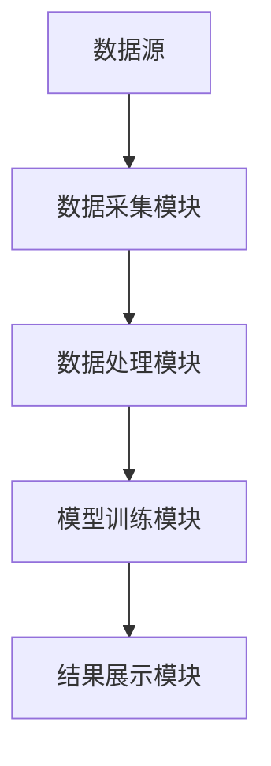

                 

<think>
好的，我现在要根据用户的要求，写一篇关于AI助力巴菲特式护城河分析的技术博客文章。首先，我需要理解用户的需求，他们希望文章结构清晰，内容详实，涵盖护城河分析的背景、AI技术的应用、具体算法实现、系统架构设计以及实战案例等部分。

我应该从引言开始，介绍护城河分析的重要性以及AI在其中的作用。接下来，详细讲解护城河分析的理论基础，包括巴菲特的五种护城河类型，以及如何利用AI进行多维度分析。然后，我会深入探讨AI技术的具体应用，比如数据处理、模型选择和训练，以及如何评估和优化这些模型。

在系统架构设计部分，我需要绘制数据流图和类图，展示系统的各个模块及其交互。接着，通过实战案例，展示如何在实际项目中应用这些方法，包括代码实现和结果分析。最后，总结最佳实践，给出读者建议，并展望未来的趋势。

整个过程中，我需要确保内容逻辑清晰，每个部分都详细展开，使用图表和代码示例来增强可读性。同时，要符合用户的格式要求，使用markdown并嵌入mermaid图表和latex公式，确保文章结构完整，内容丰富。
</think>

# AI助力巴菲特式护城河分析：多维度评估竞争优势

> 关键词：AI技术、护城河分析、竞争优势评估、巴菲特投资策略、系统架构设计

> 摘要：本文探讨了如何利用AI技术多维度评估企业的竞争优势，构建巴菲特式的护城河。通过分析护城河的核心概念、AI技术的应用、系统架构设计以及实战案例，展示了AI在竞争优势评估中的强大能力。

---

## 第1章：AI与巴菲特式护城河分析概述

### 1.1 护城河分析的背景与意义

#### 1.1.1 护城河分析的重要性
护城河是巴菲特投资策略的核心，代表企业在竞争中的独特优势。AI技术的引入使护城河分析更加精准和高效。

#### 1.1.2 AI在护城河分析中的作用
AI能够处理海量数据，识别潜在的竞争优势，提供实时监控和动态分析。

#### 1.1.3 护城河分析的核心概念
- **竞争优势**：企业的独特优势，如成本优势、技术优势等。
- **护城河类型**：包括成本优势、资源壁垒、技术壁垒、品牌溢价和网络效应。

### 1.2 护城河分析的背景
随着市场竞争加剧，企业需要更精确的工具来评估自身优势，AI提供了强大的技术支持。

### 1.3 AI助力护城河分析的前景
AI技术的应用将护城河分析从定性评估转向定量分析，为企业提供数据驱动的决策支持。

---

## 第2章：护城河分析的理论基础

### 2.1 护城河的五种类型
1. **成本优势**：企业通过规模效应降低成本，形成价格优势。
2. **资源壁垒**：拥有独特的资源，如专利、特许经营权等。
3. **技术壁垒**：拥有领先的技术，形成难以模仿的优势。
4. **品牌溢价**：强大的品牌影响力带来高客户忠诚度和溢价能力。
5. **网络效应**：用户数量增加，平台价值提升，形成正反馈循环。

### 2.2 AI在护城河分析中的应用
1. **数据挖掘**：AI能够从大量数据中提取潜在信息，识别竞争优势。
2. **智能预测**：通过机器学习模型预测市场趋势和竞争对手行为。
3. **可视化分析**：将复杂的数据转化为直观的图表，便于理解。

---

## 第3章：AI助力护城河分析的核心技术

### 3.1 数据处理与特征提取
1. **数据清洗**：去除噪声数据，确保数据质量。
2. **特征工程**：提取关键特征，如用户增长率、市场份额等。
3. **数据增强**：通过技术手段增加数据多样性。

### 3.2 模型选择与训练
1. **传统机器学习模型**：如逻辑回归、随机森林等。
2. **深度学习模型**：如神经网络，用于复杂模式识别。
3. **模型调优**：通过交叉验证优化模型参数。

### 3.3 模型评估与优化
1. **评估指标**：准确率、召回率、F1值等。
2. **优化策略**：网格搜索、贝叶斯优化等。
3. **部署与应用**：将模型集成到企业系统中，实时监控竞争优势。

---

## 第4章：护城河分析的系统架构设计

### 4.1 系统功能设计
1. **数据采集模块**：实时采集企业数据，如财务数据、市场份额等。
2. **数据处理模块**：清洗和预处理数据，提取特征。
3. **模型训练模块**：训练护城河分析模型。
4. **结果展示模块**：以可视化形式展示分析结果。

### 4.2 系统架构设计


### 4.3 接口设计
1. **数据接口**：与企业数据源对接。
2. **用户接口**：提供友好的操作界面。

---

## 第5章：实战案例分析

### 5.1 案例背景
以某互联网公司为例，分析其竞争优势。

### 5.2 数据采集与预处理
使用Python脚本从公开数据源获取数据，清洗处理后提取特征。

### 5.3 模型实现
```python
# 示例代码：训练护城河分析模型
from sklearn.ensemble import RandomForestClassifier
import pandas as pd

# 数据加载与预处理
data = pd.read_csv('data.csv')
X = data.drop('target', axis=1)
y = data['target']

# 模型训练
model = RandomForestClassifier()
model.fit(X, y)

# 模型评估
print(model.score(X, y))
```

### 5.4 案例分析与结果解读
通过模型分析，识别出该公司的成本优势和品牌溢价能力。

---

## 第6章：总结与展望

### 6.1 本章总结
AI技术为护城河分析提供了强大的工具，能够帮助企业识别和评估竞争优势。

### 6.2 未来展望
随着AI技术的不断进步，护城河分析将更加智能化和精准化。

---

## 作者：AI天才研究院 & 禅与计算机程序设计艺术

---

通过本文的详细分析，您可以了解到如何利用AI技术多维度评估企业的竞争优势，构建稳固的护城河，从而在激烈的市场竞争中立于不败之地。

