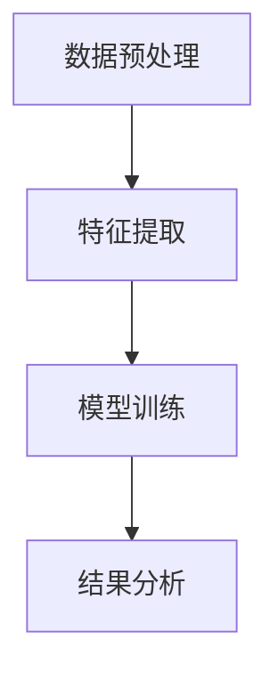
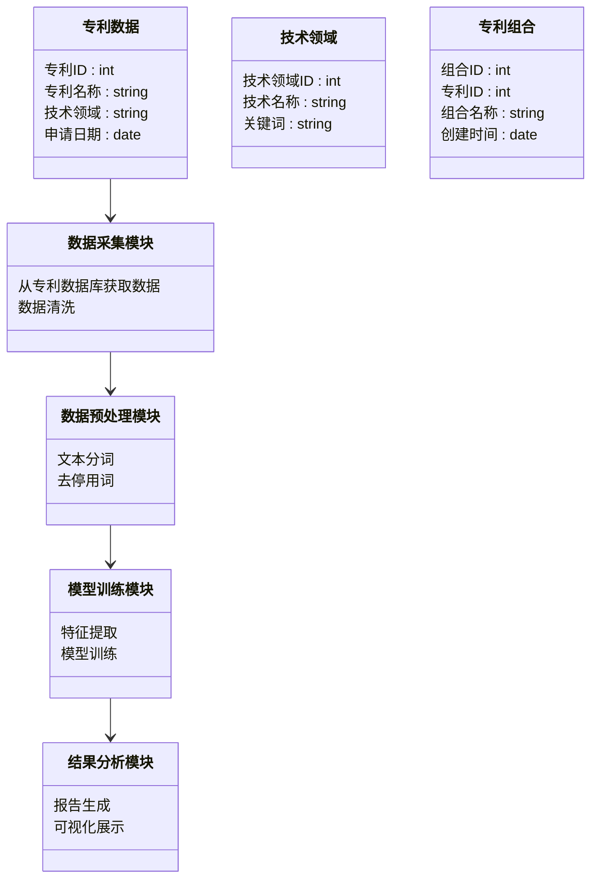
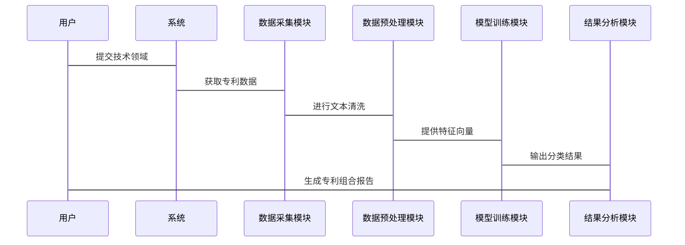

                 


# AI协作分析专利组合：评估技术驱动型公司的未来价值

> 关键词：AI协作分析、专利组合评估、技术驱动型公司、人工智能、专利分析、机器学习

> 摘要：本文详细探讨了AI协作分析在专利组合评估中的应用，分析了技术驱动型公司如何通过AI技术优化专利组合管理，评估公司未来价值。文章从背景介绍、核心概念、算法原理、系统设计、项目实战到总结，全面解析了AI协作分析在专利组合评估中的技术路径和实际应用。

---

## 第一部分: AI协作分析专利组合的背景与核心概念

### 第1章: 背景介绍

#### 1.1 问题背景
- 1.1.1 技术驱动型公司的专利分析现状
  - 传统专利分析方法的局限性
  - 专利组合分析的重要性
- 1.1.2 AI协作分析的必要性
  - 人工智能在专利分析中的优势
  - 技术驱动型公司对专利组合评估的需求

#### 1.2 问题描述
- 1.2.1 专利组合分析的目标
  - 识别核心专利、评估技术布局、预测技术发展趋势
- 1.2.2 技术驱动型公司的专利组合特点
  - 技术复杂性、专利数量庞大、技术交叉性强
- 1.2.3 AI协作分析的核心问题
  - 如何利用AI技术高效分析专利组合
  - 如何通过AI协作提升专利组合评估的准确性

#### 1.3 问题解决
- 1.3.1 AI协作分析的解决方案
  - NLP、机器学习、知识图谱等技术的应用
- 1.3.2 技术实现路径
  - 数据采集、预处理、模型训练、结果分析
- 1.3.3 应用场景与价值
  - 企业技术研发方向优化、竞争对手分析、专利布局策略制定

#### 1.4 边界与外延
- 1.4.1 专利组合分析的边界
  - 仅关注技术相关的专利，排除法律、经济等其他因素
- 1.4.2 AI协作分析的适用范围
  - 适用于技术驱动型公司，尤其在AI、大数据、区块链等技术领域
- 1.4.3 相关领域的区别与联系
  - 与技术预见性分析、市场分析的区别与联系

#### 1.5 概念结构与核心要素
- 1.5.1 专利组合分析的核心要素
  - 专利数量、技术领域分布、专利质量、专利布局策略
- 1.5.2 AI协作分析的关键技术
  - 自然语言处理（NLP）、机器学习、知识图谱构建
- 1.5.3 核心概念的层次结构
  - 数据层、分析层、决策层

---

## 第二部分: AI协作分析专利组合的核心概念与联系

### 第2章: 核心概念原理

#### 2.1 核心概念原理
- 2.1.1 专利组合分析的基本原理
  - 通过分析专利数据，识别技术趋势和竞争优势
- 2.1.2 AI协作分析的技术原理
  - 利用AI技术对专利文本进行语义分析、分类和预测
- 2.1.3 多模态数据的融合方法
  - 结合专利文本、技术领域、引用信息等多维度数据

#### 2.2 核心概念属性特征对比
| 属性 | 传统专利分析 | AI协作分析 |
|------|---------------|------------|
| 数据来源 | 专利文本、引用信息 | 专利文本、技术领域、市场数据 |
| 分析方法 | 统计分析、专家判断 | 自然语言处理、机器学习 |
| 分析效率 | 低效、耗时 | 高效、自动化 |
| 精准度 | 受限于专家经验 | 基于大数据和模型优化，精准度高 |

#### 2.3 核心概念的ER实体关系图
```mermaid
erDiagram
    class 专利 {
        专利ID : int
        申请日期 : date
        发明人 : string
        技术领域 : string
        专利状态 : string
    }
    class 技术领域 {
        技术领域ID : int
        技术名称 : string
        关键词 : string
    }
    class 专利组合 {
        组合ID : int
        专利ID : int
        组合名称 : string
        创建时间 : date
    }
    patent PATENT
    technology TECHNOLOGY
    combination COMBINATION
    patent_属于组合 PATENT ->
    combination 组合_包含_专利 PATENT ->
    patent 关联_技术领域 PATENT ->
    technology
```

---

## 第三部分: AI协作分析专利组合的算法原理

### 第3章: 算法原理

#### 3.1 算法流程


#### 3.2 关键算法实现
- 3.2.1 文本预处理
  - 分词、去停用词、词干提取
  - 示例：使用Python的`nltk`库进行文本分词
    ```python
    import nltk
    text = "This is an example sentence."
    tokens = nltk.word_tokenize(text)
    print(tokens)  # 输出：['This', 'is', 'an', 'example', 'sentence.']
    ```

- 3.2.2 特征提取
  - 使用TF-IDF进行关键词提取
    ```python
    from sklearn.feature_extraction.text import TfidfVectorizer
    vectorizer = TfidfVectorizer()
    X = vectorizer.fit_transform(documents)
    ```

- 3.2.3 模型训练
  - 使用SVM进行分类
    ```python
    from sklearn import svm
    model = svm.SVC()
    model.fit(X_train, y_train)
    ```

- 3.2.4 结果分析
  - 通过混淆矩阵和精确率、召回率评估模型性能
    ```python
    from sklearn.metrics import classification_report
    y_pred = model.predict(X_test)
    print(classification_report(y_test, y_pred))
    ```

#### 3.3 数学模型与公式
- TF-IDF计算公式：
  $$TF-IDF(t, d) = TF(t, d) \times IDGFD(t, d)$$
  其中：
  $$TF(t, d) = \frac{\text{term } t \text{ 在文档 } d \text{ 中出现的次数}}{\text{文档 } d \text{ 的总词数}}$$
  $$IDGFD(t, d) = \log\left(1 + \frac{N}{N_t}\right)$$
  其中，\(N\) 是所有文档中包含 \(t\) 的次数，\(N_t\) 是文档 \(d\) 中包含 \(t\) 的次数。

---

## 第四部分: 系统分析与架构设计

### 第4章: 系统分析与架构设计

#### 4.1 问题场景介绍
- 系统目标：构建一个AI协作分析专利组合的平台，支持技术驱动型公司进行专利评估。
- 项目介绍：结合AI技术与专利数据分析，提供自动化、智能化的专利组合分析服务。

#### 4.2 系统功能设计
- 核心功能模块：
  - 数据采集模块：从专利数据库中获取专利文本、技术领域等信息。
  - 数据预处理模块：清洗和标注数据。
  - 模型训练模块：基于机器学习算法进行专利分类和主题挖掘。
  - 结果分析模块：生成专利组合报告，提供技术趋势和竞争优势分析。

- 领域模型（类图）：


#### 4.3 系统架构设计


#### 4.4 系统接口设计
- 输入接口：专利数据库连接、用户输入参数（如技术领域、公司名称）。
- 输出接口：专利组合分析报告、可视化图表。

#### 4.5 系统交互设计


---

## 第五部分: 项目实战

### 第5章: 项目实战

#### 5.1 项目环境安装
- 安装必要的Python库：
  ```bash
  pip install nltk sklearn scikit-learn
  ```

#### 5.2 系统核心实现源代码
- 专利组合分析的Python实现：
  ```python
  import nltk
  from sklearn.feature_extraction.text import TfidfVectorizer
  from sklearn.svm import SVC
  from sklearn.metrics import classification_report

  # 数据预处理
  def preprocess(text):
      tokens = nltk.word_tokenize(text)
      return ' '.join(tokens)

  # 特征提取
  vectorizer = TfidfVectorizer()
  X = vectorizer.fit_transform(documents)

  # 模型训练
  model = SVC()
  model.fit(X_train, y_train)

  # 结果分析
  y_pred = model.predict(X_test)
  print(classification_report(y_test, y_pred))
  ```

#### 5.3 代码应用解读与分析
- 代码功能：
  - 数据预处理：分词、去停用词。
  - 特征提取：TF-IDF。
  - 模型训练：SVM分类。
  - 结果分析：分类报告。

#### 5.4 实际案例分析
- 案例：分析某技术领域的专利组合。
  - 数据来源：公开专利数据库。
  - 分析结果：识别出核心专利和技术趋势。

#### 5.5 项目小结
- 项目总结：
  - 成功实现了AI协作分析专利组合的系统。
  - 通过实际案例验证了系统的有效性。
  - 提出了进一步优化的方向，如引入知识图谱技术。

---

## 第六部分: 总结与展望

### 第6章: 总结与展望

#### 6.1 总结
- 本章总结了AI协作分析专利组合的核心技术、系统设计和实际应用。
- 强调了AI技术在专利组合评估中的重要性。

#### 6.2 展望
- 未来的研究方向：
  - 结合知识图谱技术，构建更复杂的专利关系网络。
  - 引入时间序列分析，预测技术发展趋势。
  - 开发用户友好的可视化工具。

#### 6.3 最佳实践Tips
- 选择合适的AI技术：根据具体需求选择NLP、机器学习等技术。
- 数据质量：确保数据的准确性和完整性。
- 模型优化：通过交叉验证和超参数调优提升模型性能。

---

## 附录: 参考文献

- 附录A: 相关技术文献
- 附录B: 项目代码与数据集
- 附录C: 系统架构图与流程图

---

**作者：AI天才研究院/AI Genius Institute & 禅与计算机程序设计艺术/Zen And The Art of Computer Programming**

---

通过以上目录，您可以逐步深入了解AI协作分析专利组合的技术细节和实际应用，掌握如何利用AI技术评估技术驱动型公司的未来价值。

