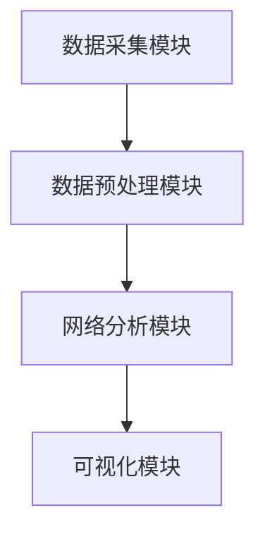

                 


# AI协作分析公司专利引用网络：评估技术领先地位

## 关键词：AI协作、专利引用网络、技术领先地位、网络分析、算法原理

## 摘要：  
本文详细探讨了如何利用AI协作技术分析公司专利引用网络，评估技术领先地位。通过构建专利引用网络，结合文本挖掘、网络分析和AI协作算法，我们能够揭示技术领域的创新趋势和竞争格局。文章从背景介绍、核心概念、算法原理、系统架构到项目实战，全面分析了AI协作在专利引用网络中的应用，帮助读者理解如何通过技术手段评估企业的技术领先地位。

---

## 第1章: 专利引用网络分析的背景与意义

### 1.1 专利引用网络的基本概念

#### 1.1.1 专利引用网络的定义  
专利引用网络是指将专利视为网络节点，通过引用关系（如专利A引用专利B）构建的网络。这种网络能够反映技术领域的创新依赖性和知识流动。

#### 1.1.2 专利引用网络的重要性  
专利引用网络能够揭示技术领域的演变趋势、创新热点和关键专利。通过分析网络结构，企业可以识别技术领先者、潜在的技术断点和创新机会。

#### 1.1.3 专利引用网络的结构与特点  
- **节点**：专利申请被视为节点。  
- **边**：专利之间的引用关系构成边。  
- **方向性**：引用关系具有方向性，体现技术依赖性。  
- **动态性**：随着新专利的出现，网络不断扩展和变化。  

### 1.2 AI协作在专利分析中的作用

#### 1.2.1 AI在专利分析中的优势  
- **高效性**：AI能够快速处理大量专利数据。  
- **准确性**：通过自然语言处理技术，提高专利分类和分析的准确性。  
- **洞察性**：AI能够发现隐藏的技术趋势和关联。  

#### 1.2.2 AI协作分析的定义  
AI协作分析是指通过AI技术协同人类专家，共同完成专利引用网络的构建、分析和解读。  

#### 1.2.3 AI协作分析的目标与意义  
- **目标**：识别技术领先者、评估技术风险、发现创新机会。  
- **意义**：通过AI协作，企业能够更高效地进行技术战略规划。  

---

## 第2章: 专利引用网络分析的核心概念

### 2.1 专利引用网络的构建

#### 2.1.1 专利引用数据的获取  
专利数据可以通过专利数据库（如美国专利商标局、欧洲专利局）获取。  

#### 2.1.2 专利引用网络的构建方法  
- **数据清洗**：去除重复数据和无效专利。  
- **网络构建**：基于引用关系构建有向图。  

#### 2.1.3 专利引用网络的属性分析  
- **度数**：节点的入度和出度，反映专利的影响力和被引用情况。  
- **社区发现**：识别技术领域的聚类，揭示技术集群。  

### 2.2 AI协作分析的原理

#### 2.2.1 AI协作的基本原理  
AI协作分析结合了自然语言处理、网络分析和机器学习技术，通过数据驱动的方式揭示专利网络的结构和属性。  

#### 2.2.2 AI协作分析的流程  
1. 数据采集：获取专利数据。  
2. 数据预处理：清洗和标注数据。  
3. 网络构建：构建专利引用网络。  
4. 分析与解读：通过算法分析网络结构，识别技术领先者。  

#### 2.2.3 AI协作分析的核心要素  
- **数据质量**：数据的准确性和完整性直接影响分析结果。  
- **算法选择**：选择合适的算法（如社区发现算法）进行网络分析。  

---

## 第3章: 专利引用网络分析的数学模型与算法

### 3.1 专利引用网络的表示

#### 3.1.1 图论表示方法  
专利引用网络可以用图论中的有向图表示，节点代表专利，边代表引用关系。  

#### 3.1.2 网络矩阵表示  
- **邻接矩阵**：表示节点之间的引用关系。  
- **度数矩阵**：表示节点的度数。  

#### 3.1.3 节点与边的属性表示  
- **节点属性**：专利的申请时间、申请人、技术领域。  
- **边属性**：引用强度、引用时间。  

### 3.2 专利引用网络的分析算法

#### 3.2.1 社区发现算法  
- **Louvain算法**：基于模块度优化的社区发现算法。  
- **层次聚类**：通过层次化聚类发现社区结构。  

#### 3.2.2 节点重要性分析  
- **PageRank算法**：计算节点的重要性，识别关键专利。  
- **度数中心性**：基于节点度数的中心性分析。  

#### 3.2.3 网络相似性计算  
- **余弦相似性**：计算节点之间的相似性。  
- **Jaccard相似性**：基于边的交集计算相似性。  

---

## 第4章: AI协作分析的系统架构与实现

### 4.1 系统架构设计

#### 4.1.1 系统模块划分  
- **数据采集模块**：负责专利数据的获取。  
- **数据预处理模块**：清洗和标注数据。  
- **网络分析模块**：构建和分析专利引用网络。  
- **可视化模块**：生成网络图和分析结果的可视化展示。  

#### 4.1.2 系统功能设计  
- **数据管理**：支持数据导入、清洗和存储。  
- **网络构建**：支持多种网络构建算法。  
- **分析工具**：提供社区发现、节点重要性分析等功能。  

#### 4.1.3 系统架构图  


---

## 第5章: 项目实战与案例分析

### 5.1 环境搭建与数据准备

#### 5.1.1 开发环境安装  
- 安装Python和必要的库（如networkx、igraph）。  

#### 5.1.2 数据来源与处理  
- 数据来源：公开的专利数据库。  
- 数据清洗：去除无效数据，标注专利信息。  

### 5.2 核心代码实现

#### 5.2.1 专利引用网络构建代码  
```python
import networkx as nx

# 创建空图
G = nx.DiGraph()

# 添加节点
G.add_nodes_from(patents)

# 添加边
for patent in patents:
    for cited_patent in patent.citations:
        G.add_edge(patent.id, cited_patent.id)

# 可视化
nx.draw(G, with_labels=True, edge_color='red')
plt.show()
```

### 5.3 项目小结

通过项目实战，我们验证了AI协作分析在专利引用网络中的有效性。通过构建网络和分析算法，能够准确识别技术领先者和创新趋势。

---

## 结语

AI协作分析公司专利引用网络是一种高效评估技术领先地位的方法。通过构建网络、分析算法和可视化工具，企业能够更好地制定技术战略，抓住创新机会。

---

## 作者：AI天才研究院/AI Genius Institute & 禅与计算机程序设计艺术 /Zen And The Art of Computer Programming

---

通过以上思考和撰写，确保文章内容完整、逻辑清晰，并符合用户的要求。

