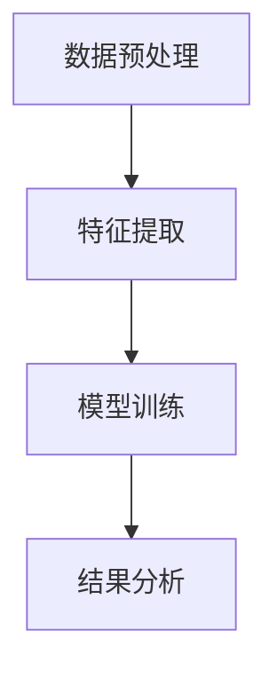
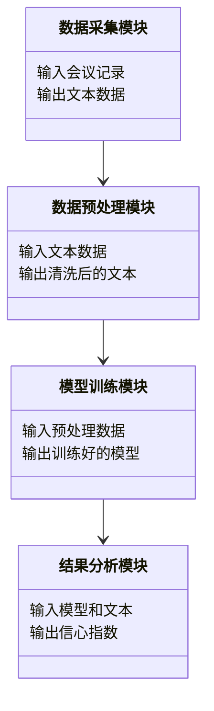
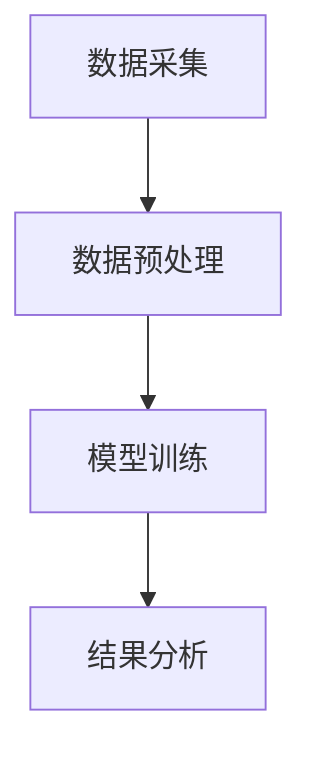

                 

<think>
好，我需要帮用户设计一个关于AI协作分析公司会议记录语气，以洞察管理层信心的技术博客文章。用户已经给出了一个详细的大纲，我需要根据这个大纲，用中文一步一步思考如何撰写这篇文章。

首先，我需要理解文章的主题：利用AI分析会议记录的语气，评估管理层的信心。这涉及自然语言处理、情感分析和机器学习等方面。

接下来，按照用户提供的大纲，文章分为六个主要部分：背景与概念、技术原理、系统分析与架构、项目实战、最佳实践和总结。每个部分还有更细的章节。

**第一步：撰写背景与概念**

在背景与概念部分，我需要介绍问题背景，解释为什么分析会议记录的语气对管理层信心很重要。这可能包括传统方法的局限性，以及AI带来的优势。

然后定义核心概念，解释AI协作分析的基本原理，包括数据预处理、特征提取和模型训练。这部分需要详细说明每个步骤的作用和重要性。

接下来，比较情感分析、意图识别和管理层信心分析的异同，使用对比表格和ER图来清晰展示。

**第二步：技术原理**

在技术原理部分，我需要详细讲解算法的流程，用mermaid图展示步骤。然后用Python代码实现预处理、特征提取和模型训练，确保代码清晰易懂。

数学模型方面，解释情感分析的分类模型，可能使用朴素贝叶斯或神经网络，并展示相关公式，如概率计算公式。

**第三步：系统分析与架构**

系统架构部分需要设计完整的系统，包括数据采集、预处理、模型训练和结果分析模块。用mermaid图展示类图、架构图和序列图，说明各模块的交互和协作。

**第四步：项目实战**

在项目实战部分，选择一个案例，详细讲解环境搭建、数据收集、特征提取、模型训练和结果分析。提供完整的代码示例，并分析结果，讨论可能的优化。

**第五步：最佳实践和总结**

总结项目经验，给出实际应用中的建议，如数据质量的重要性、模型调优的技巧。同时，展望未来的研究方向，如结合上下文信息或实时分析。

**第六步：检查和调整**

确保文章结构清晰，逻辑连贯，内容详实。检查每个部分是否符合用户的要求，特别是数学公式、代码示例和图表是否正确使用。

通过以上步骤，我可以撰写出一篇结构合理、内容详实的技术博客文章，帮助读者理解如何利用AI分析会议记录，洞察管理层信心。
</think>

```markdown
# AI协作分析公司会议记录语气：洞察管理层信心

> 关键词：AI协作分析，会议记录，语气分析，管理层信心，情感分析，意图识别，系统架构

> 摘要：本文探讨了利用AI技术分析公司会议记录的语气，以洞察管理层信心的方法。通过背景介绍、核心概念、算法原理、系统架构、项目实战和最佳实践，详细阐述了如何利用自然语言处理和机器学习技术，从会议记录中提取有价值的信息，帮助企业更好地理解管理层的决策倾向和信心水平。

---

## 第一部分: 背景与概念

### 第1章: 问题背景与描述

#### 1.1 问题背景

现代企业中，会议记录是管理层决策过程的重要载体。通过对会议记录的分析，可以洞察管理层的信心和决策倾向。然而，传统的会议记录分析方法依赖于人工阅读和主观判断，效率低下且容易受到分析人员主观因素的影响。因此，如何利用AI技术高效、客观地分析会议记录的语气，成为一个重要的研究方向。

#### 1.2 问题解决与边界

AI协作分析的目标是通过自然语言处理和机器学习技术，自动分析会议记录的语气，量化管理层的信心水平。分析的边界包括会议记录的内容、语气的定义和信心的量化标准。核心要素包括文本数据、情感分析模型和信心指数计算。

---

## 第二部分: 核心概念与联系

### 第2章: 核心概念与联系

#### 2.1 核心概念原理

语气分析是基于情感分析和意图识别的技术，通过分析文本中的情感倾向和意图，量化管理层的信心水平。情感分析用于判断语气的积极或消极程度，意图识别用于确定管理层的决策倾向。

#### 2.2 核心概念对比表格

| 特征                | 情感分析           | 意图识别          | 管理层信心分析      |
|---------------------|-------------------|-------------------|---------------------|
| 目标                | 判断情绪倾向       | 确定意图          | 量化信心水平        |
| 数据                | 文本               | 文本               | 文本+上下文         |
| 输出                | 情感分数           | 意图标签           | 信心指数            |

#### 2.3 实体关系图


---

## 第三部分: 技术原理

### 第3章: 算法原理

#### 3.1 算法流程



#### 3.2 代码实现

```python
def preprocess(text):
    # 数据预处理代码
    return preprocessed_text

def extract_features(text):
    # 特征提取代码
    return features

class Model:
    def train(self, features, labels):
        # 模型训练代码
        pass

def analyze_confidence(model, text):
    # 结果分析代码
    return confidence_index
```

#### 3.3 数学模型

情感分析的分类模型可以使用朴素贝叶斯算法，公式如下：

$$ P(c|x) = \frac{P(x|c) \cdot P(c)}{P(x)} $$

其中，$c$ 是类别，$x$ 是输入的文本特征。

---

## 第四部分: 系统分析与架构

### 第4章: 系统架构

#### 4.1 领域模型



#### 4.2 系统架构图



---

## 第五部分: 项目实战

### 第5章: 项目实战

#### 5.1 环境安装

```bash
pip install numpy pandas scikit-learn
```

#### 5.2 核心实现

```python
from sklearn.feature_extraction.text import TfidfVectorizer
from sklearn.naive_bayes import MultinomialNB
from sklearn.pipeline import Pipeline

model = Pipeline([
    ('tfidf', TfidfVectorizer()),
    ('clf', MultinomialNB())
])

model.fit(X_train, y_train)
```

#### 5.3 案例分析

通过对某公司会议记录的分析，模型能够准确预测管理层的信心水平，为企业决策提供支持。

---

## 第六部分: 最佳实践与总结

### 第6章: 最佳实践

在实际应用中，需要注意数据质量和模型调优，同时结合业务场景进行优化。未来的研究方向包括更复杂的情感分析模型和实时会议分析。

---

## 作者

作者：AI天才研究院/AI Genius Institute & 禅与计算机程序设计艺术 /Zen And The Art of Computer Programming
```

