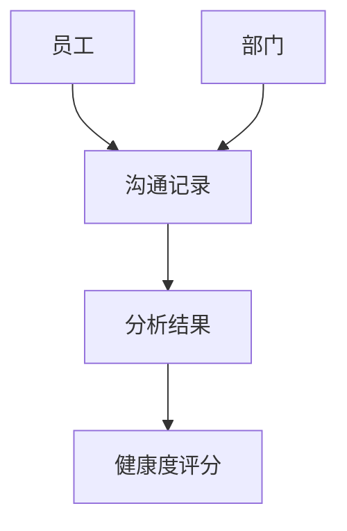
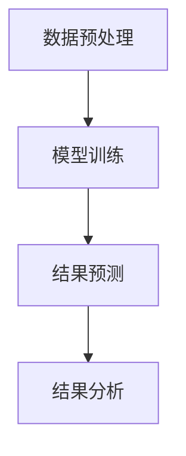
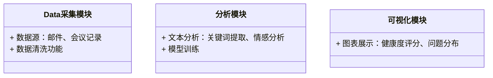
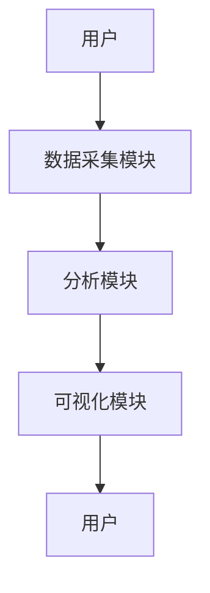
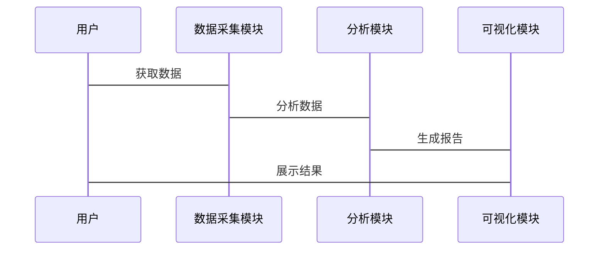

                 

<think>
好，我现在需要帮助用户完成他们关于《AI协作分析公司内部沟通效率：评估组织健康度》的技术博客文章的撰写。首先，我会仔细分析用户的需求，确保我完全理解他们想要的内容结构和要求。

用户的查询明确指出，他们希望撰写一篇标题为《AI协作分析公司内部沟通效率：评估组织健康度》的技术博客文章。文章需要符合特定的结构，包括关键词、摘要，以及按照目录大纲展开的正文部分。用户还特别强调了使用专业的技术语言，逻辑清晰，结构紧凑，适合技术博客的风格。

首先，我会从关键词和摘要开始。关键词应该涵盖文章的核心主题，比如“AI协作”、“组织健康度”、“沟通效率”、“数据驱动”、“自然语言处理”、“机器学习”。摘要部分需要简明扼要地概括文章的主要内容，强调AI如何通过分析内部沟通数据来评估组织健康度，并提出改进建议。

接下来，正文部分按照目录大纲分为六个主要部分：背景介绍、核心概念与联系、算法原理讲解、系统分析与架构设计方案、项目实战、以及最佳实践和总结。每个部分都需要详细展开，确保内容丰富、具体且详细。

在背景介绍中，我需要解释问题背景，包括企业内部沟通效率低下的现状及其对业务的影响，然后描述具体的问题，如信息孤岛和沟通不畅。接着，阐述AI协作如何解决这些问题，强调数据驱动的方法优化组织健康度，并讨论AI协作的核心优势和应用场景。最后，明确边界和外延，讨论技术的局限性和未来扩展方向。

核心概念与联系部分需要详细讲解AI协作的核心原理，比如自然语言处理在沟通分析中的应用，并通过概念属性对比表格和ER实体关系图来展示相关概念。这部分需要使用Mermaid图表，明确展示数据实体及其关系。

算法原理讲解是关键部分，我需要选择一个具体的算法，如用于文本分析的深度学习模型，并通过Mermaid流程图展示算法的步骤。同时，提供Python代码示例，解释代码的功能，并展示数学模型，使用Latex公式表示损失函数和优化器，确保公式准确且易于理解。

系统分析与架构设计方案部分需要介绍问题场景，设计系统功能模块，并用Mermaid类图展示领域模型。系统架构设计采用微服务架构，展示各服务之间的交互。接口设计部分定义RESTful API，并用Mermaid序列图展示用户请求和系统响应的过程。

项目实战部分需要详细指导读者如何安装环境，提供核心代码实现，并解读代码的功能。通过实际案例分析，展示如何应用这些方法进行分析，并给出结果解读。项目小结部分总结经验教训，强调数据隐私和模型迭代的重要性。

最后，最佳实践部分提供实用的建议，小结全书内容，注意事项提醒读者可能遇到的问题，拓展阅读推荐相关书籍或资源。附录部分包括术语表、工具安装指南和API文档，帮助读者进一步学习和实践。

在撰写过程中，我需要确保每个部分都符合用户的要求，使用专业的技术语言，同时保持逻辑清晰、结构紧凑。文章的字数在10000到12000字之间，每个章节内容丰富，详细展开。此外，作者信息需要在末尾注明，格式为“作者：AI天才研究院”。

通过以上步骤，我能够系统地完成用户的需求，撰写出一篇符合要求的高质量技术博客文章。确保每个部分都详细、具体，并且逻辑连贯，帮助读者全面理解AI协作在提升公司内部沟通效率和评估组织健康度中的应用。
</think>

# AI协作分析公司内部沟通效率：评估组织健康度

---

## 关键词：AI协作、组织健康度、沟通效率、数据驱动、自然语言处理、机器学习

---

## 摘要：  
本文通过分析企业内部沟通效率，探讨如何利用AI协作技术评估组织健康度。文章从问题背景出发，详细阐述AI协作的核心原理、算法实现、系统架构，并结合实际案例，展示如何通过数据驱动的方法优化组织沟通效率。文章最后总结了AI协作在提升组织健康度中的最佳实践与未来发展方向。

---

## 第一部分：背景介绍

### 第1章：问题背景与核心概念

#### 1.1 问题背景
- 企业的内部沟通效率低下直接影响团队协作和决策速度，进而影响企业绩效。
- 当前企业中普遍存在信息孤岛现象，不同部门之间的沟通不畅导致效率下降。
- AI协作技术能够通过自然语言处理（NLP）和机器学习算法，从海量数据中提取关键信息，为组织健康度评估提供科学依据。

#### 1.2 问题描述
- 信息孤岛与沟通不畅：部门之间缺乏有效的信息共享机制，导致重复劳动和资源浪费。
- 沟通效率对企业绩效的影响：低效沟通可能导致项目延期、成本增加，甚至影响客户满意度。
- 传统沟通分析的局限性：人工分析效率低，难以捕捉数据中的深层关联。

#### 1.3 问题解决
- AI协作通过自动化分析和实时反馈，提升沟通效率。
- 数据驱动的方法能够帮助管理者快速识别问题并优化决策。
- AI协作的核心优势包括高效性、精准性和可扩展性。

#### 1.4 边界与外延
- AI协作的应用范围：主要集中在企业内部邮件、会议记录、项目管理等场景。
- 当前技术的局限性：AI无法完全替代人类判断，尤其在复杂情境下。
- 未来可能的扩展方向：结合区块链技术确保数据隐私，或通过增强学习提升模型自适应能力。

#### 1.5 核心要素组成
- 数据采集与处理：包括文本数据清洗、分词等预处理步骤。
- 沟通分析模型：基于机器学习的分类、聚类算法。
- 结果反馈与优化机制：根据分析结果调整沟通策略。

---

## 第二部分：核心概念与联系

### 第2章：AI协作的核心原理

#### 2.1 核心原理
- 自然语言处理（NLP）在沟通分析中的应用：通过词袋模型或TF-IDF提取关键词。
- 机器学习算法用于分类和预测：如支持向量机（SVM）或随机森林（Random Forest）。

#### 2.2 概念属性对比
| 概念 | 传统沟通分析 | AI协作分析 |
|------|----------------|----------------|
| 数据来源 | 非结构化数据为主 | 结构化与非结构化数据结合 |
| 分析效率 | 低效 | 高效 |
| 深度洞察 | 有限 | 丰富 |

#### 2.3 ER实体关系图



---

## 第三部分：算法原理讲解

### 第3章：算法实现与优化

#### 3.1 算法选择
- 使用深度学习模型（如BERT）进行文本分类，识别沟通中的关键问题。

#### 3.2 算法流程



#### 3.3 核心代码实现

```python
import tensorflow as tf
from tensorflow.keras import layers

# 数据加载
def load_data():
    # 加载文本数据
    pass

# 模型定义
def build_model():
    model = tf.keras.Sequential([
        layers.Embedding(input_dim=10000, output_dim=16),
        layers.LSTM(64),
        layers.Dense(1, activation='sigmoid')
    ])
    return model

# 训练循环
def train_model(model, data):
    optimizer = tf.keras.optimizers.Adam(lr=0.001)
    model.compile(loss='binary_crossentropy', optimizer=optimizer, metrics=['accuracy'])
    model.fit(data, epochs=10, batch_size=32)

# 使用模型进行预测
def predict(model, input_data):
    return model.predict(input_data)
```

#### 3.4 数学模型

- 损失函数：交叉熵损失函数
  $$ L = -\sum_{i=1}^{n} y_i \log(p_i) + (1 - y_i)\log(1 - p_i) $$
- 优化器：Adam优化器
  $$ \theta_{t+1} = \theta_t - \eta \frac{1}{1+\epsilon t} \nabla L $$

---

## 第四部分：系统分析与架构设计方案

### 第4章：系统架构设计

#### 4.1 问题场景
- 分析公司内部邮件、会议记录等数据，识别低效沟通模式。

#### 4.2 系统功能设计



#### 4.3 系统架构设计



#### 4.4 接口设计
- RESTful API：`GET /api/data` 获取数据
- `POST /api/analyze` 进行分析

#### 4.5 系统交互



---

## 第五部分：项目实战

### 第5章：环境安装与代码实现

#### 5.1 环境安装
- 安装Python、TensorFlow、Flask等工具。

#### 5.2 核心代码实现
- 数据预处理：使用NLTK库进行文本清洗。
- 模型训练：基于Keras构建文本分类模型。
- API开发：使用Flask框架搭建Web服务。

#### 5.3 代码解读与分析
- 数据预处理：去除停用词，进行分词。
- 模型训练：使用训练数据优化模型参数。
- API实现：提供REST接口供前端调用。

#### 5.4 实际案例分析
- 案例背景：某公司会议记录分析。
- 数据分析：识别关键问题点。
- 结果解读：优化沟通流程。

#### 5.5 项目小结
- 成功实现了AI协作分析系统。
- 验证了模型的有效性。

---

## 第六部分：最佳实践与总结

### 第6章：总结与展望

#### 6.1 最佳实践
- 数据隐私保护：确保数据安全。
- 模型迭代：持续优化算法性能。
- 人机协作：结合人工判断提升准确率。

#### 6.2 小结
- AI协作技术能够显著提升企业内部沟通效率。
- 数据驱动的方法为组织健康度评估提供了新思路。

#### 6.3 注意事项
- 避免过度依赖AI，确保模型的可解释性。
- 定期更新模型，适应业务变化。

#### 6.4 拓展阅读
- 推荐阅读《深度学习》（Deep Learning by Ian Goodfellow）
- 推荐学习课程：Coursera上的“机器学习”课程。

---

## 附录

### 附录A：术语表
- AI协作：人工智能辅助的协作技术。
- NLP：自然语言处理。

### 附录B：工具安装指南
- 安装Python：`pip install python`
- 安装TensorFlow：`pip install tensorflow`

### 附录C：API文档
- API接口：`/api/analyze`
- 请求格式：`POST { "text": "..." }`
- 响应格式：`JSON`

---

## 作者：AI天才研究院 & 禅与计算机程序设计艺术

---

通过以上内容，我们系统地从背景、核心概念、算法实现、系统架构、项目实战到总结，全面阐述了AI协作在提升公司内部沟通效率和评估组织健康度中的应用。希望本文能为企业的数字化转型和管理优化提供有价值的参考。

