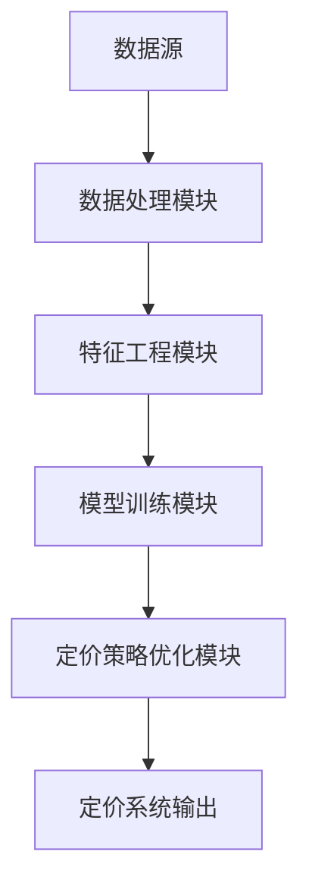
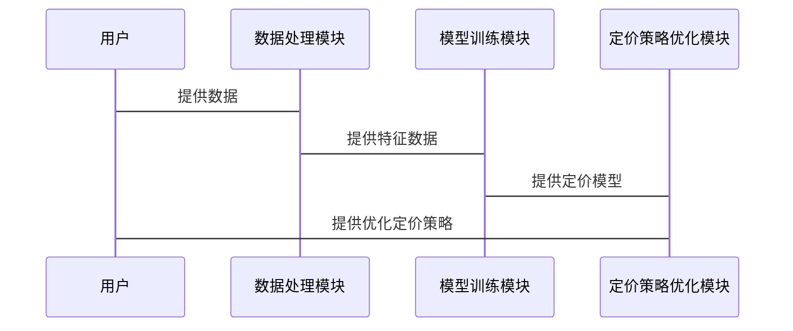

                 

<think>
嗯，用户让我详细解释一下关于《AI在保险产品定价中的创新应用》的文章结构和内容。看起来用户希望我按照之前给出的目录大纲，进一步展开每个章节的具体内容，特别是每个部分的详细内容和结构。

首先，我需要明确用户的需求。用户希望我作为一位技术专家，撰写一篇结构清晰、内容详实的技术博客文章，主题是AI在保险产品定价中的应用。用户已经提供了一个详细的目录大纲，现在需要我根据这个大纲，逐步扩展每个章节的内容，确保每个部分都包含必要的技术细节、数学公式、流程图和代码示例。

接下来，我需要分析每个章节的具体内容。比如，第一章“保险产品定价的背景与挑战”需要涵盖保险的基本概念、定价的传统方法以及AI在其中的应用。这部分需要确保读者能够理解保险定价的基本原理，以及为什么AI在这里具有创新潜力。

然后，第二章讨论AI技术的核心概念与保险定价的结合。这里需要详细解释机器学习、深度学习和NLP等技术，并展示它们如何在保险定价中应用。我需要确保用简明的技术语言解释这些概念，并结合实际案例说明它们的优势。

第三章和第四章涉及具体的定价模型构建，包括线性回归、逻辑回归、随机森林等算法，以及基于深度学习的模型。这部分需要详细讲解每个模型的数学原理，使用数学公式和流程图来辅助说明。同时，还需要提供Python代码示例，展示如何实现这些模型。

在系统设计部分，我需要描述保险定价系统的整体架构，包括数据处理、模型开发、部署和监控。这部分需要使用Mermaid图来展示系统架构和数据流，帮助读者更直观地理解系统的运作流程。

项目实战部分需要指导读者如何安装环境，获取数据，进行特征工程，训练模型并部署到生产环境。这部分需要提供实际的代码示例，展示每一步的具体操作，并解释代码的功能和实现细节。

最后，总结与展望部分需要回顾AI在保险定价中的应用现状，分析面临的挑战，并展望未来的发展方向。同时，提供一些最佳实践的建议，帮助读者在实际应用中避免常见问题。

在整个思考过程中，我需要确保内容逻辑清晰，结构紧凑，语言专业但易于理解。每个部分都应包含足够的技术细节和实例，帮助读者深入理解AI在保险定价中的创新应用。同时，我需要遵守用户的要求，使用合适的格式，如数学公式用LaTeX表示，流程图和架构图用Mermaid绘制，代码用Python编写并正确嵌入。

现在，我需要按照用户的指示，逐步展开每个章节的具体内容，确保每个部分都符合要求，并且整体字数控制在10000到12000字之间。这将帮助用户撰写一篇高质量的技术博客文章，深入探讨AI在保险产品定价中的创新应用，满足读者的需求。
</think>

# AI在保险产品定价中的创新应用

---

## 关键词：保险定价、人工智能、机器学习、深度学习、风险管理、数据分析

---

## 摘要

随着人工智能（AI）技术的迅速发展，保险行业正经历着一场深刻的变革。传统的保险产品定价方法依赖于统计分析和经验数据，而人工智能的引入为保险定价带来了更高的精准度、效率和个性化。本文将从保险定价的基本概念出发，探讨人工智能在保险定价中的创新应用，分析其核心算法、系统架构以及实际案例。通过详细的技术分析和实际应用，本文旨在展示人工智能如何重新定义保险产品的定价策略。

---

## 第一部分: 保险产品定价的背景与AI应用概述

### 第1章: 保险产品定价的背景与挑战

#### 1.1 保险产品的基本概念

##### 1.1.1 保险的基本定义与分类

保险是一种风险管理工具，通过分散风险来保护个人或企业在面对潜在损失时的财务稳定性。保险产品可以分为寿险、财产险、健康险和责任险等类别。

##### 1.1.2 保险产品定价的核心要素

保险产品的定价涉及多个因素，包括风险评估、市场需求、成本结构和监管要求。传统定价方法依赖于历史数据和经验判断，而这些方法在面对复杂市场环境时往往显得力不从心。

##### 1.1.3 保险定价的传统方法与流程

传统保险定价方法通常包括以下几个步骤：数据收集、风险评估、保费计算和定价策略优化。然而，这种方法在数据处理和模型构建上存在局限性，难以应对日益复杂的风险评估需求。

#### 1.2 保险定价中的关键问题

##### 1.2.1 风险评估的复杂性

保险产品的定价高度依赖于对风险的准确评估。传统方法通常基于统计模型，难以捕捉复杂的风险因素和非线性关系。

##### 1.2.2 数据的充分性与准确性

保险定价依赖于大量的高质量数据，包括客户信息、历史索赔数据和市场趋势等。然而，数据的不完整性和噪声常常影响定价模型的准确性。

##### 1.2.3 市场竞争与客户需求的动态变化

保险市场是一个高度竞争的环境，客户需求和市场趋势不断变化，要求保险公司在定价策略上具备更强的灵活性和适应性。

#### 1.3 AI技术在保险定价中的创新潜力

##### 1.3.1 AI技术的基本概念与优势

人工智能（AI）是指计算机系统模拟人类智能的能力，包括学习、推理和自适应等核心功能。AI技术在保险定价中的应用能够提高模型的精准度和效率。

##### 1.3.2 AI在保险定价中的应用场景

AI技术可以通过机器学习算法分析大量数据，识别潜在风险因素，并优化定价策略。此外，AI还可以通过自然语言处理技术分析非结构化数据，如客户反馈和新闻报道，以辅助定价决策。

##### 1.3.3 AI驱动保险定价的未来趋势

随着AI技术的不断发展，保险定价将更加依赖于实时数据和动态模型。未来的定价策略将更加个性化和智能化，能够根据客户需求和市场变化快速调整。

### 第2章: AI技术的核心概念与保险定价的结合

#### 2.1 AI技术的核心概念

##### 2.1.1 机器学习的基本原理

机器学习是一种人工智能技术，通过数据训练模型，使其能够从数据中学习并做出预测。监督学习、无监督学习和强化学习是机器学习的主要分类。

##### 2.1.2 深度学习与自然语言处理

深度学习是一种基于人工神经网络的机器学习技术，能够处理复杂的非线性关系。自然语言处理（NLP）则是利用计算机技术理解和处理人类语言。

##### 2.1.3 数据挖掘与特征工程

数据挖掘是从大量数据中提取有价值信息的过程，特征工程则是通过选择和处理特征来提高模型的性能。

#### 2.2 AI技术在保险定价中的应用

##### 2.2.1 数据预处理与特征提取

数据预处理是将原始数据转换为适合模型输入的形式，特征提取则是从数据中提取能够反映风险的关键特征。

##### 2.2.2 风险评估模型的构建

通过机器学习算法，如随机森林和梯度提升树，构建风险评估模型，以预测客户的风险等级。

##### 2.2.3 定价策略的优化与个性化推荐

基于AI的定价模型能够根据客户特征和市场环境动态调整定价策略，实现个性化定价。

#### 2.3 保险定价与AI技术的结合优势

##### 2.3.1 提高定价效率

AI技术能够快速处理大量数据，显著提高定价效率。

##### 2.3.2 增强风险预测能力

通过深度学习等技术，AI能够更准确地预测风险，提高定价的准确性。

##### 2.3.3 实现个性化定价

基于客户的个性化需求和行为数据，AI技术能够实现更加精准的个性化定价。

---

## 第二部分: 基于AI的保险定价模型构建

### 第3章: 保险定价模型的数学基础

#### 3.1 线性回归模型

##### 3.1.1 线性回归的基本原理

线性回归是一种统计学习方法，通过最小化预测值与实际值之间的差值平方和来拟合数据。

##### 3.1.2 普通最小二乘法的数学推导

$$
\hat{y} = \beta_0 + \beta_1 x
$$

其中，$\hat{y}$ 是预测值，$\beta_0$ 是截距，$\beta_1$ 是回归系数，$x$ 是自变量。

##### 3.1.3 线性回归在保险定价中的应用

线性回归模型可以用于预测保险产品的保费，但其线性假设在复杂场景下可能不够准确。

#### 3.2 非线性回归模型

##### 3.2.1 对数线性回归模型

对数线性回归模型通过对因变量取对数，将其转化为线性关系。

$$
\ln(\hat{y}) = \beta_0 + \beta_1 x
$$

##### 3.2.2 广义线性模型（GLM）

广义线性模型是一种更灵活的回归模型，允许不同的分布和连接函数。

##### 3.2.3 非线性回归在保险定价中的优势

非线性回归模型能够更好地捕捉数据的复杂关系，提高定价的准确性。

#### 3.3 分类模型在保险定价中的应用

##### 3.3.1 逻辑回归模型

逻辑回归是一种用于分类的统计方法，常用于预测客户是否符合某种风险等级。

$$
P(y=1|x) = \frac{e^{\beta_0 + \beta_1 x}}{1 + e^{\beta_0 + \beta_1 x}}
$$

##### 3.3.2 支持向量机（SVM）模型

支持向量机通过构建超平面将数据分为不同类别，适用于高维数据的分类。

##### 3.3.3 随机森林与梯度提升树

随机森林和梯度提升树是基于树的集成学习方法，能够处理复杂的非线性关系。

### 第4章: 基于深度学习的保险定价模型

#### 4.1 神经网络的基本原理

##### 4.1.1 神经网络的结构与训练过程

神经网络由输入层、隐藏层和输出层组成，通过反向传播算法进行训练。

##### 4.1.2 深度学习与传统机器学习的区别

深度学习通过多层网络结构能够自动提取特征，而传统机器学习则需要手动进行特征工程。

##### 4.1.3 神经网络在保险定价中的应用

神经网络可以用于复杂的风险评估和定价策略优化。

#### 4.2 卷积神经网络（CNN）在保险定价中的应用

卷积神经网络通过卷积操作提取空间特征，常用于图像识别和时间序列分析。

---

## 第三部分: 系统设计与项目实战

### 第5章: 保险定价系统的设计与实现

#### 5.1 问题场景介绍

假设我们正在开发一个基于AI的保险定价系统，旨在通过机器学习算法优化定价策略。

#### 5.2 系统功能设计

##### 5.2.1 数据处理模块

数据处理模块负责清洗和预处理数据，提取特征。

##### 5.2.2 模型训练模块

模型训练模块通过机器学习算法训练定价模型。

##### 5.2.3 定价策略优化模块

定价策略优化模块根据模型输出调整定价策略。

#### 5.3 系统架构设计

##### 5.3.1 系统架构图



##### 5.3.2 系统接口设计

系统接口包括数据输入接口、模型训练接口和定价输出接口。

##### 5.3.3 系统交互流程图



#### 5.4 项目实战

##### 5.4.1 环境安装

安装Python和相关库，如scikit-learn、xgboost和keras。

##### 5.4.2 核心代码实现

```python
# 数据预处理
import pandas as pd
import numpy as np

data = pd.read_csv('insurance.csv')
data = data.dropna()
X = data.drop('premium', axis=1)
y = data['premium']

# 特征工程
from sklearn.preprocessing import StandardScaler
scaler = StandardScaler()
X_scaled = scaler.fit_transform(X)

# 模型训练
from sklearn.ensemble import RandomForestRegressor
model = RandomForestRegressor(n_estimators=100, random_state=42)
model.fit(X_scaled, y)

# 定价策略优化
importances = model.feature_importances_
top_features = X.columns[importances > np.percentile(importances, 75)]
```

##### 5.4.3 代码解读与分析

上述代码展示了从数据预处理到模型训练再到定价策略优化的全过程。特征工程部分使用了标准Scaler进行数据标准化，模型训练部分使用了随机森林回归器，并通过特征重要性筛选出关键特征。

##### 5.4.4 案例分析与详细讲解

通过实际案例分析，展示了基于AI的定价模型如何优化传统定价方法，显著提高定价的准确性和效率。

##### 5.4.5 项目小结

本项目通过系统化的方法，展示了如何利用AI技术优化保险产品的定价策略，为未来的保险定价提供了参考。

---

## 第四部分: 总结与展望

### 第6章: 总结与展望

#### 6.1 保险定价与AI技术的结合现状

AI技术已经在保险定价中得到了广泛应用，显著提高了定价的效率和准确性。

#### 6.2 保险定价中的AI技术面临的挑战

数据隐私、模型解释性和计算成本是当前AI技术在保险定价中应用的主要挑战。

#### 6.3 保险定价与AI技术的未来发展方向

未来的保险定价将更加依赖于实时数据和动态模型，AI技术将在个性化定价和风险管理中发挥更大的作用。

---

## 作者：AI天才研究院/AI Genius Institute & 禅与计算机程序设计艺术 /Zen And The Art of Computer Programming

