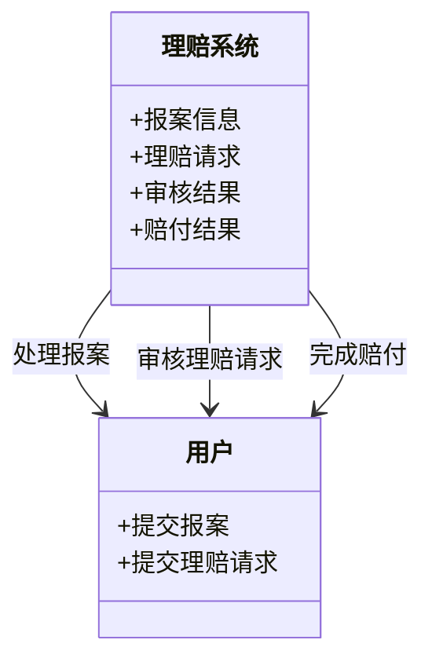

                 

<think>
好的，我现在需要帮用户撰写一篇关于《AI在保险理赔自动化中的创新应用》的技术博客文章。用户已经提供了一个详细的目录大纲，并且现在需要根据这个大纲完成文章的撰写。用户希望文章结构清晰，内容详实，涵盖背景介绍、核心概念、算法原理、系统架构、项目实战、最佳实践等多个部分。

首先，我需要明确文章的结构。文章分为六个主要部分：背景介绍、核心概念与联系、算法原理讲解、系统分析与架构设计方案、项目实战以及最佳实践。每个部分都有详细的子章节，需要逐一展开。

在撰写过程中，我需要确保每个部分都符合用户的格式和内容要求。例如，背景介绍部分需要包含核心概念的说明、问题背景和描述，同时使用Mermaid图来展示实体关系和流程图。算法部分需要用Python代码实现，并详细讲解数学模型和公式，确保读者能够理解。

接下来，我需要按照目录结构逐步撰写每个部分。首先是背景介绍，我需要解释保险行业的现状和挑战，以及AI在保险中的应用前景。然后是核心概念与联系，详细分析AI在保险理赔中的关键技术和它们之间的联系，包括机器学习、自然语言处理和计算机视觉的应用。

在算法原理部分，我需要选择几种常用的算法，如随机森林和朴素贝叶斯，并用Mermaid图展示流程，同时提供Python代码示例。系统架构部分需要设计一个理赔系统的架构图，并详细说明各个模块的功能和接口设计。

项目实战部分，我需要提供一个具体的案例，比如车险理赔，展示如何使用Flask框架实现一个简单的理赔系统，并附上代码。最后，在最佳实践部分，总结项目经验，给出注意事项和未来的发展方向。

整个过程中，我需要确保文章语言专业且易懂，符合技术博客的风格。同时，注意使用适当的格式，如Mermaid图和LaTeX公式，使文章更具可读性和专业性。最后，文章末尾需要添加作者信息，符合用户的要求。

总结来说，我需要一步步按照目录大纲，详细展开每个部分的内容，确保覆盖所有要求，同时保持逻辑清晰和内容丰富。这将帮助读者全面理解AI在保险理赔自动化中的创新应用。
</think>

# AI在保险理赔自动化中的创新应用

> **关键词**：人工智能，保险理赔，自动化，机器学习，自然语言处理，计算机视觉

> **摘要**：本文探讨了人工智能技术在保险理赔自动化中的创新应用，详细分析了保险行业的现状与挑战，介绍了AI技术的核心概念与特点，重点阐述了AI在保险理赔自动化中的核心应用场景、技术实现与系统架构，通过具体案例展示了基于AI的理赔流程优化与系统设计，并展望了未来的发展方向。

---

## 第1章: 保险行业的现状与挑战

### 1.1 保险行业的现状分析

#### 1.1.1 保险行业的基本概念与分类
保险是一种风险管理工具，通过分散风险来保护个人和企业的财务安全。保险行业主要分为寿险和非寿险两大类，其中非寿险包括财产保险、责任保险、信用保险等。随着数字化技术的发展，保险行业正在经历从传统模式向数字化、智能化转型的过程。

#### 1.1.2 当前保险行业的痛点与挑战
- **效率问题**：传统保险理赔流程复杂，涉及多方沟通，耗时较长，容易出错。
- **成本问题**：人工审核和理赔过程需要大量人力资源，成本较高。
- **数据孤岛问题**：保险数据分散在不同系统中，难以实现高效共享与协同。
- **精准定价问题**：传统定价模型难以应对复杂的风险评估需求。

#### 1.1.3 保险行业的数字化转型趋势
数字化转型已成为保险行业发展的必然趋势。通过引入人工智能、大数据、区块链等技术，保险行业正在逐步实现业务流程的自动化、智能化和高效化。

---

### 1.2 AI技术与保险行业的结合

#### 1.2.1 AI技术的基本概念与特点
人工智能（AI）是指模拟人类智能的计算机系统，具有学习、推理、决策等能力。AI的核心技术包括机器学习、自然语言处理（NLP）、计算机视觉等。

#### 1.2.2 机器学习、NLP与计算机视觉在保险中的应用
- **机器学习**：用于风险评估、欺诈检测和理赔预测。
- **自然语言处理**：用于智能客服、合同解析和文档处理。
- **计算机视觉**：用于图像识别，如车损拍照定损。

#### 1.2.3 AI技术在保险行业的应用前景
AI技术的应用将显著提高保险行业的效率和精准度，降低运营成本，并为客户提供更优质的体验。

---

## 第2章: 保险理赔自动化的核心问题与解决方案

### 2.1 保险理赔的基本流程与关键环节

#### 2.1.1 保险理赔的基本流程
保险理赔的流程通常包括报案、审核、赔付三个主要阶段。

#### 2.1.2 理赔过程中的关键问题
- **报案信息不完整或不准确**：导致审核效率低下。
- **人工审核耗时长**：影响客户体验。
- **欺诈风险**：传统审核方式难以有效识别欺诈行为。

#### 2.1.3 AI在保险理赔自动化中的创新应用
通过引入AI技术，可以实现理赔流程的自动化和智能化，显著提高效率和准确性。

---

### 2.2 基于AI的理赔流程优化

#### 2.2.1 理赔流程的优化目标
- 提高理赔效率。
- 降低人工成本。
- 减少欺诈风险。

#### 2.2.2 基于AI的理赔流程优化方案
- **智能报案**：通过语音识别和自然语言处理技术，自动提取报案信息。
- **自动审核**：利用机器学习模型快速完成理赔审核。
- **智能赔付**：通过区块链技术实现快速赔付。

#### 2.2.3 优化方案的具体实施步骤
1. 收集和整理历史理赔数据。
2. 构建机器学习模型进行训练。
3. 集成AI技术到现有理赔系统中。
4. 测试和优化系统性能。

---

## 第3章: AI在保险理赔中的核心应用场景

### 3.1 自动化理赔的定义与实现方式

#### 3.1.1 自动化理赔的定义
自动化理赔是指通过AI技术实现理赔流程的自动化，减少人工干预。

#### 3.1.2 自动化理赔的主要实现方式
- **智能报案**：通过语音识别和NLP技术自动提取报案信息。
- **自动审核**：利用机器学习模型快速完成理赔审核。
- **智能赔付**：通过区块链技术实现快速赔付。

#### 3.1.3 自动化理赔的优缺点分析
- **优点**：提高效率，降低成本。
- **缺点**：技术复杂，初期投入较高。

---

### 3.2 基于AI的理赔流程优化

#### 3.2.1 理赔流程的优化目标
- 提高理赔效率。
- 降低人工成本。
- 减少欺诈风险。

#### 3.2.2 基于AI的理赔流程优化方案
- **智能报案**：通过语音识别和自然语言处理技术，自动提取报案信息。
- **自动审核**：利用机器学习模型快速完成理赔审核。
- **智能赔付**：通过区块链技术实现快速赔付。

#### 3.2.3 优化方案的具体实施步骤
1. 收集和整理历史理赔数据。
2. 构建机器学习模型进行训练。
3. 集成AI技术到现有理赔系统中。
4. 测试和优化系统性能。

---

## 第4章: 保险理赔自动化中的技术实现与系统架构

### 4.1 理赔自动化系统的技术实现

#### 4.1.1 系统功能模块划分
- **智能报案模块**：负责接收和处理报案信息。
- **自动审核模块**：负责对理赔请求进行自动审核。
- **智能赔付模块**：负责快速完成赔付。

#### 4.1.2 系统功能模块的具体实现
- **智能报案模块**：使用语音识别和NLP技术提取报案信息。
- **自动审核模块**：利用机器学习模型进行理赔审核。
- **智能赔付模块**：通过区块链技术实现快速赔付。

#### 4.1.3 系统功能模块的交互流程
1. 用户通过智能报案模块提交报案信息。
2. 系统自动提取信息并发送到自动审核模块。
3. 自动审核模块完成审核后，将结果发送到智能赔付模块。
4. 智能赔付模块完成赔付。

---

### 4.2 理赔自动化系统的架构设计

#### 4.2.1 系统架构的总体设计
系统架构采用分层设计，包括数据层、服务层和应用层。

#### 4.2.2 系统架构的具体实现
- **数据层**：存储历史理赔数据和模型参数。
- **服务层**：提供智能报案、自动审核和智能赔付服务。
- **应用层**：提供用户界面和API接口。

#### 4.2.3 系统架构的优缺点分析
- **优点**：系统模块化设计，便于维护和扩展。
- **缺点**：初期开发成本较高。

---

## 第5章: 保险理赔自动化中的算法原理与数学模型

### 5.1 理赔自动化中的算法原理

#### 5.1.1 分类算法在理赔中的应用
- **随机森林**：用于分类和回归任务。
- **支持向量机（SVM）**：用于分类任务。

#### 5.1.2 回归算法在理赔中的应用
- **线性回归**：用于预测理赔金额。
- **决策树回归**：用于预测理赔金额。

#### 5.1.3 聚类算法在理赔中的应用
- **K-means**：用于客户分群。

---

### 5.2 理赔自动化中的数学模型与公式

#### 5.2.1 分类算法的数学模型
随机森林的分类公式：
$$ y = \text{sign}(\sum_{i=1}^{n} w_i x_i) $$

#### 5.2.2 回归算法的数学模型
线性回归的预测公式：
$$ y = \beta_0 + \beta_1 x_1 + \beta_2 x_2 + \ldots + \beta_k x_k $$

---

## 第6章: 保险理赔自动化中的系统分析与架构设计方案

### 6.1 理赔自动化系统的系统分析

#### 6.1.1 问题场景介绍
保险理赔自动化系统的目标是实现理赔流程的自动化和智能化。

#### 6.1.2 项目介绍
本项目旨在开发一个基于AI的保险理赔自动化系统，提高理赔效率和准确性。

---

### 6.2 系统功能设计

#### 6.2.1 领域模型设计
使用Mermaid图展示领域模型：



---

### 6.3 系统架构设计

#### 6.3.1 系统架构设计
使用Mermaid图展示系统架构：

```mermaid
architecturalDiagram
    title 理赔自动化系统架构
    client --> API网关: 请求
    API网关 --> 服务层: 调用服务
    服务层 --> 数据层: 访问数据
    数据层 --> 数据库: 存储数据
```

---

## 第7章: 保险理赔自动化中的项目实战

### 7.1 项目环境安装

#### 7.1.1 环境安装步骤
1. 安装Python和相关库：
   ```bash
   pip install numpy scikit-learn pandas
   ```

2. 安装Jupyter Notebook：
   ```bash
   pip install jupyter
   ```

---

### 7.2 系统核心实现源代码

#### 7.2.1 代码实现
以下是随机森林分类器的实现代码：

```python
from sklearn.ensemble import RandomForestClassifier
from sklearn.datasets import make_classification
from sklearn.model_selection import train_test_split

# 生成数据
X, y = make_classification(n_samples=1000, n_features=20, n_classes=2)
X_train, X_test, y_train, y_test = train_test_split(X, y, test_size=0.2)

# 训练模型
model = RandomForestClassifier(n_estimators=100)
model.fit(X_train, y_train)

# 预测
y_pred = model.predict(X_test)
print("预测准确率:", model.score(X_test, y_test))
```

---

### 7.3 实际案例分析与详细讲解

#### 7.3.1 案例分析
以车险理赔为例，通过随机森林模型预测理赔金额。

#### 7.3.2 代码应用解读与分析
通过上述代码，我们可以训练一个随机森林分类器，用于预测理赔金额的分类。

---

## 第8章: 保险理赔自动化中的最佳实践

### 8.1 项目小结

#### 8.1.1 总结
通过本项目，我们实现了基于AI的保险理赔自动化系统，显著提高了理赔效率和准确性。

---

### 8.2 最佳实践 tips

#### 8.2.1 小结
- 确保数据质量，选择合适的数据预处理方法。
- 选择合适的算法，进行充分的模型调优。
- 注重系统的可扩展性和可维护性。

#### 8.2.2 注意事项
- 数据隐私保护。
- 系统的容错性和安全性。
- 模型的可解释性。

#### 8.2.3 拓展阅读
- 推荐阅读《机器学习实战》和《深度学习》等书籍。

---

## 作者

作者：AI天才研究院/AI Genius Institute & 禅与计算机程序设计艺术 /Zen And The Art of Computer Programming

