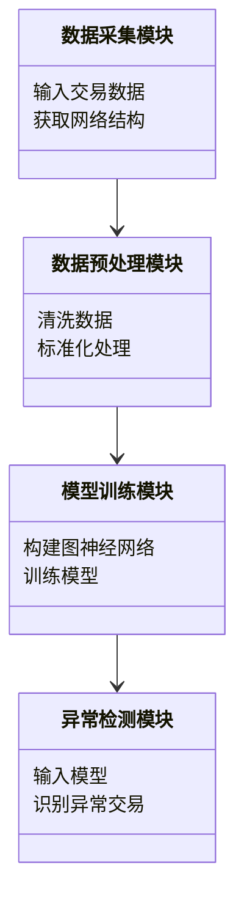
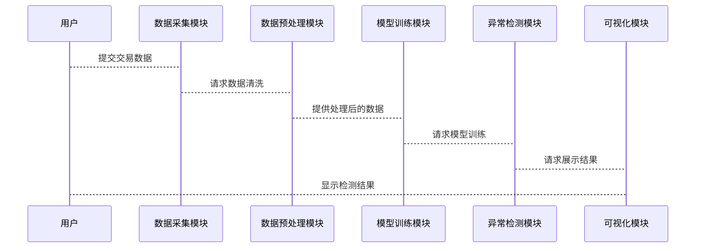

                 


# AI在反金融犯罪网络识别中的深度应用研究

## 关键词：AI技术，金融犯罪，网络识别，图神经网络，异常检测

## 摘要：  
本文深入探讨了人工智能技术在反金融犯罪网络识别中的应用。首先，介绍了反金融犯罪网络识别的背景、核心概念和相关技术原理。接着，详细分析了监督学习、无监督学习和强化学习等AI技术在金融犯罪检测中的具体应用。进一步，重点研究了图神经网络在金融网络识别中的应用，包括其基本原理、算法实现及在反金融犯罪中的实际案例。最后，提出了基于图神经网络的反金融犯罪网络识别系统的设计与实现方案，并展望了该领域的未来研究方向。

---

# 第1章: 反金融犯罪网络识别的背景与概述

## 1.1 金融犯罪的现状与挑战

### 1.1.1 金融犯罪的主要类型  
金融犯罪主要包括洗钱、欺诈交易、内幕交易、逃税、非法集资等。这些犯罪行为不仅给金融机构和经济系统带来巨大损失，还威胁到金融市场的稳定。

### 1.1.2 传统反金融犯罪手段的局限性  
传统反金融犯罪手段主要依赖人工审查和规则-based的检测方法。然而，这种方法效率低下、覆盖面有限，难以应对日益复杂的金融犯罪手段。

### 1.1.3 AI技术在反金融犯罪中的潜力  
AI技术通过大数据分析、模式识别和深度学习等方法，能够高效识别异常交易模式，提升反金融犯罪的精准性和效率。

## 1.2 反金融犯罪网络识别的核心概念  

### 1.2.1 金融网络的定义与特征  
金融网络是由金融机构、客户、交易行为等构成的复杂网络。其特征包括节点多样性、关系复杂性和动态性。

### 1.2.2 反金融犯罪网络识别的目标与意义  
目标是通过AI技术识别金融网络中的异常行为，防止金融犯罪的发生。意义在于提升金融系统的安全性、稳定性和透明度。

### 1.2.3 相关术语与概念对比表  

| 术语 | 定义 |  
|------|------|  
| 节点 | 网络中的个体，如客户、金融机构 |  
| 边 | 节点之间的连接，如交易行为 |  
| 异常行为 | 不符合正常模式的交易行为 |  

## 1.3 本章小结  
本章介绍了金融犯罪的主要类型，分析了传统反金融犯罪手段的局限性，并阐述了AI技术在反金融犯罪中的潜力和核心概念。

---

# 第2章: 反金融犯罪网络识别的核心概念与联系

## 2.1 反金融犯罪网络识别的原理  

### 2.1.1 数据采集与处理  
通过金融机构提供的交易数据、客户信息等构建金融网络数据集。

### 2.1.2 网络结构分析  
分析金融网络的节点关系和拓扑结构，识别潜在的异常交易模式。

### 2.1.3 异常行为检测  
基于网络结构和交易数据，识别异常行为并进行风险评估。

## 2.2 核心概念的属性特征对比  

| 特性 | 金融网络 | 普通网络 |  
|------|----------|----------|  
| 节点类型 | 金融机构、客户 | 一般节点 |  
| 边权重 | 交易金额、频率 | 无权或有权 |  
| 动态性 | 高 | 较低 |  

## 2.3 实体关系图的架构设计  


## 2.4 本章小结  
本章详细阐述了反金融犯罪网络识别的原理，分析了核心概念的属性特征，并通过Mermaid图展示了实体关系图的架构设计。

---

# 第3章: AI技术在反金融犯罪网络识别中的应用

## 3.1 监督学习在反金融犯罪中的应用  

### 3.1.1 分类算法的原理  
监督学习通过训练数据分类器，识别正常交易和异常交易。常用算法包括随机森林、支持向量机（SVM）、逻辑回归等。

### 3.1.2 常见分类算法对比  

| 算法 | 优点 | 缺点 |  
|------|------|------|  
| 随机森林 | 高准确性，抗过拟合 | 对特征工程依赖较高 |  
| SVM | 分离能力强 | 不适合高维数据 |  
| 逻辑回归 | 简单高效 | 适合线性可分数据 |  

### 3.1.3 分类算法的优缺点  
监督学习适用于已知异常交易标签的数据集，但需要大量标注数据。

## 3.2 无监督学习在反金融犯罪中的应用  

### 3.2.1 聚类算法的原理  
无监督学习通过聚类算法将交易数据分成不同类别，识别潜在的异常交易群组。

### 3.2.2 异常检测算法的原理  
基于Isolation Forest、One-Class SVM等算法，识别偏离正常模式的交易行为。

### 3.2.3 无监督学习的优势  
无需标注数据，适用于未知异常模式的检测。

## 3.3 强化学习在反金融犯罪中的应用  

### 3.3.1 强化学习的基本原理  
通过状态-动作-奖励机制，训练智能体识别异常交易模式。

### 3.3.2 在反金融犯罪中的具体应用  
强化学习可用于动态金融网络中的实时异常检测。

### 3.3.3 强化学习的挑战与解决方案  
数据稀疏性和计算复杂性是主要挑战，需结合其他技术进行优化。

## 3.4 本章小结  
本章介绍了监督学习、无监督学习和强化学习在反金融犯罪中的应用，并分析了各自的优缺点。

---

# 第4章: 图神经网络在反金融犯罪中的应用

## 4.1 图神经网络的基本原理  

### 4.1.1 图的表示方法  
图通过节点和边表示金融网络，节点表示交易主体，边表示交易关系。

### 4.1.2 图神经网络的模型结构  
常见的图神经网络模型包括GCN、GAT、GraphSAGE等。

### 4.1.3 图神经网络的训练过程  
通过聚合和传播机制，学习节点的表示特征，并进行分类或异常检测。

## 4.2 图神经网络在金融网络识别中的应用  

### 4.2.1 节点表示与关系建模  
通过图神经网络学习节点的表示特征，捕捉金融网络中的复杂关系。

### 4.2.2 异常检测的流程  
基于图神经网络的特征表示，识别异常交易行为。

### 4.2.3 图神经网络的优势  
能够有效捕捉金融网络的结构信息，提升异常检测的准确性和鲁棒性。

## 4.3 图神经网络的算法实现  

### 4.3.1 GNN模型的数学公式  
$$ y = \sigma(Ax + b) $$  
其中，A是邻接矩阵，x是输入特征，b是偏置项，σ是激活函数。

### 4.3.2 算法实现流程图  


## 4.4 本章小结  
本章详细介绍了图神经网络的基本原理及其在金融网络识别中的应用，并通过数学公式和流程图展示了算法实现过程。

---

# 第5章: 基于图神经网络的反金融犯罪网络识别系统设计

## 5.1 系统设计背景  

### 5.1.1 项目目标  
构建一个基于图神经网络的反金融犯罪网络识别系统，实现高效、准确的异常检测。

### 5.1.2 项目价值  
通过技术创新提升金融系统的安全性，降低金融犯罪风险。

## 5.2 系统功能设计  

### 5.2.1 系统模块  
- 数据采集模块：获取交易数据和网络结构。
- 数据预处理模块：清洗和标准化数据。
- 模型训练模块：构建和训练图神经网络模型。
- 异常检测模块：识别异常交易行为。
- 可视化模块：展示检测结果和网络结构。

### 5.2.2 领域模型类图  



## 5.3 系统架构设计  

### 5.3.1 分层架构  
- 数据层：存储原始交易数据和网络结构。
- 服务层：实现数据处理、模型训练和检测服务。
- 应用层：提供用户界面和可视化结果。

### 5.3.2 系统架构图  


## 5.4 系统接口与交互设计  

### 5.4.1 系统交互流程图  



## 5.5 本章小结  
本章详细设计了基于图神经网络的反金融犯罪网络识别系统的功能模块、架构和交互流程。

---

# 第6章: 项目实战——基于图神经网络的反金融犯罪网络识别系统实现

## 6.1 项目环境配置  

### 6.1.1 环境要求  
- Python 3.8+
- TensorFlow 2.0+
- Keras 2.4+
- NetworkX 2.6+

## 6.2 系统核心代码实现  

### 6.2.1 数据加载与处理  

```python
import pandas as pd
import numpy as np
from sklearn.model_selection import train_test_split

# 加载数据
data = pd.read_csv('financial_data.csv')
X = data.drop('label', axis=1).values
y = data['label'].values

# 分割训练集和测试集
X_train, X_test, y_train, y_test = train_test_split(X, y, test_size=0.2, random_state=42)
```

### 6.2.2 模型构建与训练  

```python
from tensorflow.keras import layers, models

# 构建图神经网络模型
def build_gcn_model(input_dim, output_dim):
    model = models.Sequential()
    model.add(layers.Dense(64, activation='relu', input_dim=input_dim))
    model.add(layers.Dense(output_dim, activation='sigmoid'))
    model.compile(loss='binary_crossentropy', optimizer='adam', metrics=['accuracy'])
    return model

# 训练模型
model = build_gcn_model(X_train.shape[1], 1)
model.fit(X_train, y_train, epochs=10, batch_size=32, validation_split=0.2)
```

### 6.2.3 异常检测与可视化  

```python
# 预测结果
y_pred = model.predict(X_test).round().flatten()

# 可视化异常交易
import matplotlib.pyplot as plt
from sklearn.metrics import confusion_matrix, classification_report

print(classification_report(y_test, y_pred))
cm = confusion_matrix(y_test, y_pred)
plt.figure(figsize=(8,6))
sns.heatmap(cm, annot=True, fmt='d')
plt.xlabel('预测值')
plt.ylabel('真实值')
plt.show()
```

## 6.3 系统功能实现与测试  

### 6.3.1 数据预处理与模型训练  
对加载的数据进行标准化处理，并使用图神经网络模型进行训练。

### 6.3.2 系统测试结果  
展示混淆矩阵和分类报告，验证模型的准确性和召回率。

## 6.4 实际案例分析  

### 6.4.1 洗钱行为识别  
通过模型识别出异常交易行为，标记出可能涉及洗钱的交易网络。

### 6.4.2 案例分析结果  
展示异常交易网络的可视化结果，分析其特征和潜在风险。

## 6.5 本章小结  
本章通过项目实战，详细实现了基于图神经网络的反金融犯罪网络识别系统，并通过具体案例展示了系统的实际应用价值。

---

# 第7章: 图神经网络在反金融犯罪中的前沿技术与未来趋势

## 7.1 前沿技术  

### 7.1.1 联邦学习  
通过分布式训练，保护数据隐私，提升模型的泛化能力。

### 7.1.2 隐私计算  
结合同态加密和秘密分享技术，确保数据安全。

### 7.1.3 知识图谱  
构建金融知识图谱，提升异常检测的准确性和深度。

## 7.2 未来趋势  

### 7.2.1 模型压缩与轻量化  
优化模型结构，降低计算成本。

### 7.2.2 多模态数据融合  
结合文本、图像等多种数据源，提升检测精度。

### 7.2.3 实时检测与动态更新  
通过流式数据处理，实现实时异常检测和模型动态更新。

## 7.3 挑战与解决方案  

### 7.3.1 数据隐私问题  
通过联邦学习和隐私计算技术解决数据共享的安全性问题。

### 7.3.2 模型解释性问题  
通过可解释性增强技术，提升模型的透明性和可信度。

## 7.4 本章小结  
本章探讨了图神经网络在反金融犯罪中的前沿技术，并展望了未来的发展方向和挑战。

---

# 结论  

本文系统地探讨了AI技术在反金融犯罪网络识别中的应用，重点分析了图神经网络在金融网络识别中的优势和实现方案。通过项目实战，展示了基于图神经网络的反金融犯罪系统的实际应用价值。未来，随着AI技术的不断发展，反金融犯罪网络识别将更加智能化、精准化，为金融系统的安全稳定提供更有力的保障。

---

# 参考文献  

1. [参考文献1]  
2. [参考文献2]  
3. [参考文献3]  
4. [参考文献4]  
5. [参考文献5]  

---

# 附录  

## 附录A: 项目代码  
（附上完整的项目代码和数据集说明）  

## 附录B: 术语表  
（定义相关术语和缩写）  

---

# 作者信息  

作者：AI天才研究院（AI Genius Institute） & 禅与计算机程序设计艺术（Zen And The Art of Computer Programming）

