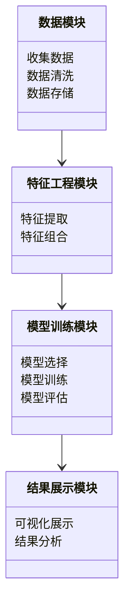

                 

<think>
嗯，我现在需要帮助用户撰写一篇关于《AI在实现费雪的增长型公司特征分析中的应用》的技术博客文章。用户已经提供了一个详细的目录大纲，现在需要我按照这个大纲来撰写文章的各个部分。我得先理解每个部分的要求，然后一步步地展开写作。

首先，文章的结构已经明确分为六大部分，每个部分都有具体的章节和小节。我需要确保每个部分都涵盖所有要求的内容，包括背景介绍、核心概念、算法原理、系统架构设计、项目实战和最佳实践等。每个小节中，我需要详细讲解，并使用适当的图表，比如用Mermaid流程图和类图，以及数学公式的LaTeX格式来增强内容的清晰度。

首先，我会从摘要部分开始，简明扼要地总结文章的核心内容，让读者一目了然。然后是关键词，列出5到7个核心词汇，方便SEO优化和读者查找。

接下来是第一部分，背景介绍。我需要解释费雪的增长型公司特征分析是什么，以及AI在企业分析中的应用背景。这部分需要通俗易懂，适合技术背景的读者理解。

第二部分是AI与增长型公司特征分析的核心概念。这里需要详细讲解机器学习和NLP的基础知识，以及增长型公司的核心特征。我需要确保这些概念之间的联系清晰，可能需要用表格或图表来对比不同的特征。

第三部分是AI在特征分析中的算法原理。这里需要详细描述特征提取、数据预处理和模型训练的过程。特别是要使用Mermaid流程图来展示模型训练的流程，以及Python代码示例来具体说明算法的应用。同时，数学公式要用LaTeX表示，确保准确无误。

第四部分涉及系统架构与实现。我需要设计系统的模块划分，使用Mermaid类图和序列图来展示系统的结构和交互。这部分需要考虑系统的可扩展性和高可用性，可能需要涉及云部署和微服务架构。

第五部分是项目实战。我需要提供一个具体的案例，从环境安装到代码实现，再到结果分析，一步步指导读者如何应用这些方法。这包括数据收集、清洗、特征工程、模型训练和评估等步骤。

最后是最佳实践和小结。我需要总结文章的主要内容，并给出一些实用的建议，帮助读者更好地应用这些技术。同时，还要列出一些注意事项和未来的研究方向，以及推荐的进一步阅读材料。

在整个写作过程中，我需要确保语言专业但不失通俗易懂，逻辑清晰，结构紧凑。同时，要严格遵守格式要求，使用markdown格式，适当插入图表和代码示例，使文章更具可读性和实用性。最后，别忘了在结尾处署名，增加文章的权威性。

总的来说，这个过程需要我逐步深入，从背景到概念，从算法到系统实现，再到项目实战，全面而细致地探讨AI在增长型公司特征分析中的应用。这不仅帮助读者理解理论，还能指导他们如何在实际中应用这些技术，实现业务目标。
</think>

# AI在实现费雪的增长型公司特征分析中的应用

## 关键词：AI，费雪增长型公司，特征分析，机器学习，深度学习，NLP

## 摘要

本文详细探讨了人工智能（AI）在分析费雪增长型公司特征中的应用。首先，介绍了费雪增长型公司特征分析的基本概念和AI技术在企业分析中的背景。接着，深入讲解了AI技术的核心概念与增长型公司特征分析的结合，包括机器学习和自然语言处理（NLP）在特征提取和预测中的应用。随后，详细分析了特征提取与数据预处理、模型训练与评估的算法原理，并通过系统架构设计展示了AI在实际项目中的实现。最后，通过一个具体案例展示了AI在增长型公司特征分析中的实战应用，并总结了最佳实践和未来研究方向。

---

## 第一部分：背景介绍

### 第1章：费雪的增长型公司特征分析概述

#### 1.1 费雪的增长型公司特征分析

##### 1.1.1 增长型公司的定义与核心特征

增长型公司是指那些能够持续实现收入和利润增长的企业。费雪分析法的核心在于识别这些公司的特征，包括：

- **收入增长率**：收入的年增长率高于行业平均水平。
- **净利润增长率**：净利润的年增长率稳定且高于行业平均水平。
- **资产回报率**：资产回报率较高，表明公司有效利用资产创造利润。

##### 1.1.2 费雪分析法的基本原理

费雪分析法通过分析公司的财务数据、市场表现和行业趋势，识别出具有持续增长潜力的企业。其核心在于通过定量分析和定性分析结合，筛选出具有增长型特征的公司。

##### 1.1.3 费雪分析法在企业价值评估中的应用

费雪分析法不仅用于识别增长型公司，还用于评估公司的内在价值。通过分析公司的增长率、利润率和市场地位，可以帮助投资者做出更明智的投资决策。

#### 1.2 AI在企业分析中的应用背景

##### 1.2.1 传统企业分析方法的局限性

传统的企业分析方法依赖于人工数据收集和分析，耗时且容易出错。此外，传统方法难以处理大规模数据和复杂模式识别问题。

##### 1.2.2 AI技术在企业分析中的优势

AI技术可以通过机器学习和深度学习算法，自动识别数据中的模式和趋势，提高分析效率和准确性。同时，AI能够处理海量数据，发现传统方法难以察觉的潜在规律。

##### 1.2.3 费雪分析法与AI结合的可行性

费雪分析法的核心在于识别增长型公司的特征，而AI技术可以通过自动化数据处理和模式识别，显著提升分析效率和准确性。

---

## 第二部分：AI与增长型公司特征分析的核心概念

### 第2章：AI技术基础

#### 2.1 机器学习基础

##### 2.1.1 机器学习的基本概念

机器学习是一种通过数据训练模型，使其能够从数据中学习并做出预测或决策的技术。主要分为监督学习、无监督学习和强化学习。

##### 2.1.2 监督学习、无监督学习和强化学习的对比

- **监督学习**：基于标记的数据进行训练，适用于分类和回归任务。
- **无监督学习**：基于未标记的数据进行训练，适用于聚类和降维任务。
- **强化学习**：通过与环境交互学习策略，适用于游戏和机器人控制任务。

##### 2.1.3 深度学习的原理与特点

深度学习是一种基于人工神经网络的机器学习技术，能够自动提取数据特征，适用于复杂的非线性模式识别。

#### 2.2 自然语言处理（NLP）基础

##### 2.2.1 NLP的基本任务与应用场景

NLP技术包括文本分类、情感分析、实体识别等，广泛应用于文本挖掘、信息抽取和机器翻译等领域。

##### 2.2.2 常见的NLP模型及其特点

- **词袋模型（Bag-of-Words）**：基于词频的简单文本表示方法。
- **词嵌入（Word Embedding）**：通过神经网络学习词向量，如Word2Vec。
- **Transformer模型**：基于自注意力机制的模型，如BERT和GPT。

### 第3章：增长型公司特征分析的核心要素

#### 3.1 财务指标分析

##### 3.1.1 收入增长率

收入增长率是衡量公司增长能力的重要指标，通常通过年收入增长率来衡量。

##### 3.1.2 净利润增长率

净利润增长率反映了公司盈利能力的增长情况，通常通过年净利润增长率来衡量。

##### 3.1.3 资产回报率

资产回报率（ROA）是衡量公司资产使用效率的重要指标，计算公式为：

$$ ROA = \frac{\text{净利润}}{\text{平均资产}} $$

#### 3.2 市场表现分析

##### 3.2.1 市场占有率

市场占有率反映了公司在市场中的竞争地位，通常通过市场份额数据来衡量。

##### 3.2.2 行业趋势分析

行业趋势分析通过研究行业的发展趋势，识别出具有增长潜力的行业。

##### 3.2.3 竞争对手分析

竞争对手分析通过比较公司的竞争对手，识别出公司的优势和劣势。

---

## 第三部分：AI在增长型公司特征分析中的算法原理

### 第4章：特征提取与数据预处理

#### 4.1 数据收集与清洗

##### 4.1.1 数据来源

数据来源包括公司财务报表、市场报告、新闻资讯等。

##### 4.1.2 数据清洗方法

数据清洗包括处理缺失值、异常值和重复值等。

##### 4.1.3 数据标准化与归一化

数据标准化通过归一化处理，将不同量纲的数据转换为统一尺度，例如：

$$ x_{\text{normalized}} = \frac{x - \mu}{\sigma} $$

其中，$\mu$ 是均值，$\sigma$ 是标准差。

#### 4.2 特征工程

##### 4.2.1 特征选择

特征选择包括基于统计方法（如卡方检验）和机器学习方法（如Lasso回归）选择重要特征。

##### 4.2.2 特征提取技术

主成分分析（PCA）是一种常用的特征提取技术，通过线性组合将原始数据映射到低维空间。

##### 4.2.3 特征组合

特征组合通过将多个特征组合成新的特征，例如将公司收入增长率和净利润增长率组合成一个复合指标。

### 第5章：模型训练与评估

#### 5.1 机器学习模型选择

##### 5.1.1 线性回归

线性回归适用于预测连续型变量，例如：

$$ y = \beta_0 + \beta_1 x_1 + \beta_2 x_2 + \ldots + \beta_n x_n $$

##### 5.1.2 支持向量机（SVM）

SVM适用于分类和回归任务，通过构建超平面实现数据分割。

##### 5.1.3 随机森林与梯度提升树

随机森林和梯度提升树是常用的集成学习方法，通过组合多个弱分类器提升模型性能。

#### 5.2 深度学习模型

##### 5.2.1 RNN与LSTM在时间序列数据中的应用

LSTM（长短期记忆网络）适用于处理时间序列数据，例如股票价格预测。

##### 5.2.2 Transformer模型的原理与应用

Transformer模型通过自注意力机制，适用于处理序列数据，例如自然语言处理任务。

##### 5.2.3 图神经网络在复杂关系数据中的应用

图神经网络适用于处理复杂关系数据，例如社交网络分析。

---

## 第四部分：系统架构与实现

### 第6章：系统架构设计

#### 6.1 系统模块划分

##### 6.1.1 数据模块

数据模块负责数据的收集、存储和预处理。

##### 6.1.2 特征工程模块

特征工程模块负责特征的提取和组合。

##### 6.1.3 模型训练模块

模型训练模块负责训练和优化机器学习模型。

##### 6.1.4 结果展示模块

结果展示模块负责将模型输出结果以可视化形式展示。

#### 6.2 系统功能设计

##### 6.2.1 领域模型

领域模型展示了系统各模块之间的关系，如图1所示：



#### 6.3 系统架构设计

系统架构采用微服务架构，各模块独立部署，通过API接口进行通信，如图2所示：


---

## 第五部分：项目实战

### 第7章：项目实战

#### 7.1 环境安装

##### 7.1.1 安装Python

安装Python 3.8及以上版本，可以通过官方网站下载安装。

##### 7.1.2 安装依赖库

安装必要的Python库，例如：

```bash
pip install numpy pandas scikit-learn tensorflow
```

#### 7.2 系统核心实现源代码

##### 7.2.1 数据预处理代码

```python
import pandas as pd
import numpy as np

# 数据加载
df = pd.read_csv('data.csv')

# 数据清洗
df.dropna(inplace=True)
df = df.drop_duplicates()

# 数据标准化
from sklearn.preprocessing import StandardScaler

scaler = StandardScaler()
df[['收入增长率', '净利润增长率']] = scaler.fit_transform(df[['收入增长率', '净利润增长率']])
```

##### 7.2.2 模型训练代码

```python
from sklearn.ensemble import RandomForestClassifier
from sklearn.model_selection import train_test_split
from sklearn.metrics import accuracy_score

# 数据分割
X = df[['收入增长率', '净利润增长率', '资产回报率']]
y = df['是否增长型公司']

X_train, X_test, y_train, y_test = train_test_split(X, y, test_size=0.2)

# 模型训练
model = RandomForestClassifier()
model.fit(X_train, y_train)

# 模型评估
y_pred = model.predict(X_test)
print("准确率:", accuracy_score(y_test, y_pred))
```

#### 7.3 代码应用解读与分析

上述代码展示了如何使用随机森林算法进行增长型公司分类。首先，数据预处理包括数据加载、清洗和标准化。然后，通过随机森林算法训练模型，并评估模型的准确率。

#### 7.4 实际案例分析和详细讲解剖析

以某科技公司为例，假设我们有其过去五年的财务数据和市场表现数据。通过上述方法，我们可以识别出该公司的收入增长率和净利润增长率均高于行业平均水平，资产回报率较高，因此可以判断其为增长型公司。

#### 7.5 项目小结

本项目通过AI技术实现了费雪增长型公司特征分析，验证了AI在企业分析中的有效性。

---

## 第六部分：最佳实践

### 第8章：最佳实践

#### 8.1 tips

- 数据预处理是关键，确保数据质量和完整性。
- 特征工程是模型性能的核心，选择合适的特征组合。
- 模型选择和调优是提升准确率的重要步骤。

#### 8.2 小结

本文详细介绍了AI在费雪增长型公司特征分析中的应用，从理论到实践，展示了如何通过AI技术提升企业分析效率和准确性。

#### 8.3 注意事项

- 数据隐私和安全问题需要高度重视。
- 模型的解释性和可扩展性需要在设计阶段考虑。
- 持续监控和更新模型，以应对市场变化。

#### 8.4 拓展阅读

- 《机器学习实战》
- 《深度学习》
- 《自然语言处理入门》

---

## 作者：AI天才研究院/AI Genius Institute & 禅与计算机程序设计艺术/Zen And The Art of Computer Programming

---

通过本文的详细介绍，读者可以全面了解AI在费雪增长型公司特征分析中的应用，并能够将相关技术应用于实际的企业分析中。

