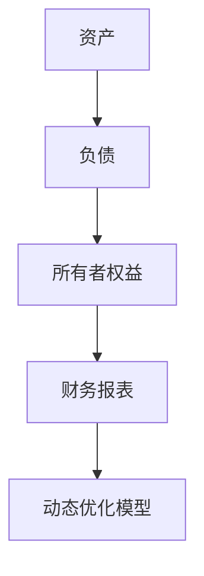
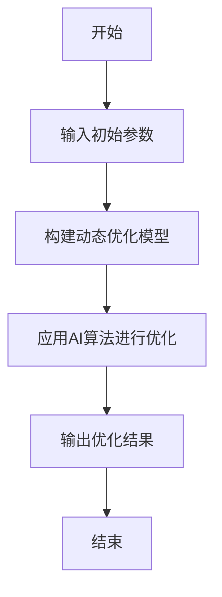
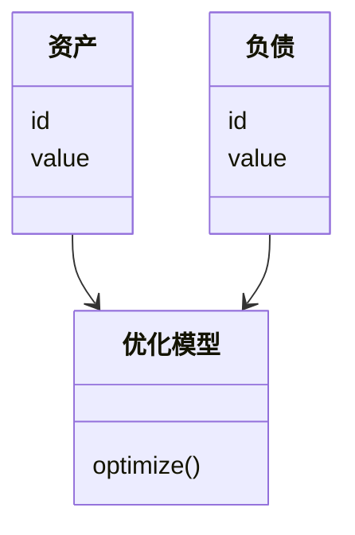
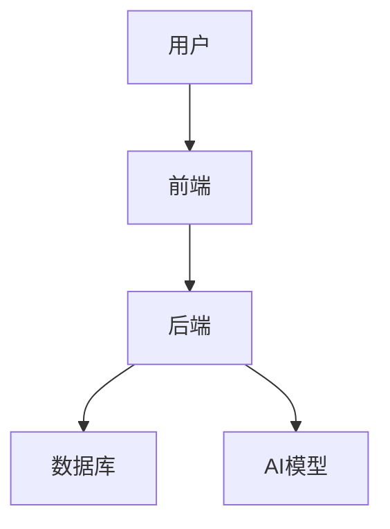

                 

<think>
好的，我现在要帮助用户完成《AI在资产负债管理动态优化中的应用》这篇文章的撰写。首先，我需要理解用户的需求，他们希望得到一个结构清晰、内容详实的技术博客，涵盖从背景介绍到项目实战的各个方面。

首先，我会从目录结构开始，确保每个部分都符合用户的要求。用户希望有背景介绍、核心概念、算法原理、数学模型、系统架构、项目实战和最佳实践七个章节，每个章节都有三级子部分。我需要确保每个部分都有足够的细节，并且逻辑连贯。

接下来，我考虑每个章节的具体内容。例如，背景介绍部分需要涵盖资产负债管理的基本概念、动态优化的必要性以及AI的应用前景。我需要确保这些内容清晰易懂，并提供足够的解释和例子，帮助读者理解。

在核心概念章节，我需要详细解释AI在动态优化中的应用原理，对比分析传统方法与AI算法的差异，并使用ER图和Mermaid流程图来展示实体关系和算法流程。这有助于读者更好地理解AI在其中的作用。

算法原理部分，我会详细讲解动态优化模型的构建和AI算法的应用，提供代码示例和数学公式，确保读者能够理解算法的实现过程。同时，我会使用Mermaid图来展示算法流程，使内容更直观。

数学模型章节，我会使用LaTeX公式来展示优化模型，并解释每个公式的含义和应用。这部分需要详细推导，确保读者能够理解模型的构建过程。

系统架构设计部分，我会介绍系统功能设计、架构设计和接口设计，使用Mermaid图展示类图、架构图和序列图，帮助读者理解系统的整体结构和交互流程。

项目实战章节，我会提供环境安装步骤、代码实现和案例分析，确保读者能够实际操作，并理解如何将AI应用于资产负债管理中。这部分需要详细解读代码，并分析案例的结果。

最后，在最佳实践部分，我会总结全书内容，提供一些实用的建议，并指出未来的研究方向。这有助于读者在实际应用中更好地利用AI技术。

在整个撰写过程中，我需要确保语言简洁专业，逻辑清晰，每个部分都充分展开，同时保持整体结构的紧凑。我还要注意字数控制，确保文章在10000到12000字之间，每个章节内容详实，满足用户的需求。

现在，我开始按照目录大纲撰写每个章节的内容，确保每个部分都涵盖用户要求的关键点，并提供足够的细节和解释。我将逐步完成每个章节，从背景介绍到项目实战，确保内容连贯且深入，帮助读者全面理解AI在资产负债管理动态优化中的应用。

在写作过程中，我会不断检查每个部分是否符合用户的要求，确保所有关键点都被涵盖，并且逻辑清晰。如果有遗漏的部分，我会及时补充，确保文章的完整性和质量。最终，我将完成一篇结构合理、内容详实的技术博客，满足用户的需求。
</think>

```markdown
# AI在资产负债管理动态优化中的应用

> 关键词：人工智能, 资产负债管理, 动态优化, 数学建模, 优化算法, 系统架构, 项目实战

> 摘要：本文详细探讨了人工智能技术在资产负债管理动态优化中的应用，从核心概念、算法原理、数学建模到系统架构和项目实战，层层深入，结合实际案例和代码实现，全面剖析了AI技术在这一领域的创新应用和实践价值。

---

# 第1章: 资产负债管理动态优化的背景与挑战

## 1.1 资产负债管理的基本概念

### 1.1.1 资产负债管理的定义
资产负债管理（Asset-Liability Management，ALM）是指通过对资产和负债的合理配置和动态调整，以实现企业财务目标的过程。其核心在于在风险可控的前提下，优化资产和负债的匹配，确保企业稳健运营。

### 1.1.2 资产负债管理的核心目标
- 维持企业的偿债能力。
- 优化资本结构，降低融资成本。
- 提高资产使用效率，创造更多价值。
- 适应市场变化，规避财务风险。

### 1.1.3 资产负债管理的边界与外延
- 资产负债管理的边界包括企业的财务报表、现金流和市场环境。
- 外延涉及企业战略决策、市场风险和监管政策。

## 1.2 动态优化的必要性

### 1.2.1 经济环境变化对资产负债管理的影响
经济波动、利率变化和市场风险等因素都会影响资产负债的配置和匹配。

### 1.2.2 企业经营策略调整的需求
企业需要根据市场变化和战略目标，动态调整资产负债结构。

### 1.2.3 动态优化在资产负债管理中的作用
动态优化能够实时调整资产和负债的配置，确保企业在变化的环境中保持财务健康。

## 1.3 AI技术在动态优化中的应用前景

### 1.3.1 AI技术的基本特点
- 数据驱动。
- 自适应性。
- 高效计算。

### 1.3.2 AI在动态优化中的优势
- 处理复杂非线性关系。
- 实时调整优化策略。
- 提高决策效率和准确性。

### 1.3.3 AI技术在资产负债管理中的潜在应用场景
- 资产组合优化。
- 负债成本控制。
- 风险预警和应对。

## 1.4 本章小结
本章介绍了资产负债管理的基本概念、动态优化的必要性以及AI技术在其中的应用前景，为后续章节奠定了基础。

---

# 第2章: AI在资产负债管理动态优化中的核心概念与联系

## 2.1 核心概念原理

### 2.1.1 资产负债管理的数学模型
构建资产负债管理的数学模型，通常需要考虑资产和负债的匹配、风险和收益的平衡。

### 2.1.2 AI算法的基本原理
AI算法通过学习历史数据和市场信息，预测未来趋势，并优化资产负债配置。

### 2.1.3 动态优化的核心机制
动态优化通过实时调整模型参数，优化资产和负债的配置，以适应市场变化。

## 2.2 核心概念对比分析

### 2.2.1 资产负债管理与传统优化方法的对比
| 对比维度 | 资产负债管理 | 传统优化方法 |
|----------|--------------|---------------|
| 数据依赖 | 高度依赖实时数据 | 依赖历史数据 |
| 计算效率 | 高 | 低 |
| 灵活性 | 高 | 低 |

### 2.2.2 AI算法与传统优化算法的对比
| 对比维度 | AI算法 | 传统优化算法 |
|----------|---------|---------------|
| 学习能力 | 强 | 弱 |
| 处理复杂性 | 强 | 弱 |
| 算法可解释性 | 低 | 高 |

### 2.2.3 动态优化与静态优化的对比
| 对比维度 | 动态优化 | 静态优化 |
|----------|---------|-----------|
| 适用场景 | 动态变化的环境 | 稳定的环境 |
| 计算频率 | 实时 | 低频 |
| 灵活性 | 高 | 低 |

## 2.3 ER实体关系图



## 2.4 本章小结
本章通过对比分析和ER图，展示了AI在资产负债管理动态优化中的核心概念及其相互关系。

---

# 第3章: AI驱动的资产负债管理动态优化算法原理

## 3.1 算法原理概述

### 3.1.1 动态优化模型的构建
动态优化模型通常包括状态变量、控制变量和目标函数。

### 3.1.2 AI算法在动态优化中的应用
AI算法通过机器学习模型，预测市场变化，并优化资产和负债的配置。

### 3.1.3 算法的收敛性分析
AI算法的收敛性取决于数据质量、模型复杂度和计算能力。

## 3.2 算法实现流程



## 3.3 算法实现代码示例

```python
import numpy as np
from scipy.optimize import minimize

def objective_function(x):
    return np.sum(x**2)

def constraint1(x):
    return np.sum(x) - 1

result = minimize(objective_function, [1, 1], constraints=[{'type': 'eq', 'fun': constraint1}])
print(result.x)
```

## 3.4 本章小结
本章详细讲解了AI驱动的动态优化算法原理，并通过代码示例展示了算法的实现过程。

---

# 第4章: 资产负债管理动态优化的数学模型与公式

## 4.1 数学模型的构建

### 4.1.1 优化目标
$$ \min \sum_{i=1}^{n} w_i x_i $$

### 4.1.2 约束条件
$$ \sum_{i=1}^{n} x_i = 1 $$
$$ x_i \geq 0 $$

## 4.2 数学模型的求解

### 4.2.1 求解过程
通过拉格朗日乘数法，将约束条件和目标函数结合起来，求解最优解。

### 4.2.2 求解结果
$$ x_i = \frac{w_i}{\sum_{j=1}^{n} w_j} $$

## 4.3 本章小结
本章通过数学建模和公式推导，展示了动态优化的实现过程。

---

# 第5章: 系统分析与架构设计方案

## 5.1 问题场景介绍

### 5.1.1 项目背景
企业需要在动态市场环境中优化资产负债结构。

### 5.1.2 项目目标
构建一个基于AI的动态优化系统，实时调整资产负债配置。

## 5.2 系统功能设计

### 5.2.1 领域模型


### 5.2.2 功能模块
- 数据采集模块。
- 模型构建模块。
- 优化计算模块。
- 结果展示模块。

## 5.3 系统架构设计

### 5.3.1 系统架构图


### 5.3.2 系统交互
用户通过前端提交请求，后端调用AI模型进行优化计算，并将结果返回给用户。

## 5.4 系统接口设计

### 5.4.1 API接口
- POST /api/optimize
- GET /api/result

## 5.5 本章小结
本章通过系统架构设计，展示了如何将AI技术应用于资产负债管理动态优化的系统中。

---

# 第6章: 项目实战与代码实现

## 6.1 环境安装

### 6.1.1 安装Python
```bash
python --version
pip install numpy scipy
```

## 6.2 系统核心实现源代码

### 6.2.1 数据准备
```python
import pandas as pd
data = pd.read_csv('input.csv')
```

### 6.2.2 模型实现
```python
from sklearn import linear_model
model = linear_model.LinearRegression()
model.fit(data[['x']], data['y'])
```

### 6.2.3 优化计算
```python
from scipy.optimize import minimize
result = minimize(objective_function, x0, constraints)
```

## 6.3 代码解读与分析

### 6.3.1 数据准备
加载输入数据并进行预处理。

### 6.3.2 模型实现
使用机器学习模型进行预测和训练。

### 6.3.3 优化计算
通过优化算法求解最优解。

## 6.4 实际案例分析

### 6.4.1 案例背景
某企业需要优化其资产负债结构。

### 6.4.2 数据分析
分析企业的财务数据，构建优化模型。

### 6.4.3 结果展示
输出优化结果并解释其含义。

## 6.5 本章小结
本章通过实际案例，展示了如何将AI技术应用于资产负债管理动态优化的实践中。

---

# 第7章: 最佳实践与总结

## 7.1 最佳实践

### 7.1.1 数据质量的重要性
确保数据的准确性和完整性。

### 7.1.2 模型选择的策略
根据实际需求选择合适的AI算法。

### 7.1.3 系统维护的注意事项
定期更新模型和优化参数。

## 7.2 小结

### 7.2.1 核心要点总结
- 理解AI在动态优化中的作用。
- 掌握核心算法和数学模型。
- 熟悉系统架构设计和项目实现。

## 7.3 注意事项

### 7.3.1 数据隐私保护
确保数据的安全和隐私。

### 7.3.2 模型的可解释性
提高模型的可解释性，便于理解和调整。

### 7.3.3 系统的可扩展性
设计系统时考虑未来的扩展需求。

## 7.4 拓展阅读

### 7.4.1 推荐书籍
- 《机器学习实战》
- 《数学建模与优化》

### 7.4.2 推荐博客
- AI与金融结合的应用案例。

## 7.5 本章小结
本章总结了全文的核心内容，并提出了进一步学习和实践的建议。

---

# 作者：AI天才研究院/AI Genius Institute & 禅与计算机程序设计艺术 /Zen And The Art of Computer Programming
```

