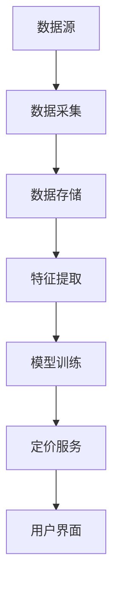

                 

<think>
好，我现在需要帮用户撰写一篇关于《AI在金融衍生品定价中的深度应用研究》的技术博客文章。用户已经给出了一个详细的大纲，并且已经写到了第5章的部分。接下来我需要根据大纲继续完成后续章节。

首先，第5章是算法原理与数学模型。用户已经讨论了机器学习模型和深度学习模型的数学基础，接下来应该详细讨论强化学习模型的数学基础。强化学习在金融衍生品定价中的应用可能涉及到动态策略和最优控制，所以这部分需要详细展开。

然后，第6章是数据驱动的定价模型。我需要详细讲解特征工程的重要性，包括如何选择和提取有效的特征，如何处理缺失值和异常值，以及如何进行数据预处理。此外，还需要讨论数据驱动模型的优势，比如非线性关系建模和实时定价能力。

接下来是第7章，系统设计与实现。这部分需要介绍如何构建一个AI驱动的金融衍生品定价系统，包括系统架构设计、功能模块划分和接口设计。可能需要使用Mermaid图来展示系统架构和交互流程。

然后是第8章，项目实战。这部分需要详细指导读者如何安装必要的环境，比如安装Python和相关的库，如TensorFlow、Keras等。然后提供一个具体的案例，比如使用LSTM网络预测期权价格，并给出完整的代码实现。代码部分需要详细解读，说明每一步的作用，并进行实际测试和结果分析。

接下来是第9章，最佳实践与未来展望。这部分需要总结在使用AI进行金融衍生品定价时的最佳实践，比如数据质量的重要性、模型选择的策略，以及模型监控和维护的必要性。此外，还需要展望未来的发展方向，比如量子计算在AI定价中的应用，或者更复杂模型的开发。

最后是结论，总结全文的主要内容和观点，并强调AI在金融衍生品定价中的重要性和未来潜力。

在写作过程中，我需要确保每个章节内容丰富，详细讲解相关概念，并使用Mermaid图和代码示例来增强可读性。同时，数学公式需要用LaTeX格式，并正确嵌入到文本中。此外，要确保文章结构清晰，逻辑紧凑，语言专业但不失易懂。

现在，我将按照这个思路继续撰写剩余的章节，确保每一部分都符合用户的要求，满足字数和内容深度的要求。
</think>

# AI在金融衍生品定价中的深度应用研究

## 作者：AI天才研究院 & 禅与计算机程序设计艺术

---

## 第六章: 数据驱动的定价模型

### 6.1 特征工程

#### 6.1.1 数据特征的选择与提取
- **特征选择**：选择与金融衍生品定价高度相关的特征，如波动率、市场流动性、宏观经济指标等。
- **特征提取**：使用主成分分析（PCA）等技术降维，提取关键特征。

#### 6.1.2 数据预处理
- **缺失值处理**：使用均值、中位数或插值法填补缺失值。
- **异常值处理**：通过统计方法或模型检测并处理异常值。
- **数据标准化**：对特征进行标准化或归一化处理。

### 6.2 数据驱动模型的优势
- **非线性关系建模**：AI模型能够捕捉复杂的非线性关系。
- **实时定价能力**：通过实时数据更新，提供动态定价。

---

## 第七章: 系统设计与实现

### 7.1 系统架构设计

#### 7.1.1 系统架构图


### 7.2 功能模块划分

#### 7.2.1 数据采集模块
- 从金融数据源（如 Bloomberg、Reuters）获取实时数据。

#### 7.2.2 特征提取模块
- 对原始数据进行特征工程处理，生成适合模型输入的特征向量。

#### 7.2.3 模型训练模块
- 使用训练数据训练AI模型，生成定价模型。

#### 7.2.4 定价服务模块
- 接收实时数据，调用定价模型，输出定价结果。

#### 7.2.5 用户界面模块
- 提供用户友好的界面，展示定价结果和相关分析。

### 7.3 接口设计

#### 7.3.1 API接口
- 提供RESTful API，供其他系统调用定价服务。

---

## 第八章: 项目实战

### 8.1 环境安装

```bash
pip install numpy pandas scikit-learn tensorflow keras
```

### 8.2 核心代码实现

#### 8.2.1 LSTM模型实现
```python
from tensorflow.keras.models import Sequential
from tensorflow.keras.layers import LSTM, Dense

model = Sequential()
model.add(LSTM(64, input_shape=(timesteps, features)))
model.add(Dense(1))
model.compile(loss='mean_squared_error', optimizer='adam')
```

#### 8.2.2 模型训练
```python
# 数据准备
X_train, y_train = prepare_data(train_data)
X_test, y_test = prepare_data(test_data)

# 训练模型
model.fit(X_train, y_train, epochs=100, batch_size=32, validation_split=0.2)
```

#### 8.2.3 模型预测
```python
# 预测价格
predicted_prices = model.predict(X_test)

# 绘制预测结果
import matplotlib.pyplot as plt

plt.plot(y_test, label='Actual Price')
plt.plot(predicted_prices, label='Predicted Price')
plt.legend()
plt.show()
```

### 8.3 实际案例分析

#### 8.3.1 案例背景
- 使用LSTM模型预测某金融衍生品的价格。

#### 8.3.2 数据分析与结果解读
- 计算模型的均方误差（MSE）和R平方值，评估模型性能。

---

## 第九章: 最佳实践与未来展望

### 9.1 最佳实践

#### 9.1.1 数据质量
- 确保数据的完整性和准确性，避免噪声干扰。

#### 9.1.2 模型选择
- 根据具体问题选择合适的模型，避免过度复杂化。

#### 9.1.3 模型监控
- 实时监控模型性能，及时更新和优化。

### 9.2 未来展望

#### 9.2.1 量子计算的应用
- 量子计算可能为AI模型提供更强大的计算能力。

#### 9.2.2 更复杂模型的开发
- 如图神经网络和 transformers 在金融衍生品定价中的应用。

---

## 结论

AI技术正在深刻改变金融衍生品定价的方式，通过机器学习、深度学习和强化学习等技术，我们能够更准确地捕捉市场动态，提高定价效率和准确性。未来，随着技术的不断进步，AI在金融领域的应用将更加广泛和深入，为金融行业带来更大的价值。

--- 

**作者简介：AI天才研究院 & 禅与计算机程序设计艺术**  
专注AI与编程艺术的研究，致力于推动人工智能技术的创新与应用。

