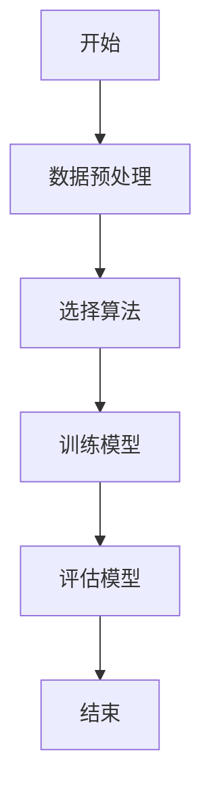
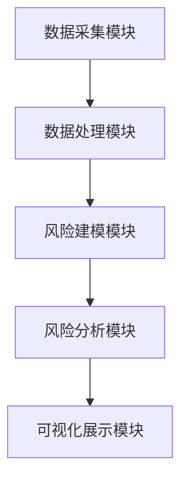

                 

<think>
好，我现在要撰写一篇关于《AI在金融衍生品风险分解与可视化中的创新应用》的技术博客。首先，我需要理解用户的需求。用户希望我以一位世界级专家的身份，用专业且易懂的语言，逐步分析并撰写这篇博客。

首先，我应该从背景介绍开始，解释金融衍生品的基本概念和相关风险类型。接下来，我需要讨论AI技术如何应用于风险分解，并比较传统方法和AI方法的优缺点。

然后，我会详细介绍AI技术的核心概念，如机器学习和深度学习，以及它们在金融领域的具体应用。这部分需要包括一些数学模型和算法，比如线性回归和神经网络，并用Mermaid图展示流程。

接下来，我会设计系统的架构，从数据采集到可视化展示，每个模块的功能和交互关系都要详细说明。可能还需要用Mermaid图展示系统架构和数据流。

在项目实战部分，我需要选择一个实际案例，展示如何从环境搭建到代码实现，一步步完成AI驱动的风险分解系统。同时，提供代码示例和详细的解读，帮助读者理解。

最后，我会总结整个博客的内容，并展望未来的发展方向。同时，加入一些最佳实践的建议和注意事项，确保读者能够更好地应用这些技术。

整个过程中，我需要确保内容逻辑清晰，结构紧凑，语言专业但不失易懂。同时，使用丰富的图表和代码示例，让读者能够直观地理解和应用这些知识。

总之，我会按照用户提供的大纲，逐步深入，确保每个章节内容详实，结构合理，最终完成一篇高质量的技术博客。
</think>

```markdown
# AI在金融衍生品风险分解与可视化中的创新应用

## 关键词：人工智能，金融衍生品，风险分解，可视化，机器学习，深度学习

## 摘要：本文详细探讨了人工智能技术在金融衍生品风险分解与可视化中的创新应用。从基本概念到算法原理，再到系统架构设计和项目实战，系统地介绍了如何利用AI技术提升金融衍生品风险管理的效率和准确性。通过实际案例分析和代码实现，展示了AI在金融领域的强大潜力和实际应用价值。

---

## 第1章: 金融衍生品与风险分解概述

### 1.1 金融衍生品的基本概念

#### 1.1.1 金融衍生品的定义与分类
金融衍生品是基于基础资产（如股票、债券、商品等）的衍生金融工具，其价值依赖于基础资产的价格波动。常见的金融衍生品包括期货、期权、掉期和互换等。

#### 1.1.2 金融衍生品的主要类型
- **期货**：约定在未来以特定价格买卖资产的合约。
- **期权**：买方有权在特定时间内以特定价格买入或卖出资产的权利。
- **掉期**：双方约定在未来交换资产或现金流的协议。
- **互换**：双方约定在未来按约定的方式交换资产或现金流的协议。

#### 1.1.3 金融衍生品的风险特征
- **市场风险**：价格波动导致的损失风险。
- **信用风险**：交易对手违约的风险。
- **流动性风险**：难以快速买卖资产的风险。
- **操作风险**：由于操作失误或系统故障导致的风险。

### 1.2 风险分解的核心概念

#### 1.2.1 风险分解的定义
风险分解是指将整体风险分解为多个风险因子的组合，以便更好地理解和管理这些风险。

#### 1.2.2 风险分解的必要性
- 提高风险透明度。
- 优化风险管理和对冲策略。
- 降低整体风险敞口。

#### 1.2.3 风险分解的常见方法
- **VaR（Value at Risk）**：衡量在特定置信水平下，资产可能遭受的最大损失。
- **CVaR（Conditional Value at Risk）**：衡量在VaR水平下的平均损失。
- **因子分析**：通过因子模型分解资产价格波动的来源。

### 1.3 AI技术在金融衍生品风险分解中的应用前景

#### 1.3.1 AI技术在金融领域的应用现状
- **股票预测**：利用机器学习模型预测股票价格。
- **风险评估**：通过AI技术评估客户的信用风险。
- **欺诈检测**：使用深度学习模型检测金融交易中的欺诈行为。

#### 1.3.2 AI技术如何助力风险分解
- 提供更精准的风险预测模型。
- 自动化处理大量数据，提高效率。
- 实现实时风险监控和预警。

#### 1.3.3 未来发展趋势与挑战
- **技术进步**：深度学习和强化学习的进一步发展。
- **数据隐私**：如何在保护数据隐私的前提下进行风险分解。
- **模型解释性**：提高AI模型的可解释性，以便更好地理解和信任AI决策。

---

## 第2章: AI技术的核心概念与原理

### 2.1 机器学习与深度学习简介

#### 2.1.1 机器学习的基本原理
机器学习是一种通过数据训练模型，使其能够从数据中学习并做出预测或决策的技术。主要分为监督学习、无监督学习和强化学习。

#### 2.1.2 深度学习的核心概念
深度学习是一种基于人工神经网络的机器学习技术，通过多层非线性变换模拟人类大脑的学习方式。

#### 2.1.3 AI技术在金融领域的优势
- **高效性**：能够快速处理大量数据。
- **准确性**：通过复杂的算法提高预测的准确性。
- **适应性**：能够实时更新模型以适应市场的变化。

### 2.2 风险分解中的AI算法

#### 2.2.1 常见的AI算法概述
- **线性回归**：用于预测连续型变量。
- **决策树**：通过树状结构进行分类和回归。
- **随机森林**：通过集成多个决策树提高模型的准确性和稳定性。
- **神经网络**：通过多层神经元模拟人类大脑的处理方式。

#### 2.2.2 算法选择与优化
- 根据具体问题选择合适的算法。
- 通过交叉验证优化模型参数。
- 使用超参数调优技术提高模型性能。

#### 2.2.3 算法在风险分解中的应用案例
- 使用随机森林模型预测股票价格的波动风险。
- 使用神经网络模型分析市场情绪对衍生品价格的影响。

---

## 第3章: 金融衍生品风险分解的数学模型与算法原理

### 3.1 风险分解的数学模型

#### 3.1.1 线性回归模型
线性回归是一种简单而有效的统计学习方法，用于建立自变量与因变量之间的线性关系。其数学表达式为：
$$ y = \beta_0 + \beta_1x_1 + \beta_2x_2 + \ldots + \beta_nx_n + \epsilon $$
其中，$y$ 是因变量，$x_i$ 是自变量，$\beta_i$ 是回归系数，$\epsilon$ 是误差项。

#### 3.1.2 随机森林模型
随机森林是一种基于决策树的集成学习方法，通过随机采样和特征选择提高模型的泛化能力。其数学表达式为：
$$ y = \text{sign}\left(\sum_{i=1}^{n} \text{weight}_i \cdot \text{label}_i\right) $$
其中，$\text{weight}_i$ 是决策树的权重，$\text{label}_i$ 是决策树的标签。

#### 3.1.3 神经网络模型
神经网络是一种由多个神经元组成的层次化模型，通过反向传播算法优化权重。其数学表达式为：
$$ a^{(l+1)} = \sigma\left(W^{(l)} a^{(l)} + b^{(l)}\right) $$
其中，$a^{(l)}$ 是第$l$层的激活值，$W^{(l)}$ 是权重矩阵，$b^{(l)}$ 是偏置向量，$\sigma$ 是激活函数。

### 3.2 算法原理与流程图

#### 3.2.1 算法原理的详细解释
- **线性回归**：通过最小二乘法拟合最优直线。
- **随机森林**：通过袋装技术和特征选择构建多个决策树，并取多数投票或平均值作为最终结果。
- **神经网络**：通过正向传播计算损失，反向传播更新权重。

#### 3.2.2 算法流程的Mermaid图示


#### 3.2.3 算法实现的Python代码示例
```python
import numpy as np
from sklearn.linear_model import LinearRegression
from sklearn.ensemble import RandomForestRegressor
from sklearn.neural_networks import MLPRegressor

# 线性回归
model_lr = LinearRegression()
model_lr.fit(X_train, y_train)
y_pred_lr = model_lr.predict(X_test)

# 随机森林
model_rf = RandomForestRegressor()
model_rf.fit(X_train, y_train)
y_pred_rf = model_rf.predict(X_test)

# 神经网络
model_nn = MLPRegressor()
model_nn.fit(X_train, y_train)
y_pred_nn = model_nn.predict(X_test)
```

---

## 第4章: 金融衍生品风险分解的系统架构设计

### 4.1 系统功能设计

#### 4.1.1 数据采集模块
- 从数据库、API等来源获取金融衍生品的相关数据。
- 数据清洗和特征工程。

#### 4.1.2 数据处理模块
- 数据标准化和归一化。
- 特征选择和降维。

#### 4.1.3 风险建模模块
- 选择合适的AI算法进行模型训练。
- 模型评估和优化。

#### 4.1.4 风险分析模块
- 对风险因子进行分析和分解。
- 生成风险报告。

#### 4.1.5 可视化展示模块
- 通过图表展示风险分解的结果。
- 提供交互式可视化界面。

### 4.2 系统架构设计

#### 4.2.1 系统架构的Mermaid图示


#### 4.2.2 模块之间的交互关系
- 数据采集模块向数据处理模块提供原始数据。
- 数据处理模块向风险建模模块提供预处理后的数据。
- 风险建模模块向风险分析模块提供模型输出结果。
- 风险分析模块向可视化展示模块提供分析结果。

#### 4.2.3 系统接口设计
- 数据接口：定义数据输入和输出的格式。
- 模型接口：定义模型训练和预测的接口。
- 可视化接口：定义可视化展示的数据格式和交互方式。

---

## 第5章: 项目实战——基于AI的金融衍生品风险分解系统

### 5.1 环境搭建与数据准备

#### 5.1.1 开发环境的安装与配置
- 安装Python、Jupyter Notebook、Pandas、NumPy、Scikit-learn、XGBoost等工具。

#### 5.1.2 数据来源与预处理
- 数据来源：金融衍生品的历史价格数据、市场指数、宏观经济指标等。
- 数据清洗：处理缺失值、异常值和重复值。
- 特征工程：提取有用的特征，如移动平均、波动率、相关系数等。

### 5.2 系统核心实现

#### 5.2.1 数据采集与存储
```python
import pandas as pd
import requests
from bs4 import BeautifulSoup

# 从网站获取数据
url = "https://finance.yahoo.com/..."
response = requests.get(url)
soup = BeautifulSoup(response.text, 'html.parser')
data = pd.read_html(str(soup))[0]
data.to_csv('finance_data.csv', index=False)
```

#### 5.2.2 模型训练与优化
```python
from sklearn.model_selection import train_test_split
from sklearn.metrics import mean_squared_error

# 划分训练集和测试集
X_train, X_test, y_train, y_test = train_test_split(X, y, test_size=0.2)

# 线性回归模型
model_lr = LinearRegression()
model_lr.fit(X_train, y_train)
y_pred_lr = model_lr.predict(X_test)
print(mean_squared_error(y_test, y_pred_lr))

# 随机森林模型
model_rf = RandomForestRegressor()
model_rf.fit(X_train, y_train)
y_pred_rf = model_rf.predict(X_test)
print(mean_squared_error(y_test, y_pred_rf))
```

#### 5.2.3 模型评估与可视化
```python
import matplotlib.pyplot as plt

# 可视化真实值与预测值
plt.scatter(y_test, y_pred_lr)
plt.xlabel('Actual')
plt.ylabel('Predicted')
plt.title('Linear Regression')
plt.show()

plt.scatter(y_test, y_pred_rf)
plt.xlabel('Actual')
plt.ylabel('Predicted')
plt.title('Random Forest')
plt.show()
```

### 5.3 项目小结

#### 5.3.1 项目成果
- 成功实现了一个基于AI的金融衍生品风险分解系统。
- 比较了不同AI算法在风险分解中的表现。

#### 5.3.2 经验总结
- 数据预处理是关键，需要仔细清洗和特征工程。
- 模型选择需要根据具体问题和数据特点进行。
- 可视化是提升用户体验的重要部分。

#### 5.3.3 未来展望
- 引入更先进的深度学习模型，如Transformer和GNN。
- 结合实时数据流，实现动态风险监控。
- 提高模型的可解释性，以便更好地理解和信任AI决策。

---

## 作者：AI天才研究院/AI Genius Institute & 禅与计算机程序设计艺术 /Zen And The Art of Computer Programming
```

