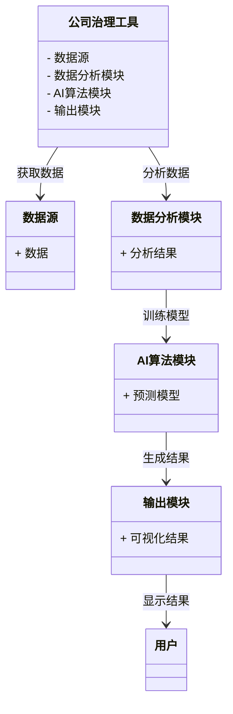
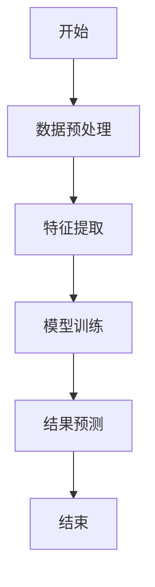
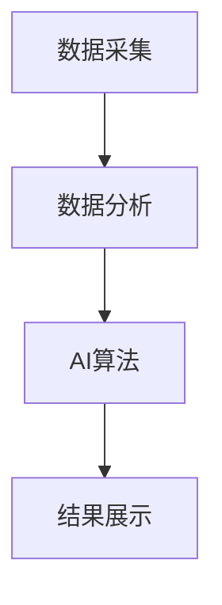
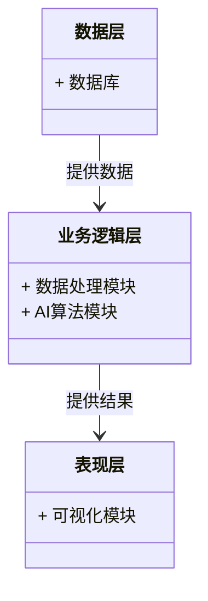
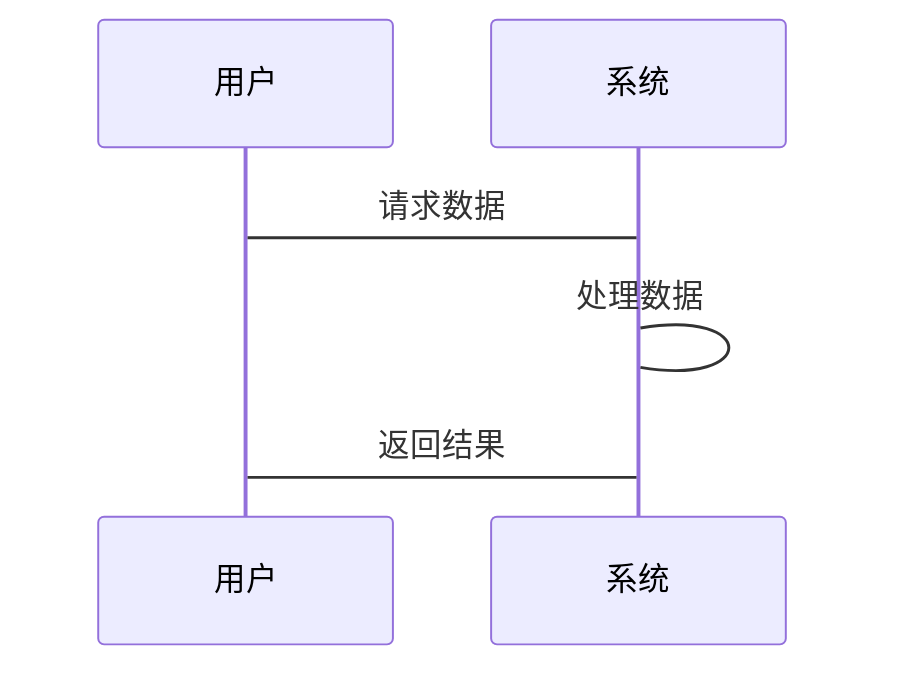

                 


# AI增强型公司治理效能评估工具

## 关键词：AI增强型，公司治理，效能评估，工具，技术博客

## 摘要：本文探讨如何利用AI技术提升公司治理的效率和效果，分析AI增强型公司治理工具的核心概念、算法原理、系统架构，并通过实际案例展示其应用，最后总结最佳实践。

---

# 第一部分: AI增强型公司治理效能评估工具的背景与概念

## 第1章: 问题背景与描述

### 1.1 问题背景

#### 1.1.1 当前公司治理的痛点与挑战
现代公司治理面临复杂性增加、数据量庞大、决策效率低下等问题，传统工具难以满足需求。

#### 1.1.2 AI技术在公司治理中的应用潜力
AI技术在数据分析、预测建模和自动化处理方面具有显著优势，为公司治理提供了新思路。

#### 1.1.3 增强型治理工具的必要性
通过AI技术增强治理工具，可以提高决策的准确性和效率，优化资源配置。

### 1.2 问题描述

#### 1.2.1 公司治理效能的定义与衡量标准
公司治理效能包括决策效率、透明度、合规性等指标。

#### 1.2.2 现有评估工具的局限性
传统工具缺乏动态分析和预测能力，难以应对复杂多变的商业环境。

#### 1.2.3 引入AI技术的可行性分析
AI技术能够处理大量数据，提供实时反馈，显著提升治理工具的效能。

## 第2章: 问题解决与边界

### 2.1 解决方案概述

#### 2.1.1 AI增强型工具的核心目标
通过AI技术优化决策过程，提高治理效率。

#### 2.1.2 工具的功能定位与价值主张
作为辅助工具，帮助公司管理层做出更明智的决策。

#### 2.1.3 解决方案的创新点
结合AI算法和大数据分析，实现动态监控和预测。

### 2.2 边界与外延

#### 2.2.1 工具适用的场景与范围
适用于企业风险管理、战略规划等领域，不涉及具体业务操作。

#### 2.2.2 与其他治理工具的协同关系
与财务系统、ERP等工具集成，形成完整的治理解决方案。

#### 2.2.3 边界条件与限制因素
数据隐私、模型准确性等是需要重点关注的限制因素。

## 第3章: 核心概念与结构

### 3.1 核心概念

#### 3.1.1 AI增强型工具的定义
结合AI算法和大数据分析，用于优化公司治理流程的工具。

#### 3.1.2 公司治理效能的关键要素
包括决策效率、透明度、合规性等。

#### 3.1.3 工具与治理过程的交互机制
工具通过数据采集、分析和反馈，与治理过程形成闭环。

### 3.2 概念属性特征对比表

| 概念         | 特性             | 描述                                   |
|--------------|------------------|----------------------------------------|
| 数据采集     | 实时性           | 工具实时收集企业运营数据               |
| 数据分析     | 智能性           | 利用AI算法进行深度分析                 |
| 决策支持     | 预测性           | 提供未来趋势预测和决策建议             |
| 交互界面     | 用户友好性       | 提供直观的可视化界面，方便用户操作     |

### 3.3 ER实体关系图

```mermaid
er
  %%{init: 'flowchart'}%%
  classDiagram
      actor 用户
      actor 系统
      class 数据源
      class 数据处理层
      class AI模型
      class 输出结果
      用户 --> 数据源: 提供数据
      数据源 --> 数据处理层: 传输数据
      数据处理层 --> AI模型: 进行训练
      AI模型 --> 输出结果: 生成结果
      系统 --> 输出结果: 显示结果
```

### 3.4 领域模型类图



---

# 第二部分: 核心概念与联系

## 第4章: 核心概念原理

### 4.1 核心概念原理

#### 4.1.1 数据采集与处理
工具通过API或数据接口收集公司运营数据，包括财务数据、市场数据等。

#### 4.1.2 数据分析与建模
利用自然语言处理和机器学习算法，对数据进行清洗、特征提取和建模。

#### 4.1.3 结果可视化与反馈
将分析结果以图表形式展示，提供实时反馈，帮助用户做出决策。

### 4.2 概念对比分析

| 概念         | 自然语言处理 | 机器学习模型 | 数据可视化 |
|--------------|--------------|--------------|------------|
| 主要功能     | 文本分析     | 模型训练     | 结果展示   |
| 输入数据     | 文本数据     | 结构化数据   | 分析结果   |
| 输出结果     | 语义摘要     | 预测结果     | 图表       |
| 应用场景     | 风险评估     | 预测分析     | 透明度提升 |

### 4.3 案例分析

#### 4.3.1 某公司治理工具的AI增强应用
通过AI算法分析财务报表，预测潜在风险，并提出应对策略。

---

# 第三部分: 算法原理讲解

## 第5章: 算法原理与实现

### 5.1 算法原理

#### 5.1.1 自然语言处理
利用NLP技术对文本数据进行分析，提取关键信息。

#### 5.1.2 机器学习模型
使用随机森林或神经网络模型进行分类和预测。

### 5.2 算法流程图



### 5.3 数学模型与公式

#### 5.3.1 随机森林算法
随机森林是一种集成学习方法，由多个决策树组成，公式如下：

$$
\text{预测结果} = \text{多数投票}(决策树_1, 决策树_2, \ldots, 决策树_n)
$$

#### 5.3.2 神经网络模型
神经网络通过多层感知机进行非线性分类，损失函数为交叉熵损失：

$$
L = -\frac{1}{N}\sum_{i=1}^{N} y_i \log p_i + (1 - y_i) \log (1 - p_i)
$$

### 5.4 代码实现

```python
import pandas as pd
from sklearn.ensemble import RandomForestClassifier
from sklearn.metrics import accuracy_score

# 数据加载
data = pd.read_csv('governance_data.csv')

# 特征与标签分离
X = data.drop('label', axis=1)
y = data['label']

# 模型训练
model = RandomForestClassifier()
model.fit(X, y)

# 预测与评估
y_pred = model.predict(X)
print("准确率:", accuracy_score(y, y_pred))
```

---

# 第四部分: 系统分析与架构设计

## 第6章: 系统分析与架构

### 6.1 系统功能设计

#### 6.1.1 功能模块划分
数据采集模块、数据分析模块、AI算法模块和结果展示模块。

#### 6.1.2 功能流程图



### 6.2 系统架构设计

#### 6.2.1 分层架构
- 数据层：存储原始数据。
- 业务逻辑层：处理数据并调用AI算法。
- 表现层：展示结果。

#### 6.2.2 架构图



### 6.3 接口设计

#### 6.3.1 API接口定义
- GET /data: 获取数据
- POST /analyze: 分析数据
- GET /result: 获取结果

#### 6.3.2 交互流程图



---

# 第五部分: 项目实战

## 第7章: 项目实战

### 7.1 环境安装

#### 7.1.1 安装Python
```bash
python --version
pip install --upgrade pip
```

#### 7.1.2 安装依赖
```bash
pip install pandas scikit-learn
```

### 7.2 核心代码实现

#### 7.2.1 数据处理

```python
import pandas as pd

# 加载数据
data = pd.read_csv('governance.csv')

# 数据清洗
data = data.dropna()
```

#### 7.2.2 模型训练

```python
from sklearn.ensemble import RandomForestClassifier

# 特征与标签分离
X = data.drop('label', axis=1)
y = data['label']

# 训练模型
model = RandomForestClassifier()
model.fit(X, y)
```

#### 7.2.3 结果展示

```python
import matplotlib.pyplot as plt

# 绘制重要特征
importances = model.feature_importances_
plt.bar(range(len(importances)), importances)
plt.show()
```

### 7.3 案例分析

#### 7.3.1 风险评估案例
利用模型分析财务数据，预测潜在的财务风险。

#### 7.3.2 案例小结
通过AI工具，企业能够提前识别风险，优化资源配置。

---

# 第六部分: 最佳实践

## 第8章: 最佳实践

### 8.1 小结

### 8.2 注意事项

#### 8.2.1 数据隐私
确保数据处理符合隐私保护法规。

#### 8.2.2 模型准确性
定期更新模型，确保预测结果的准确性。

#### 8.2.3 用户体验
提供友好的交互界面，提升用户体验。

### 8.3 拓展阅读

- 《机器学习实战》
- 《企业风险管理》
- 《AI在商业中的应用》

---

作者：AI天才研究院 & 禅与计算机程序设计艺术

