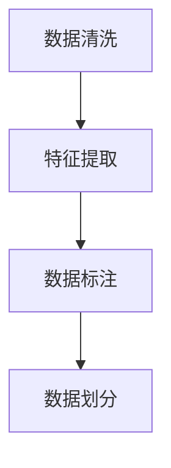
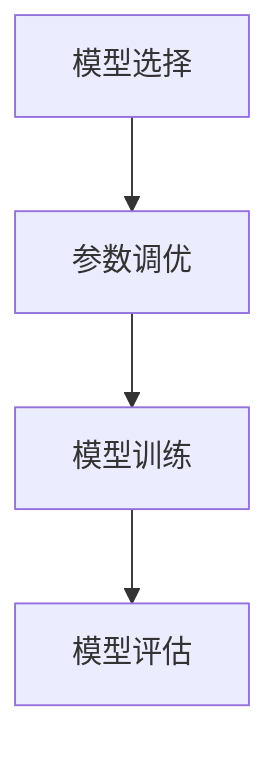
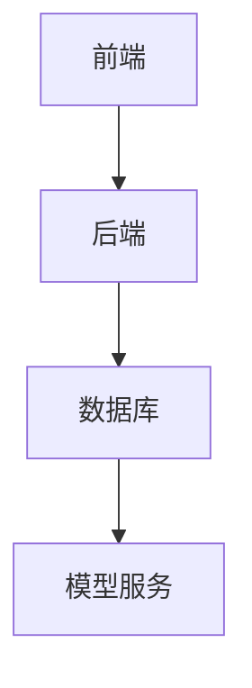
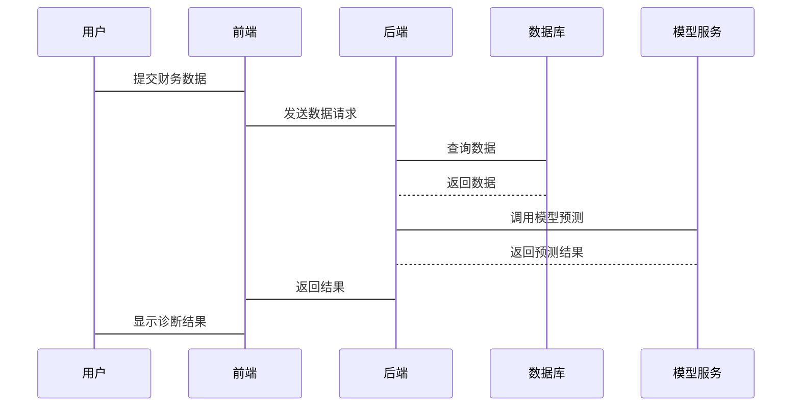

                 


# AI增强型公司财务健康诊断系统

> 关键词：AI, 财务健康诊断, 系统架构, 机器学习, 深度学习, 算法原理, 项目实战

> 摘要：本文将详细介绍AI增强型公司财务健康诊断系统的背景、核心概念、算法原理、系统架构、项目实战和最佳实践。通过逐步分析，我们将探讨如何利用人工智能技术提升企业财务管理的效率和准确性。

---

## 第一部分: 背景介绍

### 第1章: 问题背景

#### 1.1 传统公司财务诊断的局限性
- 传统财务分析依赖人工经验，效率低且易受主观因素影响。
- 数据处理复杂，难以快速响应市场变化。
- 传统方法难以处理海量数据和复杂场景。

#### 1.2 AI技术在财务诊断中的应用潜力
- 人工智能技术能够快速处理大量数据，提取关键特征。
- 机器学习和深度学习模型能够发现财务数据中的隐藏规律。
- AI技术可以实时监控财务指标，提供动态诊断。

#### 1.3 企业财务管理的痛点与需求
- 精准预测财务风险的需求日益增加。
- 提高财务分析效率和准确性的需求。
- 实现财务数据的自动化处理和智能分析。

### 第2章: 问题描述

#### 2.1 财务健康诊断的核心目标
- 评估企业的财务健康状况，预测潜在风险。
- 提供财务优化建议，帮助企业做出决策。

#### 2.2 数据驱动的财务分析需求
- 需要整合多源异构数据，包括财务报表、交易记录等。
- 数据清洗、特征提取和标注是关键步骤。

#### 2.3 AI技术的具体应用场景
- 财务风险预警：利用机器学习模型预测企业破产风险。
- 财务数据分析：通过深度学习技术自动识别财务异常。
- 财务预测：基于历史数据预测未来财务状况。

### 第3章: 问题解决

#### 3.1 AI增强型财务诊断系统的解决方案
- 综合运用机器学习、深度学习和自然语言处理技术。
- 构建智能化的财务数据分析平台，实现自动化诊断。
- 提供实时监控和动态反馈，帮助企业在第一时间发现潜在问题。

#### 3.2 系统的核心功能与目标
- 数据采集与预处理：整合多源数据，进行清洗和标注。
- 模型训练与优化：构建财务健康诊断模型，不断提升准确率。
- 可视化分析：将诊断结果以图表形式展示，方便用户理解。

#### 3.3 系统的边界与外延
- 系统边界：仅关注财务相关数据，不涉及非财务信息。
- 系统外延：可以与其他企业管理系统集成，实现数据共享。

### 第4章: 核心概念与联系

#### 4.1 核心概念原理
- 财务健康诊断基于对企业财务数据的分析。
- AI技术通过数据挖掘和模式识别，发现财务异常。

#### 4.2 概念属性特征对比表格
| 概念 | 属性 | 特征 |
|------|------|------|
| 数据预处理 | 数据清洗 | 删除缺失值、处理异常值 |
| 模型训练 | 特征工程 | 选择关键特征、构建特征向量 |
| 模型评估 | 准确率 | 分类模型的正确预测比例 |

#### 4.3 ER实体关系图架构
```mermaid
er
    图表标题: ER实体关系图
    企业
    + id
    + 名称
    + 行业
    财务数据
    + id
    + 企业id
    + 收入
    + 利润
    + 资产
    模型
    + id
    + 模型名称
    + 特征向量
    关系
    企业 -->> 财务数据
    财务数据 -->> 模型
```

---

## 第二部分: 核心概念与联系

### 第5章: 核心概念原理

#### 5.1 AI技术在财务诊断中的应用原理
- 利用机器学习算法，如随机森林和逻辑回归，进行分类预测。
- 深度学习模型，如LSTM和Transformer，用于时间序列分析和自然语言处理。

#### 5.2 数据预处理与特征提取
- 数据清洗：处理缺失值、异常值和重复数据。
- 特征工程：选择关键财务指标，构建特征向量。

#### 5.3 模型训练与优化
- 划分训练集、验证集和测试集。
- 调参优化，提升模型准确率和泛化能力。

### 第6章: 概念属性特征对比表格

#### 6.1 数据特征对比
| 数据类型 | 特征 | 示例 |
|----------|------|------|
| 财务数据 | 收入 | 营业收入 |
| 财务数据 | 利润 | 净利润 |
| 模型数据 | 特征向量 | [收入, 利润, 资产] |

#### 6.2 模型性能对比
| 模型 | 准确率 | 召回率 | F1分数 |
|------|--------|--------|-------|
| 逻辑回归 | 85% | 80% | 82.5% |
| 随机森林 | 88% | 85% | 86.5% |

#### 6.3 系统功能对比
| 功能 | 描述 | 优势 |
|------|------|------|
| 数据采集 | 从数据库获取财务数据 | 实时更新 |
| 模型训练 | 基于历史数据训练模型 | 高准确性 |
| 可视化分析 | 将诊断结果以图表形式展示 | 易于理解 |

### 第7章: ER实体关系图架构

#### 7.1 数据库实体关系图
```mermaid
er
    图表标题: 数据库实体关系图
    企业
    + id
    + 名称
    + 行业
    财务数据
    + id
    + 企业id
    + 收入
    + 利润
    + 资产
    模型
    + id
    + 模型名称
    + 特征向量
    关系
    企业 -->> 财务数据
    财务数据 -->> 模型
```

#### 7.2 实体属性与关系描述
- 企业：id是主键，名称和行业是描述性属性。
- 财务数据：id是主键，企业id是外键，收入、利润、资产是数值型属性。
- 模型：id是主键，模型名称是描述性属性，特征向量是数组类型。

#### 7.3 数据流与交互关系
- 企业数据流向财务数据表。
- 财务数据流向模型表。

---

## 第三部分: 算法原理讲解

### 第8章: 机器学习算法

#### 8.1 逻辑回归
- 用于分类问题，如企业财务健康状况的二分类。
- 概率预测，输出企业财务健康概率。

#### 8.2 随机森林
- 集成学习方法，通过多棵决策树投票进行预测。
- 对特征重要性分析有帮助。

### 第9章: 深度学习模型

#### 9.1 LSTM网络
- 用于时间序列分析，捕捉数据中的时间依赖性。
- 适用于财务数据的时间序列预测。

#### 9.2 Transformer模型
- 基于自注意力机制，适合处理长文本序列。
- 可用于财务报告的自然语言处理任务。

### 第10章: 算法流程图

#### 10.1 数据预处理流程


#### 10.2 模型训练流程


---

## 第四部分: 系统分析与架构设计方案

### 第11章: 问题场景介绍

#### 11.1 企业财务管理现状
- 传统财务管理效率低，依赖人工经验。
- 数据分散，难以进行有效整合和分析。

#### 11.2 系统目标
- 提供智能化的财务健康诊断工具。
- 实现财务数据的自动化处理和智能分析。

### 第12章: 项目介绍

#### 12.1 系统功能设计
- 数据采集与预处理模块。
- 模型训练与优化模块。
- 可视化分析模块。

#### 12.2 系统架构设计


#### 12.3 系统接口设计
- 前端与后端接口：RESTful API。
- 后端与数据库接口：ORM框架。

#### 12.4 系统交互序列图


### 第13章: 领域模型类图


---

## 第五部分: 项目实战

### 第14章: 环境安装

#### 14.1 安装Python环境
- 安装Anaconda或Miniconda。
- 配置Python版本（推荐3.8以上）。

#### 14.2 安装依赖库
- 安装机器学习库：scikit-learn、xgboost。
- 安装深度学习库：TensorFlow、Keras。
- 安装数据处理库：pandas、numpy。

### 第15章: 系统核心实现

#### 15.1 数据采集与预处理
```python
import pandas as pd
import numpy as np

# 数据加载
df = pd.read_csv('financial_data.csv')

# 数据清洗
df.dropna(inplace=True)
df = df[~df.duplicated()]

# 特征提取
features = df[['收入', '利润', '资产']]
labels = df['健康状态']
```

#### 15.2 模型训练与优化
```python
from sklearn.ensemble import RandomForestClassifier
from sklearn.metrics import accuracy_score

# 模型训练
model = RandomForestClassifier()
model.fit(features, labels)

# 模型预测
 predictions = model.predict(features)
 print('准确率:', accuracy_score(labels, predictions))
```

#### 15.3 可视化分析
```python
import matplotlib.pyplot as plt

# 绘制 ROC 曲线
from sklearn.metrics import roc_curve
fpr, tpr, thresholds = roc_curve(labels, model.predict_proba(features)[:,1])
plt.plot(fpr, tpr, label='ROC 曲线')
plt.xlabel('False Positive Rate')
plt.ylabel('True Positive Rate')
plt.title('ROC 曲线')
plt.show()
```

### 第16章: 案例分析

#### 16.1 数据来源
- 使用真实的财务数据进行分析。
- 数据包括收入、利润、资产等关键指标。

#### 16.2 模型评估
- 计算准确率、召回率和F1分数。
- 比较不同算法的性能，选择最优模型。

#### 16.3 结果解读
- 诊断结果分为健康和不健康两类。
- 提供具体的财务指标分析，帮助企业优化财务管理。

### 第17章: 项目小结

#### 17.1 核心收获
- 掌握了AI技术在财务诊断中的应用方法。
- 熟悉了系统的构建流程和关键步骤。

#### 17.2 经验总结
- 数据预处理是关键，需要仔细清洗和特征提取。
- 模型选择和调优需要结合实际业务需求。

---

## 第六部分: 最佳实践

### 第18章: 小结

#### 18.1 核心内容回顾
- AI技术如何提升企业财务管理效率。
- 系统构建的关键步骤和注意事项。

### 第19章: 注意事项

#### 19.1 数据安全
- 注意保护企业财务数据，防止数据泄露。
- 确保数据存储和传输的安全性。

#### 19.2 模型更新
- 定期更新模型，保持其准确性和适用性。
- 根据市场变化和企业需求调整模型参数。

### 第20章: 拓展阅读

#### 20.1 推荐书籍
- 《机器学习实战》
- 《深度学习》
- 《企业财务管理》

#### 20.2 在线资源
- TensorFlow官方文档
- Keras官方文档
- scikit-learn官方文档

---

## 作者信息

作者：AI天才研究院/AI Genius Institute & 禅与计算机程序设计艺术/Zen And The Art of Computer Programming

---

通过以上目录结构，您可以逐步深入了解AI增强型公司财务健康诊断系统的各个方面，从背景到实践，从理论到应用，全面掌握系统的核心内容和技术细节。

