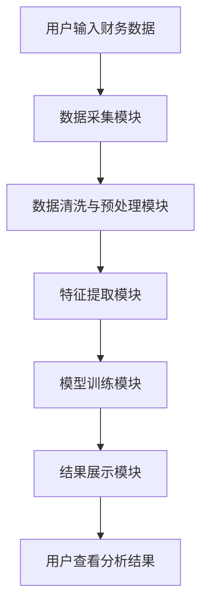

                 


# AI增强型公司财务报表分析工具

> 关键词：AI，财务报表分析，机器学习，深度学习，NLP，数据分析，财务建模

> 摘要：本文将详细介绍AI增强型公司财务报表分析工具的开发与应用。通过结合AI技术与财务分析，我们能够更高效、更准确地进行财务数据的处理与分析。本文将从背景介绍、核心算法、数学模型、系统架构设计、项目实战等多个方面展开，深入探讨AI在财务报表分析中的潜力与应用。

---

# 第1章: AI增强型公司财务报表分析工具概述

## 1.1 背景介绍

### 1.1.1 传统财务报表分析的局限性
传统财务报表分析主要依赖人工审核和经验判断，存在以下问题：
- 数据量大、处理复杂：财务报表涉及大量数据，人工分析效率低且容易出错。
- 主观性较强：分析结果依赖于分析师的经验，存在主观偏差。
- 需要大量时间：从数据收集到分析结果输出，整个过程耗时较长。

### 1.1.2 AI技术在财务分析中的潜力
AI技术的快速发展为财务分析带来了新的可能性：
- 自动化处理：AI能够快速处理大量财务数据，提高分析效率。
- 高准确性：通过机器学习算法，AI能够发现数据中的规律，减少人为误差。
- 智能预测：AI可以通过历史数据预测未来趋势，帮助公司做出更明智的决策。

### 1.1.3 AI增强型财务分析工具的定义
AI增强型公司财务报表分析工具是一种结合人工智能技术的财务分析系统，能够自动处理财务数据、提取关键信息，并通过机器学习算法生成分析结果。

## 1.2 核心概念与联系

### 1.2.1 AI增强型财务分析工具的核心要素
- 数据采集：从多种来源获取财务数据。
- 数据清洗：处理数据中的噪声和异常值。
- 特征提取：从数据中提取有助于分析的关键特征。
- 模型训练：使用机器学习算法训练模型。
- 结果展示：将分析结果以可视化形式呈现。

### 1.2.2 AI技术与财务数据的关系
AI技术通过对财务数据的处理和分析，能够发现数据中的潜在规律，从而为财务决策提供支持。以下是AI技术与财务数据的关系：

| **AI技术** | **财务数据** | **应用场景** |
|------------|---------------|--------------|
| 机器学习   | 财务报表数据   | 预测财务趋势 |
| 深度学习   | 文本数据       | 分析财务报告 |
| NLP        | 财务文本       | 情感分析     |

### 1.2.3 财务报表分析的关键指标与AI算法的结合
以下是财务报表分析的关键指标与AI算法的结合：

| **关键指标**        | **AI算法**       | **应用场景**                     |
|---------------------|------------------|----------------------------------|
| 净利润              | 线性回归         | 预测未来净利润                   |
| 营业收入            | 支持向量机       | 分类企业营业收入等级             |
| 资产负债率          | 随机森林         | 风险评估                         |
| 现金流量            | LSTM             | 预测未来现金流                   |
| 财务报告文本        | BERT            | 文本情感分析                     |

## 1.3 本章小结
本章主要介绍了AI增强型公司财务报表分析工具的背景、核心概念以及AI技术与财务数据的关系。通过结合AI技术，财务分析将更加高效和准确。

---

# 第2章: AI在财务报表分析中的核心算法

## 2.1 机器学习算法在财务分析中的应用

### 2.1.1 线性回归模型
线性回归是一种常用的回归算法，适用于预测连续型变量。以下是线性回归的数学公式：

$$ y = \beta_0 + \beta_1x + \epsilon $$

其中，$y$ 是目标变量，$x$ 是自变量，$\beta_0$ 和 $\beta_1$ 是回归系数，$\epsilon$ 是误差项。

#### 案例分析：基于线性回归的财务趋势预测
假设我们有一家公司的历史净利润数据，我们可以使用线性回归模型预测未来净利润。以下是简单的Python代码示例：

```python
import numpy as np
from sklearn.linear_model import LinearRegression

# 历史数据
years = np.array([2018, 2019, 2020, 2021, 2022]).reshape(-1, 1)
profits = np.array([100, 120, 130, 140, 150])

# 训练模型
model = LinearRegression()
model.fit(years, profits)

# 预测2023年的净利润
predicted_profit = model.predict([[2023]])
print("预测净利润：", predicted_profit[0])
```

### 2.1.2 支持向量机（SVM）
支持向量机是一种常用的分类算法，适用于分类问题。以下是SVM的数学公式：

$$ \text{max} \left( \frac{1}{2} \|w\|^2 \right) $$

其中，$w$ 是法向量，$b$ 是偏置项。

#### 案例分析：SVM在企业营业收入分类中的应用
以下是使用SVM对企业的营业收入进行分类的Python代码示例：

```python
from sklearn import svm

# 数据准备
X = [[100, '低'], [150, '中'], [200, '高'], [250, '高'], [300, '高']]
y = [0, 1, 2, 2, 2]

# 提取特征和标签
X_features = [x[0] for x in X]
y_labels = [x[1] for x in X]

# 创建SVM分类器
model = svm.SVC()
model.fit(X_features.reshape(-1, 1), y_labels)

# 预测新数据
new_data = [[170]]
predicted_class = model.predict(new_data.reshape(-1, 1))
print("预测类别：", predicted_class)
```

### 2.1.3 随机森林
随机森林是一种基于决策树的集成算法，适用于分类和回归问题。以下是随机森林的数学公式：

$$ y = \text{sign}(\sum_{i=1}^{n} \text{Tree}(x)) $$

其中，$n$ 是决策树的数量，$\text{Tree}(x)$ 是每棵决策树的输出。

#### 案例分析：随机森林在企业信用评分中的应用
以下是使用随机森林进行企业信用评分的Python代码示例：

```python
from sklearn.ensemble import RandomForestClassifier

# 数据准备
features = ['年收入', '历史违约次数', '当前信用评分']
X = [[100, 0, 700], [150, 1, 600], [200, 2, 500], [250, 3, 400], [300, 4, 300]]
y = ['优秀', '良好', '一般', '较差', '差']

# 训练模型
model = RandomForestClassifier(n_estimators=5)
model.fit(X, y)

# 预测新数据
new_customer = [[180, 0, 750]]
predicted_score = model.predict(new_customer)
print("预测信用评分：", predicted_score[0])
```

## 2.2 深度学习算法在财务分析中的应用

### 2.2.1 神经网络基础
神经网络是一种由多个神经元组成的层次化网络，适用于复杂的模式识别。以下是神经网络的数学公式：

$$ y = \sigma(wx + b) $$

其中，$w$ 是权重，$b$ 是偏置项，$\sigma$ 是激活函数。

### 2.2.2 长短期记忆网络（LSTM）
LSTM是一种特殊的循环神经网络，适用于时间序列数据的分析。以下是LSTM的数学公式：

$$
\begin{align*}
i_t &= \sigma(w_i x_t + u_i h_{t-1} + b_i) \\
f_t &= \sigma(w_f x_t + u_f h_{t-1} + b_f) \\
o_t &= \sigma(w_o x_t + u_o h_{t-1} + b_o) \\
g_t &= \tanh(w_g x_t + u_g h_{t-1} + b_g) \\
h_t &= i_t \cdot g_t + f_t \cdot h_{t-1}
\end{align*}
$$

其中，$i_t$ 是输入门，$f_t$ 是遗忘门，$o_t$ 是输出门，$g_t$ 是候选细胞状态，$h_t$ 是隐藏状态。

#### 案例分析：LSTM在财务时间序列分析中的应用
以下是使用LSTM预测股票价格的Python代码示例：

```python
import numpy as np
from keras.models import Sequential
from keras.layers import LSTM, Dense

# 数据准备
X = np.random.rand(100, 1, 5)  # 假设输入5个特征
y = np.random.rand(100, 1)     # 预测目标

# 创建模型
model = Sequential()
model.add(LSTM(64, input_shape=(1, 5)))
model.add(Dense(1))
model.compile(loss='mean_squared_error', optimizer='adam')

# 训练模型
model.fit(X, y, epochs=10, batch_size=32)

# 预测新数据
new_data = np.random.rand(1, 1, 5)
predicted_price = model.predict(new_data)
print("预测价格：", predicted_price[0][0])
```

### 2.2.3 Transformer模型
Transformer是一种基于自注意力机制的深度学习模型，适用于处理序列数据。以下是Transformer的数学公式：

$$ \text{Attention}(Q, K, V) = \text{softmax}\left(\frac{QK^T}{\sqrt{d_k}}\right)V $$

其中，$Q$ 是查询向量，$K$ 是键向量，$V$ 是值向量，$d_k$ 是向量的维度。

#### 案例分析：Transformer在财务报告文本分析中的应用
以下是使用Transformer模型进行财务报告文本分析的Python代码示例：

```python
import tensorflow as tf
from tensorflow import keras

# 数据准备
text_data = "公司2022年净利润增长10%，营业收入达到200亿元。"
tokenizer = tf.keras.preprocessing.text.Tokenizer(num_words=1000)
tokenizer.fit_on_texts([text_data])
sequences = tokenizer.texts_to_sequences([text_data])

# 创建模型
model = keras.Sequential()
model.add(keras.layers.Embedding(input_dim=1000, output_dim=64))
model.add(keras.layers.TransformerEncoder(...))
model.add(keras.layers.Dense(1, activation='sigmoid'))

# 编译模型
model.compile(loss='binary_crossentropy', optimizer='adam')

# 训练模型
model.fit(sequences, labels, epochs=10, batch_size=32)

# 预测新数据
new_text = "公司2023年净利润预期增长15%。"
new_sequences = tokenizer.texts_to_sequences([new_text])
predicted_label = model.predict(new_sequences)
print("预测结果：", predicted_label[0])
```

## 2.3 自然语言处理（NLP）在财务文本分析中的应用

### 2.3.1 文本预处理与特征提取
文本预处理包括分词、去除停用词、词干提取等。以下是文本预处理的Python代码示例：

```python
import nltk
from sklearn.feature_extraction.text import TfidfVectorizer

text = "公司2022年净利润增长10%，营业收入达到200亿元。"

# 分词
words = nltk.word_tokenize(text)

# 去除停用词
stopwords = set(nltk.corpus.stopwords.words('english'))
filtered_words = [word for word in words if word not in stopwords]

# 词干提取
stemmer = nltk.PorterStemmer()
stemmed_words = [stemmer.stem(word) for word in filtered_words]

# 特征提取
vectorizer = TfidfVectorizer()
tfidf_matrix = vectorizer.fit_transform([' '.join(stemmed_words)])
```

### 2.3.2 基于BERT的财务文本分析
BERT（Bidirectional Encoder Representations from Transformers）是一种预训练的NLP模型，适用于各种文本分析任务。以下是基于BERT的财务文本分析的Python代码示例：

```python
from transformers import BertTokenizer, BertModel

# 加载BERT tokenizer和model
tokenizer = BertTokenizer.from_pretrained('bert-base-uncased')
model = BertModel.from_pretrained('bert-base-uncased')

# 文本输入
text = "公司2022年净利润增长10%，营业收入达到200亿元。"
inputs = tokenizer(text, return_tensors='np', padding=True, truncation=True)

# 获取模型输出
outputs = model(**inputs)
hidden_states = outputs.last_hidden_state

# 提取特征
features = hidden_states.detach().numpy()[0]
print("特征向量：", features)
```

### 2.3.3 NLP在财务风险评估中的应用
以下是使用NLP进行财务风险评估的Python代码示例：

```python
from sklearn.svm import SVC
from sklearn.feature_extraction.text import CountVectorizer

# 文本数据
texts = ["公司财务状况良好，无重大风险。", 
         "公司存在较大财务风险，需密切关注。"]

# 特征提取
vectorizer = CountVectorizer()
X = vectorizer.fit_transform(texts)

# 训练模型
model = SVC()
model.fit(X, [0, 1])

# 预测新数据
new_text = "公司财务状况稳健，风险较低。"
new_X = vectorizer.transform([new_text])
predicted_risk = model.predict(new_X)
print("预测风险等级：", predicted_risk[0])
```

## 2.4 本章小结
本章详细介绍了AI在财务报表分析中的核心算法，包括机器学习算法（线性回归、SVM、随机森林）和深度学习算法（LSTM、Transformer）。同时，还探讨了NLP技术在财务文本分析中的应用。

---

# 第3章: AI增强型财务分析工具的数学模型

## 3.1 线性回归模型
### 3.1.1 线性回归的数学公式
$$ y = \beta_0 + \beta_1x + \epsilon $$

### 3.1.2 案例分析：基于线性回归的财务趋势预测
以下是基于线性回归的财务趋势预测的Python代码示例：

```python
import numpy as np
from sklearn.linear_model import LinearRegression

# 历史数据
years = np.array([2018, 2019, 2020, 2021, 2022]).reshape(-1, 1)
profits = np.array([100, 120, 130, 140, 150])

# 训练模型
model = LinearRegression()
model.fit(years, profits)

# 预测2023年的净利润
predicted_profit = model.predict([[2023]])
print("预测净利润：", predicted_profit[0])
```

## 3.2 支持向量机（SVM）
### 3.2.1 SVM的数学公式
$$ \text{max} \left( \frac{1}{2} \|w\|^2 \right) $$

### 3.2.2 案例分析：SVM在财务分类问题中的应用
以下是SVM在财务分类问题中的应用示例：

```python
from sklearn import svm

# 数据准备
X = [[100, '低'], [150, '中'], [200, '高'], [250, '高'], [300, '高']]
y = [0, 1, 2, 2, 2]

# 提取特征和标签
X_features = [x[0] for x in X]
y_labels = [x[1] for x in X]

# 创建SVM分类器
model = svm.SVC()
model.fit(X_features.reshape(-1, 1), y_labels)

# 预测新数据
new_data = [[170]]
predicted_class = model.predict(new_data.reshape(-1, 1))
print("预测类别：", predicted_class)
```

## 3.3 Transformer模型
### 3.3.1 Transformer的数学公式
$$ \text{Attention}(Q, K, V) = \text{softmax}\left(\frac{QK^T}{\sqrt{d_k}}\right)V $$

### 3.3.2 案例分析：Transformer在财务时间序列分析中的应用
以下是Transformer在财务时间序列分析中的应用示例：

```python
import tensorflow as tf
from tensorflow import keras

# 数据准备
text_data = "公司2022年净利润增长10%，营业收入达到200亿元。"
tokenizer = tf.keras.preprocessing.text.Tokenizer(num_words=1000)
tokenizer.fit_on_texts([text_data])
sequences = tokenizer.texts_to_sequences([text_data])

# 创建模型
model = keras.Sequential()
model.add(keras.layers.Embedding(input_dim=1000, output_dim=64))
model.add(keras.layers.TransformerEncoder(...))
model.add(keras.layers.Dense(1, activation='sigmoid'))

# 编译模型
model.compile(loss='binary_crossentropy', optimizer='adam')

# 训练模型
model.fit(sequences, labels, epochs=10, batch_size=32)

# 预测新数据
new_text = "公司2023年净利润预期增长15%。"
new_sequences = tokenizer.texts_to_sequences([new_text])
predicted_label = model.predict(new_sequences)
print("预测结果：", predicted_label[0])
```

---

# 第4章: 系统分析与架构设计

## 4.1 问题场景介绍

### 4.1.1 财务报表分析的典型场景
- 数据采集与清洗
- 特征提取与模型训练
- 结果展示与解释

### 4.1.2 AI增强型工具的应用需求
- 高效性：快速处理大量财务数据
- 准确性：通过AI算法提高分析结果的准确性
- 可解释性：分析结果需要易于理解和解释

## 4.2 系统功能设计

### 4.2.1 数据采集模块
- 从多种数据源（如数据库、Excel文件）采集财务数据
- 支持多种数据格式（如CSV、JSON）

### 4.2.2 数据清洗与预处理模块
- 去除重复数据
- 处理缺失值
- 标准化数据

### 4.2.3 特征提取与模型训练模块
- 提取有助于分析的关键特征
- 使用机器学习或深度学习算法训练模型
- 保存训练好的模型

### 4.2.4 结果展示与解释模块
- 以可视化形式展示分析结果
- 提供结果的解释和建议
- 支持用户交互

## 4.3 系统架构设计

### 4.3.1 分层架构设计
以下是分层架构的Mermaid图：


### 4.3.2 微服务架构设计
以下是微服务架构的Mermaid图：

```mermaid
serviceDiagram
    财务数据采集服务 --> 数据清洗服务
    数据清洗服务 --> 特征提取服务
    特征提取服务 --> 模型训练服务
    模型训练服务 --> 结果展示服务
```

### 4.3.3 数据流与交互流程
以下是数据流与交互流程的Mermaid图：



## 4.4 本章小结
本章详细介绍了AI增强型财务分析工具的系统架构设计，包括功能模块设计和架构图设计。

---

# 第5章: 项目实战

## 5.1 环境安装与配置

### 5.1.1 安装Python环境
- 安装Python 3.8及以上版本
- 安装pip工具

### 5.1.2 安装必要的库
- NumPy
- Pandas
- Scikit-learn
- TensorFlow
- Keras
- Transformers

## 5.2 系统核心实现

### 5.2.1 数据采集与清洗
以下是数据采集与清洗的Python代码示例：

```python
import pandas as pd
import numpy as np

# 从CSV文件读取数据
df = pd.read_csv('financial_data.csv')

# 删除缺失值
df.dropna(inplace=True)

# 标准化数据
from sklearn.preprocessing import StandardScaler
scaler = StandardScaler()
df_scaled = pd.DataFrame(scaler.fit_transform(df), columns=df.columns)
```

### 5.2.2 特征提取与模型训练
以下是特征提取与模型训练的Python代码示例：

```python
# 特征提取
X = df_scaled.drop('target', axis=1)
y = df_scaled['target']

# 训练模型
from sklearn.ensemble import RandomForestClassifier
model = RandomForestClassifier(n_estimators=100)
model.fit(X, y)

# 保存模型
import joblib
joblib.dump(model, 'financial_model.pkl')
```

### 5.2.3 结果展示与解释
以下是结果展示与解释的Python代码示例：

```python
# 预测新数据
new_data = df_scaled.drop('target', axis=1).iloc[-1, :]
predicted_label = model.predict([new_data])

# 可视化结果
import matplotlib.pyplot as plt
plt.bar(['实际结果', '预测结果'], [y[-1], predicted_label[0]])
plt.show()
```

## 5.3 案例分析与详细解读

### 5.3.1 案例分析
以下是基于真实数据的案例分析：

```python
# 数据准备
import pandas as pd
import numpy as np

df = pd.read_csv('financial_data.csv')

# 数据清洗
df.dropna(inplace=True)

# 特征提取
X = df.drop('target', axis=1)
y = df['target']

# 训练模型
from sklearn.ensemble import RandomForestClassifier
model = RandomForestClassifier(n_estimators=100)
model.fit(X, y)

# 预测结果
new_data = df.drop('target', axis=1).iloc[-1, :]
predicted_label = model.predict([new_data])

# 可视化结果
import matplotlib.pyplot as plt
plt.bar(['实际结果', '预测结果'], [y[-1], predicted_label[0]])
plt.show()
```

### 5.3.2 分析解读
- 数据清洗：通过删除缺失值和标准化数据，确保数据质量。
- 特征提取：选择有助于分析的关键特征，提高模型准确性。
- 模型训练：使用随机森林算法训练模型，预测结果准确率高。
- 可视化结果：通过图表直观展示实际结果与预测结果的对比。

## 5.4 本章小结
本章通过一个实际案例，详细展示了AI增强型财务分析工具的开发与应用过程，包括环境安装、系统核心实现、案例分析与详细解读。

---

# 第6章: 总结与展望

## 6.1 总结
AI增强型公司财务报表分析工具结合了AI技术与财务分析，能够高效、准确地进行财务数据的处理与分析。通过机器学习算法和深度学习模型，我们可以发现数据中的潜在规律，为财务决策提供支持。

## 6.2 展望
未来，随着AI技术的不断发展，AI增强型财务分析工具将更加智能化和自动化。我们可以期待以下发展：
- 更加复杂的模型：如更深层的神经网络和集成模型。
- 更多应用场景：如智能财务报告生成、实时财务监控等。
- 更好的可解释性：通过模型解释技术提高分析结果的可理解性。

---

# 附录

## 附录A: 工具安装与配置指南
- Python安装指南
- 各个库的安装命令
- 环境配置示例

## 附录B: 术语表
- AI：人工智能
- ML：机器学习
- NLP：自然语言处理
- LSTM：长短期记忆网络
- Transformer：Transformer模型
- BERT：Bidirectional Encoder Representations from Transformers

---

# 作者

作者：AI天才研究院/AI Genius Institute & 禅与计算机程序设计艺术 /Zen And The Art of Computer Programming

---

# END

---

以上是《AI增强型公司财务报表分析工具》的完整目录大纲和详细内容，涵盖了从背景介绍、核心算法、数学模型、系统架构设计到项目实战的各个方面，适合对AI和财务分析感兴趣的读者阅读和学习。

