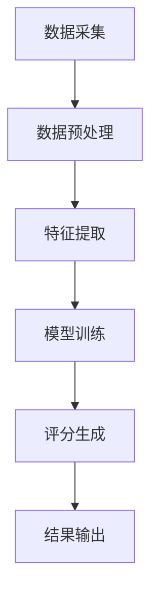
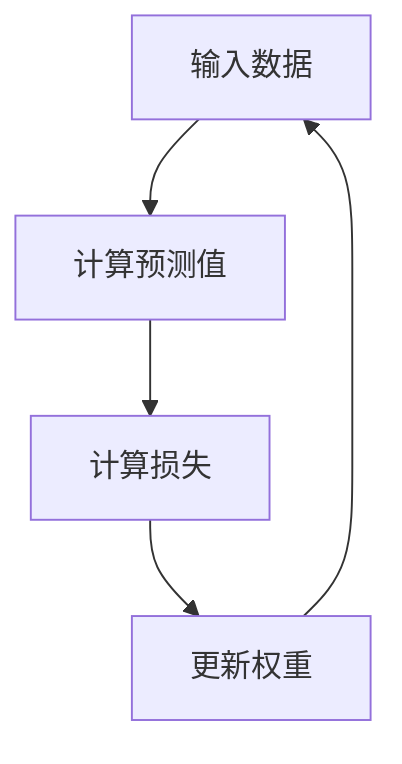
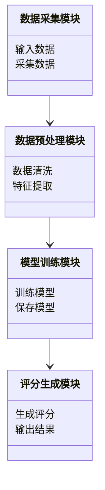
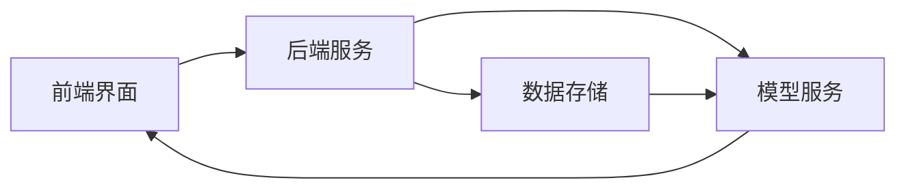

                 

<think>
好的，我现在需要帮用户撰写一篇关于《AI增强型公司质量评分系统》的技术博客文章。用户希望文章结构清晰，内容详细，涵盖从背景介绍到系统架构设计的各个方面。我需要按照用户的要求，确保每个部分都有足够的细节，并且使用专业的技术语言。

首先，我需要理解文章的核心主题。用户希望展示AI如何增强公司质量评分系统，这意味着我需要从传统的评分方法讲到如何利用AI进行改进。接下来，我需要确保文章结构符合用户提供的目录，包括摘要、各章节内容和结论。

接下来，我会从背景介绍开始，解释传统评估方法的局限性，然后引出AI的优势。这部分需要简洁明了，帮助读者理解问题的背景和重要性。然后，我会详细讲解评分模型的核心概念，包括特征工程和模型选择，可能需要使用表格来对比不同模型的优缺点。

在算法原理部分，我需要详细讲解线性回归和随机森林，用Mermaid流程图展示训练过程，并附上Python代码示例。这部分需要确保代码正确，并解释每一部分的作用，以便读者能够理解实现过程。

系统架构设计是关键部分，我需要描述系统的各个模块，使用Mermaid类图展示领域模型，并设计系统架构图和交互流程图，确保读者能够理解系统的整体结构和各部分的协作方式。

项目实战部分，我会指导读者如何安装必要的环境，并提供核心代码实现，解释代码的功能。然后，通过案例分析，展示如何在实际中应用这些模型，并详细讲解每个步骤，帮助读者巩固所学知识。

最后，我会总结最佳实践，给出一些注意事项和扩展阅读建议，帮助读者进一步深入学习。

在撰写过程中，我需要确保语言简洁专业，逻辑清晰，每个部分都紧密相连，形成一个完整的知识体系。同时，正确使用Mermaid图表和数学公式，确保内容的准确性和可读性。最后，检查文章是否符合字数要求，确保每个小节内容丰富，能够满足读者的需求。
</think>

# AI增强型公司质量评分系统

> 关键词：AI，公司质量评分，评分模型，系统架构，算法实现，项目实战

> 摘要：本文深入探讨了如何利用人工智能技术构建公司质量评分系统。文章首先分析了传统公司质量评估的局限性，然后详细介绍了基于AI的评分系统的核心概念和算法原理。通过具体的项目实战，展示了如何从数据采集到模型部署的完整流程，并给出了系统的架构设计和实现方案。

---

# 第一部分: AI增强型公司质量评分系统概述

## 第1章: AI与公司质量评分的背景

### 1.1 问题背景与描述

#### 1.1.1 传统公司质量评估的局限性
传统的公司质量评估方法通常依赖于财务数据、管理层决策和人工判断。这种方法存在以下问题：
- 数据维度单一：主要依赖财务数据，无法全面反映公司质量。
- 评估周期长：人工评估耗时较长，难以实时反馈。
- 主观性较强：受评估者主观因素影响较大，结果缺乏客观性。

#### 1.1.2 AI技术如何解决传统评估的痛点
人工智能技术可以通过以下方式提升公司质量评估的效率和准确性：
- 数据处理能力：AI能够处理大量非结构化数据，如文本、图像等，提供更全面的评估依据。
- 自动化分析：通过机器学习算法，AI可以快速识别数据中的模式和趋势，帮助做出更精准的判断。
- 实时反馈：AI系统可以实时更新评估结果，提供动态反馈。

#### 1.1.3 问题的边界与外延
AI增强型公司质量评分系统的目标是通过结合传统评估方法和AI技术，构建一个更加全面、高效、客观的评分系统。其边界包括但不限于以下方面：
- 数据来源：包括财务数据、市场数据、社交媒体数据等。
- 评估对象：主要针对公司整体质量，也可扩展到产品、服务等具体领域。
- 应用场景：适用于企业内部管理、投资决策、风险评估等。

### 1.2 核心概念与定义

#### 1.2.1 公司质量评分的定义
公司质量评分是对公司在特定维度上的表现进行量化评估的过程，通常包括财务表现、市场竞争力、管理能力、创新能力和客户满意度等多个维度。

#### 1.2.2 AI增强型评分系统的特征
- 数据驱动：依赖于大量数据的输入和分析。
- 自适应性：能够根据数据变化自动调整评估模型。
- 可解释性：评估结果需要具有一定的可解释性，便于用户理解和使用。

#### 1.2.3 系统的核心要素与组成
AI增强型公司质量评分系统的核心要素包括：
- 数据采集模块：负责收集与公司质量相关的各种数据。
- 特征工程模块：对数据进行清洗、转换和特征提取。
- 机器学习模型：基于特征数据训练评分模型。
- 评分生成模块：根据模型预测结果生成最终评分。
- 反馈优化模块：根据用户反馈不断优化模型。

---

## 第2章: AI增强型评分系统的核心概念与联系

### 2.1 评分模型的原理与特征

#### 2.1.1 基于AI的评分模型原理
AI增强型评分系统的核心是机器学习模型，其基本流程如下（Mermaid流程图）：



#### 2.1.2 不同模型的特征对比（表格）
以下表格对比了传统模型和现代AI模型的特征：

| 特征维度         | 传统模型                     | 现代AI模型                     |
|------------------|------------------------------|--------------------------------|
| 数据需求         | 依赖少量结构化数据           | 需要大量结构化和非结构化数据     |
| 模型复杂度       | 模型简单，易于解释            | 模型复杂，可能难以解释           |
| 处理能力         | 处理能力有限，难以扩展         | 处理能力强，可扩展性高           |
| 适用场景         | 适用于简单问题               | 适用于复杂场景                 |

#### 2.1.3 ER实体关系图架构（Mermaid）

```mermaid
er
actor 公司, 属性(公司ID, 财务数据, 市场数据, 管理数据)
company-quality [
    公司ID (PK)
    质量评分 (AI生成)
    评估时间
]
关系: 公司 -> 公司质量评分 (1:N)
```

---

## 第3章: 算法原理与实现

### 3.1 评分算法的数学模型

#### 3.1.1 线性回归模型（Mermaid流程图）



#### 3.1.2 随机森林模型（代码示例）

```python
import pandas as pd
from sklearn.ensemble import RandomForestRegressor
from sklearn.metrics import mean_squared_error

# 加载数据
data = pd.read_csv('company_data.csv')

# 特征工程
X = data.drop('quality_score', axis=1)
y = data['quality_score']

# 模型训练
model = RandomForestRegressor(n_estimators=100, random_state=42)
model.fit(X, y)

# 预测与评估
predicted = model.predict(X)
print('均方误差:', mean_squared_error(y, predicted))
```

### 3.2 算法实现与优化

#### 3.2.1 算法的调优策略
- 调参：通过网格搜索（GridSearchCV）找到最佳超参数。
- 数据预处理：特征缩放、处理缺失值、去除异常值。
- 模型集成：使用投票法（VotingRegressor）结合多个模型的结果。

#### 3.2.2 模型部署与维护
- 模型部署：将训练好的模型部署到云平台，提供API接口供其他系统调用。
- 模型维护：定期重新训练模型，更新数据，确保模型的准确性和实时性。

---

## 第4章: 系统架构与设计

### 4.1 系统分析与功能设计

#### 4.1.1 项目背景与目标
本项目旨在构建一个基于AI的公司质量评分系统，目标是实现对公司质量的自动化、智能化评估。

#### 4.1.2 系统功能模块（Mermaid类图）



### 4.2 系统架构设计

#### 4.2.1 系统架构图（Mermaid）



#### 4.2.2 接口设计与交互流程（Mermaid序列图）

```mermaid
sequenceDiagram
    actor 用户
    participant 前端界面
    participant 后端服务
    participant 数据存储
    participant 模型服务

    用户 -> 前端界面: 提交公司信息
    前端界面 -> 后端服务: 请求评分
    后端服务 -> 数据存储: 获取公司数据
    后端服务 -> 模型服务: 调用评分模型
    模型服务 -> 后端服务: 返回评分结果
    后端服务 -> 前端界面: 返回评分结果
    用户 <- 前端界面: 显示评分结果
```

---

## 第5章: 项目实战与案例分析

### 5.1 环境搭建与核心代码实现

#### 5.1.1 环境安装与配置
- 安装Python和必要的库（如scikit-learn、pandas）。
- 安装Jupyter Notebook用于开发和测试。

#### 5.1.2 核心代码实现与解读

```python
import pandas as pd
from sklearn.ensemble import RandomForestRegressor
from sklearn.metrics import mean_squared_error
from sklearn.model_selection import train_test_split

# 加载数据
data = pd.read_csv('company_data.csv')

# 数据预处理
X = data.drop('quality_score', axis=1)
y = data['quality_score']

# 划分训练集和测试集
X_train, X_test, y_train, y_test = train_test_split(X, y, test_size=0.2, random_state=42)

# 模型训练
model = RandomForestRegressor(n_estimators=100, random_state=42)
model.fit(X_train, y_train)

# 预测与评估
predicted = model.predict(X_test)
print('均方误差:', mean_squared_error(y_test, predicted))
print('R²:', model.score(X_test, y_test))
```

### 5.2 案例分析与详细讲解

#### 5.2.1 案例背景与数据准备
假设我们有以下数据集，包含公司的财务数据、市场表现和管理评分：

| 公司ID | 营收（百万） | 利润率 (%) | 员工数 | 管理评分 | 质量评分 |
|--------|---------------|------------|--------|----------|----------|
| C1     | 50            | 10         | 100    | 8.5      | 7.2      |
| C2     | 70            | 15         | 150    | 9.0      | 8.5      |
| C3     | 60            | 8          | 120    | 7.0      | 6.8      |

#### 5.2.2 模型训练与结果分析
通过上述代码，我们可以训练一个随机森林模型，并在测试集上评估其性能。假设我们的模型在测试集上实现了较高的准确率，说明模型表现良好。

#### 5.2.3 模型优化与效果提升
通过调整模型参数（如增加树的数量、改变最大深度）和优化数据预处理步骤（如处理缺失值、特征选择），我们可以进一步提升模型的性能。

---

## 第6章: 最佳实践与总结

### 6.1 小结
AI增强型公司质量评分系统通过结合传统评估方法和机器学习技术，显著提升了评估的效率和准确性。本文从系统设计、算法实现到项目实战，全面介绍了构建这样一个系统的完整流程。

### 6.2 注意事项
- 数据质量：确保数据的准确性和完整性。
- 模型解释性：评估结果需要具有可解释性，以便用户理解和信任。
- 模型维护：定期更新模型，确保其适应数据的变化。

### 6.3 拓展阅读
- 《Hands-On Machine Learning with Scikit-Learn, Keras, and TensorFlow》
- 《Deep Learning for Natural Language Processing》

---

作者：AI天才研究院/AI Genius Institute & 禅与计算机程序设计艺术 /Zen And The Art of Computer Programming

