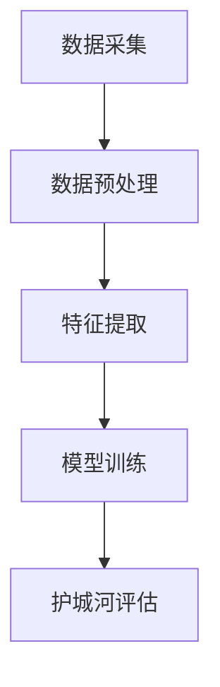

                 


# AI增强型巴菲特护城河分析系统

> 关键词：AI增强型、巴菲特护城河、护城河分析系统、AI技术、投资决策

> 摘要：本文介绍了一种结合人工智能技术的巴菲特护城河分析系统。通过分析传统护城河分析的局限性，提出了一种基于AI技术的增强型分析方法，详细阐述了系统的架构设计、算法实现、项目实战及优化策略。

---

## 第一部分: 巴菲特护城河理论与AI技术概述

### 第1章: 巴菲特护城河理论的核心概念

#### 1.1 投资中的护城河概念
##### 1.1.1 护城河的定义与核心要素
护城河是指企业在市场竞争中所具有的独特优势，能够保护企业免受竞争对手的侵蚀。核心要素包括：
- **成本优势**：企业在生产过程中具有更低的成本。
- **差异化优势**：企业的产品或服务具有独特的市场定位。
- **网络效应**：用户数量增加会增强产品的价值。
- **品牌优势**：强大的品牌形象和客户忠诚度。

##### 1.1.2 护城河的类型与特征
护城河的类型包括：
- **竞争优势型**：企业通过技术创新或专利获得竞争优势。
- **市场进入障碍型**：通过资本、技术或政策壁垒阻止竞争对手进入市场。
- **客户黏性型**：通过客户依赖性（如软件订阅）保持收入稳定。

##### 1.1.3 护城河在投资决策中的作用
护城河是巴菲特选股的核心标准之一。通过分析企业的护城河，投资者可以更好地判断企业的长期盈利能力。

---

### 第2章: AI技术在护城河分析中的应用前景

#### 2.1 AI技术的基本概念
人工智能（AI）是指计算机系统模拟人类智能的能力，包括学习、推理、感知和决策等。

#### 2.2 AI在金融分析中的优势
AI在金融分析中的优势包括：
- **数据处理能力**：AI能够快速处理大量数据，发现传统方法难以察觉的模式。
- **自动化决策**：AI可以通过训练模型自动做出投资决策。
- **实时监控**：AI可以实时监控市场变化，提供及时的预警。

#### 2.3 AI增强型护城河分析系统的必要性
传统护城河分析方法依赖于人工判断，存在主观性强、效率低下的问题。通过引入AI技术，可以实现更客观、高效的护城河分析。

---

## 第二部分: AI增强型护城河分析系统的核心原理

### 第3章: AI增强型护城河分析系统的背景与目标

#### 3.1 传统护城河分析的局限性
##### 3.1.1 数据量与复杂性对传统方法的挑战
随着市场竞争的加剧，企业护城河的分析需要考虑更多的变量，传统方法难以应对。
##### 3.1.2 传统方法在现代投资环境中的局限性
传统护城河分析方法难以量化护城河的强度，且缺乏动态调整能力。

#### 3.2 AI技术如何增强护城河分析
##### 3.2.1 数据处理能力的提升
AI技术可以快速处理大量数据，提取关键特征。
##### 3.2.2 智能化分析工具的优势
AI可以通过机器学习模型，自动判断企业的护城河类型和强度。
##### 3.2.3 AI在护城河评估中的创新应用
AI可以通过时间序列分析，预测护城河的未来变化趋势。

---

### 第4章: AI增强型护城河分析系统的架构与核心算法

#### 4.1 系统架构设计
##### 4.1.1 系统整体架构图


##### 4.1.2 数据流与模块划分
系统模块包括：
- 数据采集模块：从公开数据源获取企业信息。
- 数据预处理模块：清洗和标准化数据。
- 特征提取模块：提取护城河相关特征。
- 模型训练模块：训练护城河评估模型。
- 护城河评估模块：输出企业护城河评估结果。

#### 4.2 核心算法原理
##### 4.2.1 数据预处理与特征提取
- 数据预处理：包括数据清洗、缺失值填充、异常值处理。
- 特征提取：通过主成分分析（PCA）提取关键特征。

##### 4.2.2 护城河评估模型的构建
- 使用机器学习算法（如随机森林、支持向量机）训练模型。
- 模型输入：企业财务数据、市场数据、竞争对手数据。
- 模型输出：护城河强度评分（0-10分）。

##### 4.2.3 AI算法的优化与调优
- 参数调优：通过网格搜索优化模型参数。
- 模型评估：使用准确率、召回率、F1值评估模型性能。

---

## 第三部分: 项目实战与案例分析

### 第5章: 项目实战与案例分析

#### 5.1 项目环境搭建
##### 5.1.1 开发工具与库的安装
- 开发工具：Python、Jupyter Notebook。
- 库的安装：Pandas、NumPy、Scikit-learn、XGBoost。

##### 5.1.2 数据集的准备与获取
- 数据来源：从公开数据库获取企业财务数据和市场数据。
- 数据格式：CSV格式。

##### 5.1.3 环境配置与测试
- 安装Python依赖：`pip install pandas numpy scikit-learn xgboost`。
- 简单测试：运行一个简单的数据处理脚本。

#### 5.2 核心代码实现
##### 5.2.1 数据预处理代码
```python
import pandas as pd
import numpy as np

# 读取数据
data = pd.read_csv('enterprise_data.csv')

# 删除缺失值
data = data.dropna()

# 填充异常值
data['revenue'].replace(to_replace=np.nan, value=data['revenue'].mean(), inplace=True)
```

##### 5.2.2 模型训练代码
```python
from sklearn.model_selection import train_test_split
from xgboost import XGBClassifier
from sklearn.metrics import accuracy_score

# 划分数据集
X_train, X_test, y_train, y_test = train_test_split(data.drop('target', axis=1), data['target'], test_size=0.2)

# 训练模型
model = XGBClassifier()
model.fit(X_train, y_train)

# 预测与评估
y_pred = model.predict(X_test)
print("Accuracy:", accuracy_score(y_test, y_pred))
```

##### 5.2.3 模型评估与可视化代码
```python
from sklearn.metrics import confusion_matrix, classification_report

print(classification_report(y_test, y_pred))
```

#### 5.3 案例分析与结果解读
##### 5.3.1 典型案例的选择与分析
以某科技公司为例，分析其护城河强度。

##### 5.3.2 模型输出结果的解读
模型输出护城河强度评分，评分越高表示护城河越强。

##### 5.3.3 实战中的经验与教训
- 数据质量对模型性能影响较大。
- 模型调参是提升性能的关键。

---

## 第四部分: 系统优化与扩展

### 第6章: 系统优化与扩展

#### 6.1 系统优化策略
##### 6.1.1 模型优化
- 引入深度学习模型（如LSTM）提升时间序列预测能力。
##### 6.1.2 数据优化
- 增加更多数据源，如社交媒体数据、行业报告。
##### 6.1.3 系统性能优化
- 使用分布式计算提升处理效率。

#### 6.2 未来扩展方向
##### 6.2.1 多模型融合
- 结合多种模型（如随机森林、XGBoost）提升预测准确性。
##### 6.2.2 实时分析
- 构建实时数据处理管道，实现动态护城河评估。

---

## 第五部分: 最佳实践与总结

### 第7章: 最佳实践与总结

#### 7.1 最佳实践 tips
- 数据预处理是模型训练的基础，要确保数据质量。
- 模型调参是提升性能的关键，要耐心优化。
- 结合领域知识，选择合适的特征和模型。

#### 7.2 小结
本文介绍了一种基于AI技术的巴菲特护城河分析系统，详细阐述了系统的架构设计、算法实现和项目实战。通过案例分析，验证了系统的有效性和实用性。

#### 7.3 注意事项
- 数据隐私和安全问题需要高度重视。
- 模型的泛化能力需要在不同数据集上进行验证。

#### 7.4 拓展阅读
建议阅读《巴菲特选股之道》和《机器学习实战》深入理解护城河分析和AI技术。

---

## 作者信息

作者：AI天才研究院/AI Genius Institute & 禅与计算机程序设计艺术 /Zen And The Art of Computer Programming

