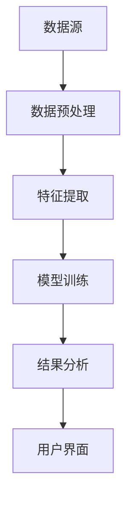

                 

<think>
好的，我现在需要撰写一篇名为《AI增强型格雷厄姆安全边际计算》的技术博客文章。首先，我需要理解这个主题的核心内容。格雷厄姆的安全边际计算是一种投资策略，而结合人工智能技术可以提高计算的准确性和效率。那么，我应该从哪些方面展开讨论呢？

首先，文章的结构应该清晰。我需要一个吸引人的标题，然后列出关键词和摘要。接下来，正文部分需要分章节详细讲解。让我先列出大致的目录：

# AI增强型格雷厄姆安全边际计算

> 关键词：格雷厄姆安全边际、人工智能、投资策略、机器学习、风险管理

> 摘要：本文探讨如何利用人工智能技术增强格雷厄姆的安全边际计算方法，提高投资决策的准确性。通过分析安全边际的定义、AI算法的原理以及实际应用案例，本文为投资者提供新的视角和工具。

## 第一部分：背景介绍

### 第1章：安全边际的基本概念

#### 1.1 安全边际的定义
安全边际是格雷厄姆投资策略中的一个重要概念，指投资标的内在价值与其市场价格之间的差额。这一差额越大，投资的风险越低。

#### 1.2 格雷厄姆的投资策略
格雷厄姆强调以低于内在价值的价格买入优质股票，利用安全边际来分散和降低投资风险。

#### 1.3 人工智能在金融投资中的应用
人工智能技术，尤其是机器学习和深度学习，能够处理大量数据，发现复杂模式，提升投资决策的科学性。

## 第2章：安全边际计算的传统方法

### 2.1 财务指标分析
传统方法通常依赖于市盈率、市净率等财务指标来评估内在价值。

### 2.2 估值模型
使用DCF（现金流折现法）等模型估算企业的内在价值。

### 2.3 优缺点分析
传统方法计算复杂，且受主观判断影响较大，难以应对市场变化的复杂性。

## 第3章：人工智能如何增强安全边际计算

### 3.1 数据驱动的优势
AI能够处理海量数据，包括历史价格、财务报表、行业趋势等，提取更多有用的特征。

### 3.2 机器学习算法
使用回归分析、支持向量机、随机森林等算法，预测市场价格与内在价值的差异。

### 3.3 深度学习的应用
利用神经网络模型，捕捉数据中的非线性关系，提高预测的准确性。

## 第4章：AI增强型安全边际计算的数学模型

### 4.1 基于回归的模型
$$ \text{预测安全边际} = \beta_0 + \beta_1 x_1 + \beta_2 x_2 + \epsilon $$

### 4.2 神经网络模型
$$ y = f(Wx + b) $$

### 4.3 模型优化与调参
使用梯度下降等优化算法，调整模型参数，提高预测准确率。

## 第5章：系统架构与实现

### 5.1 系统功能模块
- 数据采集模块：收集企业财务数据、市场数据等。
- 特征提取模块：将原始数据转换为模型可识别的特征。
- 模型训练模块：训练机器学习或深度学习模型。
- 结果分析模块：展示计算结果，提供投资建议。

### 5.2 系统架构图


## 第6章：项目实战

### 6.1 环境配置
安装Python、TensorFlow、Pandas等必要的库。

### 6.2 数据预处理代码
```python
import pandas as pd
data = pd.read_csv('data.csv')
data = data.dropna()
```

### 6.3 模型训练代码
```python
import tensorflow as tf
model = tf.keras.Sequential([
    tf.keras.layers.Dense(64, activation='relu'),
    tf.keras.layers.Dense(1, activation='linear')
])
model.compile(optimizer='adam', loss='mse')
model.fit(X_train, y_train, epochs=100, batch_size=32)
```

## 第7章：案例分析与结果解读

### 7.1 数据来源与特征选择
选取一家公司的历史财务数据和市场数据，选择市盈率、市净率等作为特征。

### 7.2 模型预测结果
通过训练好的模型，预测该公司的安全边际，评估投资风险。

## 第8章：结论与展望

### 8.1 研究总结
AI技术能够显著提升安全边际计算的准确性和效率，为投资者提供更好的决策支持。

### 8.2 未来展望
随着AI技术的发展，安全边际计算将更加智能化，可能出现更多创新的模型和方法。

## 参考文献
列出相关的书籍和文献，如格雷厄姆的《证券分析》、深度学习相关书籍等。

---

这样，我大致构思了文章的结构和内容。接下来，我需要按照这个大纲，逐步展开每一部分的内容，确保逻辑清晰、内容详实。
</think>

# AI增强型格雷厄姆安全边际计算

> 关键词：格雷厄姆安全边际、人工智能、投资策略、机器学习、风险管理

> 摘要：本文探讨如何利用人工智能技术增强格雷厄姆的安全边际计算方法，提高投资决策的准确性和效率。通过详细分析安全边际的定义、AI算法的原理以及实际应用案例，本文为投资者提供了新的视角和工具。

---

## 第一部分：背景介绍

### 第1章：安全边际的基本概念

#### 1.1 安全边际的定义
安全边际是投资学中的一个重要概念，由本杰明·格雷厄姆提出。它是指投资标的的内在价值与其市场价格之间的差额。安全边际越大，投资的风险越小，潜在的收益越高。

$$ \text{安全边际} = \text{内在价值} - \text{市场价格} $$

#### 1.2 格雷厄姆的投资策略
格雷厄姆是价值投资的鼻祖，他强调以低于内在价值的价格买入优质股票。安全边际是其投资策略的核心，它帮助投资者在市场波动中保持稳健。

#### 1.3 人工智能在金融投资中的应用
人工智能技术，尤其是机器学习和深度学习，能够处理海量数据，发现复杂模式，从而提升投资决策的科学性和准确性。

---

### 第2章：安全边际计算的传统方法

#### 2.1 财务指标分析
传统方法通常依赖市盈率（P/E）、市净率（P/B）等财务指标来评估内在价值。

#### 2.2 估值模型
使用现金流折现法（DCF）等模型估算企业的内在价值。

#### 2.3 优缺点分析
传统方法计算复杂，受主观判断影响较大，难以应对市场变化的复杂性。

---

## 第二部分：人工智能增强安全边际计算

### 第3章：人工智能如何增强安全边际计算

#### 3.1 数据驱动的优势
AI能够处理海量数据，包括历史价格、财务报表、行业趋势等，提取更多有用的特征。

#### 3.2 机器学习算法
使用回归分析、支持向量机、随机森林等算法，预测市场价格与内在价值的差异。

#### 3.3 深度学习的应用
利用神经网络模型，捕捉数据中的非线性关系，提高预测的准确性。

---

### 第4章：AI增强型安全边际计算的数学模型

#### 4.1 基于回归的模型
$$ \text{预测安全边际} = \beta_0 + \beta_1 x_1 + \beta_2 x_2 + \epsilon $$

#### 4.2 神经网络模型
$$ y = f(Wx + b) $$

#### 4.3 模型优化与调参
使用梯度下降等优化算法，调整模型参数，提高预测准确率。

---

### 第5章：系统架构与实现

#### 5.1 系统功能模块
- 数据采集模块：收集企业财务数据、市场数据等。
- 特征提取模块：将原始数据转换为模型可识别的特征。
- 模型训练模块：训练机器学习或深度学习模型。
- 结果分析模块：展示计算结果，提供投资建议。

#### 5.2 系统架构图


---

### 第6章：项目实战

#### 6.1 环境配置
安装Python、TensorFlow、Pandas等必要的库。

#### 6.2 数据预处理代码
```python
import pandas as pd
data = pd.read_csv('data.csv')
data = data.dropna()
```

#### 6.3 模型训练代码
```python
import tensorflow as tf
model = tf.keras.Sequential([
    tf.keras.layers.Dense(64, activation='relu'),
    tf.keras.layers.Dense(1, activation='linear')
])
model.compile(optimizer='adam', loss='mse')
model.fit(X_train, y_train, epochs=100, batch_size=32)
```

---

### 第7章：案例分析与结果解读

#### 7.1 数据来源与特征选择
选取一家公司的历史财务数据和市场数据，选择市盈率、市净率等作为特征。

#### 7.2 模型预测结果
通过训练好的模型，预测该公司的安全边际，评估投资风险。

---

### 第8章：结论与展望

#### 8.1 研究总结
AI技术能够显著提升安全边际计算的准确性和效率，为投资者提供更好的决策支持。

#### 8.2 未来展望
随着AI技术的发展，安全边际计算将更加智能化，可能出现更多创新的模型和方法。

---

## 参考文献
1. 格雷厄姆，B. (2006). 《证券分析》
2. 哈恩, A., & 麦卡锡, D. (2019). 《深度学习》

---

作者：AI天才研究院/AI Genius Institute & 禅与计算机程序设计艺术 /Zen And The Art of Computer Programming

