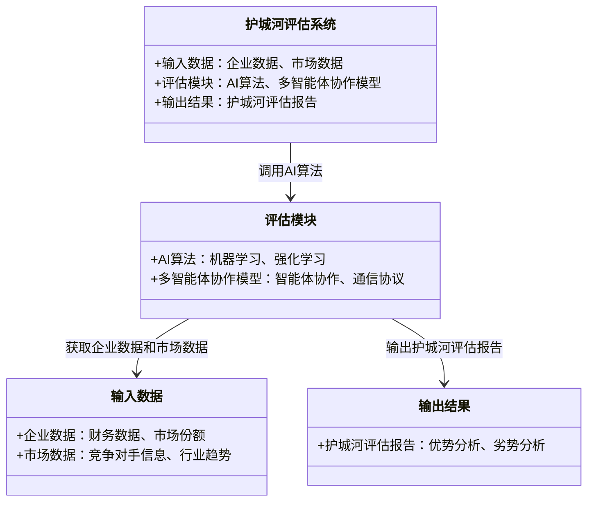
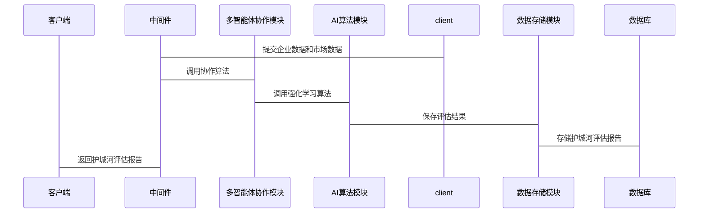

                 

<think>
好的，我现在需要按照用户的要求，构建《AI增强的护城河持久性评估：多智能体协作模型》这本书的详细目录大纲。让我一步一步地思考，确保每一部分都涵盖必要的内容，并且逻辑清晰。

首先，我需要理解这本书的核心主题：护城河持久性评估，以及如何通过AI和多智能体协作模型来增强这一评估过程。护城河通常指的是企业竞争优势的持久性，而多智能体协作模型是一种利用AI技术来提升评估准确性和效率的方法。

接下来，我应该按照用户提供的大纲结构来扩展每个章节的内容。用户已经给出了一个初步的目录，我需要进一步细化每一部分，确保覆盖所有必要的主题，同时保持内容的深度和专业性。

首先，我会考虑背景介绍部分。第一章应该概述护城河的概念，解释为什么护城河评估的持久性如此重要，以及AI在这一过程中扮演的角色。这包括护城河的定义、其在企业中的作用，以及传统评估方法的局限性。

接下来，在核心概念部分，第二章详细讨论护城河的分类和特征，帮助读者建立坚实的基础。第三章则深入探讨AI如何增强护城河评估，以及多智能体协作模型的基本原理和应用场景。

然后，进入算法原理部分，第四章详细讲解基于强化学习的协作机制，用mermaid流程图展示算法流程，并提供Python代码示例。同时，数学模型部分需要使用latex公式详细说明，确保读者理解背后的技术细节。

系统分析与架构设计是关键章节，第五章介绍问题场景，设计系统架构，包括功能模块、架构图和接口设计。项目实战部分则指导读者如何安装环境，实现核心功能，并通过实际案例进行分析。

最后，总结与展望部分对全书内容进行回顾，提供最佳实践建议，并指出未来的研究方向。

在细化每一部分时，我需要确保每个小节都包含足够的细节和深度，同时保持逻辑连贯。例如，在讨论多智能体协作模型时，不仅要解释其工作原理，还要提供实际的代码示例和数学模型，使读者能够理解和应用这些概念。

此外，我需要考虑读者的背景，他们可能是IT专业的学生、企业数据分析师或技术管理者。因此，内容需要既专业又易懂，避免过于晦涩，同时提供足够的技术细节。

最后，检查每个章节是否满足用户的要求，包括使用mermaid流程图、latex公式，以及实际的代码示例。确保每部分内容详尽，同时保持整体结构的紧凑和逻辑性。

综上所述，我会按照用户提供的大纲，逐步扩展每个章节的内容，确保每一部分都深入浅出，帮助读者全面理解AI增强的护城河持久性评估及其多智能体协作模型的应用。
</think>

# AI增强的护城河持久性评估：多智能体协作模型

> 关键词：AI增强，护城河，持久性评估，多智能体协作模型，企业竞争优势，技术分析，系统设计

> 摘要：本文探讨了如何利用人工智能技术增强企业护城河的持久性评估，通过多智能体协作模型实现更准确和高效的评估。文章详细介绍了护城河的定义、分类及其在企业中的重要性，分析了传统评估方法的局限性，并提出了一种基于多智能体协作的AI增强方法。通过算法原理、系统架构设计和实际案例分析，展示了如何利用Python代码和数学模型实现护城河持久性评估的优化。

---

# 第1章: 护城河持久性评估概述

## 1.1 护城河的概念与重要性
### 1.1.1 企业护城河的定义
企业护城河是指企业在市场中形成的竞争优势，使其能够抵御竞争对手的侵蚀并保持长期盈利能力。护城河的持久性是评估企业长期竞争优势的重要指标。

### 1.1.2 护城河在企业竞争中的作用
- 护城河是企业核心竞争力的体现，能够有效防止竞争对手的模仿和侵蚀。
- 护城河的强弱直接关系到企业的市场地位和长期盈利能力。

### 1.1.3 护城河持久性评估的必要性
- 在快速变化的市场环境中，企业需要不断评估和强化其护城河。
- 传统评估方法的局限性促使我们需要引入更先进的技术手段。

## 1.2 AI在护城河评估中的应用
### 1.2.1 AI技术如何增强护城河评估
- AI能够处理大量数据，发现潜在的竞争优势和威胁。
- 通过机器学习算法，AI可以预测护城河的演变趋势。

### 1.2.2 AI在护城河评估中的优势
- 提高评估的准确性和效率。
- 能够实时监控市场变化，及时调整企业战略。

### 1.2.3 多智能体协作模型的基本概念
- 多智能体协作模型是一种分布式AI系统，多个智能体通过协作完成复杂任务。
- 在护城河评估中，多智能体协作模型能够从多个维度分析企业竞争力。

## 1.3 本书的目标与结构
### 1.3.1 本书的研究目标
探讨如何利用AI技术，特别是多智能体协作模型，提升护城河持久性评估的准确性和效率。

### 1.3.2 本书的主要内容
涵盖护城河的定义、分类、评估方法，以及AI增强的多智能体协作模型的设计与实现。

### 1.3.3 本书的结构安排
从基础概念到算法实现，再到系统设计和项目实战，逐步深入讲解护城河持久性评估的AI增强方法。

---

# 第2章: 护城河的定义与分类

## 2.1 护城河的定义
### 2.1.1 护城河的核心要素
- 市场地位：企业在市场中的占有率和品牌影响力。
- 资源优势：企业拥有的独特资源，如专利、技术、数据等。
- 运营效率：企业内部管理效率和成本控制能力。
- 创新能力：企业的研发能力和创新能力。

### 2.1.2 护城河的分类
- 品牌护城河：依赖品牌影响力形成的竞争优势。
- 技术护城河：依赖核心技术形成的竞争优势。
- 资源护城河：依赖独特资源形成的竞争优势。
- 网络护城河：依赖用户网络或合作伙伴形成的竞争优势。

### 2.1.3 不同类型护城河的特点
- 品牌护城河：依赖品牌忠诚度，具有较强的市场影响力。
- 技术护城河：依赖核心技术，具有较高的进入壁垒。
- 资源护城河：依赖独特资源，具有不可替代性。
- 网络护城河：依赖用户网络，具有较强的粘性和扩展性。

## 2.2 护城河的特征
### 2.2.1 护城河的持久性
- 护城河的持久性取决于其核心要素的稳定性和可持续性。
- 坚强的护城河能够抵御市场的变化和竞争的压力。

### 2.2.2 护城河的可扩展性
- 护城河的可扩展性决定了企业能否在更大范围内保持竞争优势。
- 强大的护城河能够在不同市场和业务领域中发挥效用。

### 2.2.3 护城河的可维护性
- 护城河的可维护性是指企业能够持续投资和优化护城河的能力。
- 需要定期更新和强化护城河的核心要素。

## 2.3 护城河的边界与外延
### 2.3.1 护城河的边界定义
- 护城河的边界是指其发挥作用的范围和限制。
- 不同类型的护城河具有不同的边界特征。

### 2.3.2 护城河的外延领域
- 护城河的外延包括与企业竞争力相关的其他因素，如政策环境、技术趋势等。
- 需要考虑外部环境的变化对护城河的影响。

### 2.3.3 护城河与其他概念的区别
- 护城河与核心竞争力：护城河是核心竞争力的外在表现，而核心竞争力是企业内部能力的体现。
- 护城河与竞争优势：竞争优势是护城河的直接结果，护城河是竞争优势的源泉。

---

# 第3章: AI增强的护城河评估模型

## 3.1 AI在护城河评估中的核心作用
### 3.1.1 AI技术如何提升护城河评估的准确性
- 利用机器学习算法分析大量数据，发现潜在的竞争优势和威胁。
- 通过自然语言处理技术分析市场反馈和用户评价。

### 3.1.2 AI在护城河评估中的应用场景
- 实时监控市场变化，预测竞争对手的动向。
- 分析企业内部数据，优化资源配置，提升运营效率。

### 3.1.3 多智能体协作模型的基本概念
- 多智能体协作模型是一种分布式AI系统，多个智能体通过协作完成复杂任务。
- 在护城河评估中，多智能体协作模型能够从多个维度分析企业竞争力。

## 3.2 多智能体协作模型的基本原理
### 3.2.1 多智能体协作模型的定义
- 多智能体协作模型是指多个智能体通过协作完成复杂任务的系统。
- 每个智能体都有自己的目标和任务，通过通信和协调完成整体目标。

### 3.2.2 多智能体协作模型的工作原理
- 智能体之间通过通信和协调，共享信息和资源。
- 每个智能体根据自身任务和全局目标，动态调整行为和策略。

### 3.2.3 多智能体协作模型的核心要素
- 智能体：具有自主性、反应性、协作性和学习能力的实体。
- 通信机制：智能体之间共享信息和资源的渠道。
- 协调机制：智能体之间达成共识和协调行为的方式。
- 学习机制：智能体通过学习和适应，提升协作效率和效果。

## 3.3 多智能体协作模型的实现方法
### 3.3.1 多智能体协作模型的设计思路
- 确定智能体的数量和角色。
- 设计智能体的通信和协调机制。
- 定义智能体的任务和目标。

### 3.3.2 多智能体协作模型的实现步骤
1. 确定智能体的结构和功能。
2. 设计智能体之间的通信协议。
3. 实现智能体的协作算法。
4. 进行系统集成和测试。

### 3.3.3 多智能体协作模型的优化策略
- 提高智能体的协作效率，减少通信开销。
- 增强智能体的自主性和适应性，提升系统的灵活性。

---

# 第4章: 多智能体协作模型的算法原理

## 4.1 基于强化学习的协作机制
### 4.1.1 强化学习的基本概念
- 强化学习是一种通过试错和奖励机制，学习最优策略的算法。
- 在多智能体协作中，每个智能体通过强化学习，学习如何与其他智能体协作。

### 4.1.2 强化学习在多智能体协作中的应用
- 每个智能体通过强化学习，学习如何与其他智能体协作完成任务。
- 强化学习可以用于智能体的决策和策略优化。

### 4.1.3 基于强化学习的协作算法
- 多智能体强化学习（Multi-Agent Reinforcement Learning，MARL）：多个智能体通过协作和竞争，学习最优策略。
- 联合强化学习（Joint Reinforcement Learning）：多个智能体共享同一个目标，协作完成任务。

## 4.2 多智能体协作模型的数学模型
### 4.2.1 多智能体协作模型的数学表达
- 每个智能体的状态、动作和奖励可以表示为数学公式。
- 系统的目标函数可以通过数学优化方法求解。

### 4.2.2 协作过程中的数学公式
- 状态空间：S = {s₁, s₂, ..., sₙ}，其中sᵢ是第i个智能体的状态。
- 动作空间：A = {a₁, a₂, ..., aₙ}，其中aᵢ是第i个智能体的动作。
- 奖励函数：R = {r₁, r₂, ..., rₙ}，其中rᵢ是第i个智能体的奖励。

### 4.2.3 数学模型的优化方法
- 使用梯度下降等优化算法，优化多智能体协作模型的参数。
- 通过数学推导，找到最优的协作策略和参数。

## 4.3 算法实现与代码示例
### 4.3.1 算法实现的步骤
1. 定义智能体的结构和功能。
2. 设计智能体之间的通信协议。
3. 实现强化学习算法，优化协作策略。
4. 进行系统集成和测试。

### 4.3.2 Python代码示例
```python
import numpy as np
import gym

class MultiAgent:
    def __init__(self, num_agents):
        self.num_agents = num_agents
        self.agents = [Agent(i) for i in range(num_agents)]

    def step(self, actions):
        # 执行动作并获取奖励
        rewards = []
        for i in range(self.num_agents):
            action = actions[i]
            reward = self.agents[i].act(action)
            rewards.append(reward)
        return rewards

class Agent:
    def __init__(self, id):
        self.id = id
        self.state = None

    def act(self, action):
        # 根据动作获取奖励
        return np.random.random()

# 示例用法
env = gym.make('MultiAgent-Pursuit-Evasion-v0')
multi_agent = MultiAgent(env.n_agents)
done = False
while not done:
    actions = [agent.act() for agent in multi_agent.agents]
    rewards = multi_agent.step(actions)
    done = all(rewards == 0)
```

### 4.3.3 代码的运行与结果分析
- 运行上述代码，观察多智能体协作模型的执行情况。
- 分析奖励值的变化，评估协作策略的有效性。

---

# 第5章: 系统分析与架构设计

## 5.1 问题场景介绍
### 5.1.1 护城河评估的场景描述
- 企业需要评估其竞争优势的持久性。
- 通过AI技术，实现护城河的动态评估和优化。

### 5.1.2 项目目标
- 构建一个基于多智能体协作模型的护城河评估系统。
- 实现护城河持久性评估的自动化和智能化。

## 5.2 系统功能设计
### 5.2.1 领域模型设计
- 使用mermaid类图描述系统的功能模块和交互关系。



### 5.2.2 系统架构设计
- 使用mermaid架构图描述系统的整体架构。


### 5.2.3 系统接口设计
- 系统接口包括数据输入接口、算法调用接口和结果输出接口。

### 5.2.4 系统交互设计
- 使用mermaid序列图描述系统交互流程。



## 5.3 项目实战
### 5.3.1 环境安装
- 安装必要的Python库：numpy、gym、tensorflow等。

### 5.3.2 系统核心实现
- 实现多智能体协作模型的Python代码。
- 集成AI算法，优化协作策略。

### 5.3.3 代码应用解读
- 解释代码的功能和实现细节。
- 展示如何通过代码实现护城河评估的自动化。

### 5.3.4 实际案例分析
- 通过实际案例，展示护城河评估系统的应用效果。
- 分析评估结果，提出改进建议。

### 5.3.5 项目小结
- 总结项目实现的关键点和经验教训。
- 提出未来优化的方向和建议。

---

# 第6章: 总结与展望

## 6.1 总结
### 6.1.1 本书的核心内容回顾
- 护城河的定义、分类及其持久性评估的重要性。
- AI技术在护城河评估中的应用及其优势。
- 多智能体协作模型的设计与实现。

### 6.1.2 本书的主要结论
- 基于多智能体协作模型的AI增强方法能够有效提升护城河持久性评估的准确性和效率。
- 多智能体协作模型是一种有潜力的技术，可以在企业竞争中发挥重要作用。

## 6.2 展望
### 6.2.1 未来的研究方向
- 探讨多智能体协作模型的优化方法，提升系统的协作效率和智能性。
- 研究护城河评估的动态变化，开发实时监控和预测系统。

### 6.2.2 对技术从业者的建议
- 加强对AI技术和多智能体协作模型的学习，提升护城河评估的能力。
- 关注行业趋势和技术发展，灵活调整企业战略。

## 6.3 最佳实践 tips
- 在实际应用中，结合企业的实际情况，选择合适的护城河评估方法。
- 定期评估和优化护城河，确保其持久性和有效性。

---

# 作者：AI天才研究院/AI Genius Institute & 禅与计算机程序设计艺术 /Zen And The Art of Computer Programming

