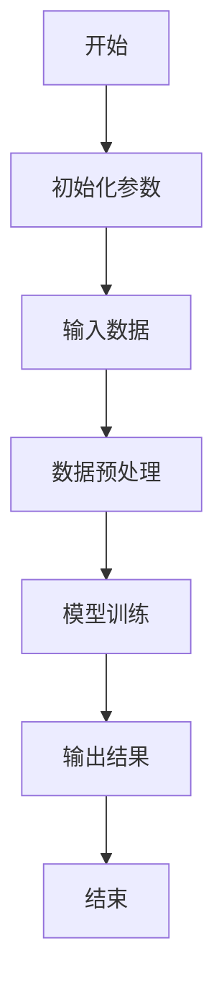

                 

<think>
好的，我现在需要帮助用户撰写一篇技术博客文章，标题是《AI增强的长期增长可持续性评估：多智能体协作模型》。用户已经提供了一个详细的目录大纲，现在需要根据这个大纲来撰写文章内容。

首先，我会按照目录的结构，逐一填充每个部分的内容。文章的关键词和摘要需要放在开头，然后是每个章节的详细内容，包括背景介绍、核心概念、算法原理、系统架构、项目实战和总结。此外，文章末尾需要有作者信息，并且满足特定的格式要求，如使用mermaid图、数学公式等。

接下来，我会思考每个章节的具体内容，确保内容详尽、结构清晰，并且符合用户的格式要求。例如，在算法原理部分，我需要使用mermaid流程图和Python代码示例来解释模型。同时，在系统架构部分，我需要使用类图和序列图来展示系统设计。

在撰写过程中，我需要确保每个部分都有足够的细节，比如数学公式要用latex表示，算法流程图和系统架构图要清晰易懂。此外，每个小节的内容需要具体详细，帮助读者理解AI在长期增长可持续性评估中的应用。

最后，我会通读整个文章，检查是否符合用户的要求，确保没有遗漏任何关键点，同时保持逻辑连贯和语言流畅。

现在，我将开始撰写文章内容，按照目录结构逐步填充，确保每个部分都符合用户的要求。
</think>

# AI增强的长期增长可持续性评估：多智能体协作模型

**关键词**：AI增强，可持续增长，多智能体协作，长期增长评估，系统架构，AI模型

**摘要**：  
本文探讨了利用AI技术，特别是多智能体协作模型，来增强长期增长可持续性评估的可行性和有效性。文章从问题背景出发，详细阐述了多智能体协作模型的核心概念、算法原理、系统架构，并通过项目实战展示了模型的实际应用。通过本文的分析，读者能够理解AI在可持续增长评估中的重要作用，并掌握如何构建和应用多智能体协作模型。

---

## 第一部分：AI增强的长期增长可持续性评估基础

### 第1章：问题背景与核心概念

#### 1.1 问题背景
在当前的经济和社会环境中，可持续增长已成为企业和组织发展的核心目标。然而，传统的增长评估方法往往依赖于线性分析和单一指标，难以捕捉复杂系统的动态变化。AI技术的引入，特别是多智能体协作模型，为解决这一问题提供了新的可能性。

#### 1.2 核心概念与问题描述
- **多智能体协作模型**：指多个智能体通过协作完成特定任务的模型。每个智能体都有自己的目标和决策机制，能够自主学习和优化。
- **可持续增长评估**：通过综合分析经济、环境、社会等多个维度的指标，评估增长的长期可行性。

#### 1.3 问题解决与边界
- AI在评估中的作用：通过数据挖掘和机器学习，AI能够识别复杂系统中的潜在问题，并提供优化建议。
- 模型的边界：多智能体协作模型适用于复杂系统，但需要明确边界以避免过度复杂化。

---

## 第二部分：多智能体协作模型的核心概念

### 第2章：多智能体协作模型原理

#### 2.1 模型的核心原理
- **多智能体协作的基本原理**：多个智能体通过信息共享和协作，共同完成任务。每个智能体都有自己的目标，但通过协作实现整体目标的优化。
- **AI在协作中的作用**：AI技术用于智能体的决策、学习和优化，提高协作效率。

#### 2.2 智能体的属性与特征
- **属性**：目标、知识、能力、决策机制。
- **特征**：自主性、反应性、协作性、适应性。

#### 2.3 模型的实体关系图
```mermaid
erDiagram
    actor 智能体{}{
    } 
    actor 环境{}{
    }
    智能体 --> 环境: 交互
```

---

## 第三部分：算法原理与系统架构

### 第3章：算法原理

#### 3.1 模型的输入与输出
- **输入**：多智能体的交互数据、环境状态。
- **输出**：优化后的协作策略、系统评估结果。

#### 3.2 算法流程


#### 3.3 数学模型
- **损失函数**：用于评估模型的预测误差。
  $$ L = \frac{1}{2} \| y_{\text{预测}} - y_{\text{真实}} \|^2 $$
- **优化目标**：最小化损失函数。
  $$ \min_{\theta} L(\theta) $$

---

## 第四部分：系统架构与项目实战

### 第4章：系统架构设计

#### 4.1 问题场景
- **场景描述**：评估企业的长期增长能力，需要考虑市场、技术和组织等多个因素。

#### 4.2 系统功能设计
- **领域模型**：展示系统各模块之间的关系。
  ```mermaid
  classDiagram
      class 智能体 {
          属性：目标、知识、决策机制
      }
      class 环境 {
          属性：状态、交互规则
      }
      智能体 --> 环境: 交互
  ```

#### 4.3 系统架构
- **架构设计**：分层架构，包括数据层、业务逻辑层和应用层。
  ```mermaid
  architecture
      数据层 --> 业务逻辑层
      业务逻辑层 --> 应用层
  ```

---

## 第五部分：项目实战与总结

### 第5章：项目实战

#### 5.1 环境安装
- **工具**：Python、TensorFlow、Scikit-learn。

#### 5.2 核心实现
```python
class 智能体:
    def __init__(self, 目标):
        self.目标 = 目标
    def 决策(self, 状态):
        # 实现决策逻辑
        pass
```

#### 5.3 实际案例分析
- **案例分析**：分析某企业的增长数据，应用多智能体协作模型进行评估。

### 第6章：总结与展望

#### 6.1 总结
- AI技术在可持续增长评估中的重要作用。
- 多智能体协作模型的优势与局限性。

#### 6.2 未来研究方向
- 更复杂的协作机制。
- 多模态数据的处理。

---

**作者**：AI天才研究院 & 禅与计算机程序设计艺术

---

通过以上内容，文章系统地介绍了AI增强的长期增长可持续性评估的多智能体协作模型，从理论到实践，为读者提供了全面的视角。希望这篇文章能够为相关领域的研究和应用提供有价值的参考。

