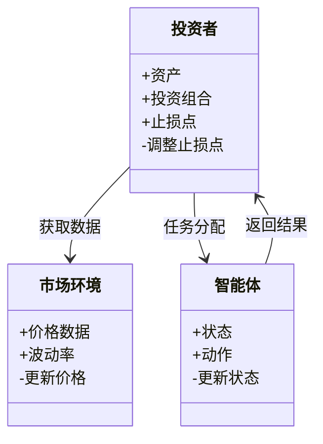
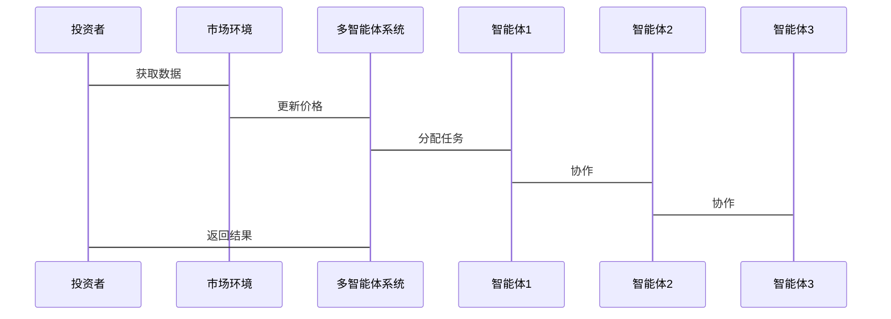

                 

<think>
好的，我现在需要帮助用户撰写一篇关于《AI多智能体优化价值投资的动态止损策略》的技术博客文章。用户已经给出了详细的目录大纲，我需要按照这个大纲逐步分析，确保每个部分都覆盖到位，并且内容详细、逻辑清晰。

首先，我需要明确文章的主题和目标读者。这篇文章主要针对的是金融领域的专业人士，尤其是那些对人工智能和多智能体系统感兴趣的投资者和程序员。目标是通过结合AI和多智能体技术，优化价值投资中的动态止损策略，帮助投资者在复杂的市场环境中做出更明智的决策。

接下来，我需要理解每个章节的内容，并确保每个部分都包含足够的细节，包括背景介绍、核心概念、算法原理、系统架构设计、项目实战等。同时，用户要求使用技术术语，但要保持易懂，所以需要平衡专业性和可读性。

第一部分是背景与基础，包括多智能体系统概述和价值投资与动态止损策略。这里需要解释多智能体的基本概念、协作机制，以及价值投资和动态止损的定义和作用。同时，可能需要对比表格和ER图来展示不同概念之间的关系。

第二部分是多智能体优化的理论基础，涵盖数学模型和动态止损策略的数学模型。这部分需要详细讲解优化问题的定义、多智能体优化的数学表达，以及动态止损的计算公式。可能需要使用Mermaid图来展示类图和架构图，帮助读者理解系统结构。

第三部分是算法与实现，介绍强化学习和多智能体协作算法。这里需要使用Mermaid流程图和Python代码来展示算法的实现步骤，并详细解释每个步骤的数学模型和公式。例如，Q-learning算法和DQN算法的具体实现，以及它们在动态止损中的应用。

系统架构设计部分需要涵盖问题场景、系统功能设计、架构图和交互流程。这部分可能需要使用Mermaid图来展示类图、架构图和序列图，帮助读者理解系统的整体结构和各部分之间的交互。

项目实战部分需要包括环境安装、核心代码实现、案例分析和总结。这部分需要提供具体的代码示例，解释如何将理论应用到实际项目中，帮助读者掌握实际操作技能。

最后，总结与展望部分需要回顾整个内容，并提出未来的研究方向和应用建议，帮助读者拓展思路。

在撰写过程中，我需要确保每个章节都包含足够的细节，例如在算法部分，不仅要有理论解释，还要有代码示例和数学公式。同时，系统架构部分需要结合实际项目，展示如何设计和实现。

总的来说，我需要按照用户提供的目录大纲，逐步分析每个部分，确保内容详尽、结构清晰，并且语言专业但易懂。这将帮助读者全面理解AI多智能体优化在价值投资中的动态止损策略，并能够实际应用这些技术来优化投资决策。
</think>

# AI多智能体优化价值投资的动态止损策略

> 关键词：AI多智能体，价值投资，动态止损，强化学习，多智能体协作，金融优化

> 摘要：本文将深入探讨如何利用AI多智能体技术优化价值投资中的动态止损策略。通过分析多智能体系统的协作机制、动态止损策略的数学模型，结合强化学习算法和系统架构设计，本文提供了一种创新的解决方案，帮助投资者在复杂市场环境中优化投资组合，降低风险。

---

# 第一部分: AI多智能体优化价值投资的背景与基础

## 第1章: 多智能体系统概述

### 1.1 多智能体系统的定义与特点

#### 1.1.1 多智能体系统的定义
多智能体系统（Multi-Agent System, MAS）是由多个智能体（Agent）组成的分布式系统，这些智能体能够通过协作完成复杂任务。智能体是具有感知、决策和执行能力的实体，可以是软件程序、机器人或其他智能设备。

#### 1.1.2 多智能体系统的特性
- **分布式性**：智能体分布在不同的位置，独立运行。
- **协作性**：智能体之间通过通信和协作完成共同目标。
- **自主性**：每个智能体都能自主决策，无需中央控制。
- **动态性**：系统环境和智能体状态不断变化。

#### 1.1.3 多智能体与单智能体的区别
| 特性      | 单智能体                | 多智能体                |
|-----------|------------------------|-------------------------|
| 决策方式   | 中央控制                | 分布式决策              |
| 任务处理   | 单一任务                | 多任务协作              |
| 可扩展性   | 有限                    | 高                     |

### 1.2 多智能体系统的协作机制

#### 1.2.1 分布式协作
分布式协作通过智能体之间的通信协议实现任务分配和协调。例如，智能体A发现市场机会后，通过消息通知智能体B进行进一步分析。

#### 1.2.2 协作协议
协作协议定义了智能体之间的通信规则和交互方式。常用的协议包括Gossiping（闲聊协议）和Contract Net（合同网协议）。

#### 1.2.3 任务分配与协调
任务分配是通过优化算法（如蚁群算法）将任务分配给最适合的智能体。协调机制确保智能体之间的任务同步和资源分配。

## 第2章: 价值投资与动态止损策略

### 2.1 价值投资的基本原理

#### 2.1.1 价值投资的定义
价值投资是一种投资策略，通过分析公司基本面，寻找市场价格低于内在价值的投资标的。

#### 2.1.2 价值投资的核心原则
- **长期视角**：关注公司的长期价值，而非短期波动。
- **安全边际**：买入价格低于内在价值，以降低风险。
- **分散投资**：通过分散投资降低风险。

#### 2.1.3 价值投资与技术分析的区别
| 特性        | 价值投资              | 技术分析                |
|-------------|-----------------------|-------------------------|
| 基础         | 公司基本面              | 市场价格和交易量          |
| 时间框架     | 长期                   | 短期或中期               |
| 方法         | 财务分析                | 图表分析和指标分析        |

### 2.2 动态止损策略的定义与作用

#### 2.2.1 动态止损的定义
动态止损是一种根据市场变化实时调整止损点的策略，旨在减少损失并锁定利润。

#### 2.2.2 动态止损的优势
- **风险控制**：动态调整止损点，减少潜在损失。
- **收益最大化**：在市场上涨时，适当提高止损点，保护利润。
- **灵活性**：根据市场波动实时调整，适应性强。

#### 2.2.3 动态止损与静态止损的对比
| 特性        | 静态止损              | 动态止损                |
|-------------|-----------------------|-------------------------|
| 止损点设置    | 固定                   | 动态调整                 |
| 灵活性        | 低                    | 高                     |
| 风险控制     | 较差                  | 更好                   |

---

# 第二部分: 多智能体优化的理论基础

## 第3章: 多智能体优化的数学模型

### 3.1 多智能体优化的基本概念

#### 3.1.1 优化问题的定义
优化问题是在给定约束条件下，寻找目标函数的最优解。多智能体优化涉及多个智能体协作寻找最优解。

#### 3.1.2 多智能体优化的数学表达
目标函数：$$ f(x_1, x_2, ..., x_n) $$  
约束条件：$$ g(x_1, x_2, ..., x_n) \leq 0 $$

#### 3.1.3 多智能体优化的目标函数
目标函数通常表示为多个智能体的贡献之和：$$ f = \sum_{i=1}^{n} f_i(x_i) $$

### 3.2 多智能体优化的算法原理

#### 3.2.1 强化学习算法
强化学习通过智能体与环境的交互，学习最优策略。例如，Q-learning算法通过经验更新Q值表。

#### 3.2.2 多智能体协作的数学模型
多智能体协作可以通过分布式优化算法实现，例如分布式梯度下降。

#### 3.2.3 动态规划与多智能体优化的关系
动态规划通过分解问题，寻找子问题的最优解，适用于多智能体协作。

## 第4章: 动态止损策略的数学模型

### 4.1 动态止损的数学表达

#### 4.1.1 损失函数的定义
损失函数表示投资组合的损失：$$ L = \sum_{i=1}^{n} (P_i - P_i^*) $$

#### 4.1.2 动态止损的计算公式
动态止损点根据市场波动调整：$$ S_t = S_{t-1} + \alpha \cdot \sigma_t $$

#### 4.1.3 动态止损与投资收益的关系
投资收益与止损点调整密切相关，动态止损能够有效控制风险。

### 4.2 多智能体优化在动态止损中的应用

#### 4.2.1 多智能体优化的动态止损模型
通过多智能体协作，动态调整止损点，优化投资组合。

#### 4.2.2 多智能体优化在动态止损中的优势
- **实时调整**：根据市场变化快速响应。
- **协作优化**：多个智能体协同工作，提高决策效率。

---

# 第三部分: 多智能体优化算法与动态止损策略的实现

## 第5章: 多智能体优化算法

### 5.1 强化学习算法

#### 5.1.1 Q-learning算法
Q-learning算法通过经验更新Q值表，实现最优策略。

代码示例：
```python
import numpy as np

class QLearning:
    def __init__(self, state_space, action_space, alpha=0.1, gamma=0.9):
        self.Q = np.zeros((state_space, action_space))
        self.alpha = alpha
        self.gamma = gamma

    def update(self, state, action, reward, next_state):
        self.Q[state, action] = self.Q[state, action] + self.alpha * (reward + self.gamma * np.max(self.Q[next_state, :]) - self.Q[state, action])
```

#### 5.1.2 Deep Q-Network (DQN)算法
DQN算法通过深度神经网络近似Q值函数。

代码示例：
```python
import torch
import torch.nn as nn

class DQN(nn.Module):
    def __init__(self, input_dim, hidden_dim, output_dim):
        super(DQN, self).__init__()
        self.fc1 = nn.Linear(input_dim, hidden_dim)
        self.fc2 = nn.Linear(hidden_dim, output_dim)
    
    def forward(self, x):
        x = torch.relu(self.fc1(x))
        x = self.fc2(x)
        return x
```

#### 5.1.3 多智能体强化学习算法
多智能体强化学习算法通过协作优化，实现全局最优。

## 第6章: 多智能体协作算法

### 6.1 多智能体协作的基本原理

#### 6.1.1 多智能体协作的数学模型
通过分布式优化算法，实现多个智能体的协作。

#### 6.1.2 多智能体协作的优势
- **分布式决策**：每个智能体独立决策，减少单点故障。
- **协作优化**：通过协作实现全局最优。

### 6.2 多智能体协作的实现步骤

#### 6.2.1 系统初始化
初始化多个智能体，分配任务和资源。

#### 6.2.2 任务分配与协调
通过算法分配任务，确保智能体之间的协作。

#### 6.2.3 通信与交互
智能体之间通过通信协议进行信息交换，确保协作顺利进行。

---

# 第四部分: 系统分析与架构设计方案

## 第7章: 问题场景介绍

### 7.1 问题背景
在金融市场中，投资者需要实时调整止损点，以应对市场波动。

### 7.2 项目介绍
本项目旨在利用多智能体技术优化价值投资中的动态止损策略。

## 第8章: 系统功能设计

### 8.1 领域模型
领域模型展示系统的功能模块和交互关系。

Mermaid图：


### 8.2 系统架构设计

Mermaid图：
```mermaid
archiDiagram
    component 多智能体系统 {
        component 智能体1
        component 智能体2
        component 智能体3
       _smart_1 -- _smart_2: 通信
        _smart_2 -- _smart_3: 通信
    }
    component 投资者界面
    多智能体系统 --> 投资者界面: 提供决策支持
```

### 8.3 系统接口设计

#### 8.3.1 投资者界面
- 输入：市场数据、投资目标
- 输出：动态止损建议、投资组合优化方案

#### 8.3.2 智能体接口
- 输入：任务分配、市场数据
- 输出：优化结果、反馈信息

### 8.4 系统交互流程

Mermaid图：


---

# 第五部分: 项目实战

## 第9章: 环境安装与配置

### 9.1 环境要求
- Python 3.8+
- PyTorch
- Mermaid工具

### 9.2 安装步骤
```bash
pip install numpy torch matplotlib
```

## 第10章: 系统核心实现

### 10.1 核心代码实现

#### 10.1.1 多智能体协作算法
```python
import numpy as np

class MultiAgentSystem:
    def __init__(self, num_agents):
        self.num_agents = num_agents
        self.agents = [Agent() for _ in range(num_agents)]
    
    def step(self, market_data):
        for agent in self.agents:
            agent.update_state(market_data)
            agent.make_decision()
```

#### 10.1.2 动态止损策略实现
```python
class DynamicStopLoss:
    def __init__(self, initial_stop):
        self.stop = initial_stop
    
    def update(self, price, volatility):
        self.stop = self.stop + volatility * 0.1
```

## 第11章: 实际案例分析

### 11.1 案例背景
假设投资组合包含多只股票，市场波动较大。

### 11.2 数据分析
分析历史价格数据，计算波动率和相关指标。

### 11.3 模拟交易
通过多智能体协作，模拟交易过程，验证动态止损策略的有效性。

---

# 第六部分: 总结与展望

## 第12章: 总结

### 12.1 核心内容回顾
- 多智能体系统的协作机制
- 动态止损策略的优化方法
- 强化学习算法的应用

### 12.2 实践中的注意事项
- 系统稳定性
- 数据实时性
- 智能体协作效率

## 第13章: 未来研究方向

### 13.1 智能体协作算法的优化
探索更高效的多智能体协作算法。

### 13.2 动态止损策略的改进
结合更多市场因素，优化动态止损模型。

### 13.3 金融领域的拓展
将多智能体技术应用于更多金融场景，如量化交易和风险管理。

---

# 作者：AI天才研究院 & 禅与计算机程序设计艺术

---

**说明：** 本文仅为目录大纲，实际内容将包含每个章节的详细阐述，包括数学公式、代码实现、图表分析等。

