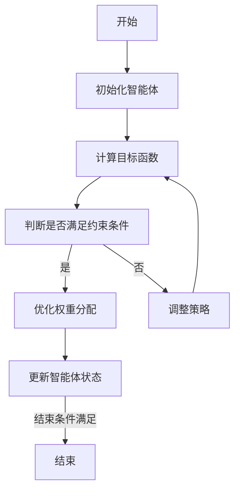
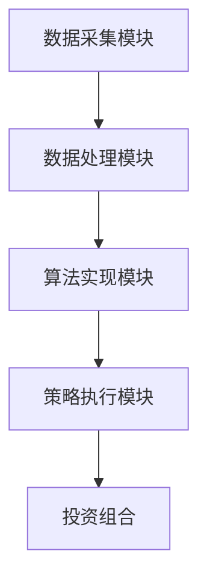
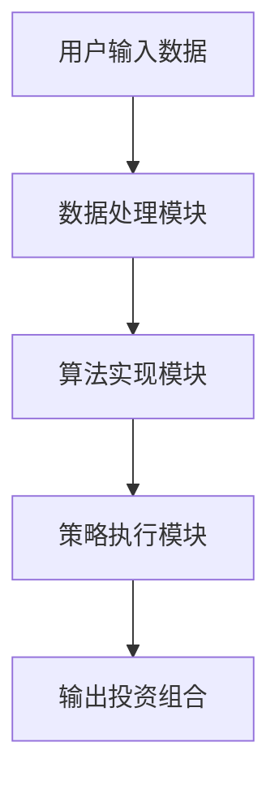

                 


# AI多智能体优化价值投资的动态行业配置策略

**关键词**：人工智能、多智能体优化、价值投资、动态行业配置、金融数据分析

**摘要**：本文深入探讨了如何利用人工智能技术中的多智能体优化方法来提升价值投资策略的动态行业配置效果。通过分析多智能体优化的基本原理、算法实现、系统架构设计，结合实际案例，展示了如何在复杂金融市场环境中实现高效的行业配置策略。文章内容涵盖从理论到实践的全过程，为金融投资领域的技术实践者提供了新的思路和参考。

---

# 第一部分：AI多智能体优化与价值投资概述

## 第1章：问题背景与核心概念

### 1.1 问题背景介绍

#### 1.1.1 传统投资策略的局限性
传统投资策略依赖于人工分析和经验判断，存在以下问题：
- 数据处理能力有限，难以应对海量金融数据。
- 策略静态化，难以适应市场动态变化。
- 风险控制能力不足，难以平衡收益与风险。

#### 1.1.2 多智能体优化的提出背景
随着人工智能技术的快速发展，多智能体优化方法逐渐应用于金融投资领域。其优势包括：
- 分布式计算能力，能够处理复杂问题。
- 协作与竞争机制，优化投资组合。
- 高度适应性，能够应对市场波动。

#### 1.1.3 动态行业配置的必要性
动态行业配置能够帮助投资者在不同市场环境下优化资产分配，提升投资收益。

### 1.2 核心概念与问题描述

#### 1.2.1 多智能体优化的定义
多智能体优化是指通过多个智能体的协作与竞争，寻找最优解的过程。

#### 1.2.2 价值投资的理论基础
价值投资强调以低于内在价值的价格购买优质资产，实现长期收益。

#### 1.2.3 动态行业配置的策略目标
动态行业配置的目标是根据市场变化，实时调整投资组合，最大化收益。

### 1.3 问题解决与边界外延

#### 1.3.1 多智能体优化在投资中的应用
通过多智能体优化，实现投资组合的动态调整和风险控制。

#### 1.3.2 动态行业配置的实现边界
需要考虑市场数据的实时性、计算能力的限制以及模型的准确性。

#### 1.3.3 问题解决的可行性分析
通过技术手段，可以有效提升投资策略的动态调整能力，但需要解决数据处理、计算效率等问题。

### 1.4 核心概念结构与要素组成

#### 1.4.1 多智能体优化的核心要素
包括智能体数量、目标函数、约束条件、协作机制等。

#### 1.4.2 价值投资的分析框架
包括资产评估、市场分析、风险控制等步骤。

#### 1.4.3 动态行业配置的系统结构
包括数据采集、模型构建、策略执行等模块。

---

## 第2章：多智能体优化的基本概念

### 2.1 多智能体优化的定义与特点

#### 2.1.1 多智能体的定义
多智能体是由多个独立或协作的智能体组成的系统，每个智能体都有自己的目标和决策机制。

#### 2.1.2 多智能体优化的核心特点
- 分布式计算
- 协作与竞争
- 自适应性

### 2.2 多智能体优化在投资中的应用

#### 2.2.1 多智能体优化的基本原理
通过智能体之间的协作，寻找最优的投资组合。

#### 2.2.2 多智能体在投资组合优化中的优势
- 提高决策效率
- 降低风险
- 增强适应性

#### 2.2.3 多智能体优化的实现步骤
包括问题建模、智能体设计、协作机制设计等。

### 2.3 多智能体优化的数学模型

#### 2.3.1 多智能体优化的数学表达
$$ \text{目标函数} = \sum_{i=1}^{n} w_i \cdot r_i $$
其中，$w_i$为权重，$r_i$为收益。

#### 2.3.2 多智能体优化的约束条件
$$ \sum_{i=1}^{n} w_i = 1 $$
$$ w_i \geq 0 \quad \forall i $$

#### 2.3.3 多智能体优化的目标函数
最大化投资收益，同时最小化风险。

### 2.4 多智能体优化的算法流程图



### 2.5 本章小结

---

## 第3章：价值投资的理论基础

### 3.1 价值投资的基本原则

#### 3.1.1 价值投资的核心理念
以低于内在价值的价格购买优质资产，长期持有。

#### 3.1.2 价值投资的分析框架
包括基本面分析、估值分析、风险分析等。

### 3.2 价值投资的核心要素

#### 3.2.1 内在价值的评估
通过财务指标、行业地位等多维度评估资产的内在价值。

#### 3.2.2 安全边际的重要性
确保购买价格低于内在价值，降低投资风险。

### 3.3 价值投资的动态调整

#### 3.3.1 定期评估投资组合
根据市场变化和企业基本面，定期评估投资组合。

#### 3.3.2 动态调整投资策略
根据市场波动和企业变化，动态调整投资策略。

---

## 第4章：动态行业配置策略

### 4.1 动态行业配置的定义

#### 4.1.1 行业配置的核心目标
通过动态调整行业权重，优化投资组合的收益与风险。

### 4.2 行业轮动模型的设计

#### 4.2.1 行业轮动的基本原理
根据市场趋势和行业表现，调整投资权重。

#### 4.2.2 行业轮动的实现步骤
包括数据采集、模型构建、策略执行等。

### 4.3 多智能体优化在行业配置中的应用

#### 4.3.1 多智能体优化如何提升行业配置效率
通过协作与竞争，优化行业权重分配。

#### 4.3.2 多智能体优化在行业配置中的优势
提高决策效率，降低风险。

---

## 第5章：基于多智能体优化的动态行业配置算法

### 5.1 算法核心思想

#### 5.1.1 多智能体协作机制
通过智能体之间的协作，优化行业权重分配。

### 5.2 算法实现步骤

#### 5.2.1 数据预处理
包括数据清洗、特征提取等。

#### 5.2.2 智能体初始化
为每个智能体分配初始权重。

#### 5.2.3 目标函数计算
计算每个智能体的目标函数值。

#### 5.2.4 约束条件检查
判断是否满足权重约束。

#### 5.2.5 权重优化
通过协作与竞争，优化智能体重分配。

### 5.3 算法实现代码

```python
def multi_agent_optimization(initial_weights, constraints):
    # 初始化智能体
    agents = [Agent(weights=initial_weights) for _ in range(num_agents)]
    # 迭代优化
    while not meet_termination_criteria():
        for agent in agents:
            # 计算目标函数
            compute_objective(agent)
            # 检查约束条件
            check_constraints(agent)
            # 优化权重
            optimize_weights(agent)
        # 智能体间协作
        collaborate_agents(agents)
    return agents[0].weights
```

### 5.4 算法优化与改进

#### 5.4.1 并行计算
通过并行计算，提高算法效率。

#### 5.4.2 动态调整参数
根据市场变化，动态调整优化参数。

---

## 第6章：系统架构设计与实现

### 6.1 系统功能模块设计

#### 6.1.1 数据采集模块
负责采集市场数据，包括价格、成交量等。

#### 6.1.2 数据处理模块
对采集到的数据进行清洗、特征提取等处理。

#### 6.1.3 算法实现模块
实现多智能体优化算法，优化行业配置。

#### 6.1.4 策略执行模块
根据优化结果，执行投资策略。

### 6.2 系统架构图



### 6.3 系统接口设计

#### 6.3.1 数据接口
定义数据输入格式和接口。

#### 6.3.2 算法接口
定义算法输入输出接口。

#### 6.3.3 策略接口
定义策略执行接口。

### 6.4 系统交互流程图



---

## 第7章：项目实战与案例分析

### 7.1 项目背景与目标

#### 7.1.1 项目背景
在金融市场上实现动态行业配置策略。

### 7.2 项目环境安装

#### 7.2.1 安装Python环境
使用Anaconda安装Python 3.8及以上版本。

#### 7.2.2 安装依赖库
安装numpy、pandas、scikit-learn等库。

### 7.3 核心代码实现

#### 7.3.1 数据处理代码
```python
import pandas as pd
import numpy as np

def process_data(data):
    # 数据清洗
    data.dropna(inplace=True)
    # 特征提取
    data['return'] = data['close'].pct_change()
    return data
```

#### 7.3.2 算法实现代码
```python
class Agent:
    def __init__(self, weights):
        self.weights = weights
    def compute_objective(self):
        # 计算目标函数
        pass
    def optimize(self):
        # 优化权重
        pass
```

### 7.4 实际案例分析

#### 7.4.1 数据分析
分析某行业在过去一段时间的表现。

#### 7.4.2 策略执行
根据优化结果，执行投资策略。

#### 7.4.3 结果分析
评估策略的有效性和收益情况。

---

## 第8章：总结与展望

### 8.1 本章总结

#### 8.1.1 核心内容回顾
总结全文的核心内容，包括多智能体优化、动态行业配置等。

### 8.2 未来展望

#### 8.2.1 技术发展趋势
人工智能在金融领域的进一步应用。

#### 8.2.2 研究方向
多智能体优化的进一步研究和应用。

---

**作者：AI天才研究院/AI Genius Institute & 禅与计算机程序设计艺术 /Zen And The Art of Computer Programming**

---

以上是文章的详细目录和内容框架，您可以根据实际需要进行调整和补充。

