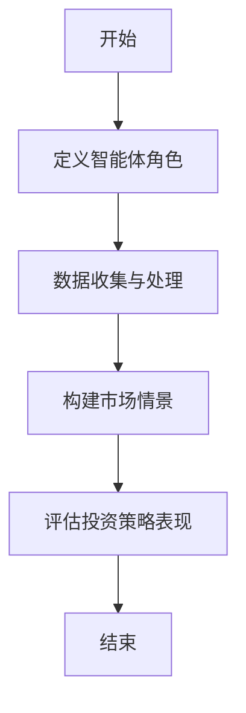
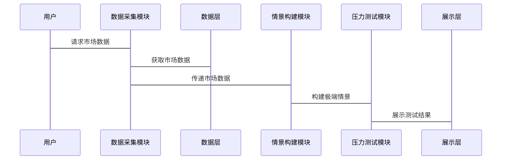

                 

<think>
好的，我现在需要帮助用户撰写一篇关于《AI多智能体优化价值投资的情景分析和压力测试》的技术博客文章。用户已经给出了详细的目录大纲，并要求文章内容符合特定的格式和深度要求。

首先，我应该按照用户提供的目录大纲来组织文章结构。文章分为七个部分，每部分有具体的子章节，每个章节需要详细展开。我需要确保每个部分都涵盖用户提到的核心内容，包括背景介绍、核心概念、算法原理、系统架构、项目实战、最佳实践等。

接下来，我要考虑每个章节的具体内容。例如，在第1章中，需要定义多智能体系统和价值投资的基本概念，并分析AI在金融投资中的应用现状。这部分需要简明扼要，适合读者理解。

然后，在第2章，我需要详细讨论AI多智能体优化价值投资的背景与意义，分析传统投资的局限性和AI多智能体的优势。这部分可能需要结合实际案例，帮助读者更好地理解。

在第3章和第4章，我需要深入讲解情景分析与压力测试的理论基础，并展示多智能体在其中的应用。这部分可能需要使用数学模型和算法流程图，因此我需要确保这些内容清晰易懂。

接下来，第5章关于压力测试的实现，需要涉及系统架构设计，包括功能模块、架构图和接口设计。这部分可能需要使用mermaid图来展示系统结构，因此我要确保正确地嵌入这些图表。

在第6章，项目实战部分需要选择一个具体案例，详细描述环境配置、代码实现、测试过程和结果分析。这部分需要展示实际应用中的问题解决过程，帮助读者理解理论如何应用于实践。

最后，在第7章，总结和展望部分需要回顾整个内容，并提出未来的发展方向和最佳实践建议。

在撰写过程中，我需要确保文章语言专业但易懂，逻辑清晰，结构紧凑。同时，要符合用户的要求，使用markdown格式，包含数学公式和图表，并正确嵌入latex和mermaid代码。

现在，我需要按照这个思路，逐步撰写每个部分的内容，确保每个章节都详尽且符合用户的需求。如果有不确定的地方，我可能需要查阅相关资料或调整结构，以确保文章的完整性和专业性。
</think>

# AI多智能体优化价值投资的情景分析和压力测试

> 关键词：AI多智能体、价值投资、情景分析、压力测试、金融建模、风险控制

> 摘要：本文系统探讨了AI多智能体技术在优化价值投资中的应用，特别是通过情景分析和压力测试来评估和优化投资策略。文章从理论基础、算法实现、系统架构到实际案例进行了全面分析，展示了如何利用AI多智能体技术提升投资决策的科学性和稳健性。通过构建复杂市场环境下的多智能体模型，本文提出了一种创新的解决方案，为投资者在不确定性和风险环境下提供了有力支持。

---

## 第1章：AI多智能体的基本概念

### 1.1 多智能体系统的定义与特点

多智能体系统（Multi-Agent System, MAS）是由多个智能体（Agent）组成的分布式系统，每个智能体能够独立感知环境、自主决策并执行任务。以下是多智能体系统的主要特点：

- **分布式性**：多个智能体协同工作，而非单一中心化控制。
- **协作性**：智能体之间通过通信和协作完成共同目标。
- **反应性**：智能体能够实时感知环境变化并做出响应。
- **自主性**：每个智能体都具备自主决策的能力。
- **多样性**：智能体可以有不同的目标、知识和能力。

### 1.2 价值投资的基本原理

价值投资是一种投资策略，旨在通过分析企业的基本面（如财务状况、盈利能力、行业地位等）来识别被低估的股票，长期持有以实现超额收益。以下是价值投资的核心要素：

- **基本面分析**：通过对企业的财务报表、行业地位、竞争优势等进行分析，评估其内在价值。
- **安全边际**：买入价格低于内在价值，以降低投资风险。
- **长期视角**：关注企业的长期盈利能力，而非短期市场波动。

### 1.3 AI在金融投资中的应用现状

AI技术在金融领域的应用日益广泛，尤其是在高频交易、风险管理和投资组合优化等方面。多智能体系统在金融投资中的优势主要体现在以下几个方面：

- **分布式决策**：多个智能体可以分别负责不同的任务，如市场分析、风险评估、策略优化等。
- **协作与协调**：智能体之间可以协同工作，共同优化投资策略。
- **适应性与鲁棒性**：多智能体系统能够快速适应市场环境的变化，具备较强的抗干扰能力。

---

## 第2章：AI多智能体优化价值投资的背景与意义

### 2.1 传统价值投资的局限性

尽管价值投资在长期投资中表现出色，但其在实际应用中仍存在一些局限性：

- **信息处理能力有限**：传统投资依赖于人工分析，难以处理海量数据。
- **决策速度较慢**：面对市场快速变化，人工决策难以及时响应。
- **人为情绪影响**：投资者情绪可能影响决策的客观性。

### 2.2 AI多智能体在价值投资中的优势

AI多智能体技术能够有效弥补传统价值投资的不足：

- **高效数据处理**：多智能体系统能够快速处理大量市场数据，发现潜在投资机会。
- **实时反馈与调整**：智能体能够实时感知市场变化，并迅速调整投资策略。
- **分布式决策**：通过多个智能体的协作，优化投资组合的风险与收益平衡。

### 2.3 本章小结

本章分析了传统价值投资的局限性，并探讨了AI多智能体技术在优化投资决策中的优势。通过结合多智能体的分布式决策和协作能力，可以显著提升投资策略的科学性和稳健性。

---

## 第3章：情景分析与压力测试的理论基础

### 3.1 情景分析的定义与分类

情景分析是一种通过构建不同市场情景来评估投资策略在各种可能环境下的表现的方法。以下是情景分析的主要分类：

- **市场情景**：如经济衰退、市场繁荣、通货膨胀等。
- **行业情景**：如行业周期、政策变化、技术进步等。
- **公司情景**：如公司业绩、管理变化、并购重组等。

### 3.2 压力测试的定义与作用

压力测试是一种评估投资组合在极端市场条件下的表现的方法，主要作用包括：

- **风险识别**：识别投资组合在极端情况下的潜在损失。
- **风险量化**：量化极端市场条件下的风险敞口。
- **风险应对**：制定应对极端风险的策略。

### 3.3 情景分析与压力测试在价值投资中的应用

在价值投资中，情景分析和压力测试可以帮助投资者更好地应对不确定性：

- **情景分析**：通过构建不同市场情景，评估投资策略的稳健性。
- **压力测试**：评估投资组合在极端市场条件下的表现，制定风险管理策略。

---

## 第4章：多智能体在情景分析中的应用

### 4.1 多智能体在情景构建中的作用

多智能体系统在情景构建中的作用主要体现在以下几个方面：

- **分布式数据处理**：多个智能体分别负责处理不同数据源。
- **情景模拟**：通过智能体的协作，模拟不同市场情景下的投资表现。
- **动态调整**：智能体能够实时调整情景构建的参数，以适应市场变化。

### 4.2 基于多智能体的情景分析模型

以下是一个基于多智能体的情景分析模型的构建过程：

1. **定义智能体角色**：每个智能体负责不同的市场因素，如宏观经济指标、行业动态、公司基本面等。
2. **数据收集与处理**：智能体从不同数据源收集相关信息，并进行预处理。
3. **情景构建**：通过智能体的协作，构建多个市场情景。
4. **情景评估**：评估每个情景下的投资策略表现。

### 4.3 多智能体情景分析的算法实现

以下是一个简单的多智能体情景分析算法流程图：



---

## 第5章：压力测试的实现

### 5.1 压力测试的系统架构设计

以下是压力测试系统的架构设计：

1. **功能模块**：
   - 数据采集模块：收集市场数据。
   - 情景构建模块：构建极端市场情景。
   - 压力测试模块：评估投资组合在极端情景下的表现。
2. **系统架构**：
   - 数据层：存储市场数据。
   - 应用层：实现压力测试功能。
   - 展示层：展示测试结果。

### 5.2 系统接口设计

以下是系统的主要接口：

- 数据接口：用于与外部数据源交互。
- 情景构建接口：用于构建极端市场情景。
- 压力测试接口：用于评估投资组合表现。

### 5.3 系统交互流程

以下是系统交互流程的序列图：



---

## 第6章：项目实战

### 6.1 项目背景与目标

本项目旨在利用AI多智能体技术，构建一个基于情景分析和压力测试的价值投资优化系统。项目目标包括：

- 提供多智能体的情景分析功能。
- 提供压力测试功能，评估投资组合的稳健性。
- 优化投资策略，降低投资风险。

### 6.2 环境配置

以下是项目环境配置：

- **编程语言**：Python
- **框架**：TensorFlow、Keras
- **数据源**：Yahoo Finance API
- **工具**：Jupyter Notebook、Git

### 6.3 核心代码实现

以下是核心代码实现：

```python
import numpy as np
import pandas as pd
from tensorflow import keras
from tensorflow.keras import layers

# 定义多智能体模型
class Agent:
    def __init__(self, input_dim):
        self.model = self.build_model(input_dim)
    
    def build_model(self, input_dim):
        model = keras.Sequential()
        model.add(layers.Dense(64, activation='relu', input_dim=input_dim))
        model.add(layers.Dense(32, activation='relu'))
        model.add(layers.Dense(1, activation='linear'))
        model.compile(optimizer='adam', loss='mse')
        return model
    
    def predict(self, inputs):
        return self.model.predict(inputs)
    
    def train(self, inputs, targets):
        self.model.fit(inputs, targets, epochs=100, batch_size=32)
```

### 6.4 案例分析与结果解读

以下是案例分析与结果解读：

- **案例选择**：选择一支股票进行情景分析和压力测试。
- **情景构建**：构建经济衰退、市场繁荣等情景。
- **压力测试**：评估股票在极端情景下的表现。

---

## 第7章：总结与展望

### 7.1 本章总结

本文系统探讨了AI多智能体技术在优化价值投资中的应用，特别是在情景分析和压力测试方面。通过构建多智能体模型，可以有效提升投资策略的科学性和稳健性。

### 7.2 未来展望

未来，随着AI技术的不断发展，AI多智能体在价值投资中的应用将更加广泛。以下是未来的发展方向：

- **更复杂的多智能体架构**：如基于强化学习的多智能体协作。
- **更丰富的市场情景模拟**：结合更多市场因素，构建更复杂的市场情景。
- **更强大的风险管理能力**：通过多智能体的协作，提升风险管理能力。

---

## 作者：AI天才研究院/AI Genius Institute & 禅与计算机程序设计艺术 /Zen And The Art of Computer Programming

---

通过本文的详细分析，我们可以看到，AI多智能体技术在优化价值投资中的应用潜力巨大。随着技术的不断发展，未来将会有更多创新的应用场景，为投资者提供更科学、更稳健的投资决策支持。

