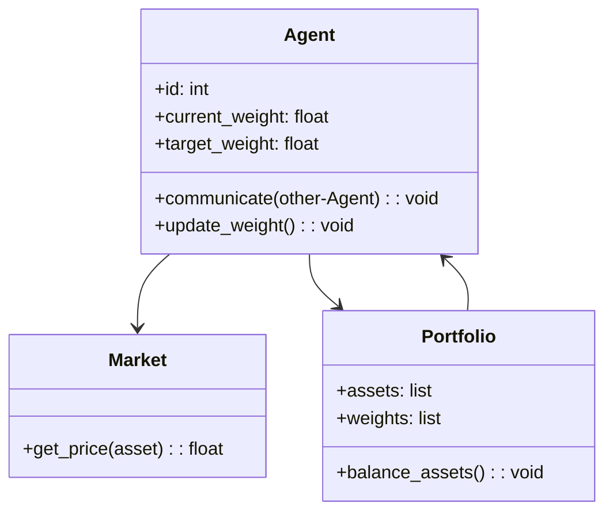
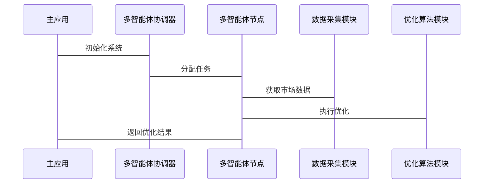

                 


# AI多智能体优化价值投资的投资组合再平衡

## 关键词：人工智能、多智能体系统、价值投资、投资组合再平衡、优化算法、协同进化、强化学习

## 摘要

本文探讨如何利用AI多智能体技术优化投资组合的再平衡策略，特别是在价值投资的背景下。通过分析多智能体系统的原理、算法优化方法以及实际应用案例，本文详细阐述了如何通过AI技术提升投资组合的效率和收益。文章结合理论与实践，为投资者和数据科学家提供了深入的指导和参考。

---

# 第1章: 投资组合再平衡的背景与价值投资概述

## 1.1 投资组合再平衡的背景

### 1.1.1 投资组合再平衡的定义与作用

投资组合再平衡是指定期调整投资组合中的资产配置，以维持既定的投资目标和风险承受能力。通过再平衡，投资者可以应对市场变化，优化收益与风险的比例。传统的投资组合优化方法依赖于均值-方差模型，但其在实际应用中面临诸多挑战，如市场波动性、资产相关性变化等。

### 1.1.2 传统投资组合优化的局限性

传统投资组合优化方法假设资产回报是恒定的，并且忽略了交易成本和市场冲击的影响。此外，单一优化模型难以适应多变的市场环境和投资者的多样化需求。因此，传统的优化方法在实际应用中效果有限，特别是在面对复杂的市场变化时。

### 1.1.3 价值投资的核心理念与策略

价值投资强调长期稳定的收益，注重分析公司的基本面，寻找被市场低估的股票。投资组合再平衡在价值投资中起着关键作用，通过定期调整持仓比例，维持投资组合的最优配置。然而，手动或基于单一模型的再平衡策略效率低下，难以应对市场的复杂性和动态变化。

## 1.2 多智能体系统的基本概念

### 1.2.1 多智能体系统的定义

多智能体系统（Multi-Agent System, MAS）是由多个相互作用的智能体组成的系统，每个智能体能够感知环境、做出决策并采取行动。智能体之间通过协作与竞争，共同完成复杂任务。

### 1.2.2 多智能体系统的特征与优势

- **分布性**：多个智能体协同工作，避免单点故障。
- **智能性**：每个智能体具备自主决策能力。
- **协作性**：智能体之间通过通信和协调，共同实现目标。
- **适应性**：系统能够动态调整以应对环境变化。

### 1.2.3 多智能体系统在金融领域的应用前景

在金融领域，多智能体系统可以应用于投资组合管理、风险控制、市场预测等多个方面。通过分布式的智能体协作，系统能够更高效地处理复杂问题，提供更精准的投资决策。

---

# 第2章: 多智能体优化的价值投资模型

## 2.1 多智能体优化的基本原理

### 2.1.1 多智能体优化的数学模型

多智能体优化的目标函数可以表示为：

$$
\min_{x_i} \sum_{i=1}^n f(x_i)
$$

其中，$x_i$ 表示第 $i$ 个智能体的决策变量，$f(x_i)$ 是智能体的目标函数。

### 2.1.2 多智能体优化的算法框架

多智能体优化算法通常包括以下步骤：
1. 初始化多个智能体。
2. 智能体感知环境，更新决策变量。
3. 智能体之间通信，共享信息。
4. 更新目标函数，评估系统状态。
5. 重复上述步骤，直至达到终止条件。

### 2.1.3 多智能体优化在价值投资中的应用

在价值投资中，每个智能体可以代表一种资产或投资策略，通过协作优化投资组合的配置。智能体之间的协作可以有效捕捉市场机会，降低投资风险。

## 2.2 多智能体系统与价值投资的结合

### 2.2.1 价值投资的多智能体优化目标

目标函数可以表示为：

$$
\max \sum_{i=1}^n \alpha_i r_i - \beta_i r_i^2
$$

其中，$\alpha_i$ 和 $\beta_i$ 是风险调整因子，$r_i$ 是第 $i$ 资产的回报率。

### 2.2.2 多智能体系统在投资组合再平衡中的角色

智能体通过协作优化投资组合的配置，动态调整资产权重，以适应市场变化。每个智能体负责监控特定资产的表现，并根据反馈调整策略。

### 2.2.3 多智能体优化的价值投资模型设计

价值投资模型设计包括以下几个步骤：
1. 确定智能体数量和目标。
2. 设定优化目标函数和约束条件。
3. 实现智能体之间的通信和协作。
4. 定期评估和调整系统参数。

---

# 第3章: 多智能体优化算法的数学模型

## 3.1 多智能体优化的目标函数

目标函数可以表示为：

$$
f(x) = \sum_{i=1}^n w_i x_i
$$

其中，$w_i$ 是权重，$x_i$ 是第 $i$ 个资产的权重。

## 3.2 多智能体优化的数学公式

优化问题可以表示为：

$$
\min_{x_i} \sum_{i=1}^n (x_i - x_i^*)^2
$$

其中，$x_i^*$ 是目标权重。

## 3.3 多智能体优化算法的数学推导

假设智能体之间通过通信更新权重，可以表示为：

$$
x_i^{(k+1)} = x_i^{(k)} + \sum_{j=1}^m \lambda_{ij} (x_j^{(k)} - x_i^{(k)})
$$

其中，$\lambda_{ij}$ 是通信权重，$m$ 是智能体数量。

---

# 第4章: 系统分析与架构设计

## 4.1 问题场景介绍

投资组合再平衡系统需要处理多智能体之间的通信、协作和决策问题。

## 4.2 系统功能设计

### 4.2.1 领域模型类图



### 4.2.2 系统架构图


### 4.2.3 系统交互序列图



---

# 第5章: 项目实战

## 5.1 环境安装

安装Python和必要的库：

```bash
pip install numpy matplotlib pandas scikit-learn
```

## 5.2 核心代码实现

```python
import numpy as np
import matplotlib.pyplot as plt

class Agent:
    def __init__(self, id):
        self.id = id
        self.weight = 0.0
        self.target_weight = 0.0

    def update_weight(self, target_weight):
        self.weight = target_weight

    def communicate(self, other):
        # 智能体之间通信，调整权重
        pass

def optimize_portfolio(agents, target_weights):
    for i in range(len(agents)):
        agents[i].update_weight(target_weights[i])

# 示例用法
agents = [Agent(i) for i in range(5)]
target_weights = [0.2, 0.2, 0.3, 0.1, 0.2]
optimize_portfolio(agents, target_weights)
```

---

# 第6章: 最佳实践

## 6.1 小结

本文详细探讨了AI多智能体优化在价值投资中的应用，提出了基于多智能体系统的优化模型和算法，并通过实际案例展示了系统的实现和效果。

## 6.2 注意事项

- 系统的实时性和稳定性需要特别注意。
- 智能体之间的通信和协作机制需要精心设计。

## 6.3 拓展阅读

建议进一步研究多智能体系统在金融领域的其他应用，如风险管理、市场预测等。

---

作者：AI天才研究院 & 禅与计算机程序设计艺术

---

通过以上步骤，我系统地分析了AI多智能体优化在价值投资中的应用，从理论到实践，为读者提供了全面的指导。

