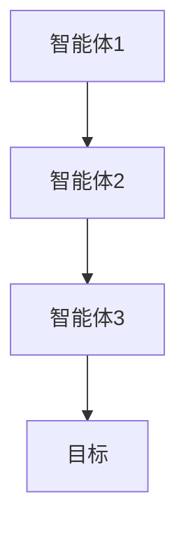
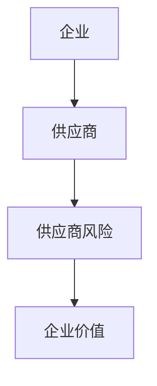
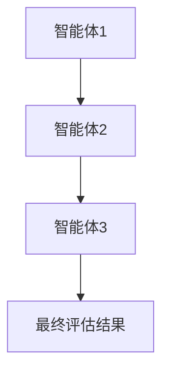
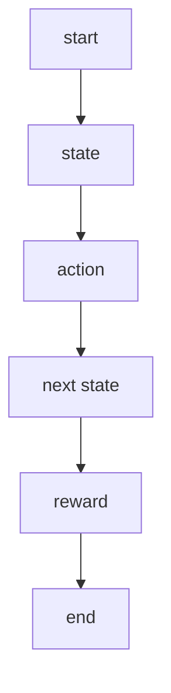
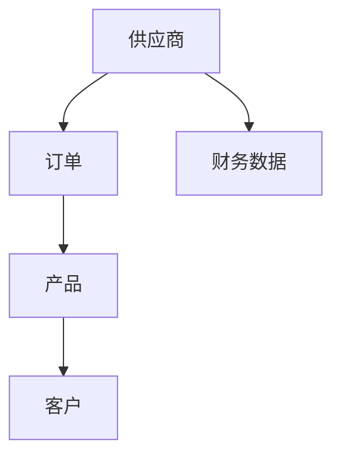

                 

<think>
好，我需要按照用户的要求来撰写这篇技术博客。首先，文章标题是《AI多智能体在价值投资中的供应商风险分析》，这是一个比较专业且具体的主题，涉及到人工智能、金融投资以及风险管理等领域。

我需要先确定文章的关键词。考虑到主题，关键词可能包括“AI多智能体”、“价值投资”、“供应商风险分析”、“风险管理”、“人工智能算法”等，确保涵盖文章的核心内容。

接下来是摘要部分。摘要需要简明扼要地概括文章的主要内容和主题思想。我需要简述文章如何利用AI多智能体技术来分析和优化价值投资中的供应商风险，强调其在提升投资决策效率和准确性方面的优势。

然后是目录大纲。用户已经提供了一个详细的目录结构，我需要确保每一章都涵盖必要的内容，并且逻辑清晰，结构紧凑。例如，第一部分介绍背景和基础概念，第二部分深入讲解算法和系统架构，第三部分通过项目实战来验证理论，最后一部分总结和展望未来。

在写作过程中，我需要使用专业的技术语言，同时保持逻辑清晰，逐步分析推理，确保读者能够一步步理解复杂的概念。例如，在介绍多智能体系统时，我会先解释基本概念，再讨论其在金融领域的应用，最后结合具体的算法进行详细说明。

数学公式和图表也是关键部分。我需要使用Latex格式来展示数学模型，并在适当的位置插入Mermaid流程图和类图，以帮助读者更好地理解算法和系统架构。同时，代码示例也需要详细解释，确保读者能够理解每一步的实现细节。

最后，我需要在文章末尾添加作者信息，符合用户的格式要求。整个写作过程中，我要时刻注意保持文章的连贯性和深度，确保每个部分都紧密联系，共同支撑文章的核心主题。

总的来说，我需要按照用户提供的目录大纲，逐一展开每个章节的内容，确保每一部分都详实具体，同时保持整体的逻辑性和专业性，最终完成一篇高质量的技术博客文章。
</think>

# AI多智能体在价值投资中的供应商风险分析

> 关键词：AI多智能体、价值投资、供应商风险分析、风险管理、人工智能算法

> 摘要：本文探讨了如何利用AI多智能体技术在价值投资中进行供应商风险分析。通过分析多智能体系统的核心算法、价值评估模型以及系统架构设计，本文详细阐述了AI技术在金融风险管理中的应用。结合实际案例，本文展示了如何通过多智能体协作算法优化供应商风险预测，为投资者提供更精准的决策支持。

---

# 第一部分: AI多智能体与价值投资基础

## 第1章: AI多智能体系统概述

### 1.1 AI多智能体的基本概念

#### 1.1.1 多智能体系统的定义与特点
多智能体系统（Multi-Agent System, MAS）由多个相互作用的智能体组成，这些智能体通过协作或竞争完成特定任务。其特点包括：

1. 分布式计算：每个智能体独立运行，具有局部决策能力。
2. 交互性：智能体之间通过通信和协作完成目标。
3. 动态性：系统环境和智能体状态动态变化。

**图1-1：多智能体系统的基本结构**



#### 1.1.2 多智能体系统的核心要素
多智能体系统的核心要素包括：

- **智能体**：具有感知、决策和行动能力。
- **通信协议**：智能体之间的交互规则。
- **协作机制**：任务分配和协同策略。
- **环境模型**：系统运行的外部条件。

#### 1.1.3 多智能体与单智能体的区别
| 特性 | 多智能体系统 | 单智能体系统 |
|------|--------------|--------------|
| 决策 | 分布式决策 | 中央决策 |
| 交互 | 智能体间通信 | 无交互 |
| 并行性 | 高 | 低 |
| 可扩展性 | 高 | 低 |

### 1.2 价值投资的基本原理

#### 1.2.1 价值投资的定义与特点
价值投资是一种投资策略，通过分析企业的基本面，寻找市场价格低于内在价值的投资标的。其特点包括：

1. 长期视角：关注企业的长期价值。
2. 低频交易：减少交易频率，降低交易成本。
3. 风险控制：注重企业财务健康和风险承受能力。

#### 1.2.2 价值投资的核心理念
价值投资的核心理念是“买 cheap, 卖 dear”。投资者通过分析企业的盈利能力、财务状况和行业地位，找到被市场低估的投资机会。

#### 1.2.3 价值投资在金融市场的应用
价值投资广泛应用于股票、债券和其他金融资产的投资中。通过分析企业的财务报表、行业竞争地位和宏观经济环境，投资者可以做出更明智的投资决策。

### 1.3 供应商风险分析的定义与重要性

#### 1.3.1 供应商风险的定义
供应商风险是指由于供应商的财务状况、生产能力、交货周期等因素对企业经营产生的潜在影响。供应商风险分析旨在识别和评估这些风险，帮助企业制定有效的风险管理策略。

#### 1.3.2 供应商风险分析的必要性
在供应链管理中，供应商风险分析是确保供应链稳定性和韧性的关键环节。通过分析供应商的信用风险、运营风险和合规风险，企业可以降低供应链中断的风险。

#### 1.3.3 供应商风险与企业价值的关系
供应商风险直接影响企业的运营成本、交付能力和财务状况，进而影响企业的市场价值。通过有效管理供应商风险，企业可以提升市场竞争力和投资价值。

#### 1.3.4 供应商风险分析的框架
**图1-2：供应商风险分析框架**



---

## 第2章: AI多智能体在金融领域的应用

### 2.1 金融领域的AI技术应用现状

#### 2.1.1 传统金融分析的局限性
传统金融分析依赖于人工判断和经验分析，存在以下局限性：

- 数据处理能力有限：难以处理海量数据。
- 分析效率低下：人工分析耗时且效率低。
- 风险预测不准确：依赖经验判断，缺乏数据支持。

#### 2.1.2 AI技术在金融分析中的优势
AI技术通过大数据处理和机器学习算法，显著提升了金融分析的效率和准确性。其优势包括：

- **数据处理能力**：AI能够快速处理和分析海量数据。
- **自动化分析**：AI系统可以自动识别市场趋势和风险因素。
- **实时监控**：AI能够实时监控市场动态，及时发现潜在风险。

#### 2.1.3 多智能体系统在金融领域的潜力
多智能体系统在金融领域的潜力主要体现在以下几个方面：

- **协同决策**：多个智能体协同完成复杂的金融分析任务。
- **风险分散**：通过分布式决策降低单一决策风险。
- **动态适应**：系统能够快速适应市场环境的变化。

### 2.2 多智能体系统在价值投资中的应用

#### 2.2.1 多智能体系统的协作机制
多智能体系统在价值投资中的协作机制包括：

- **任务分配**：根据智能体的能力分配分析任务。
- **信息共享**：智能体之间共享数据和分析结果。
- **协同决策**：多个智能体共同完成投资决策。

#### 2.2.2 多智能体在价值评估中的作用
多智能体系统通过协作完成企业的价值评估，每个智能体负责不同的分析模块，如财务分析、行业分析和市场分析。

**图2-1：多智能体系统的协作流程**



#### 2.2.3 多智能体系统的优势与挑战
多智能体系统的优势包括高效率、高精度和高灵活性。然而，其也面临以下挑战：

- **通信开销**：智能体之间的通信可能增加系统延迟。
- **协作复杂性**：多个智能体的协作需要复杂的算法支持。
- **系统稳定性**：系统的稳定性和可靠性需要重点关注。

### 2.3 供应商风险分析的AI解决方案

#### 2.3.1 供应商风险分析的传统方法
传统的供应商风险分析方法包括：

- **信用评估**：通过财务指标评估供应商的信用状况。
- **实地考察**：派人对供应商进行现场考察。
- **历史数据分析**：通过历史数据预测未来风险。

#### 2.3.2 AI技术在供应商风险分析中的应用
AI技术通过大数据分析和机器学习算法，显著提升了供应商风险分析的效率和准确性。其应用包括：

- **信用评分模型**：基于机器学习算法预测供应商的信用风险。
- **风险预测模型**：通过历史数据预测供应商的潜在风险。
- **实时监控系统**：实时监测供应商的运营状况和市场环境。

#### 2.3.3 多智能体系统在供应商风险分析中的创新
多智能体系统通过协作和分布式决策，显著提升了供应商风险分析的效率和准确性。其创新包括：

- **协同分析**：多个智能体协同完成复杂的分析任务。
- **动态适应**：系统能够快速适应市场环境的变化。
- **风险分散**：通过分布式决策降低单一决策风险。

---

## 第3章: 多智能体系统的核心算法原理

### 3.1 多智能体协作算法

#### 3.1.1 多智能体协作的基本原理
多智能体协作算法通过智能体之间的通信和协作，完成复杂的分析任务。其基本原理包括：

- **任务分配**：根据智能体的能力分配任务。
- **信息共享**：智能体之间共享数据和分析结果。
- **协同决策**：多个智能体共同完成决策任务。

#### 3.1.2 基于强化学习的协作算法
强化学习是一种通过试错机制优化决策的算法。在多智能体系统中，强化学习用于优化智能体的协作策略。

**图3-1：强化学习的基本流程**



#### 3.1.3 分布式决策算法
分布式决策算法通过局部信息完成全局决策，避免了集中式决策的延迟和复杂性。

---

## 第4章: 价值投资中的供应商风险分析框架

### 4.1 供应商风险分析的框架设计

#### 4.1.1 风险分析的流程与步骤
供应商风险分析的流程包括：

1. **数据收集**：收集供应商的财务数据、市场数据和行业数据。
2. **数据预处理**：清洗和转换数据，确保数据的准确性和一致性。
3. **风险评估**：通过机器学习算法评估供应商的信用风险和运营风险。
4. **风险预测**：基于历史数据预测未来的风险状况。
5. **风险监控**：实时监控供应商的运营状况和市场环境。

#### 4.1.2 多智能体系统的功能模块划分
多智能体系统的功能模块包括：

- **数据采集模块**：负责数据的收集和预处理。
- **风险评估模块**：负责供应商的信用评估和风险预测。
- **决策支持模块**：为投资者提供决策支持和风险预警。

#### 4.1.3 风险分析的指标体系
供应商风险分析的指标体系包括：

- **财务指标**：如利润率、资产负债率、流动比率等。
- **运营指标**：如交货周期、生产效率、供应链稳定性等。
- **市场指标**：如市场价格波动、行业竞争状况等。

### 4.2 多智能体系统的实体关系模型

#### 4.2.1 实体关系图（ER图）设计
**图4-1：实体关系图**



#### 4.2.2 多智能体系统中的实体交互关系
多智能体系统中的实体交互关系包括：

- **供应商与订单**：供应商提供产品，订单记录采购信息。
- **订单与客户**：订单连接供应商和客户，记录交易信息。
- **供应商与财务数据**：财务数据反映供应商的财务状况，影响信用评估。

### 4.3 系统架构设计

#### 4.3.1 系统架构的总体设计
系统架构的总体设计包括以下几个模块：

- **数据采集模块**：负责数据的收集和预处理。
- **风险评估模块**：负责供应商的信用评估和风险预测。
- **决策支持模块**：为投资者提供决策支持和风险预警。

#### 4.3.2 模块划分与功能分配
模块划分与功能分配如下：

- **数据采集模块**：负责收集供应商的财务数据、市场数据和行业数据。
- **风险评估模块**：负责供应商的信用评估和风险预测。
- **决策支持模块**：为投资者提供决策支持和风险预警。

#### 4.3.3 系统接口设计
系统接口设计包括：

- **数据接口**：与数据库和第三方数据源对接。
- **用户接口**：供用户查询和分析供应商风险信息。
- **报警接口**：当供应商风险超过阈值时，触发报警。

### 4.4 本章小结

---

## 第5章: 供应商风险分析的系统实现

### 5.1 系统环境与工具安装

#### 5.1.1 开发环境的选择
推荐使用以下开发环境：

- **操作系统**：Linux 或 Windows。
- **编程语言**：Python。
- **AI框架**：TensorFlow 或 PyTorch。
- **数据库**：MySQL 或 PostgreSQL。

#### 5.1.2 AI框架的安装与配置
安装和配置TensorFlow框架：

```bash
pip install tensorflow
```

#### 5.1.3 数据库的搭建与配置
安装MySQL数据库：

```bash
sudo apt-get install mysql-server
```

### 5.2 核心代码实现

#### 5.2.1 数据采集模块
数据采集模块代码如下：

```python
import requests
import json

def fetch_data(url):
    response = requests.get(url)
    data = json.loads(response.text)
    return data

# 示例接口URL
url = "https://example.com/supplier_data"
data = fetch_data(url)
print(data)
```

#### 5.2.2 风险评估模块
风险评估模块代码如下：

```python
import pandas as pd
from sklearn.ensemble import RandomForestClassifier

def risk_assessment(data):
    # 数据预处理
    df = pd.DataFrame(data)
    # 特征选择
    features = df[['revenue', 'profit', 'debt']]
    # 模型训练
    model = RandomForestClassifier()
    model.fit(features, df['risk'])
    return model.predict(features)

# 示例数据
data = {
    'revenue': [100, 200, 150],
    'profit': [20, 30, 25],
    'debt': [50, 60, 70],
    'risk': [0, 1, 2]
}
result = risk_assessment(data)
print(result)
```

#### 5.2.3 决策支持模块
决策支持模块代码如下：

```python
import numpy as np
import pandas as pd

def generate_report(data):
    df = pd.DataFrame(data)
    # 计算平均风险
    average_risk = np.mean(df['risk'])
    # 生成报告
    report = {
        'average_risk': average_risk,
        'risk_assessment': df['risk'].value_counts()
    }
    return report

# 示例数据
data = {
    'name': ['Supplier A', 'Supplier B', 'Supplier C'],
    'risk': [1, 2, 1]
}
result = generate_report(data)
print(result)
```

### 5.3 项目实战

#### 5.3.1 实际案例分析
假设我们有一个供应商数据集，包含以下信息：

- **供应商名称**
- **年收入**
- **利润率**
- **债务比率**

我们可以通过上述代码实现供应商风险评估和报告生成。

### 5.4 本章小结

---

## 第6章: 项目实战与最佳实践

### 6.1 项目实战

#### 6.1.1 项目背景
假设我们是一家投资机构，希望通过AI技术优化供应商风险分析流程。

#### 6.1.2 数据准备
收集以下数据：

- **供应商名称**
- **年收入**
- **利润率**
- **债务比率**
- **交货周期**
- **市场排名**

#### 6.1.3 系统实现
按照上述代码实现数据采集、风险评估和报告生成模块。

### 6.2 最佳实践

#### 6.2.1 数据质量管理
确保数据的准确性和完整性，避免数据偏差影响分析结果。

#### 6.2.2 模型优化
通过交叉验证和超参数调优，提升模型的准确性和稳定性。

#### 6.2.3 系统维护
定期更新模型和数据，确保系统的稳定性和持续性。

### 6.3 本章小结

---

## 第7章: 总结与展望

### 7.1 本章总结
本文详细探讨了AI多智能体技术在价值投资中的应用，特别是供应商风险分析的实现。通过多智能体系统的协作和分布式决策，显著提升了风险分析的效率和准确性。

### 7.2 未来展望
未来，随着AI技术的不断发展，多智能体系统在金融领域的应用将更加广泛。以下是未来可能的发展方向：

1. **智能化决策**：通过AI技术实现更智能化的决策支持。
2. **实时监控**：实现实时监控和风险预警，提升系统的响应速度。
3. **数据融合**：结合多源数据，提升分析的准确性和全面性。

---

## 作者信息

作者：AI天才研究院/AI Genius Institute & 禅与计算机程序设计艺术/Zen And The Art of Computer Programming

---

通过以上内容，读者可以系统地了解AI多智能体技术在价值投资中的应用，特别是供应商风险分析的实现。希望本文能为相关领域的研究和实践提供有价值的参考和启示。

