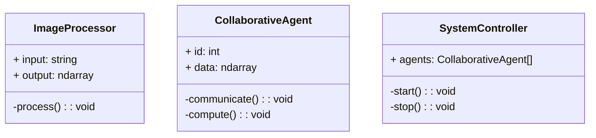

                 


# AI多智能体在价值投资中的卫星图像分析应用

**关键词**：AI多智能体、卫星图像分析、价值投资、图像处理算法、系统架构设计

**摘要**：  
本文探讨AI多智能体技术在价值投资中的应用，特别是通过卫星图像分析来评估和预测投资价值。文章从AI多智能体的基本原理、卫星图像分析的数学模型、系统架构设计以及实际项目实现等多个方面进行深入分析。通过具体的案例分析，展示了如何利用AI多智能体协同算法处理卫星图像数据，并将其应用于价值投资决策中，为投资者提供更精准的决策支持。

---

## 第一部分：引言

### 1.1 背景介绍  
随着人工智能技术的快速发展，AI多智能体系统在多个领域的应用逐渐崭露头角。卫星图像分析作为一项技术密集型任务，能够提供丰富的地理和经济信息，为价值投资决策提供有力支持。然而，卫星图像数据的复杂性和多样性使得传统的单一算法难以应对，因此，AI多智能体协同分析成为一种新的解决方案。

### 1.2 问题描述  
价值投资的核心在于对资产未来收益的准确预测。然而，传统的分析方法往往依赖于历史数据和财务指标，难以捕捉到实时的地理和环境变化信息。卫星图像分析能够提供地面设施、建筑密度、交通流量等实时数据，但如何高效地处理和分析这些数据，并将其与投资决策相结合，是当前面临的主要挑战。

### 1.3 问题解决  
AI多智能体系统通过分布式计算和协同学习，能够高效处理卫星图像的复杂数据，并结合其他金融数据，为价值投资提供更全面的分析支持。本文将重点探讨如何利用AI多智能体协同算法，实现卫星图像数据的高效分析，并将其应用于价值投资决策中。

### 1.4 边界与外延  
本文的研究范围限定在AI多智能体与卫星图像分析技术在价值投资中的应用，重点关注算法设计和系统架构。未来的研究方向包括更大规模的卫星图像数据处理、多模态数据融合以及更复杂的协同学习机制。

---

## 第二部分：核心概念与联系

### 2.1 AI多智能体系统的核心概念  
AI多智能体系统由多个具有自主决策能力的智能体组成，通过协同工作完成复杂的任务。以下是AI多智能体系统的核心概念：  
- **智能体**：能够感知环境、自主决策并采取行动的实体。  
- **协作机制**：智能体之间通过通信和协调实现任务分配和结果共享。  
- **分布式计算**：任务通过分布式计算实现高效处理。  

#### AI多智能体系统的特点对比表  
| 特性 | 单智能体 | 多智能体 |
|------|----------|----------|
| 决策 | 中央化   | 分布化   |
| 通信 | 无       | 有       |
| 并行性 | 低       | 高       |

### 2.2 卫星图像分析的数学模型与算法  
卫星图像分析需要处理海量的图像数据，通常采用以下数学模型和算法：  
- **图像分割**：基于颜色、纹理等特征进行图像分割。  
- **目标检测**：利用卷积神经网络（CNN）进行目标检测。  
- **图像配准**：通过特征匹配实现图像配准。  

#### 图像处理算法的数学公式  
图像处理中的灰度变换公式为：  
$$ g(x,y) = T(f(x,y)) $$  
其中，$f(x,y)$ 是输入图像的像素值，$g(x,y)$ 是变换后的像素值，$T$ 是变换函数。

### 2.3 价值投资的数学模型  
价值投资的核心是预测资产的未来收益，通常采用回归分析模型：  
$$ R_i = \beta_0 + \beta_1 X_i + \epsilon_i $$  
其中，$R_i$ 是资产的收益，$X_i$ 是影响收益的变量，$\beta_0$ 和 $\beta_1$ 是回归系数，$\epsilon_i$ 是误差项。

---

## 第三部分：算法原理与数学模型

### 3.1 AI多智能体协作算法的原理  
AI多智能体协作算法的核心是通过智能体之间的通信与协调，实现任务的分布式处理。以下是算法的实现步骤：  
1. **任务分配**：将整体任务分解为多个子任务，分配给不同的智能体。  
2. **数据采集**：各智能体采集卫星图像数据并进行初步处理。  
3. **协同计算**：通过通信协议共享数据，进行联合计算。  
4. **结果整合**：将各智能体的计算结果整合，得到最终的分析结果。  

#### 协作算法的数学模型  
协同计算的数学模型可以表示为：  
$$ y_i = f_i(x_i) $$  
其中，$x_i$ 是智能体 $i$ 的输入数据，$y_i$ 是智能体 $i$ 的输出结果，$f_i$ 是智能体 $i$ 的计算函数。

### 3.2 卫星图像分析算法的实现  
卫星图像分析算法的实现步骤如下：  
1. **图像预处理**：对图像进行降噪、增强等预处理。  
2. **特征提取**：提取图像的颜色、纹理等特征。  
3. **目标检测**：利用CNN进行目标检测。  
4. **结果分析**：根据检测结果生成分析报告。  

#### 图像处理的Python代码示例  
```python
import cv2

def image_processing(image_path):
    image = cv2.imread(image_path)
    gray_image = cv2.cvtColor(image, cv2.COLOR_BGR2GRAY)
    return gray_image

processed_image = image_processing("satellite_image.jpg")
print(processed_image.shape)
```

---

## 第四部分：系统分析与架构设计

### 4.1 系统应用场景与功能需求  
系统应用场景包括城市扩展监测、交通流量分析、土地利用变化监测等。系统功能需求包括数据采集、图像处理、协同计算、结果展示等。

#### 系统功能需求分析图（Mermaid类图）  


### 4.2 系统架构设计  
系统架构设计包括数据采集层、协同计算层、结果展示层。以下是系统架构图：  

```mermaid
archiDiagram
    component DataCollector {
        provides Data to ImageProcessor
    }
    component ImageProcessor {
        uses DataCollector
        provides ProcessedData to CollaborativeAgent
    }
    component CollaborativeAgent {
        uses ImageProcessor
        provides Result to SystemController
    }
    component SystemController {
        uses CollaborativeAgent
        provides FinalResult to UserInterface
    }
    component UserInterface {
        uses SystemController
        provides UserInput to SystemController
    }
```

---

## 第五部分：项目实战与案例分析

### 5.1 环境安装与配置  
开发环境选择Python 3.8及以上版本，安装必要的库，如NumPy、OpenCV、TensorFlow等。

### 5.2 系统核心实现源代码  
以下是协同计算的核心代码：  

```python
import numpy as np
from agents import CollaborativeAgent

class SystemController:
    def __init__(self, num_agents):
        self.agents = [CollaborativeAgent() for _ in range(num_agents)]
    
    def start(self):
        for agent in self.agents:
            agent.start_communication()
    
    def compute(self, data):
        for agent in self.agents:
            agent.process_data(data)
    
    def get_result(self):
        results = [agent.get_result() for agent in self.agents]
        return np.mean(results)
```

### 5.3 实际案例分析  
以某城市的卫星图像分析为例，通过协同计算，系统能够准确识别城市扩展区域，并预测其对房地产市场的影响。

---

## 第六部分：总结与展望

### 6.1 总结  
本文探讨了AI多智能体在价值投资中的应用，特别是卫星图像分析技术的实现与应用。通过系统的架构设计和算法实现，展示了如何利用AI技术提升投资决策的效率和准确性。

### 6.2 未来展望  
未来的研究方向包括：  
1. 更高效的多智能体协同算法。  
2. 更多样化的卫星图像数据融合方法。  
3. 更智能的投资决策模型。  

---

**作者：AI天才研究院/AI Genius Institute & 禅与计算机程序设计艺术/Zen And The Art of Computer Programming**

