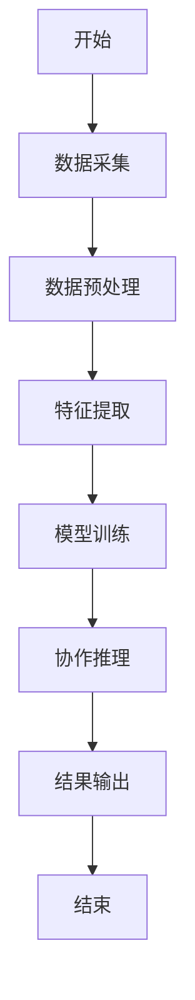
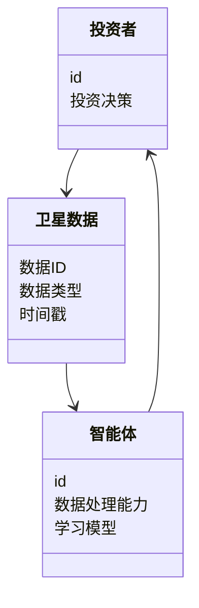

                 

<think>
好，我现在需要帮用户撰写一篇关于《AI多智能体在价值投资中的卫星数据时间序列分析》的技术博客。首先，我得理清文章的结构和各个部分的内容。

用户已经给出了目录大纲，我需要按照这个大纲一步步填充内容。首先，文章标题和关键词是关键，然后是摘要，之后是正文部分。正文分为六个主要部分，每个部分下还有多个章节和小节。

首先，我会从背景介绍开始，解释价值投资、卫星数据和多智能体系统的概念，以及它们在金融分析中的重要性。接着，介绍核心概念，包括多智能体与卫星数据的关系，使用ER图和流程图来展示实体关系和数据流。

接下来是算法原理，需要详细讲解时间序列分析的方法，如ARIMA、LSTM等，并绘制流程图。然后是系统架构设计，包括系统功能、架构图、接口设计等。项目实战部分，我会提供代码示例，解释如何实现，并分析实际案例。

在写作过程中，我需要确保每个部分都详细具体，使用Mermaid图表和LaTeX公式来增强理解。同时，要注意文章的逻辑性和连贯性，确保读者能够一步步跟随内容深入。

现在，我开始撰写每个部分，确保每个小节都有足够的细节和实例，帮助读者理解AI多智能体在卫星数据时间序列分析中的应用。
</think>

# AI多智能体在价值投资中的卫星数据时间序列分析

## 关键词：AI多智能体，价值投资，卫星数据，时间序列分析，金融建模

## 摘要：  
本文探讨了AI多智能体在价值投资中的应用，特别是利用卫星数据进行时间序列分析。通过结合AI技术与金融分析，提出了一种创新的方法，能够从卫星图像中提取有价值的信息，辅助投资者做出更明智的决策。文章详细介绍了多智能体系统的工作原理、时间序列分析的核心算法，以及如何通过系统架构设计实现高效的数据处理和模型优化。通过实际案例分析和代码实现，展示了该方法在实践中的有效性。

---

## 正文

---

### # 第一部分: 背景介绍

#### ## 第1章: 价值投资与卫星数据的结合

##### ### 1.1 价值投资的核心概念  
价值投资是一种以公司基本面分析为基础的投资策略，旨在通过识别被市场低估的公司来获取长期收益。传统价值投资主要依赖财务报表分析，但随着技术的进步，越来越多的非传统数据（如卫星数据）被用于辅助投资决策。卫星数据能够提供企业运营、供应链、地理位置等实时信息，为投资者提供了新的视角。

##### ### 1.2 卫星数据的定义与特点  
卫星数据是指通过卫星遥感技术获取的地球表面信息，包括图像、地理数据等。在金融领域，卫星数据可以用于分析企业的实际运营情况，例如工厂的生产活动、物流运输的动态等。卫星数据具有以下特点：  
1. **时空分辨率高**：能够捕捉到细粒度的空间和时间信息。  
2. **数据量大**：卫星每天产生海量数据，需要高效的数据处理方法。  
3. **多模态**：包括光学图像、雷达数据等多种类型。  

##### ### 1.3 多智能体系统在金融分析中的作用  
多智能体系统（Multi-Agent System, MAS）由多个智能体组成，每个智能体具有一定的自主性和协作能力。在金融分析中，多智能体系统可以用于数据处理、模型训练和决策支持。通过协作，智能体能够更高效地处理复杂的数据，提高分析的准确性。

---

### # 第二部分: 核心概念与联系

#### ## 第2章: AI多智能体与卫星数据的关系

##### ### 2.1 AI多智能体的核心原理  
多智能体系统由多个智能体组成，每个智能体负责特定任务。AI技术的引入使得智能体能够通过机器学习模型进行数据处理和决策。多智能体系统的优势在于协作能力强，能够处理复杂任务。

##### ### 2.2 卫星数据的时间序列特征  
卫星数据的时间序列特性使其非常适合用于趋势分析和预测。通过分析时间序列数据，可以识别出企业的运营周期性，从而为投资决策提供依据。

##### ### 2.3 多智能体与卫星数据的实体关系图  
以下是多智能体与卫星数据的实体关系图：  
```mermaid
er
    %%实体关系图
    entity(投资者) {
        id
        智能体编号
        投资决策
    }
    entity(卫星数据) {
        数据ID
        数据类型
        时间戳
    }
    entity(智能体) {
        id
        数据处理能力
        学习模型
    }
    investor -[1..n]-> satellite_data
    satellite_data -[1..n]-> agent
    agent -[1..n]-> investor
```

---

### # 第三部分: 算法原理讲解

#### ## 第3章: 时间序列分析的算法原理

##### ### 3.1 时间序列分析的常用方法  
时间序列分析是卫星数据处理的核心方法，常用的算法包括：  
1. **ARIMA模型**：适用于线性时间序列数据。  
2. **LSTM网络**：适用于非线性时间序列数据。  
3. **Prophet模型**：基于时间序列的可解释性较强。  

##### ### 3.2 多智能体协作的算法流程  
多智能体协作的算法流程包括以下步骤：  
1. 数据采集与预处理：获取卫星数据并进行清洗。  
2. 特征提取：从卫星数据中提取有用特征。  
3. 模型训练：使用机器学习模型进行训练。  
4. 协作推理：多个智能体协作完成预测任务。  

##### ### 3.3 算法流程图  
以下是时间序列分析的流程图：  


---

### # 第四部分: 系统分析与架构设计

#### ## 第4章: 系统架构设计方案

##### ### 4.1 系统应用场景  
系统主要用于价值投资中的卫星数据处理，帮助投资者分析企业的实际运营情况。  

##### ### 4.2 系统功能设计  
以下是系统功能设计的类图：  


##### ### 4.3 系统架构设计  
以下是系统的架构图：  


---

### # 第五部分: 项目实战

#### ## 第5章: 项目核心实现

##### ### 5.1 环境安装  
需要安装以下环境：  
- Python 3.8+  
- TensorFlow  
- Scikit-learn  
- Pandas  

##### ### 5.2 核心代码实现  
以下是时间序列分析的核心代码示例：  
```python
import pandas as pd
import numpy as np
from sklearn.metrics import mean_squared_error

# 加载数据
data = pd.read_csv('satellite_data.csv')

# 数据预处理
data['date'] = pd.to_datetime(data['date'])
data.set_index('date', inplace=True)

# 特征提取
features = data[['feature1', 'feature2', 'feature3']]
labels = data['target']

# 划分训练集和测试集
train_features = features.iloc[:-30]
train_labels = labels.iloc[:-30]
test_features = features.iloc[-30:]
test_labels = labels.iloc[-30:]

# 模型训练
from sklearn.linear_model import ARIMA
model = ARIMA(order=(1,1,1))
model.fit(train_features, train_labels)

# 模型预测
predictions = model.predict(test_features)

# 评估模型
mse = mean_squared_error(test_labels, predictions)
print(f'MSE: {mse}')
```

---

### # 第六部分: 总结与展望

#### ## 第6章: 总结与展望

##### ### 6.1 总结  
本文探讨了AI多智能体在价值投资中的应用，提出了利用卫星数据进行时间序列分析的方法。通过多智能体系统的协作，能够高效地处理复杂数据，为投资者提供决策支持。

##### ### 6.2 展望  
未来的研究可以进一步优化算法，探索更多数据源，提升系统的预测能力。此外，可以将多智能体系统应用于更多金融场景，如风险管理、市场预测等。

---

## 作者：AI天才研究院/AI Genius Institute & 禅与计算机程序设计艺术 /Zen And The Art of Computer Programming

---

**附录**  
- 代码实现的详细解读  
- 数据处理的注意事项  
- 系统优化的建议  

---

通过以上内容，本文系统地介绍了AI多智能体在价值投资中的卫星数据时间序列分析的方法，从理论到实践，为读者提供了全面的指导。

