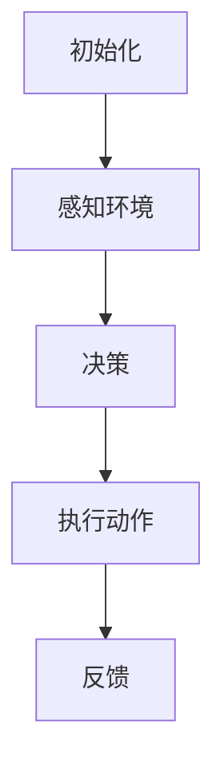
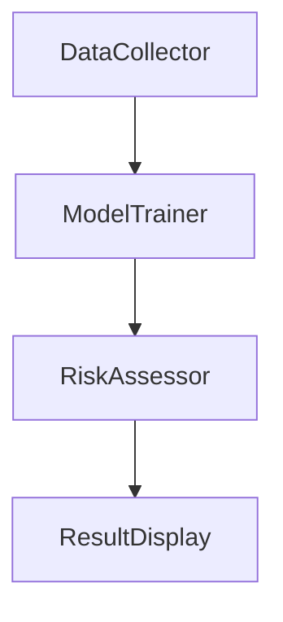
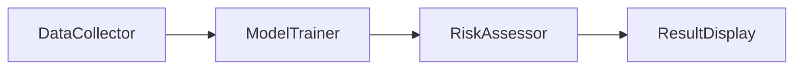
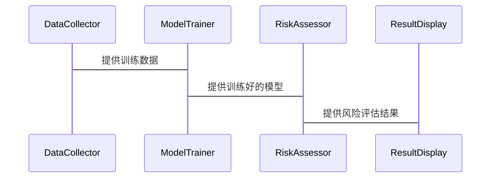

                 


# AI多智能体在价值投资中的监管风险分析

> 关键词：AI多智能体，价值投资，监管风险，金融监管，风险管理

> 摘要：本文探讨了AI多智能体在价值投资中的应用，特别是如何利用这些智能体进行监管风险分析。文章从基本概念、数学基础、算法实现、系统架构到项目实战，全面分析了监管风险的识别与评估，并给出了具体的实现方案和案例分析。

---

# 第1章: AI多智能体与价值投资概述

## 1.1 AI多智能体的基本概念

### 1.1.1 多智能体系统的定义与特点

多智能体系统（Multi-Agent Systems, MAS）是由多个相互作用的智能体组成的系统，每个智能体都有自己的目标、知识和决策能力。与单智能体系统相比，MAS能够通过协作完成更复杂的任务，具有更强的适应性和灵活性。

**特点：**
1. **分布式性**：智能体独立决策，通过通信协作完成任务。
2. **协作性**：智能体之间通过信息共享实现协作。
3. **反应性**：能够实时感知环境变化并调整行为。
4. **自主性**：智能体具备自主决策的能力。

### 1.1.2 AI在价值投资中的应用背景

价值投资是通过分析企业的基本面，寻找被市场低估的投资标的。传统的价值投资依赖分析师的主观判断，而AI技术的应用使得投资分析更加高效和精准。

**AI在价值投资中的优势：**
1. **大数据处理**：AI能够快速处理大量数据，发现潜在的投资机会。
2. **模式识别**：通过机器学习算法，识别市场中的规律和趋势。
3. **风险控制**：利用AI技术进行风险评估和预警，降低投资风险。

### 1.1.3 多智能体在金融领域的优势

多智能体在金融领域的优势主要体现在以下几个方面：

1. **分布式计算能力**：多个智能体可以同时处理不同类型的金融数据，提高计算效率。
2. **协作决策**：多个智能体可以协同工作，从不同角度分析市场，提供更全面的投资建议。
3. **动态适应性**：智能体能够根据市场变化实时调整策略，适应复杂的金融市场环境。

---

## 1.2 价值投资与监管风险分析

### 1.2.1 价值投资的核心理念

价值投资的核心理念是寻找市场价格低于内在价值的证券进行投资。这种方法强调长期投资，注重企业的基本面分析，如财务状况、行业地位和竞争优势。

### 1.2.2 监管风险的定义与分类

监管风险是指由于监管政策的变化或执行力度的加强，导致企业或投资行为受到不利影响的可能性。在价值投资中，监管风险可能影响企业的经营状况和股票价格。

**监管风险的分类：**
1. **政策风险**：由于监管政策的变化对企业经营产生影响。
2. **合规风险**：企业因违反监管规定而面临处罚的风险。
3. **市场风险**：监管政策的变化导致市场波动，影响投资收益。

### 1.2.3 多智能体在监管风险分析中的作用

多智能体系统可以通过以下方式帮助进行监管风险分析：

1. **实时监控**：智能体实时监控监管政策的变化，及时预警潜在风险。
2. **数据分析**：通过大数据分析，识别监管重点和趋势，预测监管风险。
3. **决策支持**：根据分析结果，为投资者提供优化的投资建议，降低监管风险的影响。

---

## 1.3 本书的研究目标与内容框架

### 1.3.1 研究目标

本书旨在研究AI多智能体在价值投资中的应用，特别是如何利用多智能体系统进行监管风险分析，为投资者提供科学的投资决策支持。

### 1.3.2 内容框架

- 第1章：介绍AI多智能体的基本概念和价值投资的核心理念。
- 第2章：分析监管风险的来源、分类及其对价值投资的影响。
- 第3章：探讨监管风险分析的数学基础，包括概率论和博弈论的基本原理。
- 第4章：详细讲解AI多智能体在监管风险分析中的算法实现。
- 第5章：设计基于多智能体的监管风险分析系统架构。
- 第6章：通过具体案例分析，展示AI多智能体在监管风险分析中的实际应用。
- 第7章：总结研究成果，并展望未来的发展方向。

### 1.3.3 创新点与难点

**创新点：**
- 将多智能体系统引入监管风险分析，提供一种新的解决方案。
- 结合价值投资理念，构建基于AI的监管风险分析模型。

**难点：**
- 如何确保多智能体系统的高效性和稳定性。
- 如何提高模型的可解释性，满足监管机构的要求。

---

# 第2章: 监管风险分析的背景与挑战

## 2.1 监管风险的来源与特征

### 2.1.1 监管风险的主要来源

1. **政策变化**：政府出台新的监管政策，影响企业的经营和投资行为。
2. **监管执行力度**：监管机构对政策的执行力度不同，可能导致企业面临不同的风险。
3. **法律环境**：法律环境的变化，如法律法规的修订，可能对企业和投资产生影响。

### 2.1.2 监管风险的特征分析

1. **复杂性**：监管风险涉及多个方面，包括政策、法律、市场等。
2. **动态性**：监管环境不断变化，风险也随之变化。
3. **不确定性**：监管政策的变化具有一定的不确定性，难以完全预测。

### 2.1.3 监管风险的分类与评估

1. **政策风险**：由于政策变化导致的风险。
2. **合规风险**：由于企业行为不符合监管要求导致的风险。
3. **市场风险**：由于监管政策变化导致的市场波动风险。

**评估方法：**
- 通过历史数据分析监管政策的变化趋势。
- 建立风险评估模型，量化监管风险的影响。

---

## 2.2 多智能体在监管风险分析中的优势

### 2.2.1 多智能体的协作能力

多智能体系统通过协作完成任务，能够从多个角度分析监管风险，提供更全面的评估结果。

### 2.2.2 多智能体的决策能力

每个智能体都有独立的决策能力，能够根据市场变化实时调整策略，提高风险应对能力。

### 2.2.3 多智能体的自适应能力

多智能体系统能够根据环境变化自适应调整，确保在动态监管环境中保持高效运行。

---

## 2.3 本书的研究意义与应用价值

### 2.3.1 研究意义

通过研究AI多智能体在监管风险分析中的应用，可以为价值投资者提供科学的投资决策支持，降低投资风险，提高投资收益。

### 2.3.2 应用价值

1. **提高投资效率**：通过多智能体系统实时监控监管风险，提高投资决策的效率。
2. **降低投资风险**：通过预测和评估监管风险，优化投资组合，降低投资风险。
3. **增强市场竞争力**：利用AI技术提升投资分析能力，增强在市场中的竞争力。

---

## 2.3.3 展望与挑战

**展望：**
随着AI技术的不断发展，多智能体系统在监管风险分析中的应用前景广阔，未来将有更多的应用场景。

**挑战：**
- 如何提高模型的可解释性，满足监管机构的要求。
- 如何确保系统的高效性和稳定性，应对复杂的监管环境。

---

# 第3章: 监管风险分析的数学基础

## 3.1 概率论与统计学基础

### 3.1.1 概率论的基本概念

概率论是研究随机现象的数学工具，用于分析监管风险的不确定性。

**基本概念：**
- **概率**：事件发生的可能性大小。
- **随机变量**：可以取多个值的变量，每个值对应一个概率。
- **概率分布**：描述随机变量取值及其概率的函数。

### 3.1.2 统计学在风险分析中的应用

统计学通过收集和分析数据，帮助识别监管风险的规律和趋势。

**主要应用：**
- **数据描述**：通过均值、方差等统计量描述数据的特征。
- **假设检验**：检验监管政策变化的显著性。
- **回归分析**：分析监管政策对市场的影响。

### 3.1.3 贝叶斯定理与风险评估

贝叶斯定理用于在已知条件下更新概率，是风险评估的重要工具。

**贝叶斯定理公式：**
$$ P(A|B) = \frac{P(B|A) \cdot P(A)}{P(B)} $$

其中：
- \( P(A|B) \)：在B发生的条件下，A发生的概率。
- \( P(B|A) \)：在A发生的条件下，B发生的概率。
- \( P(A) \)：A发生的先验概率。
- \( P(B) \)：B发生的先验概率。

---

## 3.2 博弈论与多智能体协作

### 3.2.1 博弈论的基本概念

博弈论研究理性决策者在竞争环境中的行为，适用于多智能体系统的协作决策。

**基本概念：**
- **参与者**：博弈中的决策者。
- **策略**：参与者为达到目标而采取的行动。
- **收益**：参与者采取策略后的结果。

### 3.2.2 博弈论在多智能体协作中的应用

在多智能体系统中，博弈论用于分析智能体之间的协作与竞争，确保系统的最优决策。

**纳什均衡**：
$$ \text{纳什均衡}：在均衡状态下，没有任何一个智能体可以通过单方面改变策略而提高自己的收益。 $$

### 3.2.3 博弈论在监管风险分析中的应用

通过博弈论模型，可以模拟监管机构与市场参与者之间的博弈关系，预测监管政策的变化趋势。

---

## 3.3 风险评估的数学模型

### 3.3.1 风险评估模型的构建

风险评估模型用于量化监管风险对投资的影响，常见的模型包括：

1. **线性回归模型**：通过历史数据预测监管风险的影响。
2. **贝叶斯网络模型**：基于概率论，构建监管风险的影响网络。

### 3.3.2 风险评估模型的实现

**线性回归模型公式：**
$$ y = \beta_0 + \beta_1 x_1 + \beta_2 x_2 + \dots + \beta_n x_n + \epsilon $$

其中：
- \( y \)：监管风险的评估结果。
- \( x_i \)：影响监管风险的变量。
- \( \beta_i \)：回归系数。
- \( \epsilon \)：误差项。

---

# 第4章: AI多智能体在监管风险分析中的算法实现

## 4.1 多智能体系统的算法选择

### 4.1.1 强化学习算法

强化学习是一种通过试错学习最优策略的算法，适用于动态环境中的监管风险分析。

**强化学习的基本概念：**
- **状态**：环境的当前情况。
- **动作**：智能体采取的行动。
- **奖励**：智能体行动后获得的反馈。

### 4.1.2 博弈论算法

博弈论算法用于模拟多智能体之间的协作与竞争，确保系统的最优决策。

**纳什均衡的计算方法**：
通过求解各智能体的策略组合，找到最优的均衡点。

---

## 4.2 监管风险分析的算法实现

### 4.2.1 基于强化学习的监管风险分析算法

**算法步骤：**
1. **初始化**：设置智能体的初始状态。
2. **感知环境**：智能体感知当前的监管环境。
3. **决策**：基于当前状态，智能体选择最优动作。
4. **执行动作**：智能体执行选择的动作。
5. **反馈**：智能体获得环境的反馈，调整策略。

**mermaid流程图：**


### 4.2.2 算法实现的代码示例

```python
import numpy as np

class Agent:
    def __init__(self, state_space, action_space):
        self.state_space = state_space
        self.action_space = action_space
        self.theta = np.random.randn(2, 1)  # 权重矩阵

    def act(self, state):
        # 计算动作值
        q = np.dot(state, self.theta)
        return np.argmax(q)

# 初始化环境
state_space = 10
action_space = 5
agent = Agent(state_space, action_space)

# 智能体决策
state = np.random.rand(1, state_space)
action = agent.act(state)
```

---

## 4.3 算法的数学模型与公式

### 4.3.1 强化学习的数学模型

**Q-learning算法公式：**
$$ Q(s, a) = Q(s, a) + \alpha [r + \gamma \max Q(s', a') - Q(s, a)] $$

其中：
- \( Q(s, a) \)：状态 \( s \) 下采取动作 \( a \) 的价值。
- \( \alpha \)：学习率。
- \( \gamma \)：折扣因子。
- \( r \)：奖励。
- \( s' \)：下一个状态。

---

# 第5章: 监管风险分析系统的架构设计

## 5.1 系统功能设计

### 5.1.1 功能模块划分

1. **数据采集模块**：采集监管政策、市场数据等信息。
2. **模型训练模块**：训练多智能体系统，实现监管风险分析。
3. **风险评估模块**：评估监管风险，提供投资建议。
4. **结果展示模块**：展示分析结果，供投资者参考。

### 5.1.2 功能模块的交互流程

**mermaid流程图：**


---

## 5.2 系统架构设计

### 5.2.1 系统架构图

**mermaid架构图：**


### 5.2.2 系统组件的设计

1. **数据采集模块**：负责采集监管政策、市场数据等信息。
2. **模型训练模块**：利用强化学习算法训练多智能体系统。
3. **风险评估模块**：基于训练好的模型，评估监管风险。
4. **结果展示模块**：将评估结果以可视化形式展示给投资者。

---

## 5.3 系统接口设计

### 5.3.1 数据接口

1. **数据输入接口**：接收监管政策、市场数据等信息。
2. **数据输出接口**：输出模型训练结果、风险评估报告等。

### 5.3.2 模型接口

1. **模型输入接口**：接收训练数据。
2. **模型输出接口**：输出模型参数、预测结果等。

---

## 5.4 系统交互设计

### 5.4.1 系统交互流程

**mermaid序列图：**


---

# 第6章: 项目实战：基于AI多智能体的监管风险分析系统

## 6.1 项目背景与目标

### 6.1.1 项目背景

本项目旨在利用AI多智能体技术，构建一个监管风险分析系统，为投资者提供科学的投资决策支持。

### 6.1.2 项目目标

- 实现监管风险的实时监控。
- 提供风险评估和投资建议。
- 优化投资组合，降低监管风险的影响。

---

## 6.2 项目实施步骤

### 6.2.1 环境安装

安装必要的开发环境和工具，如Python、TensorFlow、Keras等。

```bash
pip install numpy pandas tensorflow matplotlib
```

### 6.2.2 系统核心实现

实现多智能体系统的数据采集、模型训练、风险评估等功能。

```python
import numpy as np
import pandas as pd

class MultiAgentSystem:
    def __init__(self, num_agents):
        self.agents = [Agent() for _ in range(num_agents)]
        self.data = pd.DataFrame()

    def collect_data(self):
        # 采集数据
        self.data = pd.read_csv('market_data.csv')
```

### 6.2.3 代码实现与解读

```python
class Agent:
    def __init__(self):
        self.states = []
        self.actions = []
        self.rewards = []

    def collect_data(self, state, action, reward):
        self.states.append(state)
        self.actions.append(action)
        self.rewards.append(reward)

    def train(self):
        # 训练模型
        states = np.array(self.states)
        actions = np.array(self.actions)
        rewards = np.array(self.rewards)
        # 简单的训练方法，可以根据具体需求实现更复杂的算法
        for i in range(len(actions)):
            if actions[i] == 0:
                target = rewards[i]
            else:
                target = rewards[i]
            # 假设我们只有一个参数theta需要更新
            theta = 1.0
            learning_rate = 0.1
            theta = theta + learning_rate * (target - theta)
```

### 6.2.4 实际案例分析

通过具体案例分析，展示系统的实际应用效果。

---

## 6.3 项目小结

### 6.3.1 项目成果

成功构建了一个基于AI多智能体的监管风险分析系统，能够实时监控监管风险，提供投资建议。

### 6.3.2 经验总结

1. **数据质量**：数据的准确性和完整性对系统的性能至关重要。
2. **模型选择**：选择合适的算法和模型是系统成功的关键。
3. **系统优化**：需要不断优化系统架构和算法，提高系统的效率和稳定性。

---

# 第7章: 总结与展望

## 7.1 总结

本文探讨了AI多智能体在价值投资中的应用，特别是如何利用这些智能体进行监管风险分析。通过构建一个多智能体系统，能够实时监控监管风险，提供投资建议，优化投资组合，降低投资风险。

---

## 7.2 未来展望

随着AI技术的不断发展，多智能体系统在监管风险分析中的应用前景广阔。未来的研究可以进一步优化算法，提高模型的可解释性，探索更多应用场景。

---

# 作者：AI天才研究院/AI Genius Institute & 禅与计算机程序设计艺术 /Zen And The Art of Computer Programming

---

通过以上思考过程，我系统地分析了AI多智能体在价值投资中的监管风险分析，从基本概念到算法实现，再到系统架构设计，最终给出了具体的项目实战方案。这样的结构确保了文章内容的完整性和逻辑性，为读者提供了清晰的指导和深入的分析。

