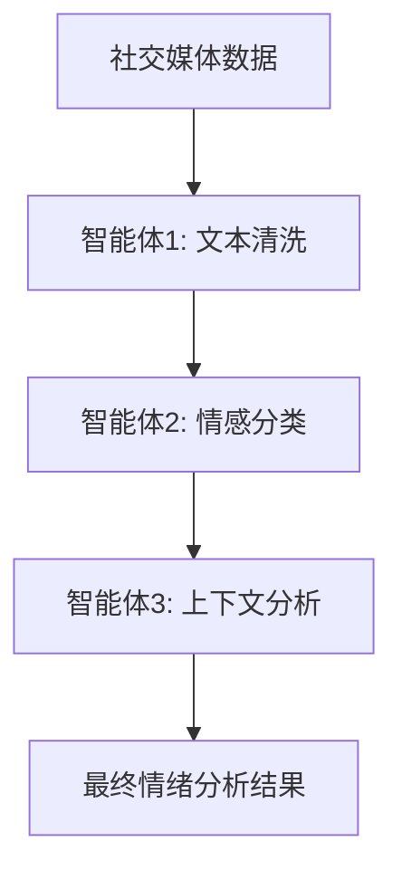
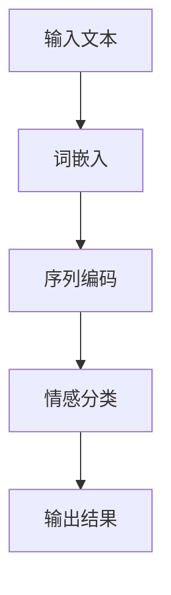
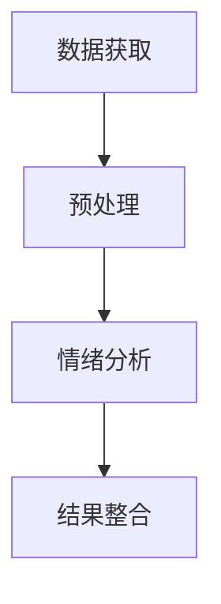

                 


# AI多智能体在价值投资中的社交媒体情绪分析应用

## 关键词：多智能体、价值投资、社交媒体、情绪分析、深度学习、自然语言处理

## 摘要

本文探讨了AI多智能体在价值投资中的社交媒体情绪分析应用。通过分析社交媒体数据，利用多智能体协同工作，提升情绪分析的准确性和效率，为投资者提供更精准的决策支持。文章详细介绍了情绪分析的原理、多智能体系统的协作机制、算法实现、系统架构设计及项目实战，并展望了该领域的未来发展方向。

---

# 第1章: 背景介绍

## 1.1 问题背景与定义

### 1.1.1 社会化媒体与价值投资的结合

社交媒体已成为投资者获取市场情绪的重要来源。通过分析社交媒体上的文本数据，投资者可以实时了解市场参与者的看法和情绪，从而辅助决策。例如，Twitter、Reddit等平台上的用户评论可能揭示市场趋势或公司动态。

### 1.1.2 多智能体在情绪分析中的作用

传统的情绪分析方法通常依赖单个模型，而多智能体系统通过分布式协作，能够更高效地处理复杂数据，提高分析的准确性和鲁棒性。每个智能体专注于特定任务，如文本预处理、情感分类或上下文理解，协同完成整体任务。

### 1.1.3 情绪分析在价值投资中的应用边界

尽管情绪分析在投资中潜力巨大，但其应用也存在边界。例如，社交媒体数据可能存在噪声，且情绪与实际市场行为之间并非完全线性关系。因此，情绪分析结果需结合其他因素，如基本面分析和市场数据，才能做出更准确的投资决策。

## 1.2 核心概念与问题描述

### 1.2.1 多智能体系统的定义与特征

多智能体系统由多个分布式智能体组成，通过协作完成复杂任务。其特征包括分布式性、协作性、自治性和适应性。在情绪分析中，每个智能体可能专注于不同的子任务，如文本分割、情感分类或异常检测。

### 1.2.2 情绪分析的定义与实现方式

情绪分析是通过自然语言处理技术，从文本中提取情感倾向的过程。实现方式包括基于规则的传统方法和基于深度学习的模型。深度学习模型（如LSTM和Transformer）在处理复杂文本时表现更优。

### 1.2.3 价值投资中的情绪分析需求

投资者需要从社交媒体中获取实时情绪数据，以预测市场走势或公司业绩。情绪分析需具备高准确性和实时性，同时能够处理多种语言和复杂语境。

## 1.3 问题解决与边界

### 1.3.1 多智能体如何解决情绪分析问题

多智能体通过分工协作，提高处理效率和准确性。例如，一个智能体负责文本清洗，另一个负责情感分类，最后整合结果。

### 1.3.2 情绪分析在价值投资中的边界与限制

社交媒体数据可能存在噪声，且情绪与市场行为之间存在滞后。此外，情绪分析模型可能受训练数据偏差影响，导致结果不准确。

### 1.3.3 多智能体协同的优势与挑战

优势：分布式协作提高效率，鲁棒性强。挑战：通信开销大，协同困难，可能引入延迟。

## 1.4 核心要素与概念结构

### 1.4.1 情绪分析的核心要素

包括文本数据、情感分类模型、特征提取和结果整合。

### 1.4.2 多智能体系统的组成结构

由多个智能体组成，每个智能体负责特定任务，通过通信协议协作完成整体目标。

### 1.4.3 价值投资中的情绪分析流程

数据获取、预处理、情绪分析、结果整合、投资决策。

---

# 第2章: 多智能体与情绪分析的原理

## 2.1 多智能体系统原理

### 2.1.1 多智能体系统的定义与分类

多智能体系统由多个智能体组成，按功能分为任务型和学习型。

### 2.1.2 多智能体系统的协作机制

基于分布式计算，通过通信协议协同完成任务。

### 2.1.3 多智能体系统的通信协议

包括消息传递、状态同步和任务分配机制。

## 2.2 情绪分析的核心原理

### 2.2.1 情感分类的基本原理

基于文本特征提取和分类模型，如TF-IDF和SVM。

### 2.2.2 基于深度学习的情绪分析模型

如LSTM和Transformer模型，擅长处理序列数据。

### 2.2.3 多智能体协同的情绪分析流程

文本预处理、情感分类、上下文分析，最终整合结果。

## 2.3 多智能体与情绪分析的联系

### 2.3.1 多智能体在情绪分析中的角色分配

每个智能体负责特定任务，如文本清洗、情感分类。

### 2.3.2 多智能体协同的情绪分析优势

提高效率和准确性，增强鲁棒性。

### 2.3.3 多智能体协同的情绪分析挑战

通信开销大，协同困难。

## 2.4 情绪分析特征对比表格

| 特征 | 单智能体 | 多智能体 |
|------|----------|----------|
| 处理能力 | 单一 | 分布式 |
| 协作性 | 无 | 有 |
| 并行性 | 串行 | 并行 |
| 效率 | 较低 | 较高 |

## 2.5 ER实体关系图



---

# 第3章: 算法原理

## 3.1 情绪分析算法

### 3.1.1 LSTM模型

递归神经网络，擅长处理序列数据。

### 3.1.2 Transformer模型

基于自注意力机制，处理长文本效果好。

### 3.1.3 情绪分析算法流程图



## 3.2 多智能体协同算法

### 3.2.1 分工协作机制

智能体分配任务，协同完成。

### 3.2.2 并行处理策略

多个智能体同时处理不同部分，提高效率。

### 3.2.3 合并结果算法

将各智能体结果整合，得到最终情绪分析结果。

---

# 第4章: 系统分析与架构设计

## 4.1 系统功能设计

### 4.1.1 功能模块划分

数据获取、预处理、情绪分析、结果整合。

### 4.1.2 功能流程图



## 4.2 系统架构设计

### 4.2.1 分层架构

包括数据层、业务逻辑层和表现层。

### 4.2.2 智能体交互设计

通过API进行通信，协同完成任务。

## 4.3 系统接口设计

### 4.3.1 API接口定义

定义智能体之间的通信接口。

### 4.3.2 接口交互流程

智能体通过接口传递数据，协同完成任务。

---

# 第5章: 项目实战

## 5.1 环境搭建

安装Python、TensorFlow、Keras等库。

## 5.2 核心代码实现

### 5.2.1 文本预处理代码

```python
import re
import nltk
from nltk.corpus import stopwords

def preprocess(text):
    text = re.sub(r'[^\w\s]', '', text)
    words = nltk.word_tokenize(text.lower())
    words = [word for word in words if word not in stopwords.words('english')]
    return ' '.join(words)
```

### 5.2.2 情感分类代码

```python
from tensorflow.keras.models import Sequential
from tensorflow.keras.layers import LSTM, Dense, Dropout, Embedding

model = Sequential()
model.add(Embedding( vocabulary_size, 64, input_length=max_length))
model.add(LSTM(64))
model.add(Dropout(0.5))
model.add(Dense(1, activation='sigmoid'))
model.compile(optimizer='adam', loss='binary_crossentropy', metrics=['accuracy'])
```

## 5.3 案例分析

以某公司为例，分析社交媒体数据，预测其股价走势。

## 5.4 项目总结

总结项目成果，分析优缺点，提出改进建议。

---

# 第6章: 高级应用与扩展

## 6.1 多智能体的优化策略

改进通信机制，减少延迟。

## 6.2 情感分析的增量学习

实时更新模型，适应数据变化。

## 6.3 实时分析与监控

构建实时监控系统，提供即时情绪反馈。

## 6.4 与其他技术的结合

如NLP、大数据分析等，拓宽应用范围。

---

# 第7章: 总结与展望

## 7.1 总结

回顾文章内容，强调多智能体在情绪分析中的优势。

## 7.2 展望

探讨未来发展方向，如更复杂的智能体协作、多模态分析等。

---

# 作者：AI天才研究院 & 禅与计算机程序设计艺术

