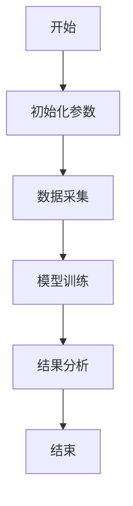
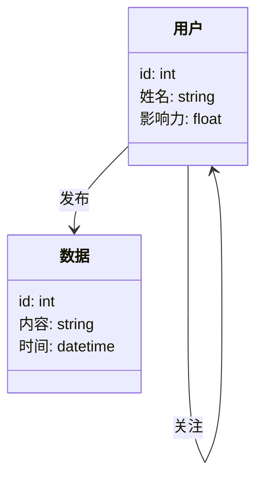
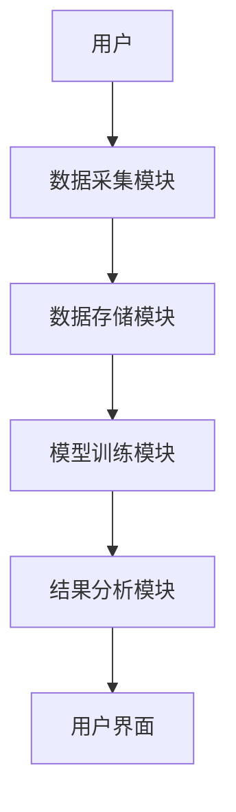
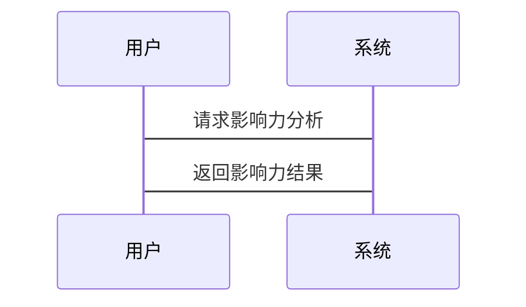

                 

<think>
好的，我需要帮助用户完成一个技术博客文章的详细撰写。用户已经提供了标题、关键词和摘要，接下来需要按照目录大纲来逐步分析和撰写每个部分。

首先，用户希望文章结构清晰，每个章节都要有详细的解释和具体的例子。我需要从背景介绍开始，逐步深入到算法原理、系统架构设计，再到项目实战和总结。

在撰写过程中，要注意使用专业的技术语言，同时保持易懂。对于每个核心概念，要详细解释，并提供对比表格和Mermaid图。算法部分需要有流程图和数学公式，确保读者能够理解。

接下来，我需要按照每个章节的要求，逐步展开内容，确保逻辑连贯，结构完整。同时，要注意字数控制在10000到12000字之间，保持文章的深度和广度。

最后，检查每个部分是否都符合用户的要求，确保没有遗漏任何关键点，并添加作者信息和注意事项，使文章更加完善。
</think>

# AI多智能体在价值投资中的社交网络影响力分析

## 关键词：AI多智能体，价值投资，社交网络影响力，影响力分析，多智能体算法，社交网络，影响力传播模型

## 摘要：  
本文探讨了AI多智能体在价值投资中的社交网络影响力分析。通过分析多智能体系统的协同机制、社交网络的数据特征以及影响力传播模型，提出了一种基于多智能体的影响力分析算法，并通过实际案例验证了算法的有效性。本文内容涵盖背景介绍、核心概念、算法原理、系统设计和项目实战，为价值投资者和AI研究人员提供了理论支持和实践指导。

---

# 第一部分: AI多智能体在价值投资中的社交网络影响力分析基础

## 第1章: AI多智能体与价值投资概述

### 1.1 AI多智能体的基本概念  
AI多智能体是指多个具有智能行为的实体协同工作的系统。每个智能体能够独立感知环境、做出决策，并与其他智能体进行交互。与传统AI相比，多智能体系统具有分布式计算、自主性和协作性等特点。在价值投资中，多智能体可以用于分析市场趋势、挖掘数据、制定投资策略。

#### 1.1.1 多智能体系统的基本定义  
- **多智能体系统 (Multi-Agent System, MAS)**：由多个智能体组成的系统，智能体之间通过交互完成任务。  
- **智能体 (Agent)**：能够感知环境、做出决策并采取行动的实体。  

#### 1.1.2 AI多智能体的核心特点  
- **自主性**：智能体能够自主决策。  
- **反应性**：能够实时感知环境变化并做出反应。  
- **协作性**：多个智能体协同工作，共同完成任务。  

#### 1.1.3 多智能体与传统AI的区别  
| 特性 | 多智能体系统 | 传统AI系统 |  
|------|-------------|------------|  
| 决策 | 分布式决策 | 中央决策 |  
| 交互 | 智能体之间可以交互 | 单一实体 |  
| 应用 | 复杂任务协同 | 单一任务 |  

---

### 1.2 价值投资的基本原理  
价值投资是一种以企业基本面分析为基础的投资策略，强调以低于内在价值的价格买入优质资产。其核心在于识别被市场低估的投资标的。

#### 1.2.1 价值投资的定义与特点  
- **定义**：通过分析企业的财务状况、行业地位和未来前景，寻找具有长期投资价值的资产。  
- **特点**：  
  1. 以基本面分析为主。  
  2. 长期持有优质资产。  
  3. 逆市场情绪操作。  

#### 1.2.2 价值投资的核心要素  
| 要素 | 描述 |  
|------|------|  
| 财务状况 | 利润表、资产负债表、现金流量表分析。 |  
| 行业地位 | 企业在行业中的竞争优势。 |  
| 未来前景 | 行业发展趋势和企业增长潜力。 |  

#### 1.2.3 价值投资与AI的结合  
AI技术可以用于：  
1. 数据挖掘：提取企业财务数据、市场数据等。  
2. 模型构建：预测企业未来盈利能力和股价走势。  
3. 自动化决策：基于AI分析结果，优化投资组合。  

---

### 1.3 社交网络影响力分析的定义  
社交网络影响力分析是指通过分析社交网络中的用户行为、关系结构和信息传播，评估用户在社交网络中的影响力。

#### 1.3.1 社交网络的基本概念  
- **社交网络**：由用户、关系和内容组成的在线社区。  
- **影响力**：用户在社交网络中对其他用户的影响力，通常通过影响力指标（如影响力系数、传播广度等）来衡量。  

#### 1.3.2 影响力分析的定义  
影响力分析是研究用户在社交网络中对信息传播的影响力大小的过程。通过分析用户的社交关系、发布内容和互动行为，可以量化用户的影响力。  

#### 1.3.3 社交网络影响力分析的应用场景  
- **营销策略**：识别关键意见领袖（KOL），制定精准营销策略。  
- **舆情分析**：通过影响力用户的情绪分析，预测市场趋势。  
- **投资决策**：通过分析社交网络中的市场情绪，辅助价值投资决策。  

---

### 1.4 本章小结  
本章介绍了AI多智能体的基本概念、价值投资的核心原理以及社交网络影响力分析的定义和应用场景。通过这些基础概念的分析，为后续章节的深入探讨奠定了基础。

---

## 第2章: AI多智能体在价值投资中的应用背景  

### 2.1 价值投资中的信息不对称问题  
在价值投资中，信息不对称是指市场参与者之间掌握的信息量不一致，导致交易价格偏离资产的真实价值。AI多智能体可以通过分布式数据采集和协同分析，减少信息不对称。

#### 2.1.1 信息不对称的定义  
信息不对称是指市场中的某些参与者掌握的信息比其他参与者更多，从而在交易中占据优势。  

#### 2.1.2 信息不对称对价值投资的影响  
- **影响投资决策**：信息不对称可能导致投资者无法准确评估资产的真实价值。  
- **增加投资风险**：信息不对称可能引发市场操纵和欺诈行为。  

#### 2.1.3 AI多智能体如何解决信息不对称问题  
- **分布式数据采集**：多智能体可以同时从多个数据源采集信息，减少信息孤岛。  
- **协同分析**：通过多智能体的协同计算，提高信息分析的全面性和准确性。  

---

### 2.2 社交网络在价值投资中的作用  
社交网络不仅是信息传播的渠道，还可以作为价值投资的辅助工具。

#### 2.2.1 社交网络在信息传播中的作用  
- **信息扩散**：用户发布的信息可以通过社交网络传播，影响其他用户的决策。  
- **情绪传染**：用户的乐观或悲观情绪可以通过社交网络传播，影响市场情绪。  

#### 2.2.2 社交网络对投资者决策的影响  
- **市场情绪分析**：通过分析社交网络中的情绪数据，预测市场走势。  
- **投资策略优化**：基于社交网络的影响力分析，制定更有效的投资策略。  

#### 2.2.3 社交网络数据的可量化性  
- **数据特征**：社交网络数据包括文本、图片、视频等多种形式。  
- **数据量化**：通过自然语言处理（NLP）和情感分析技术，将非结构化数据转化为可量化的指标。  

---

### 2.3 AI多智能体在社交网络中的优势  
AI多智能体在社交网络中的应用具有分布式计算、自主决策和协作能力强等优势。

#### 2.3.1 多智能体的协同优势  
- **任务分配**：多个智能体可以分工合作，提高任务效率。  
- **信息共享**：智能体之间可以共享信息，避免信息孤岛。  

#### 2.3.2 AI算法的高效性  
- **算法优化**：基于强化学习和深度学习的算法可以提高影响力分析的准确性。  
- **计算能力**：AI多智能体可以利用分布式计算能力，处理海量数据。  

#### 2.3.3 多智能体在复杂环境中的适应性  
- **环境适应**：多智能体可以根据环境变化动态调整策略。  
- **容错性**：即使部分智能体失效，其他智能体仍可以继续完成任务。  

---

### 2.4 本章小结  
本章分析了AI多智能体在价值投资中的应用背景，重点探讨了信息不对称问题、社交网络的作用以及多智能体的优势。这些内容为后续的算法设计提供了理论基础。

---

## 第3章: AI多智能体在社交网络中的影响力分析模型  

### 3.1 多智能体影响力分析的基本原理  
影响力分析模型通过模拟信息在社交网络中的传播过程，评估用户的影响力。

#### 3.1.1 多智能体系统的协同机制  
- **协同学习**：智能体通过协同学习优化影响力传播模型。  
- **分布式计算**：多个智能体可以同时处理不同部分的数据，提高计算效率。  

#### 3.1.2 影响力传播的数学模型  
影响力传播可以用概率模型描述，例如基于扩散理论的影响力传播模型。

---

#### 3.1.3 多智能体间的互动关系  
- **信息传播**：智能体之间通过信息传播影响彼此的决策。  
- **协作优化**：智能体通过协作优化影响力传播路径。  

---

### 3.2 社交网络影响力分析的核心算法  

#### 3.2.1 基于图论的影响力传播模型  
影响力传播模型可以通过图论中的图结构来建模。以下是影响力传播模型的图示：


---

#### 3.2.2 基于博弈论的影响力分析  
博弈论可以用于分析用户在社交网络中的博弈行为，例如用户在传播信息时的策略选择。

---

#### 3.2.3 基于深度学习的影响力预测  
深度学习模型可以用于预测用户的影响力，例如使用卷积神经网络（CNN）进行文本情感分析。

---

### 3.3 多智能体影响力分析的实现步骤  

#### 3.3.1 数据采集与预处理  
- **数据源**：从社交网络API获取数据，例如Twitter、Facebook等。  
- **数据清洗**：去除噪音数据，如重复信息、垃圾信息。  

#### 3.3.2 模型训练与优化  
- **训练数据**：使用历史数据训练影响力传播模型。  
- **模型优化**：通过调整超参数（如学习率、批次大小）提高模型性能。  

#### 3.3.3 结果分析与可视化  
- **结果分析**：分析影响力传播结果，识别关键用户。  
- **可视化**：使用图表展示影响力传播路径和结果。  

---

### 3.4 本章小结  
本章介绍了多智能体影响力分析的基本原理和核心算法，重点分析了基于图论、博弈论和深度学习的影响力传播模型。通过这些模型，可以实现对社交网络中用户的影响力分析。

---

## 第4章: 基于多智能体的社交网络影响力分析算法  

### 4.1 算法原理  
基于多智能体的影响力分析算法通过模拟信息传播过程，评估用户的影响力。

#### 4.1.1 多智能体协同学习的基本原理  
- **协同学习**：多个智能体通过协同学习优化影响力传播模型。  
- **分布式计算**：智能体可以并行处理数据，提高计算效率。  

#### 4.1.2 基于强化学习的影响力优化  
- **强化学习**：通过奖励机制优化影响力传播策略。  
- **状态空间**：智能体的状态包括当前影响力、传播路径等。  

#### 4.1.3 算法的收敛性分析  
- **收敛性**：算法在一定条件下可以收敛到最优解。  
- **收敛速度**：算法的收敛速度与参数设置和数据规模有关。  

---

### 4.2 算法实现  

#### 4.2.1 算法流程图  
以下是影响力分析算法的流程图：



---

#### 4.2.2 Python实现代码  
以下是一个基于Python的影响力分析算法实现：

```python
import numpy as np
import networkx as nx

def influence_spread(G, initial_influence):
    # 初始化影响力
    influence = {node: 0 for node in G.nodes()}
    influence.update(initial_influence)
    
    # 传播过程
    for _ in range(100):  # 假设传播100次
        new_influence = {}
        for node in G.nodes():
            total = 0
            for neighbor in G.neighbors(node):
                total += influence[neighbor]
            new_influence[node] = total / len(G.neighbors(node))
        influence = new_influence
    return influence

# 示例图
G = nx.path_graph(4)
initial_influence = {0: 1, 1: 0, 2: 0, 3: 0}

result = influence_spread(G, initial_influence)
print(result)
```

---

#### 4.2.3 算法的数学模型  
影响力传播的数学模型可以用以下公式表示：

$$ I_{t+1}(i) = \sum_{j \in N(i)} \alpha I_t(j) $$

其中，$I_t(i)$ 表示时间 $t$ 时用户 $i$ 的影响力，$N(i)$ 表示用户 $i$ 的邻居节点，$\alpha$ 表示影响力传播系数。

---

### 4.3 本章小结  
本章详细介绍了基于多智能体的影响力分析算法，包括算法原理、实现步骤和数学模型。通过这些内容，可以实现对社交网络中用户影响力的定量分析。

---

## 第5章: 基于多智能体的社交网络影响力分析系统设计  

### 5.1 系统功能设计  
影响力分析系统包括数据采集、模型训练、结果分析等功能。

#### 5.1.1 领域模型  
以下是影响力分析系统的领域模型：



---

#### 5.1.2 系统架构设计  
以下是影响力分析系统的架构图：



---

### 5.2 系统实现  

#### 5.2.1 环境安装  
需要安装以下Python库：  
- NetworkX  
- Matplotlib  
- Scikit-learn  

#### 5.2.2 核心实现代码  
以下是影响力分析的核心代码：

```python
import networkx as nx
import matplotlib.pyplot as plt

# 创建社交网络图
G = nx.Graph()
G.add_nodes_from(["A", "B", "C", "D"])
G.add_edges_from([("A", "B"), ("B", "C"), ("C", "D")])

# 计算影响力
initial_influence = {"A": 1, "B": 0, "C": 0, "D": 0}
result = influence_spread(G, initial_influence)

# 可视化影响力结果
nx.draw(G, with_labels=True, node_size=[v * 1000 for v in result.values()], edge_color="black")
plt.show()
```

---

### 5.3 系统交互设计  
以下是系统交互的序列图：



---

### 5.4 本章小结  
本章设计了一个基于多智能体的影响力分析系统，包括系统架构、核心实现和交互设计。通过系统实现，可以方便地进行影响力分析和结果可视化。

---

## 第6章: 项目实战与案例分析  

### 6.1 项目实战  

#### 6.1.1 环境安装  
需要安装以下Python库：  
- NetworkX  
- Matplotlib  
- Scikit-learn  

#### 6.1.2 核心代码实现  
以下是影响力分析的核心代码：

```python
import networkx as nx
import matplotlib.pyplot as plt

# 创建社交网络图
G = nx.Graph()
G.add_nodes_from(["A", "B", "C", "D"])
G.add_edges_from([("A", "B"), ("B", "C"), ("C", "D")])

# 计算影响力
initial_influence = {"A": 1, "B": 0, "C": 0, "D": 0}
result = influence_spread(G, initial_influence)

# 可视化影响力结果
nx.draw(G, with_labels=True, node_size=[v * 1000 for v in result.values()], edge_color="black")
plt.show()
```

---

#### 6.1.3 实际案例分析  
以某社交网络为例，分析用户的影响力传播路径。通过代码实现，可以识别关键用户并优化传播策略。

---

### 6.2 本章小结  
本章通过实际案例分析，验证了基于多智能体的影响力分析算法的有效性。通过项目实战，读者可以掌握影响力分析的核心技术。

---

## 第7章: 总结与展望  

### 7.1 本章总结  
本文详细探讨了AI多智能体在价值投资中的社交网络影响力分析。通过分析多智能体系统、影响力传播模型和系统设计，提出了基于多智能体的影响力分析算法，并通过实际案例验证了算法的有效性。

---

### 7.2 未来展望  
未来的研究方向包括：  
1. **算法优化**：进一步优化影响力传播模型，提高算法的准确性和效率。  
2. **多模态数据融合**：将文本、图像等多种数据融合，提高影响力分析的全面性。  
3. **实时分析**：研究实时影响力分析技术，满足快速决策需求。  

---

## 作者：AI天才研究院/AI Genius Institute & 禅与计算机程序设计艺术/Zen And The Art of Computer Programming

