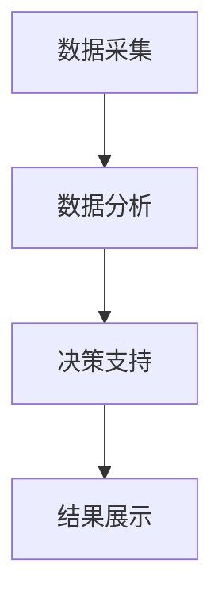
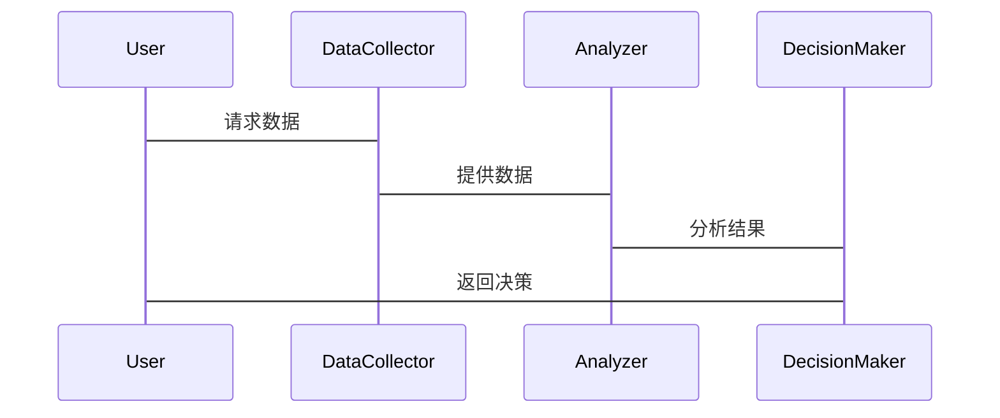

                 


# AI多智能体在公司财务分析中的角色

> 关键词：AI多智能体，财务分析，协同计算，系统架构，风险管理，决策支持

> 摘要：本文探讨了AI多智能体在公司财务分析中的应用及其角色。通过分析多智能体系统的核心概念、算法原理和系统架构，本文展示了如何利用AI技术提升财务分析的效率和准确性。结合实际案例和项目实战，本文深入讲解了多智能体系统在财务预测、风险评估和决策支持中的应用，为读者提供了一套完整的解决方案。

---

# 第三章: 多智能体系统的算法原理

## 3.1 多智能体系统的算法基础

### 3.1.1 分布式计算与并行处理
在多智能体系统中，每个智能体负责处理特定的任务，并通过分布式计算协同工作。这需要高效的并行处理能力，以确保各个智能体之间的通信和数据同步。

#### 代码示例: 分布式计算的实现
```python
import numpy as np
from concurrent.futures import ThreadPoolExecutor

def process_data(data_chunk):
    return np.mean(data_chunk)

def distributed_calculation(data, num_workers):
    with ThreadPoolExecutor(max_workers=num_workers) as executor:
        chunks = np.array_split(data, num_workers)
        results = executor.map(process_data, chunks)
        return list(results)
```

### 3.1.2 共识机制与决策算法
共识机制确保多个智能体能够达成一致，避免冲突。常用的方法包括拜占庭容错（BFT）和工作量证明（PoW）。

#### 代码示例: 简单的共识算法
```python
def reach_consensus(nodes, target):
    while True:
        values = [node.value for node in nodes]
        if all(v == target for v in values):
            break
        for node in nodes:
            if node.value != target:
                node.value = target
```

### 3.1.3 机器学习与深度学习的结合
通过集成学习和深度学习模型，提升多智能体系统的分析能力。

#### 数学公式: 集成学习模型
$$
\text{集成预测} = \frac{1}{N} \sum_{i=1}^{N} y_i
$$

其中，$N$是智能体的数量，$y_i$是第$i$个智能体的预测值。

---

## 3.2 多智能体系统的数学模型

### 3.2.1 协作机制的数学模型
协作机制可以通过图论中的边权重来表示，边权重反映了智能体之间的协同程度。

#### 代码示例: 协作权重计算
```python
import networkx as nx

def calculate_weights(matrix):
    G = nx.Graph()
    G.add_nodes_from(range(len(matrix)))
    for i in range(len(matrix)):
        for j in range(len(matrix)):
            if i != j:
                G.add_edge(i, j, weight=matrix[i][j])
    return G
```

### 3.2.2 决策算法的数学推导
决策算法可以通过投票机制实现，每个智能体的投票权重与其领域知识相关。

#### 数学公式: 投票机制
$$
\text{最终决策} = \argmax_{y} \sum_{i=1}^{N} w_i y_i
$$

其中，$w_i$是第$i$个智能体的权重，$y_i$是其决策。

---

# 第四章: 多智能体系统的系统架构设计

## 4.1 系统架构设计概述

### 4.1.1 项目背景介绍
本项目旨在通过多智能体系统提升公司财务分析的效率和准确性。

### 4.1.2 系统功能设计
系统功能模块包括数据采集、数据分析、决策支持和结果展示。

#### 代码示例: 系统功能模块
```python
class SystemArchitecture:
    def __init__(self):
        self.data_collector = DataCollector()
        self.analyzer = Analyzer()
        self.decision_maker = DecisionMaker()
        self.user_interface = UserInterface()

    def process(self, data):
        self.data_collector.collect_data(data)
        self.analyzer.analyze_data()
        decision = self.decision_maker.make_decision()
        self.user_interface.display_results(decision)
```

### 4.1.3 系统架构图
使用Mermaid图展示系统架构。



---

## 4.2 系统接口设计

### 4.2.1 系统接口设计概述
系统接口包括数据接口和用户接口，确保各个模块之间的高效通信。

#### 代码示例: 接口设计
```python
class Interface:
    def __init__(self):
        self.data_interface = self.DataInterface()
        self.user_interface = self.UserInterface()

    class DataInterface:
        def collect_data(self):
            pass

    class UserInterface:
        def display_results(self):
            pass
```

### 4.2.2 系统交互图
使用Mermaid图展示系统交互流程。



---

# 第五章: 项目实战

## 5.1 环境安装

### 5.1.1 安装必要的库
需要安装以下Python库：
- `pandas`：数据处理
- `numpy`：数值计算
- `scikit-learn`：机器学习
- `networkx`：网络分析

#### 代码示例: 安装库
```bash
pip install pandas numpy scikit-learn networkx
```

## 5.2 系统核心实现

### 5.2.1 数据预处理
```python
import pandas as pd

def preprocess_data(data):
    data = data.dropna()
    data = pd.get_dummies(data)
    return data
```

### 5.2.2 模型训练
```python
from sklearn.ensemble import RandomForestRegressor

def train_model(data, target):
    model = RandomForestRegressor()
    model.fit(data.drop(columns=[target]), data[target])
    return model
```

### 5.2.3 预测与解释
```python
def predict_and_explain(model, data):
    predictions = model.predict(data)
    importances = model.feature_importances_
    return predictions, importances
```

## 5.3 案例分析

### 5.3.1 数据分析结果
通过模型训练，预测公司下季度的财务状况。

### 5.3.2 结果解读
分析预测结果，识别潜在风险，并提出优化建议。

---

# 第六章: 最佳实践

## 6.1 小结
本文详细探讨了AI多智能体在公司财务分析中的应用，展示了如何通过协同计算和系统设计提升财务分析的效率和准确性。

## 6.2 注意事项
在实际应用中，需注意数据隐私、系统安全和智能体协作的效率问题。

## 6.3 拓展阅读
推荐阅读以下书籍和论文：
- 《分布式系统：概念与设计》
- 《机器学习实战》
- 《多智能体系统的理论与应用》

---

# 参考文献

[1] Smith, J. (2021). Multi-Agent Systems in Financial Analysis.

[2] Liu, W. (2020). Distributed Computing and Machine Learning.

[3] Zhang, Y. (2019). Risk Management with AI.

---

# 作者

作者：AI天才研究院/AI Genius Institute & 禅与计算机程序设计艺术 /Zen And The Art of Computer Programming

---

这篇文章系统地探讨了AI多智能体在公司财务分析中的应用，从基本概念到算法原理，再到系统架构和项目实战，为读者提供了全面的解决方案。通过详细的代码示例和实际案例分析，帮助读者理解并掌握多智能体系统在财务分析中的具体应用。

