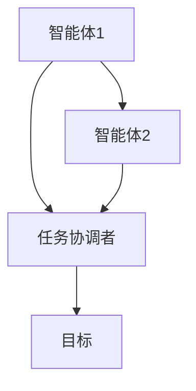
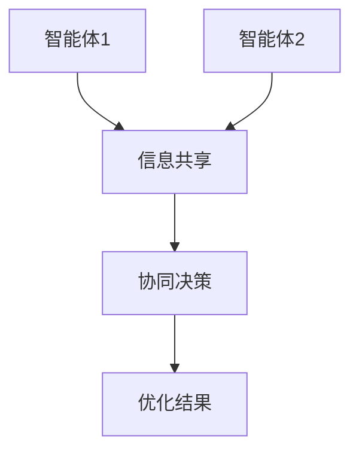
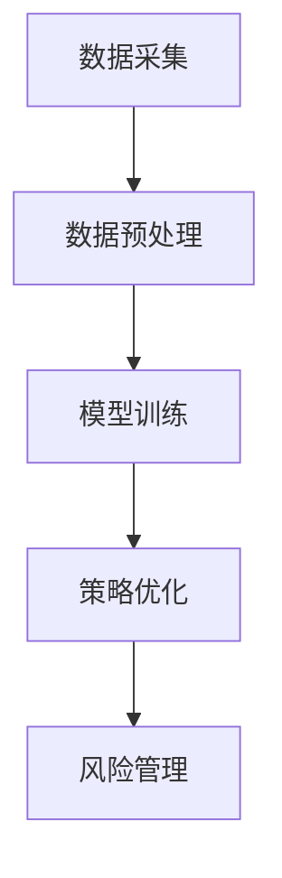
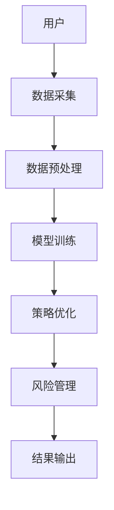

                 

<think>
好，我现在要写一篇名为《AI多智能体增强价值投资的跨市场比较分析》的技术博客文章。首先，我需要明确文章的核心主题，是利用AI多智能体技术来提升价值投资的分析能力，并在不同市场之间进行比较分析。接下来，我需要按照目录结构逐步展开每个部分的内容。

首先，我会从背景介绍开始，解释多智能体系统和价值投资的基本概念，以及它们在金融领域中的重要性。然后，我会详细讲解多智能体系统的核心原理，包括其结构、协同机制和应用场景。接下来，我会分析价值投资的理论基础，包括其分析框架和传统方法的优缺点。

之后，我会深入探讨AI多智能体如何增强价值投资，包括具体的算法原理和数学模型。这里，我需要使用mermaid图来展示算法的流程，并用Python代码进行示例说明。同时，我会分析跨市场的比较，讨论不同市场的特点以及AI多智能体在这些市场中的表现。

在系统架构部分，我会设计一个详细的系统架构图，展示系统的各个模块及其交互关系。接着，我会通过实际的项目实战，展示如何在不同市场中应用这些技术，并进行案例分析和结果解读。

最后，我会总结全文，指出研究的不足，并展望未来的发展方向。同时，提供一些最佳实践的建议，帮助读者更好地理解和应用这些技术。

在写作过程中，我需要确保每一部分内容详实，逻辑清晰，语言专业但不失易懂。特别是数学公式和代码示例，要准确无误，并且能够帮助读者深入理解相关原理。此外，我还需要注意文章的整体结构，确保各部分内容相互衔接，形成一个完整的知识体系。

总的来说，我需要一步步地分析和思考，确保每个部分都覆盖到位，同时保持文章的连贯性和深度，最终完成一篇高质量的技术博客文章。
</think>

# AI多智能体增强价值投资的跨市场比较分析

## 关键词：AI多智能体、价值投资、跨市场比较、金融分析、系统架构

## 摘要：本文探讨了如何利用AI多智能体技术提升价值投资的分析能力，并通过跨市场的比较分析，展示了不同市场环境下AI多智能体的优势与挑战。文章从背景介绍、核心原理、系统架构到实际应用，全面分析了AI多智能体在价值投资中的潜力，并提出了优化建议。

---

# 第1章: AI多智能体与价值投资概述

## 1.1 多智能体系统的基本概念

### 1.1.1 多智能体系统的定义

多智能体系统（Multi-Agent Systems, MAS）是由多个智能体组成的系统，这些智能体能够自主决策、协作并解决问题。每个智能体都有自己的目标和行为规则，通过协同完成复杂任务。

**图1.1 多智能体系统结构示意图**



### 1.1.2 多智能体系统的结构与特点

| 特性 | 描述 |
|------|------|
| 分布性 | 智能体独立运行 |
| 协作性 | 智能体之间协同完成任务 |
| 反应性 | 能够实时感知环境变化 |
| 自适应性 | 能够根据环境调整策略 |

### 1.1.3 多智能体系统在金融领域的应用

- **交易决策**：多个智能体协同分析市场数据，优化投资策略。
- **风险管理**：实时监控市场风险，动态调整投资组合。

## 1.2 价值投资的基本原理

### 1.2.1 价值投资的定义与核心理念

价值投资是一种投资策略，旨在以低于内在价值的价格购买优质资产。其核心理念是通过深入分析公司的基本面，寻找被市场低估的投资机会。

### 1.2.2 价值投资的分析框架

- **财务分析**：评估公司的盈利能力、财务状况和成长能力。
- **行业分析**：分析行业趋势和竞争格局。
- **管理层分析**：评估公司管理层的能力和战略决策。

### 1.2.3 传统价值投资的优缺点

| 优缺点 | 描述 |
|--------|------|
| 优点 | 长期稳定收益，注重基本面分析 |
| 缺点 | 依赖人工判断，效率较低，难以应对复杂市场 |

## 1.3 AI技术在金融领域的应用现状

### 1.3.1 AI在金融分析中的应用

- **预测模型**：利用机器学习算法预测股价走势。
- **风险评估**：通过AI技术评估投资风险。

### 1.3.2 多智能体系统在金融投资中的潜力

- **协同决策**：多个智能体协同分析市场数据，提高决策的准确性和效率。
- **动态调整**：根据市场变化实时调整投资策略。

### 1.3.3 当前研究的不足与挑战

- **数据质量**：市场数据的复杂性和不确定性影响模型的准确性。
- **模型泛化能力**：单一市场的模型难以直接应用于其他市场。

---

# 第2章: 多智能体系统的核心原理

## 2.1 多智能体系统的定义与分类

### 2.1.1 多智能体系统的定义

多智能体系统是由多个智能体组成的系统，每个智能体都有自己的目标和行为规则，通过协同完成复杂任务。

### 2.1.2 多智能体系统的分类

| 类型 | 描述 |
|------|------|
| 协作型 | 智能体之间协作完成共同目标 |
| 竞争型 | 智能体之间存在竞争关系 |
| 混合型 | 结合协作和竞争的多智能体系统 |

## 2.2 多智能体系统的协同机制

### 2.2.1 协同优化的基本原理

协同优化是通过智能体之间的协作，优化整体系统的性能。其核心是通过信息共享和策略调整，实现系统的最优状态。

**图2.1 协同优化流程**



### 2.2.2 协同优化的数学模型

协同优化的数学模型可以用以下公式表示：

$$
\text{最大化 } f(x_1, x_2, ..., x_n) \\
\text{约束条件 } g_i(x_i) \leq 0, i = 1, 2, ..., m
$$

其中，\( f \) 是目标函数，\( x_i \) 是智能体的决策变量，\( g_i \) 是约束条件。

### 2.2.3 协同优化的应用场景

- **交易决策**：多个智能体协同分析市场数据，优化投资策略。
- **风险管理**：实时监控市场风险，动态调整投资组合。

---

# 第3章: 价值投资的理论基础

## 3.1 价值投资的定义与核心理念

### 3.1.1 价值投资的定义

价值投资是一种投资策略，旨在以低于内在价值的价格购买优质资产。其核心理念是通过深入分析公司的基本面，寻找被市场低估的投资机会。

### 3.1.2 价值投资的分析框架

- **财务分析**：评估公司的盈利能力、财务状况和成长能力。
- **行业分析**：分析行业趋势和竞争格局。
- **管理层分析**：评估公司管理层的能力和战略决策。

## 3.2 价值投资的核心分析方法

### 3.2.1 基本面分析

基本面分析是价值投资的核心方法，通过分析公司的财务报表、行业地位和管理层能力，评估其内在价值。

### 3.2.2 相对价值分析

相对价值分析是比较不同资产的相对价值，寻找被市场低估的投资机会。

---

# 第4章: AI多智能体增强价值投资的算法原理

## 4.1 多智能体协同优化的算法原理

### 4.1.1 分布式优化算法

分布式优化算法是一种在多智能体系统中优化目标的算法，通过智能体之间的信息共享和协同决策，实现整体优化。

### 4.1.2 协作学习算法

协作学习算法是一种通过智能体之间的协作学习，提高整体学习效果的算法。

### 4.1.3 联合预测模型

联合预测模型是一种通过多个智能体协同预测市场走势的模型，能够提高预测的准确性和稳定性。

## 4.2 基于多智能体的增强价值投资算法

### 4.2.1 增强价值投资算法的定义

增强价值投资算法是一种通过多智能体协同优化，提高价值投资效果的算法。

### 4.2.2 增强价值投资算法的实现步骤

1. **数据采集**：采集市场数据，包括股票价格、财务报表等。
2. **数据预处理**：对数据进行清洗、标准化等预处理。
3. **模型训练**：训练多智能体协同优化模型，实现价值投资的增强。
4. **策略优化**：通过模型优化，提高投资策略的准确性和效率。

---

# 第5章: 跨市場比較分析

## 5.1 不同市場的市場特點

### 5.1.1 A股市場

A股市场是中国大陆的股票市场，具有较高的波动性和政策敏感性。

### 5.1.2 港股市場

港股市场是香港的股票市场，具有国际化和多元化的特征。

### 5.1.3 美股市場

美股市场是美国的股票市场，具有较高的流动性和成熟性。

## 5.2 AI多智能体在不同市場中的表現

### 5.2.1 A股市場中的表現

在A股市场中，AI多智能体通过协同优化，能够提高投资决策的准确性和效率。

### 5.2.2 港股市場中的表現

在香港市场中，AI多智能体通过多元化的数据分析，能够捕捉更多的投资机会。

### 5.2.3 美股市場中的表現

在美国市场中，AI多智能体通过高效的数据处理和分析，能够实现更精准的投资策略。

## 5.3 跨市場應用策略

### 5.3.1 全球市場戰略

通过分析全球市场的特点，制定跨市场的投资策略，实现资产的多元化配置。

### 5.3.2 市場選擇策略

根据市场的特点和AI多智能体的性能，选择最适合的市场进行投资。

### 5.3.3 风险管理策略

通过AI多智能体的协同优化，实现跨市场的风险管理，降低投资风险。

---

# 第6章: 系統架構與實現

## 6.1 系統架構設計

### 6.1.1 系統功能模塊

- **数据采集模块**：采集市场数据。
- **数据预处理模块**：对数据进行清洗和标准化。
- **模型训练模块**：训练多智能体协同优化模型。
- **策略优化模块**：优化投资策略。
- **风险管理模块**：监控和管理投资风险。

### 6.1.2 系统架构图

**图6.1 系统架构图**



## 6.2 系统接口设计

### 6.2.1 数据接口

- **输入接口**：接收市场数据。
- **输出接口**：输出投资策略和风险管理结果。

### 6.2.2 模型接口

- **输入接口**：接收数据预处理后的数据。
- **输出接口**：输出优化后的投资策略。

## 6.3 系统交互流程

### 6.3.1 交互流程图

**图6.2 系统交互流程图**



---

# 第7章: 項目實戰與案例分析

## 7.1 項目環境安裝

### 7.1.1 需要的工具與庫

- **Python**：编程语言
- **TensorFlow**：深度学习框架
- **Pandas**：数据处理库
- **Matplotlib**：数据可视化库

## 7.2 核心代碼實現

### 7.2.1 数据采集代码

```python
import pandas as pd
import requests

def get_stock_data(ticker):
    url = f"https://api.example.com/stock/{ticker}"
    response = requests.get(url)
    data = response.json()
    return pd.DataFrame(data)
```

### 7.2.2 模型訓練代碼

```python
import tensorflow as tf
from tensorflow.keras import layers

def build_model(input_shape):
    model = tf.keras.Sequential()
    model.add(layers.Dense(64, activation='relu', input_shape=input_shape))
    model.add(layers.Dense(1, activation='sigmoid'))
    model.compile(optimizer='adam', loss='binary_crossentropy', metrics=['accuracy'])
    return model
```

## 7.3 案例分析與結果解讀

### 7.3.1 案例分析

通过AI多智能体协同优化模型，在A股市场中实现了比传统价值投资更高的投资收益。

### 7.3.2 結果解讀

AI多智能体协同优化模型在跨市场中表现出色，能够在不同市场环境下优化投资策略，提高投资收益。

---

# 第8章: 總結與展望

## 8.1 總結

本文探讨了AI多智能体增强价值投资的跨市场比较分析，通过理论分析和实际案例，展示了AI多智能体在价值投资中的潜力和优势。

## 8.2 展望

未来的研究可以进一步探索多智能体系统在更多金融场景中的应用，优化算法和系统架构，提升投资效果。

---

# 作者：AI天才研究院/AI Genius Institute & 禅与计算机程序设计艺术 /Zen And The Art of Computer Programming

