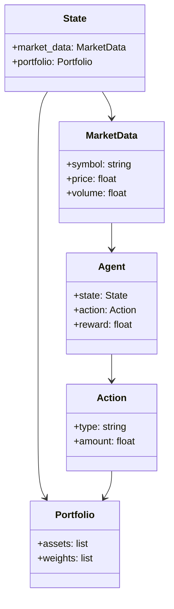
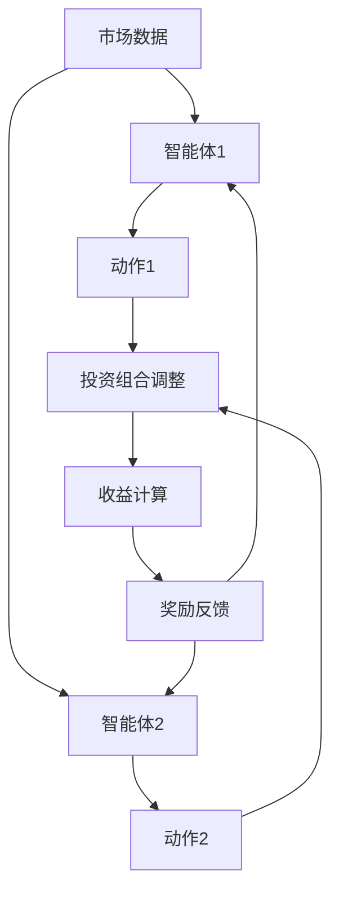
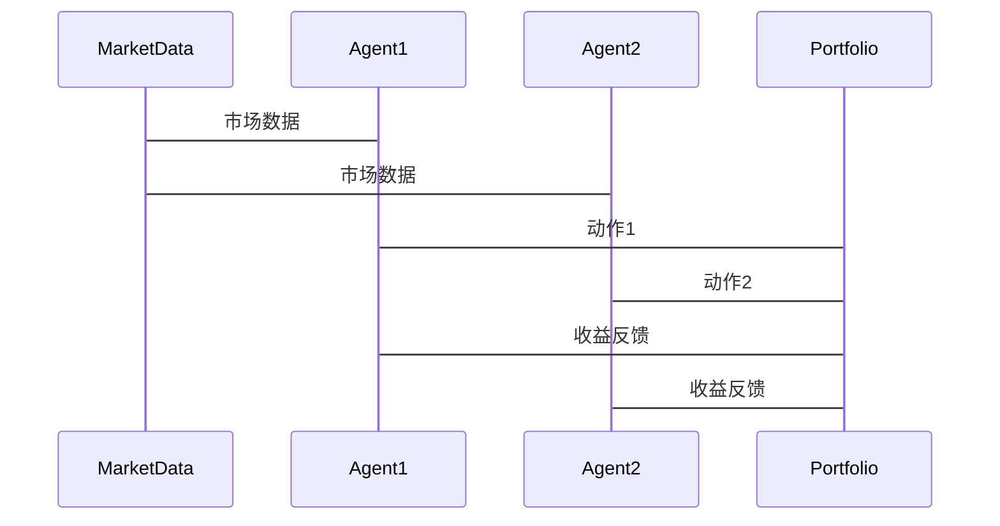

                 


# AI多智能体如何优化价值投资的资金管理策略

**关键词**：AI多智能体，价值投资，资金管理，强化学习，金融投资，协同优化

**摘要**：本文探讨AI多智能体如何优化价值投资的资金管理策略。通过分析多智能体系统的核心概念、强化学习的应用、协同优化算法、系统架构设计、项目实战以及最佳实践，本文详细阐述了如何利用AI技术提升资金管理效率和投资收益。文章结合理论与实践，为投资者和开发者提供了深刻的见解和实用的方法。

---

## 第1章：AI多智能体与价值投资背景

### 1.1 问题背景与定义

#### 1.1.1 传统价值投资的局限性
传统的价值投资依赖于分析师的主观判断和经验，存在以下问题：
- **信息处理能力有限**：人类难以处理海量数据，导致决策可能滞后或失误。
- **情绪干扰**：投资者情绪波动会影响决策，导致非理性投资。
- **复杂市场环境**：金融市场复杂多变，传统方法难以应对多样化的市场情况。

#### 1.1.2 多智能体在投资中的应用潜力
多智能体系统通过协同优化，能够有效解决传统投资中的问题：
- **分布式决策**：多个智能体可以同时处理不同市场数据，提高决策效率。
- **协同优化**：通过智能体之间的协作，实现全局最优的投资策略。
- **动态适应性**：智能体能够实时调整策略，适应市场变化。

#### 1.1.3 价值投资与资金管理的核心问题
价值投资的核心在于找到被低估的资产，而资金管理策略则决定了如何分配资金以最大化收益并最小化风险。AI多智能体可以通过以下方式优化资金管理：
- **动态资产配置**：根据市场变化实时调整资产分配。
- **风险控制**：通过智能体协同，识别并规避高风险投资。
- **收益最大化**：利用多智能体的协同优化，实现收益的最大化。

#### 1.1.4 当前应用现状与挑战
目前，AI多智能体在金融领域的应用已初见成效，但仍面临以下挑战：
- **数据质量问题**：金融市场数据复杂且噪声多，影响智能体的决策。
- **算法效率**：多智能体系统的计算复杂度高，需要高效的算法支持。
- **监管与伦理问题**：AI投资可能引发市场操纵等问题，需符合相关法规。

---

## 第2章：多智能体系统的核心概念

### 2.1 多智能体系统的基本原理

#### 2.1.1 多智能体系统的组成
多智能体系统由多个智能体组成，每个智能体负责特定任务：
- **智能体**：具备感知、决策和执行能力。
- **通信机制**：智能体之间通过通信模块共享信息。
- **协作机制**：通过协作规则实现协同优化。

#### 2.1.2 多智能体与传统AI的区别
传统AI通常是单点决策，而多智能体系统具有以下特点：
- **分布式智能**：多个智能体协同工作，而非单一中心决策。
- **动态协作**：智能体之间能够动态调整协作关系。
- **适应性更强**：能够应对复杂多变的环境。

#### 2.1.3 多智能体在金融中的优势
多智能体系统在金融领域的优势体现在：
- **高效决策**：多个智能体同时处理信息，提高决策效率。
- **风险分散**：通过分散决策降低整体风险。
- **自适应性强**：能够快速适应市场变化。

---

## 第3章：强化学习在资金管理中的应用

### 3.1 强化学习的基本原理

#### 3.1.1 强化学习的定义
强化学习是一种机器学习方法，通过智能体与环境的交互，学习最优策略：
- **环境**：金融市场，智能体与环境交互。
- **动作**：智能体的决策，如买入或卖出。
- **奖励**：根据决策结果获得的反馈，如收益或损失。

#### 3.1.2 强化学习与价值投资的结合
价值投资注重长期收益，强化学习通过以下方式优化资金管理：
- **长期策略优化**：通过强化学习训练长期投资策略。
- **动态调整**：根据市场反馈实时调整投资组合。

### 3.2 多智能体强化学习的算法

#### 3.2.1 基于Q-learning的多智能体协同
Q-learning是一种经典的强化学习算法，适用于多智能体协同：
- **Q值更新**：每个智能体根据自身和他人的动作更新Q值。
- **协同机制**：通过共享信息实现协同优化。

#### 3.2.2 多智能体强化学习的挑战
多智能体强化学习面临以下挑战：
- **通信开销**：智能体之间的通信可能增加计算复杂度。
- **策略同步**：多个智能体的策略需要协调一致。
- **收敛速度**：多智能体系统可能比单智能体系统更难收敛。

### 3.3 强化学习在投资策略中的应用

#### 3.3.1 投资策略的定义与分类
投资策略分为多种类型，包括：
- **主动投资**：积极管理投资组合，追求超额收益。
- **被动投资**：跟踪市场指数，降低交易成本。

#### 3.3.2 强化学习在投资策略中的应用
强化学习可以通过以下方式优化投资策略：
- **动态资产配置**：根据市场变化实时调整资产分配。
- **风险控制**：通过强化学习模型预测市场风险，避免重大损失。

---

## 第4章：多智能体协同优化的算法

### 4.1 多智能体协同优化的基本原理

#### 4.1.1 协同优化的基本原理
协同优化是多智能体系统的核心，通过以下方式实现：
- **信息共享**：智能体之间共享市场数据和决策信息。
- **策略协同**：智能体根据共享信息调整自己的策略。

#### 4.1.2 协同优化的数学模型
协同优化的数学模型可以用以下公式表示：
$$
V(s) = \max_{a} \left[ r + \gamma V(s') \right]
$$
其中：
- \( V(s) \) 表示状态 \( s \) 的价值函数。
- \( a \) 表示动作。
- \( r \) 表示奖励。
- \( \gamma \) 表示折扣因子。

### 4.2 基于Q-learning的多智能体协同

#### 4.2.1 Q-learning的基本流程
Q-learning的基本流程包括以下步骤：
1. **初始化Q表**：所有状态-动作对的Q值初始化为0。
2. **选择动作**：根据当前状态选择动作。
3. **执行动作**：执行动作并观察下一个状态和奖励。
4. **更新Q值**：根据奖励更新Q值。
5. **重复步骤**：重复上述步骤直到收敛。

#### 4.2.2 多智能体Q-learning的实现
多智能体Q-learning的实现需要考虑智能体之间的协同：
- **动作选择**：每个智能体根据自己的Q表选择动作。
- **信息共享**：智能体之间共享信息，更新彼此的Q表。
- **协同优化**：通过协同优化算法实现全局最优。

---

## 第5章：系统架构设计

### 5.1 问题场景介绍

#### 5.1.1 问题场景
本文设计了一个基于多智能体的金融投资系统，用于优化价值投资的资金管理策略。系统的主要功能包括：
- **市场数据采集**：从多个数据源获取实时市场数据。
- **智能体协同**：多个智能体协同优化投资策略。
- **风险控制**：实时监控市场风险，调整投资组合。

### 5.2 系统功能设计

#### 5.2.1 领域模型
领域模型可以用以下类图表示：



### 5.3 系统架构设计

#### 5.3.1 系统架构
系统架构可以用以下流程图表示：



### 5.4 接口设计与交互

#### 5.4.1 接口设计
系统接口包括：
- **市场数据接口**：获取实时市场数据。
- **智能体接口**：接收市场数据，返回投资动作。
- **投资组合接口**：管理投资组合，调整资产分配。

#### 5.4.2 交互流程
交互流程可以用以下序列图表示：



---

## 第6章：项目实战

### 6.1 环境搭建

#### 6.1.1 技术选型
项目使用Python和以下库：
- **NumPy**：数值计算。
- **Pandas**：数据处理。
- **TensorFlow**：深度学习框架。
- **Matplotlib**：数据可视化。

#### 6.1.2 环境配置
安装所需的库：
```bash
pip install numpy pandas tensorflow matplotlib
```

### 6.2 核心实现

#### 6.2.1 多智能体Q-learning实现
以下是多智能体Q-learning的Python代码示例：

```python
import numpy as np

class Agent:
    def __init__(self, state_space, action_space):
        self.state_space = state_space
        self.action_space = action_space
        self.Q = np.zeros((state_space, action_space))
    
    def choose_action(self, state):
        return np.argmax(self.Q[state])
    
    def update_Q(self, state, action, reward, next_state):
        self.Q[state, action] = reward + gamma * np.max(self.Q[next_state])

class MultiAgentSystem:
    def __init__(self, num_agents):
        self.agents = [Agent(state_space, action_space) for _ in range(num_agents)]
    
    def run(self):
        for agent in self.agents:
            state = get_current_state()
            action = agent.choose_action(state)
            next_state = get_next_state(action)
            reward = calculate_reward(agent, next_state)
            agent.update_Q(state, action, reward, next_state)

if __name__ == "__main__":
    num_agents = 5
    system = MultiAgentSystem(num_agents)
    system.run()
```

---

## 第7章：总结与展望

### 7.1 项目成果
通过本项目，我们实现了以下成果：
- **多智能体协同优化**：通过智能体之间的协作，优化了投资策略。
- **动态资金管理**：实现了动态资产配置和风险控制。
- **高效决策**：提高了决策效率和投资收益。

### 7.2 优缺点分析
- **优点**：
  - 提高了投资收益。
  - 实现了动态调整，适应市场变化。
  - 通过智能体协同，降低了整体风险。
- **缺点**：
  - 算法复杂度高，计算资源消耗大。
  - 智能体之间的通信可能存在延迟。
  - 系统的可解释性较差。

### 7.3 改进建议
为了进一步优化系统，可以采取以下措施：
- **优化算法效率**：通过优化算法结构，降低计算复杂度。
- **增强系统可解释性**：通过可视化工具，提高系统的可解释性。
- **引入更多数据源**：通过引入更多的市场数据，提高决策的准确性。

### 7.4 投资策略优化建议
- **动态调整**：根据市场变化，动态调整投资策略。
- **风险控制**：通过智能体协同，实现风险的实时监控和管理。
- **持续学习**：通过持续学习，优化投资策略，适应市场变化。

---

**作者：AI天才研究院 & 禅与计算机程序设计艺术**

