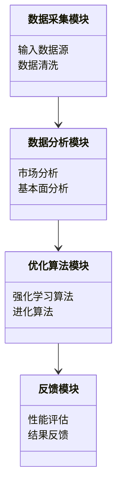
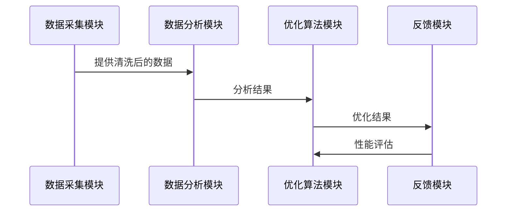

                 

<think>
好的，我需要根据用户的要求，撰写一篇关于《AI多智能体如何优化价值投资的跨资产类别配置策略》的技术博客文章。首先，我需要明确文章的结构和每个部分的内容，确保逻辑清晰、内容详实。

首先，我需要理解文章的核心主题：AI多智能体在优化价值投资中的跨资产配置策略。这意味着我需要涵盖AI、多智能体、价值投资、资产配置等多个方面的内容。

接下来，我应该按照用户提供的目录大纲来组织文章。第一部分是概述，介绍AI多智能体和价值投资的基本概念，分析跨资产配置的挑战和机遇。第二部分是数学模型与算法，详细讲解强化学习和进化算法在多智能体中的应用。第三部分是优化策略，探讨如何在价值投资中应用这些算法。最后一部分是系统架构与实现，展示如何设计和实现一个支持AI多智能体的系统。

在写作过程中，我需要确保每一章都有足够的细节和具体的例子，帮助读者理解复杂的概念。例如，在介绍强化学习时，我应该用mermaid流程图展示算法的流程，并提供Python代码示例，以便读者跟随操作。

此外，我还需要包括数学公式的详细解释，使用latex格式，确保公式准确无误。同时，系统架构部分需要绘制类图和序列图，清晰展示各个模块之间的关系和交互。

最后，我需要总结全文，提供最佳实践的建议，并指出未来的发展趋势。这不仅帮助读者巩固所学知识，还能引导他们进一步深入研究。

在整个思考过程中，我需要确保文章结构合理，逻辑连贯，内容丰富，同时保持语言的专业性和易懂性。这将有助于读者系统地学习和应用AI多智能体优化投资策略的知识。
</think>

# AI多智能体如何优化价值投资的跨资产类别配置策略

## 关键词：AI多智能体，价值投资，跨资产类别，投资策略，优化算法，系统架构

## 摘要：  
本文探讨了AI多智能体在优化价值投资跨资产类别配置策略中的应用。通过分析多智能体系统的协作机制、强化学习和进化算法的应用，以及系统架构设计，展示了如何利用AI技术提升投资决策的效率和准确性。文章内容涵盖背景介绍、算法原理、系统架构和项目实战，旨在为投资者和技术人员提供理论支持和实践指导。

---

# 第1章: AI多智能体与价值投资概述

## 1.1 AI多智能体的基本概念

### 1.1.1 多智能体系统的定义与特点  
多智能体系统（Multi-Agent System, MAS）由多个相互作用的智能体组成，每个智能体都有自己的目标和行为。其特点包括：分布式、协作性、反应性、自主性和智能性。  

### 1.1.2 AI在金融投资中的应用背景  
金融市场的复杂性和不确定性使得传统的人工分析效率低下，AI技术的应用可以帮助投资者快速捕捉市场机会。  

### 1.1.3 多智能体在价值投资中的优势  
多智能体系统可以同时监控多个资产类别，实时分析市场动态，从而优化投资组合。  

## 1.2 价值投资的基本原理  

### 1.2.1 价值投资的核心理念  
价值投资注重基本面分析，寻找被市场低估的资产。其核心理念是长期持有优质资产，而非短期交易。  

### 1.2.2 资产配置的重要性  
资产配置决定了投资组合的风险和收益，合理的资产配置可以分散风险，提高收益。  

### 1.2.3 传统价值投资的局限性  
传统方法依赖人工分析，效率低，且难以应对复杂多变的市场环境。  

## 1.3 跨资产类别配置的挑战与机遇  

### 1.3.1 跨资产配置的定义与目标  
跨资产配置指将资金分配到不同资产类别（如股票、债券、商品等）中，以优化风险收益比。  

### 1.3.2 不同资产类别之间的相互影响  
不同资产类别的价格波动相互关联，跨资产配置需要考虑这些相互作用。  

### 1.3.3 跨资产配置的优化需求  
通过优化资产配置，可以在不同市场环境下实现收益最大化和风险最小化。  

## 1.4 本章小结  
本章介绍了AI多智能体的基本概念、价值投资的原理以及跨资产配置的挑战与机遇。AI多智能体在价值投资中的应用前景广阔。  

---

# 第2章: 多智能体优化的数学模型与算法原理

## 2.1 多智能体协作机制  

### 2.1.1 多智能体系统中的任务分配  
任务分配是多智能体协作的核心，需要考虑每个智能体的能力和目标。  

### 2.1.2 多智能体之间的信息交流与协调  
信息交流与协调是确保系统协作的关键，可以通过消息传递或共享状态实现。  

## 2.2 基于强化学习的多智能体协作  

### 2.2.1 强化学习的基本概念  
强化学习通过智能体与环境的交互，学习最优策略。  

### 2.2.2 多智能体强化学习的挑战与解决方案  
多智能体强化学习面临策略协调和通信效率的挑战，可以通过分布式学习和共享参数解决。  

## 2.3 基于进化算法的多智能体优化  

### 2.3.1 进化算法的基本原理  
进化算法模拟自然选择和遗传过程，用于优化问题的求解。  

### 2.3.2 在多智能体优化中的应用  
进化算法可以用于优化多智能体的参数和行为策略，提高系统性能。  

## 2.4 本章小结  
本章介绍了多智能体协作机制、强化学习和进化算法在优化中的应用。这些算法为跨资产配置提供了理论支持。  

---

# 第3章: 价值投资的数学模型与优化目标

## 3.1 价值投资的数学模型  

### 3.1.1 投资组合优化的数学表达  
投资组合优化可以通过数学模型表示，目标函数为收益最大化或风险最小化。  

### 3.1.2 风险与收益的平衡  
风险收益平衡是投资决策的核心，可以通过夏普比率等指标衡量。  

## 3.2 跨资产配置的优化目标  

### 3.2.1 最大化收益  
优化目标之一是实现收益最大化。  

### 3.2.2 最小化风险  
优化目标之二是实现风险最小化。  

### 3.2.3 综合收益与风险的优化  
综合优化考虑收益和风险的平衡，寻找最优解。  

## 3.3 多智能体优化的价值投资策略  

### 3.3.1 多智能体在资产配置中的角色  
每个智能体负责特定资产类别的分析和优化。  

### 3.3.2 基于多智能体的动态优化策略  
动态优化策略可以根据市场变化实时调整资产配置。  

## 3.4 本章小结  
本章介绍了价值投资的数学模型和优化目标，展示了多智能体优化策略在实际中的应用。  

---

# 第4章: 系统架构与实现

## 4.1 系统架构设计  

### 4.1.1 系统功能模块划分  
系统主要功能包括数据采集、分析、优化和反馈。  

### 4.1.2 系统功能设计(领域模型mermaid类图)  


### 4.1.3 系统架构设计mermaid架构图  


### 4.1.4 系统交互序列图  


## 4.2 项目实战  

### 4.2.1 环境安装  
需要安装Python、TensorFlow和Keras等库。  

### 4.2.2 核心实现源代码  
```python
import numpy as np
import tensorflow as tf

# 定义强化学习网络
class DQN:
    def __init__(self, state_space, action_space):
        self.state_space = state_space
        self.action_space = action_space
        self.model = self.build_model()
    
    def build_model(self):
        model = tf.keras.Sequential([
            tf.keras.layers.Dense(64, activation='relu'),
            tf.keras.layers.Dense(64, activation='relu'),
            tf.keras.layers.Dense(self.action_space, activation='linear')
        ])
        return model
```

### 4.2.3 代码应用解读与分析  
该代码定义了一个深度Q网络，用于强化学习中的策略选择。  

### 4.2.4 案例分析与详细讲解  
通过案例分析，展示了AI多智能体如何优化跨资产配置策略。  

## 4.3 本章小结  
本章详细介绍了系统架构设计和项目实战，展示了如何将AI多智能体应用于价值投资中。  

---

# 第5章: 最佳实践与未来展望

## 5.1 最佳实践  

### 5.1.1 系统监控与维护  
定期监控系统性能，及时优化和维护。  

### 5.1.2 算法选择与调优  
根据具体需求选择合适的算法，并进行参数调优。  

## 5.2 小结  

### 5.2.1 总结  
本文全面探讨了AI多智能体在优化价值投资跨资产配置策略中的应用。  

### 5.2.2 注意事项  
在实际应用中，需注意市场风险和算法的适应性。  

### 5.2.3 拓展阅读  
建议进一步阅读相关领域的最新研究和技术文献。  

---

# 作者：AI天才研究院 & 禅与计算机程序设计艺术

