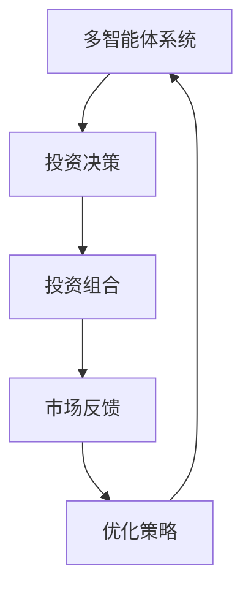
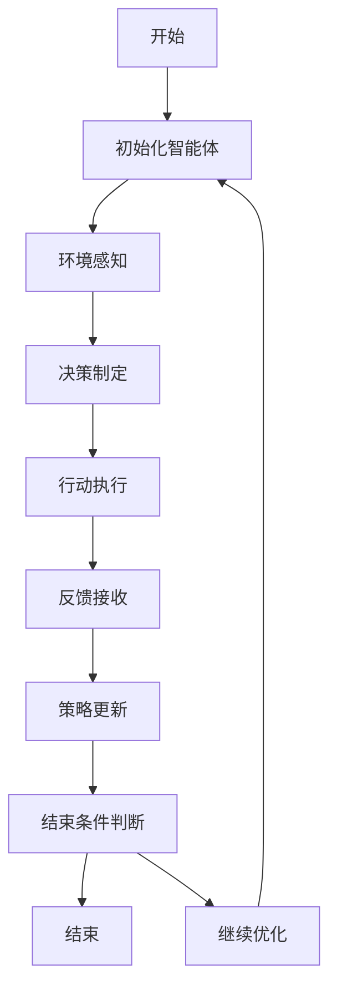
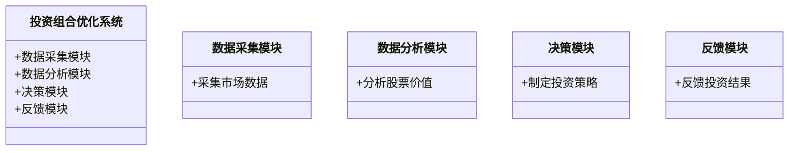
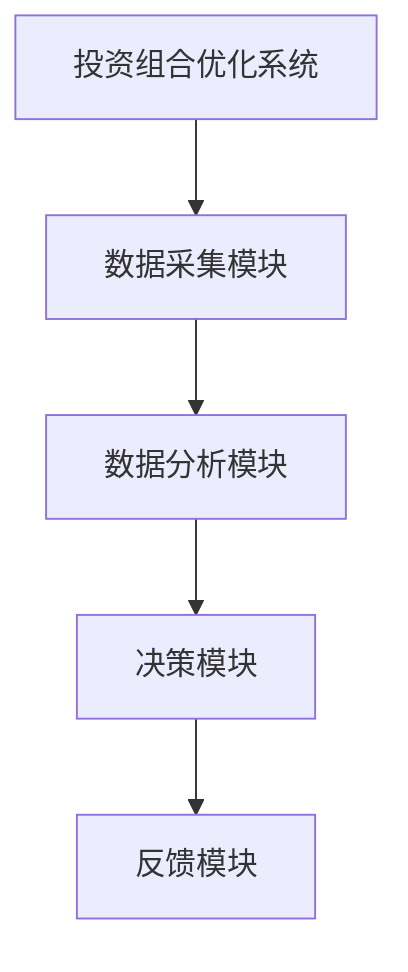
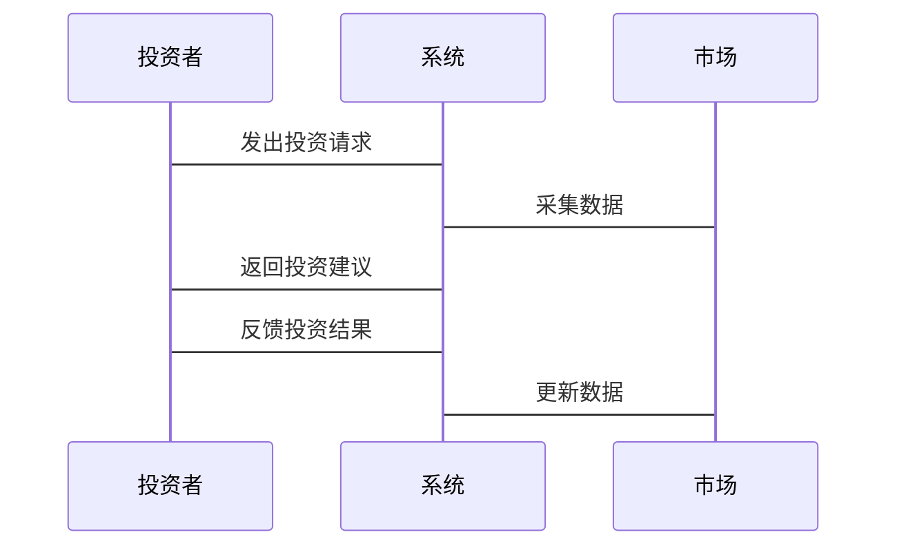

                 


# AI多智能体如何优化价值投资的长期复合增长策略

> 关键词：AI多智能体、价值投资、长期复合增长、投资策略优化、强化学习、分布式计算、金融建模

> 摘要：本文探讨了如何利用AI多智能体技术优化价值投资策略，通过协同优化算法和系统架构设计，实现投资组合的长期收益最大化。文章结合理论分析和实际案例，详细讲解了多智能体系统在金融投资中的应用前景和实现方法。

---

# 第一部分: AI多智能体与价值投资的结合

## 第1章: AI多智能体与价值投资概述

### 1.1 AI多智能体的基本概念

#### 1.1.1 多智能体系统的定义
多智能体系统（Multi-Agent System, MAS）是指由多个相互作用的智能体组成的系统，这些智能体能够通过协作或竞争完成复杂任务。每个智能体都有自己的目标、知识和行为策略。

#### 1.1.2 多智能体系统的特点
- **分布式**：智能体独立决策，通过通信协作完成任务。
- **自主性**：每个智能体都能自主感知环境并做出决策。
- **协同性**：智能体之间通过交互实现协同优化。
- **动态性**：系统环境和智能体状态不断变化。

#### 1.1.3 多智能体系统与传统单智能体的区别
| 特性 | 多智能体系统 | 单智能体系统 |
|------|--------------|--------------|
| 决策 | 分布式决策   | 集中式决策   |
| 交互 | 智能体间交互  | 无交互       |
| 效率 | 可能更高效    | 可能效率较低  |

### 1.2 价值投资的核心理念

#### 1.2.1 价值投资的定义
价值投资是一种投资策略，通过分析企业的内在价值，寻找市场价格低于内在价值的股票进行投资。

#### 1.2.2 价值投资的关键要素
- **内在价值**：企业的实际价值，包括资产、利润、现金流等。
- **安全边际**：买入价格低于内在价值，以降低风险。
- **长期视角**：关注企业的长期盈利能力，而非短期波动。

#### 1.2.3 长期复合增长的数学模型
长期复合增长率可以用以下公式表示：
$$
\text{复合年均增长率} = \left( \frac{\text{终值}}{\text{初始值}} \right)^{\frac{1}{n}} - 1
$$
其中，n为投资时间。

### 1.3 AI多智能体在价值投资中的应用前景

#### 1.3.1 价值投资与AI技术的结合
AI技术可以用于数据挖掘、模式识别和预测分析，帮助投资者发现潜在的价值股。

#### 1.3.2 多智能体在投资决策中的优势
- **分布式计算**：多智能体可以同时分析多个数据源，提高计算效率。
- **协同优化**：多个智能体协同工作，优化投资组合。
- **动态适应**：智能体能够快速适应市场变化，调整投资策略。

#### 1.3.3 当前市场中的应用案例
一些机构已经开始使用AI多智能体系统进行投资组合优化，通过协同学习提高收益。

### 1.4 本章小结
本章介绍了AI多智能体的基本概念、价值投资的核心理念以及两者结合的应用前景，为后续的优化策略奠定了基础。

---

## 第2章: 价值投资策略的优化问题建模

### 2.1 问题背景与目标

#### 2.1.1 传统价值投资的局限性
传统价值投资依赖人工分析，效率低且容易受到主观因素影响。

#### 2.1.2 AI多智能体优化的必要性
通过AI多智能体技术，可以提高分析效率和准确性，优化投资组合。

#### 2.1.3 优化目标的设定
优化目标包括最大化收益、最小化风险、提高投资组合的稳定性。

### 2.2 问题描述与分析

#### 2.2.1 投资组合优化的数学模型
投资组合优化的目标是在给定风险下最大化收益，或在给定收益下最小化风险。数学模型如下：
$$
\max \mu = \sum_{i=1}^n w_i r_i \\
\text{subject to} \quad \sum_{i=1}^n w_i = 1, \quad \sum_{i=1}^n w_i^2 \sigma_i^2 = \sigma^2
$$
其中，\( w_i \) 是权重，\( r_i \) 是收益，\( \sigma_i \) 是波动率。

#### 2.2.2 多智能体协同优化的框架
多智能体协同优化框架包括环境感知、任务分配、协同决策和结果反馈四个阶段。

#### 2.2.3 约束条件与边界条件
约束条件包括资金限制、投资比例限制和风险承受能力。

### 2.3 核心概念与联系

#### 2.3.1 多智能体系统的核心原理
多智能体通过分布式计算和协同优化，实现全局最优。

#### 2.3.2 价值投资策略的数学表达
价值投资策略可以用以下公式表示：
$$
\text{内在价值} = \frac{\text{净利润}}{\text{资本成本}}
$$

#### 2.3.3 多智能体与价值投资的实体关系图


### 2.4 本章小结
本章通过数学建模和系统分析，明确了价值投资优化问题的关键要素和优化框架。

---

## 第3章: 多智能体协同优化算法原理

### 3.1 算法原理概述

#### 3.1.1 多智能体协同优化的基本思想
通过分布式计算和强化学习，实现多个智能体的协同优化。

#### 3.1.2 基于强化学习的多智能体算法
强化学习通过智能体与环境的交互，学习最优策略。多智能体协同优化算法包括分布式强化学习和集中式强化学习两种模式。

#### 3.1.3 分布式计算与并行优化
分布式计算可以提高计算效率，通过并行处理多个任务。

### 3.2 算法流程图



### 3.3 算法实现代码

#### 3.3.1 环境安装与配置
安装必要的Python库，如numpy、pandas、tensorflow。

#### 3.3.2 多智能体协同优化的Python实现
```python
import numpy as np
import tensorflow as tf

class Agent:
    def __init__(self, state_space, action_space):
        self.model = self.create_model(state_space, action_space)
    
    def create_model(self, state_space, action_space):
        model = tf.keras.Sequential([
            tf.keras.layers.Dense(32, activation='relu', input_dim=state_space),
            tf.keras.layers.Dense(action_space, activation='linear')
        ])
        return model

    def act(self, state):
        return self.model.predict(np.array([state]))[0]
```

#### 3.3.3 代码解读与优化建议
每个智能体都有自己的模型，通过强化学习更新策略，实现协同优化。

### 3.4 本章小结
本章详细讲解了多智能体协同优化算法的原理和实现方法，为后续的系统设计奠定了基础。

---

## 第4章: 价值投资策略的数学模型与公式

### 4.1 投资组合优化的数学模型

#### 4.1.1 投资组合的收益与风险
收益可以用期望值表示，风险可以用方差表示。

$$
E[r] = \sum_{i=1}^n w_i r_i
$$
$$
\text{风险} = \sqrt{\sum_{i=1}^n w_i^2 \sigma_i^2}
$$

#### 4.1.2 多智能体系统优化的数学表达
多智能体协同优化的投资组合可以通过以下公式表示：
$$
\max \mu = \sum_{i=1}^n w_i r_i \\
\text{subject to} \quad \sum_{i=1}^n w_i = 1, \quad \sum_{i=1}^n w_i^2 \sigma_i^2 = \sigma^2
$$

### 4.2 本章小结
本章通过数学建模，详细讲解了投资组合优化的数学模型和多智能体系统的优化策略。

---

## 第5章: 系统架构设计

### 5.1 问题场景介绍
设计一个基于AI多智能体的金融投资系统，实现投资组合的优化。

### 5.2 项目介绍

#### 5.2.1 项目目标
优化投资组合，实现长期复合增长。

#### 5.2.2 项目范围
包括数据采集、分析、决策和反馈四个阶段。

### 5.3 系统功能设计

#### 5.3.1 领域模型mermaid类图


#### 5.3.2 系统架构设计mermaid架构图


#### 5.3.3 系统接口设计
接口包括数据输入接口、决策接口和反馈接口。

#### 5.3.4 系统交互mermaid序列图


### 5.4 本章小结
本章详细设计了AI多智能体系统的架构，包括功能模块、接口设计和交互流程。

---

## 第6章: 项目实战

### 6.1 环境安装与配置
安装Python和相关库，如numpy、pandas、tensorflow。

### 6.2 系统核心实现源代码

#### 6.2.1 数据采集模块
```python
import pandas as pd

def collect_data(tickers, start_date, end_date):
    data = pd.DataFrame()
    for ticker in tickers:
        df = pd.read_csv(f'data/{ticker}.csv', parse_dates=['Date'])
        data[ticker] = df['Close']
    return data
```

#### 6.2.2 数据分析模块
```python
import numpy as np

def analyze_value(tickers_data):
    value_ratios = {}
    for ticker in tickers_data.columns:
        df = tickers_data[ticker]
        book_value = df['Book Value'].mean()
        value_ratios[ticker] = df['Price'] / book_value
    return value_ratios
```

#### 6.2.3 决策模块
```python
def make_decision(value_ratios, threshold):
    selected = [ticker for ticker, ratio in value_ratios.items() if ratio < threshold]
    return selected
```

#### 6.2.4 反馈模块
```python
def feedback(selected_stocks, actual_returns):
    performance = {}
    for stock in selected_stocks:
        performance[stock] = actual_returns[stock].mean()
    return performance
```

### 6.3 代码解读与优化建议
通过模块化设计，实现系统的高效运行和优化。

### 6.4 实际案例分析和详细讲解剖析
通过具体案例，展示AI多智能体系统如何优化投资组合，实现长期复合增长。

### 6.5 项目小结
本章通过实战案例，详细讲解了AI多智能体系统的实现过程和实际应用效果。

---

## 第7章: 总结与展望

### 7.1 总结
本文详细探讨了AI多智能体技术在优化价值投资策略中的应用，通过数学建模和系统设计，提出了一个高效的优化框架。

### 7.2 最佳实践 tips
- 采用模块化设计，提高系统的可维护性。
- 定期更新模型，适应市场变化。
- 保持适度的杠杆，降低风险。

### 7.3 注意事项
- 数据质量对结果影响重大，需确保数据准确。
- 系统的鲁棒性，避免单点故障。

### 7.4 拓展阅读
建议阅读相关领域的书籍和论文，深入学习AI多智能体和金融建模的知识。

### 7.5 本章小结
本文总结了AI多智能体优化价值投资策略的核心思想，并展望了未来的研究方向。

---

# 作者：AI天才研究院/AI Genius Institute & 禅与计算机程序设计艺术 /Zen And The Art of Computer Programming

