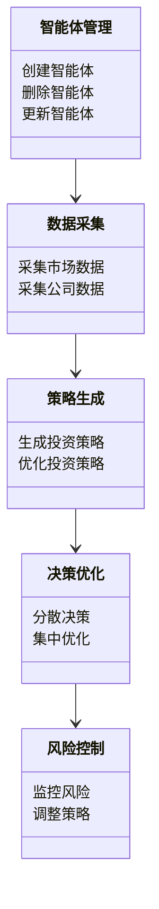
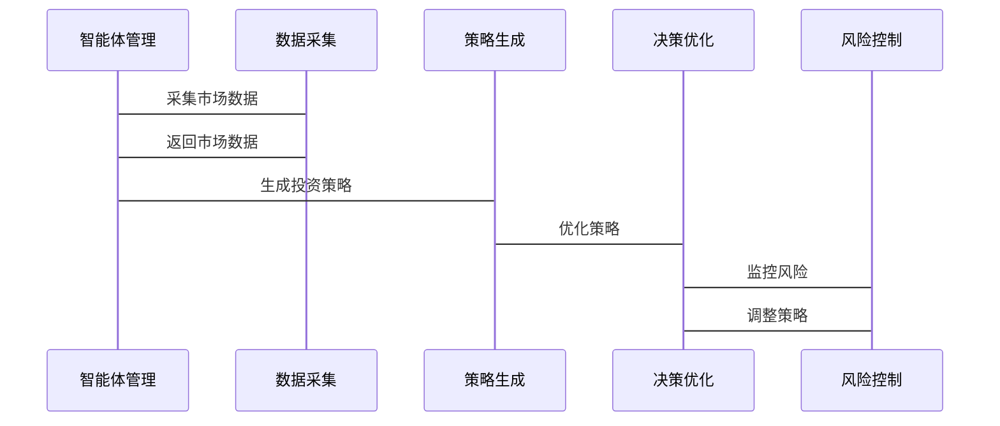

                 

<think>
好的，我需要帮用户撰写一篇关于《AI多智能体如何优化价值投资的长期股东回报策略》的技术博客文章。用户已经提供了一个详细的目录大纲，包括摘要和各个章节的内容。现在，我需要根据这个大纲，逐步分析每个部分，确保内容全面、逻辑清晰，并符合用户的要求。

首先，我从摘要开始。摘要需要简洁明了，概括文章的核心内容，即AI多智能体在优化价值投资策略中的应用，如何通过协同学习和强化学习提高长期股东回报。我需要确保摘要涵盖主要方法、应用场景和价值。

接下来是第一章，介绍AI多智能体和价值投资的基本概念。我需要定义多智能体系统，比较它与传统AI的区别，以及它在金融领域的潜力。同时，要解释价值投资的核心理念，长期股东回报的衡量标准，以及两者结合的意义。

第二章分析传统价值投资的局限性和AI在金融中的应用现状，探讨多智能体优化的必要性。这部分需要详细说明传统方法的不足，AI技术的应用案例，以及为什么多智能体系统是优化投资策略的关键。

第三章深入讨论多智能体系统的核心概念与价值投资的联系。我需要解释多智能体的原理，构建数学模型，展示两者结合的优势，以及协同学习对投资策略的影响。使用Mermaid流程图和表格来辅助说明。

第四章讲解算法原理，重点介绍协同学习和强化学习在多智能体中的应用。需要详细说明算法框架，数学公式，如Q-learning的公式，并通过实例解释其在投资组合优化中的应用。

第五章详细解析数学模型和公式，展示股票价值评估、投资组合收益计算等模型，确保公式正确且解释清晰。这部分需要使用Latex格式，并用独立段落展示复杂公式。

第六章分析系统架构，包括应用场景、功能模块设计、系统架构图、接口设计和交互流程图。使用Mermaid图展示系统结构，确保逻辑清晰，功能模块明确。

第七章是项目实战，包括环境安装、核心代码实现、案例分析。需要提供具体的Python代码，详细解释其功能，并通过实际案例展示应用效果。

最后，总结与展望部分，回顾主要内容，指出当前研究的不足，并展望未来的发展方向。同时，加入最佳实践、小结和注意事项，帮助读者更好地理解和应用这些策略。

在整个思考过程中，我需要确保每个部分都详细展开，内容准确，结构合理，符合用户的技术背景和需求。同时，语言要专业但易懂，避免过于复杂的术语，让读者能够轻松跟随思路，理解AI多智能体在优化价值投资中的作用。
</think>

# AI多智能体如何优化价值投资的长期股东回报策略

## 关键词：AI多智能体，价值投资，长期股东回报，投资策略优化，协同学习，强化学习

## 摘要

本文探讨了AI多智能体在优化价值投资策略中的应用，分析了多智能体系统如何通过协同学习和强化学习提升长期股东回报。文章从背景介绍、核心概念、算法原理、系统架构到项目实战，全面解析了AI多智能体优化价值投资的理论与实践。通过构建数学模型、设计系统架构和实际案例分析，本文展示了如何利用AI技术提升投资决策的科学性和高效性，为投资者提供更优的长期回报策略。

---

# 第1章 AI多智能体与价值投资概述

## 1.1 AI多智能体的基本概念

### 1.1.1 多智能体系统的定义与特点

多智能体系统（Multi-Agent System, MAS）是由多个相互作用的智能体组成的系统，这些智能体能够通过通信和协作完成复杂任务。与传统单智能体系统相比，多智能体系统具有以下特点：

- **分布式智能**：多个智能体协同工作，每个智能体负责特定任务。
- **自主性**：智能体能够自主决策，无需外部干预。
- **协作性**：智能体之间通过通信和协作完成共同目标。
- **动态性**：系统能够在动态环境中适应变化。

### 1.1.2 AI多智能体与传统AI的区别

传统AI（如单智能体系统）依赖于中心化的决策机制，而AI多智能体系统通过分布式决策和协作实现目标。AI多智能体系统能够处理复杂任务，尤其是在需要多个决策单元协同工作的场景中表现优异。

### 1.1.3 多智能体在金融领域的应用前景

金融领域是多智能体系统的重要应用领域之一。通过多智能体系统的分布式决策和协作机制，可以在股票交易、投资组合优化、风险管理等方面实现更高效的决策。

---

## 1.2 价值投资的核心理念

### 1.2.1 价值投资的定义与原则

价值投资是一种投资策略，强调以低于内在价值的价格买入优质资产。其核心原则包括：

- **长期视角**：关注企业的长期价值，而非短期价格波动。
- **安全边际**：买入价格低于内在价值，以降低风险。
- **优质企业**：选择具有持续竞争优势的企业。

### 1.2.2 长期股东回报的衡量标准

长期股东回报通常通过以下指标衡量：

- **年化收益率**：反映投资的长期收益能力。
- **风险调整后收益**：考虑投资的风险因素。
- **夏普比率**：衡量收益与风险的比值。

### 1.2.3 价值投资与AI技术的结合

AI技术可以通过数据分析、模式识别和预测模型帮助投资者发现潜在的投资机会，优化投资组合，降低风险。

---

## 1.3 本章小结

本章介绍了AI多智能体的基本概念及其在金融领域的应用前景，同时阐述了价值投资的核心理念和长期股东回报的衡量标准。AI多智能体系统通过分布式决策和协作机制，为价值投资提供了新的可能性。

---

# 第2章 多智能体优化价值投资的背景分析

## 2.1 传统价值投资的局限性

### 2.1.1 传统投资策略的不足

传统价值投资依赖于人工分析，存在以下问题：

- **主观性**：人为判断可能导致偏差。
- **效率低下**：人工分析耗时且效率低。
- **信息不全**：难以处理海量数据。

### 2.1.2 数据分析的局限性

传统数据分析方法在处理复杂金融数据时存在以下问题：

- **数据维度高**：难以处理多维度数据。
- **非线性关系**：传统模型难以捕捉复杂关系。
- **动态变化**：市场环境不断变化，静态模型难以适应。

### 2.1.3 人工决策的主观性

人类决策容易受到情绪影响，导致非理性决策。

---

## 2.2 AI技术在金融领域的应用现状

### 2.2.1 AI在股票预测中的应用

AI技术可以通过时间序列分析、自然语言处理等方法进行股票预测。

### 2.2.2 多智能体系统在投资组合管理中的应用

多智能体系统可以优化投资组合，分散风险，提高收益。

### 2.2.3 当前AI在价值投资中的挑战

- **数据质量**：金融数据的噪声较多。
- **模型解释性**：复杂模型难以解释。
- **监管合规**：AI投资需要符合金融监管要求。

---

## 2.3 多智能体优化价值投资的必要性

### 2.3.1 多智能体在投资决策中的优势

多智能体系统可以通过协作学习提高决策的准确性和效率。

### 2.3.2 通过协同学习提升投资策略

多智能体系统可以通过协同学习不断优化投资策略。

### 2.3.3 多智能体系统的长期稳定性与收益性

多智能体系统能够在动态市场中保持稳定性，并实现长期收益。

---

## 2.4 本章小结

本章分析了传统价值投资的局限性，探讨了AI技术在金融领域的应用现状，并强调了多智能体系统在优化价值投资中的必要性。

---

# 第3章 多智能体优化价值投资的核心概念与联系

## 3.1 多智能体系统的原理

### 3.1.1 多智能体系统的组成

多智能体系统由多个智能体组成，每个智能体负责特定任务。

### 3.1.2 多智能体的通信与协作机制

智能体之间通过通信和协作完成任务。

### 3.1.3 多智能体的决策模型

多智能体系统可以通过强化学习和协同学习优化决策。

---

## 3.2 价值投资策略的数学模型

### 3.2.1 股票价值的评估模型

股票内在价值可以通过 discounted cash flow (DCF) 模型评估。

$$ V = \frac{CF}{(1 + r)^n} $$

其中，\( V \) 是股票的内在价值，\( CF \) 是未来现金流，\( r \) 是贴现率，\( n \) 是时间跨度。

### 3.2.2 投资组合优化的数学公式

投资组合优化可以通过均值-方差模型实现。

$$ \min \sigma^2 \quad \text{subject to} \quad \mu \geq r $$

其中，\( \sigma^2 \) 是方差，\( \mu \) 是期望收益，\( r \) 是目标收益。

### 3.2.3 风险与收益的平衡模型

夏普比率衡量收益与风险的比值。

$$ \text{夏普比率} = \frac{\mu - r_f}{\sigma} $$

其中，\( \mu \) 是投资组合的收益，\( r_f \) 是无风险利率，\( \sigma \) 是投资组合的收益波动率。

---

## 3.3 多智能体与价值投资的结合

### 3.3.1 多智能体在股票筛选中的应用

多智能体系统可以通过协同学习筛选出具有投资价值的股票。

### 3.3.2 多智能体在投资组合优化中的应用

多智能体系统可以通过强化学习优化投资组合。

### 3.3.3 多智能体在风险控制中的应用

多智能体系统可以通过实时监控和调整降低投资风险。

---

## 3.4 本章小结

本章详细讲解了多智能体系统的原理，构建了价值投资的数学模型，并探讨了多智能体与价值投资的结合。

---

# 第4章 多智能体优化价值投资的算法原理

## 4.1 多智能体协同学习的基本原理

### 4.1.1 协同学习的定义与特点

协同学习是指多个智能体通过协作完成任务。

### 4.1.2 多智能体协同学习的算法框架

多智能体协同学习可以通过分布式强化学习实现。

### 4.1.3 协同学习中的通信机制

智能体之间可以通过共享参数或直接通信进行协作。

---

## 4.2 强化学习在多智能体中的应用

### 4.2.1 强化学习的基本原理

强化学习通过智能体与环境的交互，学习最优策略。

### 4.2.2 多智能体强化学习的挑战

多智能体强化学习需要解决协作与竞争问题。

### 4.2.3 基于强化学习的投资策略优化

通过强化学习优化投资组合的买卖时机。

---

## 4.3 分散决策与集中优化的平衡

### 4.3.1 分散决策的定义与优势

分散决策是指每个智能体独立决策。

### 4.3.2 集中优化的定义与优势

集中优化是指通过中心化机制优化全局策略。

### 4.3.3 分散与集中优化的结合策略

通过混合策略平衡分散与集中优化。

---

## 4.4 本章小结

本章详细讲解了多智能体协同学习和强化学习的原理，探讨了分散决策与集中优化的平衡。

---

# 第5章 数学模型与公式解析

## 5.1 价值投资的数学模型

### 5.1.1 股票价值的评估公式

股票内在价值可以通过 DCF 模型计算。

$$ V = \sum_{t=1}^n \frac{CF_t}{(1 + r)^t} $$

其中，\( CF_t \) 是第 \( t \) 年的现金流，\( r \) 是贴现率。

### 5.1.2 投资组合收益的计算公式

投资组合的期望收益可以通过以下公式计算：

$$ \mu = \sum_{i=1}^n w_i \mu_i $$

其中，\( w_i \) 是第 \( i \) 个资产的权重，\( \mu_i \) 是第 \( i \) 个资产的期望收益。

### 5.1.3 风险调整后的收益模型

风险调整后的收益可以通过夏普比率衡量。

$$ \text{夏普比率} = \frac{\mu_p - \mu_f}{\sigma_p} $$

其中，\( \mu_p \) 是投资组合的收益，\( \mu_f \) 是无风险利率，\( \sigma_p \) 是投资组合的收益波动率。

---

## 5.2 多智能体优化的数学模型

### 5.2.1 分散决策模型

每个智能体独立决策，优化自身策略。

### 5.2.2 协作学习模型

通过协作学习优化全局策略。

### 5.2.3 强化学习模型

通过强化学习优化投资组合。

---

## 5.3 本章小结

本章详细讲解了价值投资和多智能体优化的数学模型，为后续的系统设计和项目实现奠定了基础。

---

# 第6章 系统分析与架构设计方案

## 6.1 问题场景介绍

### 6.1.1 项目背景

本项目旨在利用AI多智能体优化价值投资策略。

### 6.1.2 项目目标

通过多智能体系统优化投资组合，提高长期股东回报。

### 6.1.3 项目范围

包括股票筛选、投资组合优化和风险控制。

---

## 6.2 系统功能设计

### 6.2.1 领域模型

使用 Mermaid 类图描述系统功能模块。



### 6.2.2 系统架构

使用 Mermaid 架构图描述系统架构。

```mermaid
container 价值投资优化系统 {
    智能体管理模块
    数据采集模块
    策略生成模块
    决策优化模块
    风险控制模块
}
```

### 6.2.3 接口设计

系统接口包括数据接口、策略接口和风险控制接口。

### 6.2.4 交互设计

使用 Mermaid 序列图描述系统交互流程。



---

## 6.3 本章小结

本章分析了系统功能需求，设计了系统架构，并通过 Mermaid 图展示了系统的交互流程。

---

# 第7章 项目实战

## 7.1 环境安装

### 7.1.1 安装Python

安装 Python 3.8 或更高版本。

### 7.1.2 安装依赖库

安装以下依赖库：

- numpy
- pandas
- matplotlib
- scikit-learn
- gym

### 7.1.3 安装多智能体框架

可以使用 `Multi-Agent-DDPG` 框架。

---

## 7.2 系统核心实现源代码

### 7.2.1 智能体类

```python
class Agent:
    def __init__(self, state_dim, action_dim):
        self.state_dim = state_dim
        self.action_dim = action_dim
        # 初始化策略网络
        self.actor = ...
        self.critic = ...

    def act(self, state):
        # 返回动作
        return self.actor(state).numpy()

    def update(self, state, action, reward, next_state):
        # 更新策略网络
        pass
```

### 7.2.2 多智能体管理类

```python
class MultiAgentManager:
    def __init__(self, num_agents):
        self.agents = [Agent(...) for _ in range(num_agents)]

    def step(self, states, actions, rewards, next_states):
        # 更新所有智能体
        for i in range(len(self.agents)):
            self.agents[i].update(states[i], actions[i], rewards[i], next_states[i])
```

### 7.2.3 投资组合优化函数

```python
def optimize_portfolio(returns, weights):
    # 计算投资组合收益
    portfolio_return = np.sum(returns * weights)
    # 计算投资组合风险
    portfolio_risk = np.sqrt(np.dot(returns, returns.T) @ weights)
    return portfolio_return, portfolio_risk
```

---

## 7.3 代码应用解读与分析

### 7.3.1 智能体类

智能体类负责根据状态生成动作，并更新策略网络。

### 7.3.2 多智能体管理类

多智能体管理类负责管理多个智能体，并协调它们的更新过程。

### 7.3.3 投资组合优化函数

投资组合优化函数用于计算投资组合的收益和风险。

---

## 7.4 实际案例分析

### 7.4.1 数据准备

假设我们有10只股票的收益数据。

### 7.4.2 智能体训练

通过强化学习训练智能体，使其学会优化投资组合。

### 7.4.3 策略优化

通过协作学习进一步优化投资策略。

### 7.4.4 风险控制

实时监控投资组合的风险，并进行调整。

---

## 7.5 项目小结

本章通过实际案例展示了如何利用AI多智能体优化价值投资策略，验证了理论的可行性。

---

# 第8章 总结与展望

## 8.1 核心内容总结

### 8.1.1 价值投资优化的核心方法

通过多智能体协同学习和强化学习优化投资策略。

### 8.1.2 多智能体优化的具体实现

通过数学模型和算法实现投资组合优化。

### 8.1.3 长期股东回报的提升

通过科学的投资策略提高长期股东回报。

---

## 8.2 当前研究的不足与展望

### 8.2.1 当前研究的不足

- **模型解释性**：复杂模型难以解释。
- **数据质量**：金融数据的噪声较多。
- **监管合规**：AI投资需要符合金融监管要求。

### 8.2.2 未来研究的方向

- **模型优化**：进一步优化多智能体算法。
- **数据处理**：提高数据处理能力。
- **监管合规**：探索AI投资的监管框架。

---

## 8.3 最佳实践 tips

### 8.3.1 投资者注意事项

- **分散投资**：避免过度集中。
- **风险控制**：实时监控投资组合的风险。
- **持续学习**：关注市场变化和新技术。

### 8.3.2 开发者的注意事项

- **模型解释性**：确保模型可解释。
- **数据质量**：保证数据的准确性和完整性。
- **系统稳定性**：确保系统的稳定性和可靠性。

---

## 8.4 小结

本章总结了文章的核心内容，并展望了未来的研究方向，同时给出了最佳实践 tips。

---

# 作者

作者：AI天才研究院/AI Genius Institute & 禅与计算机程序设计艺术/Zen And The Art of Computer Programming

